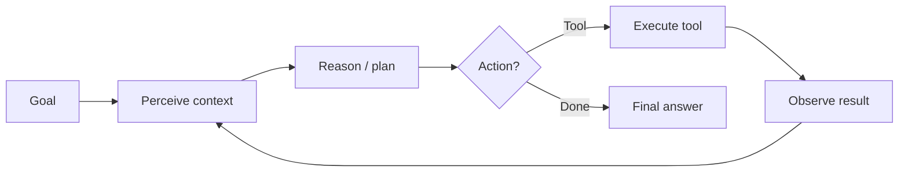

# The Agent Loop

Every AI agent — from a simple ReAct tool-caller to Claude Code — implements the same **iterative loop**.

## The cycle



| Phase | What happens | Example |
|-------|--------------|---------|
| **Perceive** | Load goal, history, tool outputs | User asks "book cheapest flight to NYC" |
| **Reason** | LLM decides next step | "Search flights first" |
| **Act** | Call tool or return answer | `search_flights(dest="NYC")` |
| **Observe** | Append result to context | 3 results: $890, $1200, $750 |
| **Repeat** | Until termination | Filter, compare, respond |

## Chatbot vs agent

| | Chatbot | Agent |
|---|---------|-------|
| **Calls** | 1 LLM request | Many in a loop |
| **External world** | No | Yes (tools, APIs, files) |
| **Control flow** | Fixed | LLM-decided |
| **Failure mode** | Wrong text | Wrong tool, infinite loop, runaway cost |

## ReAct pattern

**ReAct** (Reason + Act) structures each step as explicit thought + action:

```
Thought: I need current weather before recommending clothes.
Action: get_weather(city="London")
Observation: 12°C, rain
Thought: User should bring a jacket. I have enough info.
Action: finish(answer="Bring a light jacket — 12°C and rain in London.")
```

Full lesson: [M11 · ReAct Pattern](../build/module-11-ai-agents-fundamentals/lessons/03-ReAct-Pattern.md)

## Minimal loop (Python)

```python
MAX_STEPS = 10

def agent_loop(goal: str, llm, tools: dict) -> str:
    messages = [{"role": "user", "content": goal}]
    for step in range(MAX_STEPS):
        response = llm.chat(messages, tools=list(tools.keys()))
        if response.finish_reason == "stop":
            return response.text
        if response.tool_calls:
            for call in response.tool_calls:
                result = tools[call.name](**call.args)
                messages.append({"role": "tool", "name": call.name, "content": str(result)})
        else:
            return response.text
    raise RuntimeError("Max steps exceeded")
```

!!! warning "Production needs a harness"
    This loop has no permissions, tracing, or cost limits. See [Harness Engineering](04-harness-engineering.md).

## Termination conditions

| Signal | When to stop |
|--------|--------------|
| **Explicit finish** | Model returns final answer (no tool call) |
| **Max steps** | Prevent infinite loops (typical: 10–50) |
| **Budget** | Token or dollar cap per run |
| **Success predicate** | Eval harness confirms goal met |
| **Human approval** | HITL gate for destructive actions |

## Common misconceptions

| Myth | Reality |
|------|---------|
| "More steps = smarter" | Often = more cost and compounding errors |
| "Agents replace workflows" | Many tasks are better as **deterministic workflows** ([M11 L10](../build/module-11-ai-agents-fundamentals/lessons/10-Workflow-vs-Agent.md)) |
| "The LLM is the agent" | The **harness + loop** is the agent; the LLM is the reasoner |

## Key takeaways

- The agent loop is perceive → reason → act → observe, repeated
- ReAct makes reasoning and tool calls explicit
- Termination and budgets belong in the **harness**, not ad hoc
- Every production agent needs observability on each loop iteration

**Next:** [Memory Systems →](02-memory.md)

## Related papers

| Paper | Link |
|-------|------|
| ReAct — reason + act loop | [arXiv:2210.03629](https://arxiv.org/abs/2210.03629) |
| Toolformer — self-taught tool use | [arXiv:2302.04761](https://arxiv.org/abs/2302.04761) |
| Reflexion — learn from failure in-session | [arXiv:2303.11366](https://arxiv.org/abs/2303.11366) |
| Chain-of-Thought prompting | [arXiv:2201.11903](https://arxiv.org/abs/2201.11903) |

[Full list →](related-papers.md)
