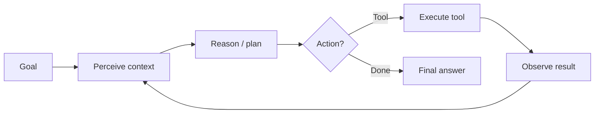

# The Agent Loop

Every AI agent — from a simple ReAct tool-caller to Claude Code — implements the same **iterative loop**.

## Prerequisites

- [M01 · First AI Application](../foundations/module-01-ai-engineering-essentials/lessons/02-first-ai-application.md) — calling an LLM API
- [M01 · Tokens and Costs](../foundations/module-01-ai-engineering-essentials/lessons/03-tokens-and-costs.md) — why loops multiply spend
- Basic Python — the minimal loop example below

## What You'll Learn

| Concept | Why it matters |
|---------|---------------|
| Perceive → reason → act → observe | The universal agent cycle |
| ReAct pattern | Explicit thoughts improve tool selection |
| Chatbot vs agent | When a loop is worth the complexity |
| Termination conditions | Prevent infinite loops and runaway cost |
| Harness boundaries | What the bare loop is missing for production |

---

## Intuition: a robot in a room with tools

Picture an agent as a robot in a room. It **perceives** notes on a whiteboard (context), **reasons** about what to do next, **acts** by using a tool, then **observes** the result written back on the board. It repeats until the goal is done or someone pulls the plug.

A chatbot is a robot that can only speak once and leave. An agent can open doors (APIs), read files, and try again when the first attempt fails.

The loop is simple; the engineering is hard — permissions, budgets, tracing, and evals wrap the loop in a **harness** (covered in [Harness Engineering](04-harness-engineering.md)).

---

## The cycle



| Phase | What happens | Example |
|-------|--------------|---------|
| **Perceive** | Load goal, history, tool outputs | User asks "book cheapest flight to NYC" |
| **Reason** | LLM decides next step | "Search flights first" |
| **Act** | Call tool or return answer | `search_flights(dest="NYC")` |
| **Observe** | Append result to context | 3 results: $890, $1200, $750 |
| **Repeat** | Until termination | Filter, compare, respond |

## Chatbot vs agent

| | Chatbot | Agent |
|---|---------|-------|
| **Calls** | 1 LLM request | Many in a loop |
| **External world** | No | Yes (tools, APIs, files) |
| **Control flow** | Fixed | LLM-decided |
| **Failure mode** | Wrong text | Wrong tool, infinite loop, runaway cost |

## ReAct pattern

**ReAct** (Reason + Act) structures each step as explicit thought + action:

```
Thought: I need current weather before recommending clothes.
Action: get_weather(city="London")
Observation: 12°C, rain
Thought: User should bring a jacket. I have enough info.
Action: finish(answer="Bring a light jacket — 12°C and rain in London.")
```

Full lesson: [M11 · ReAct Pattern](../build/module-11-ai-agents-fundamentals/lessons/03-ReAct-Pattern.md)

## Minimal loop (Python)

```python
MAX_STEPS = 10

def agent_loop(goal: str, llm, tools: dict) -> str:
    messages = [{"role": "user", "content": goal}]
    for step in range(MAX_STEPS):
        response = llm.chat(messages, tools=list(tools.keys()))
        if response.finish_reason == "stop":
            return response.text
        if response.tool_calls:
            for call in response.tool_calls:
                result = tools[call.name](**call.args)
                messages.append({"role": "tool", "name": call.name, "content": str(result)})
        else:
            return response.text
    raise RuntimeError("Max steps exceeded")
```

!!! warning "Production needs a harness"
    This loop has no permissions, tracing, or cost limits. See [Harness Engineering](04-harness-engineering.md).

## Termination conditions

| Signal | When to stop |
|--------|--------------|
| **Explicit finish** | Model returns final answer (no tool call) |
| **Max steps** | Prevent infinite loops (typical: 10–50) |
| **Budget** | Token or dollar cap per run |
| **Success predicate** | Eval harness confirms goal met |
| **Human approval** | HITL gate for destructive actions |

## Common misconceptions

| Myth | Reality |
|------|---------|
| "More steps = smarter" | Often = more cost and compounding errors |
| "Agents replace workflows" | Many tasks are better as **deterministic workflows** ([M11 L10](../build/module-11-ai-agents-fundamentals/lessons/10-Workflow-vs-Agent.md)) |
| "The LLM is the agent" | The **harness + loop** is the agent; the LLM is the reasoner |

---

## Worked example: book the cheapest flight

**Goal:** `"Find the cheapest round-trip flight to NYC departing Friday, returning Sunday."`

### Step-by-step trace

| Step | Phase | What happens | Context size |
|------|-------|--------------|--------------|
| 0 | Perceive | User goal loaded; tools: `search_flights`, `book_flight` | 1,200 tokens |
| 1 | Reason | Model decides to search first | — |
| 1 | Act | `search_flights(origin="SFO", dest="NYC", depart="Fri", return="Sun")` | — |
| 1 | Observe | 3 results: $750, $890, $1,200 | +400 tokens |
| 2 | Reason | Compare prices; $750 is cheapest | — |
| 2 | Act | `book_flight(flight_id="UA447", price=750)` | — |
| 2 | Observe | `{"status": "confirmed", "pnr": "ABC123"}` | +80 tokens |
| 3 | Reason | Goal met | — |
| 3 | Act | Final answer (no tool) | — |

**Total:** 3 loop iterations, 2 tool calls, ~2,500 tokens cumulative input (each step re-reads history).

### Cost estimate

| Item | Value |
|------|-------|
| Model | $3 / 1M input tokens |
| Input tokens (sum across steps) | ~6,800 |
| Output tokens | ~450 |
| **Estimated cost** | **~$0.02** |

Ten steps with bloated tool output (50K tokens each) → dollars per run. Termination and truncation are economic necessities.

### What goes wrong without a harness

| Failure | Symptom | Harness fix |
|---------|---------|-------------|
| No max steps | Searches flights forever | `max_steps=10` |
| No budget | $50 API bill on one user query | `cost_cap_usd=0.25` |
| Raw 2MB JSON in observe | Model hallucinates on step 4 | Truncate + summarize tool output |
| Wrong tool args | `dest="New York"` → API 400 | Schema validation + retry hint |

---

## Production connection

Every production agent loop should emit:

1. **Span per step** — `agent.step`, tokens, latency (see [Observability](06-observability-and-tracing.md))
2. **Checkpoint every N steps** — resume after rate limit or crash
3. **Identical-tool-call detector** — if same `(tool, args)` repeats 3×, break loop
4. **Eval hook** — record trajectory for golden regression

### When to use a loop vs single shot

| Single LLM call | Agent loop |
|-----------------|------------|
| Summarize this paragraph | Research + compare + act across 5 sources |
| Classify intent | Book travel, file ticket, run multi-step code change |
| Fixed input → fixed output | Outcome depends on external world state |

If your task graph is fixed (always step A → B → C), use a **workflow** instead of LLM-routed loops. See [M11 L10 · Workflow vs Agent](../build/module-11-ai-agents-fundamentals/lessons/10-Workflow-vs-Agent.md).

---

## Key takeaways

- The agent loop is perceive → reason → act → observe, repeated
- ReAct makes reasoning and tool calls explicit
- Termination and budgets belong in the **harness**, not ad hoc
- Every production agent needs observability on each loop iteration

### Further reading in this handbook

- [M11 · ReAct Pattern](../build/module-11-ai-agents-fundamentals/lessons/03-ReAct-Pattern.md) — full ReAct lesson with exercises
- [M18 · Agent Loop and State](../build/module-18-agent-harness-tools-runtime/lessons/02-agent-loop-and-state.md) — stateful loops
- [Deep Dive · Attention](../deep-dives/attention-math.md) — if you want to understand what happens inside the reasoner

### Design review checklist (single-agent)

Before shipping any agent loop, confirm:

- [ ] `max_steps` and `cost_cap` configured in harness, not prompt
- [ ] Tool output truncation with re-fetch path for full data
- [ ] Trace span per step with token counts
- [ ] At least 5 golden trajectories in CI
- [ ] Documented when **not** to use an agent (workflow alternative)

### Practice exercise (45 min)

Implement the minimal `agent_loop` from this page in Python against any chat-completions API with one mock tool (`search` returning fixed JSON). Log each phase to stdout. Run with `MAX_STEPS=3` on a query that needs more steps — observe termination. Add a duplicate-call detector. This is your harness seed.

### Why workflows still win for fixed pipelines

Order-status lookup is always: `authenticate → fetch_order → format_reply`. An LLM choosing those steps adds latency, cost, and failure modes. Use an agent loop when the **sequence is not known in advance** — open-ended research, debugging, multi-file refactors. The decision is economic: if you can draw the graph without an LLM, draw the graph.

!!! note "Starter project"
    After this page, implement the loop with one tool and wire [Observability](06-observability-and-tracing.md) before adding a second tool — you will debug tool choice errors on day one.

### State you must track per run

At minimum: `messages`, `step`, `cumulative_cost_usd`, `tool_call_history` (for stuck detection), and `status`. Optional but valuable: `plan` scratchpad and `parent_trace_id` when nested. Serialize to JSON at checkpoints so resume after 429 does not replay expensive reads.

**Next:** [Memory Systems →](02-memory.md)

## Related papers

| Paper | Link |
|-------|------|
| ReAct — reason + act loop | [arXiv:2210.03629](https://arxiv.org/abs/2210.03629) |
| Toolformer — self-taught tool use | [arXiv:2302.04761](https://arxiv.org/abs/2302.04761) |
| Reflexion — learn from failure in-session | [arXiv:2303.11366](https://arxiv.org/abs/2303.11366) |
| Chain-of-Thought prompting | [arXiv:2201.11903](https://arxiv.org/abs/2201.11903) |

[Full list →](related-papers.md)
