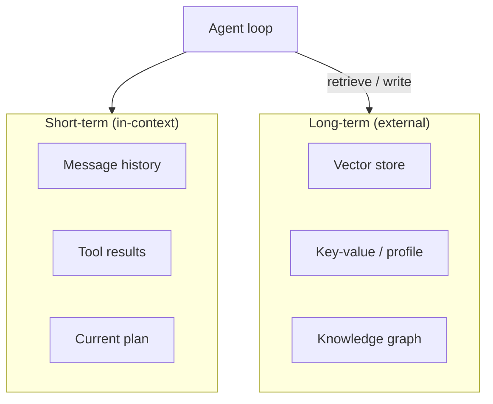

# Memory Systems

Agents need **memory** beyond the context window — to remember users, past sessions, and learned facts.

## Memory layers



| Layer | Latency | Capacity | Use case |
|-------|---------|----------|----------|
| **Working memory** | Instant | Context window (8K–200K tokens) | Current conversation |
| **Episodic** | ms | Unlimited (vector DB) | Past sessions, summaries |
| **Semantic** | ms | Unlimited | Facts, docs, user preferences |
| **Procedural** | — | Code / skills | How to use tools |

## Short-term memory

Everything in the prompt today:

```python
context = {
    "system": SYSTEM_PROMPT,
    "messages": conversation_history,      # last N turns
    "tool_results": recent_observations,   # truncated if large
    "plan": current_plan,                  # optional scratchpad
}
```

!!! tip "Context engineering"
    What you put in working memory **is** the agent's mind right now. Trim, summarize, and prioritize. See [Context Engineering (2026)](../ai-engineering-2026/context-engineering.md).

### Compaction strategies

| Strategy | When |
|----------|------|
| **Sliding window** | Keep last K messages |
| **Summarization** | LLM compresses old turns into a summary block |
| **Tool result truncation** | Store full output externally; keep excerpt in context |
| **Plan scratchpad** | Separate channel for agent's todo list |

## Long-term memory

### Vector retrieval (most common)

```python
def recall(user_id: str, query: str, k: int = 5) -> list[str]:
    embedding = embed(query)
    return vector_db.search(
        collection=f"user_{user_id}",
        vector=embedding,
        top_k=k,
    )
```

Write after each session:

```python
def remember(user_id: str, text: str, metadata: dict):
    vector_db.upsert(
        id=uuid4(),
        vector=embed(text),
        metadata={"user_id": user_id, **metadata},
    )
```

### Structured profile memory

```json
{
  "user_id": "u_123",
  "preferences": {"timezone": "PST", "tone": "concise"},
  "facts": ["Works at Acme", "Uses Python"],
  "last_updated": "2026-06-26"
}
```

Update via tool: `update_user_profile(field, value)` with human-readable audit log.

## Memory in multi-agent systems

| Pattern | Description |
|---------|-------------|
| **Shared blackboard** | All agents read/write one state object ([M12 L8](../build/module-12-multi-agent-systems/lessons/08-shared-memory-and-blackboards.md)) |
| **Per-agent memory** | Each worker has private scratchpad; orchestrator merges |
| **Handoff packets** | Passing structured context when delegating ([M12 L6](../build/module-12-multi-agent-systems/lessons/06-agent-handoffs-and-delegation.md)) |

## Pitfalls

| Problem | Fix |
|---------|-----|
| **Stale memories** | TTL, version tags, re-embed on update |
| **Wrong retrieval** | Hybrid search, metadata filters, reranking |
| **PII in memory** | Redact before store; encrypt at rest |
| **Context overflow** | Summarize + retrieve instead of append forever |

## Key takeaways

- Short-term = context window; long-term = vector DB / profile / graph
- Compaction is mandatory for long-running agents
- Memory writes should be explicit tool calls, not implicit side effects
- Multi-agent systems need clear memory ownership

**Next:** [Tools & MCP →](03-tools-and-mcp.md) · Full lesson: [M11 · Agent Memory](../build/module-11-ai-agents-fundamentals/lessons/05-Agent-Memory.md)

## Related papers

| Paper | Link |
|-------|------|
| MemGPT — virtual context / memory paging | [arXiv:2310.08560](https://arxiv.org/abs/2310.08560) |
| Generative Agents — long-term agent memory | [arXiv:2304.03442](https://arxiv.org/abs/2304.03442) |
| RAG — retrieval-augmented generation | [arXiv:2005.11401](https://arxiv.org/abs/2005.11401) |
| Lost in the Middle — context placement | [arXiv:2307.03172](https://arxiv.org/abs/2307.03172) |

[Full list →](related-papers.md)
