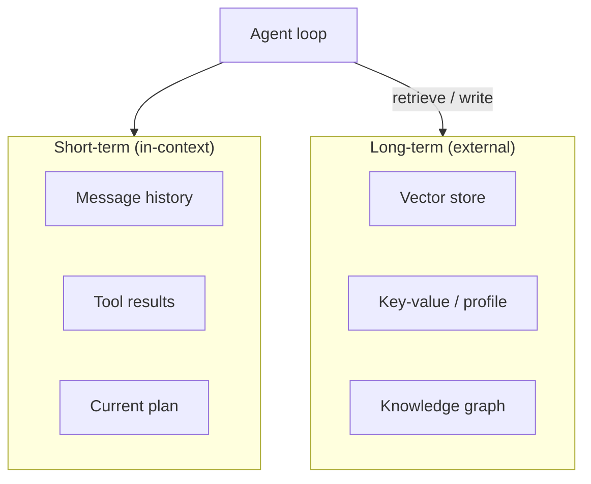

# Memory Systems

Agents need **memory** beyond the context window — to remember users, past sessions, and learned facts.

## Prerequisites

- [The Agent Loop](01-agent-loop.md) — where memory is read/written each step
- [M01 · Tokens and Costs](../foundations/module-01-ai-engineering-essentials/lessons/03-tokens-and-costs.md) — context limits
- [Context Engineering (2026)](../ai-engineering-2026/context-engineering.md) — assembling working memory

## What You'll Learn

| Concept | Why it matters |
|---------|---------------|
| Working vs episodic vs semantic memory | Match storage to retrieval pattern |
| Compaction strategies | Long sessions without context overflow |
| Vector recall + structured profiles | Two complementary long-term stores |
| Multi-agent memory ownership | Who writes what on a shared blackboard |
| Production pitfalls | Stale data, PII, wrong retrieval |

---

## Intuition: desk, filing cabinet, and company wiki

| Memory type | Analogy | Agent equivalent |
|-------------|---------|------------------|
| **Working** | Papers on your desk | Current messages, tool results, plan |
| **Episodic** | Personal journal | "Last Tuesday we debugged auth" |
| **Semantic** | Company wiki | Facts, docs, product specs |
| **Procedural** | Muscle memory | Skills, tool usage patterns |

The desk is small but instant. The wiki is huge but requires a search. Good agents **compact the desk** (summarize old turns) and **retrieve from the wiki** (RAG) instead of dumping everything into context.

---

## Memory layers



| Layer | Latency | Capacity | Use case |
|-------|---------|----------|----------|
| **Working memory** | Instant | Context window (8K–200K tokens) | Current conversation |
| **Episodic** | ms | Unlimited (vector DB) | Past sessions, summaries |
| **Semantic** | ms | Unlimited | Facts, docs, user preferences |
| **Procedural** | — | Code / skills | How to use tools |

## Short-term memory

Everything in the prompt today:

```python
context = {
    "system": SYSTEM_PROMPT,
    "messages": conversation_history,      # last N turns
    "tool_results": recent_observations,   # truncated if large
    "plan": current_plan,                  # optional scratchpad
}
```

!!! tip "Context engineering"
    What you put in working memory **is** the agent's mind right now. Trim, summarize, and prioritize. See [Context Engineering (2026)](../ai-engineering-2026/context-engineering.md).

### Compaction strategies

| Strategy | When |
|----------|------|
| **Sliding window** | Keep last K messages |
| **Summarization** | LLM compresses old turns into a summary block |
| **Tool result truncation** | Store full output externally; keep excerpt in context |
| **Plan scratchpad** | Separate channel for agent's todo list |

## Long-term memory

### Vector retrieval (most common)

```python
def recall(user_id: str, query: str, k: int = 5) -> list[str]:
    embedding = embed(query)
    return vector_db.search(
        collection=f"user_{user_id}",
        vector=embedding,
        top_k=k,
    )
```

Write after each session:

```python
def remember(user_id: str, text: str, metadata: dict):
    vector_db.upsert(
        id=uuid4(),
        vector=embed(text),
        metadata={"user_id": user_id, **metadata},
    )
```

### Structured profile memory

```json
{
  "user_id": "u_123",
  "preferences": {"timezone": "PST", "tone": "concise"},
  "facts": ["Works at Acme", "Uses Python"],
  "last_updated": "2026-06-26"
}
```

Update via tool: `update_user_profile(field, value)` with human-readable audit log.

## Memory in multi-agent systems

| Pattern | Description |
|---------|-------------|
| **Shared blackboard** | All agents read/write one state object ([M12 L8](../build/module-12-multi-agent-systems/lessons/08-shared-memory-and-blackboards.md)) |
| **Per-agent memory** | Each worker has private scratchpad; orchestrator merges |
| **Handoff packets** | Passing structured context when delegating ([M12 L6](../build/module-12-multi-agent-systems/lessons/06-agent-handoffs-and-delegation.md)) |

## Pitfalls

| Problem | Fix |
|---------|-----|
| **Stale memories** | TTL, version tags, re-embed on update |
| **Wrong retrieval** | Hybrid search, metadata filters, reranking |
| **PII in memory** | Redact before store; encrypt at rest |
| **Context overflow** | Summarize + retrieve instead of append forever |

---

## Worked example: returning user session

**User:** `"What was that deployment issue we fixed last week?"`

### Memory flow

```
1. Session start
   → load profile: {"user_id": "u_42", "team": "platform"}
   → recall(query="deployment issue last week", k=5) from vector DB

2. Retrieved chunks (episodic)
   - "2026-06-28: Fixed K8s rollout timeout — increased readiness probe"
   - "2026-06-20: Deploy checklist skill used for prod push"

3. Injected into working memory (not full history — 800 tokens)

4. Agent answers with read_doc if user wants runbook detail
```

### Compaction at turn 15

| Before compaction | After |
|-------------------|-------|
| 14 full turns in context (~18K tokens) | Summary block (600 tokens) + turns 13–14 verbatim |
| Tool outputs from turn 3 still present | Full outputs in S3; excerpts only in context |

```python
def compact_if_needed(messages: list, threshold: int = 12_000) -> list:
    if count_tokens(messages) < threshold:
        return messages
    old, recent = messages[:-4], messages[-4:]
    summary = llm.summarize(old, max_tokens=500)
    return [{"role": "system", "content": f"Prior context: {summary}"}] + recent
```

### Write path (explicit, not implicit)

```python
# GOOD: agent calls remember() tool after user confirms
remember(text="Fixed K8s rollout timeout 2026-06-28", metadata={"type": "incident"})

# BAD: silently append every turn to vector DB → noise, PII risk
```

---

## Edge cases & misconceptions

| Myth | Reality |
|------|---------|
| "Vector DB = agent memory" | Vectors store **episodic/semantic** recall; you still need **working memory** management |
| "Remember everything" | Retrieval quality **degrades** with irrelevant stored turns — curate writes |
| "One embedding model forever" | Re-embed when you change models or chunking strategy |
| "Memory replaces RAG on docs" | User prefs ≠ product documentation — use both |
| "Shared blackboard is simple" | Needs schema, locks, and TTL or agents overwrite each other |

### Lost in the middle

Even with a 200K context window, models attend poorly to information buried mid-prompt. Put **critical memories** near the start or end of context, or retrieve just-in-time via tool. See [Context Engineering](../ai-engineering-2026/context-engineering.md).

---

## Production connection

| Concern | Practice |
|---------|----------|
| PII | Redact emails, SSNs before `remember()`; encrypt at rest |
| TTL | Episodic memories expire after 90 days unless pinned |
| Versioning | `memory_schema_version` on profile JSON for migrations |
| Audit | Log every write: `user_id, agent_id, text_hash, timestamp` |
| Eval | Golden tests for recall: query → expected chunk IDs |

Multi-tenant SaaS: **partition** vector collections by `tenant_id` + `user_id`. Never share embedding space across customers without metadata filters.

---

## Key takeaways

- Short-term = context window; long-term = vector DB / profile / graph
- Compaction is mandatory for long-running agents
- Memory writes should be explicit tool calls, not implicit side effects
- Multi-agent systems need clear memory ownership

### Memory write decision tree

```
Should this information persist beyond this session?
├─ No  → keep in working memory only (maybe compact later)
├─ Yes → is it about the USER?
│   ├─ Yes → structured profile + optional vector episodic
│   └─ No  → is it domain knowledge?
│       ├─ Yes → RAG corpus (not agent memory)
│       └─ No  → episodic vector with TTL
```

### Reranking retrieved memories

Raw vector top-5 may miss the best chunk. Production stack:

1. Vector search `k=20`
2. Metadata filter (`user_id`, `type=incident`, `date > 30d ago`)
3. Cross-encoder rerank → top 5
4. Inject into context with citation paths for verification

### When retrieval hurts

If recall returns wrong chunks three times in a row, the agent may **hallucinate a bridge** between unrelated memories. Mitigations: require `citation` field in answers, lower temperature on memory synthesis steps, and surface "low confidence" when reranker scores fall below threshold.

### Practice exercise (30 min)

Design memory schema for a fictional SaaS support agent: working memory compaction rule, one profile JSON field, one episodic vector metadata filter. Write pseudocode for `recall()` and `remember()` with TTL. List one PII field you would redact before storage.

### Episodic vs semantic write policy

| Content | Store as |
|---------|----------|
| "User prefers email on Tuesdays" | Profile (structured) |
| "We debugged auth on 2026-06-28" | Episodic vector + TTL |
| "API rate limit is 100/min" | RAG corpus (semantic), not user memory |
| "Current plan: step 2 of 4" | Working memory only — never persist |

Mixing types pollutes retrieval: a query about rate limits should hit docs, not yesterday's chat summary.

!!! warning "Do not memorize the entire chat"
    Every `remember()` call should be **deliberate** — user-confirmed facts, resolved incidents, stated preferences. Implicit logging creates retrieval noise within weeks.

### Hybrid profile + vector pattern

Store stable fields (`timezone`, `plan tier`) in SQL/JSON profile; store narrative episodic memories in vectors with `user_id` metadata filter on every query. The agent calls `get_profile()` for structured fields and `recall()` for fuzzy past context — two tools, two storage systems, one mental model for the model.

**Next:** [Tools & MCP →](03-tools-and-mcp.md) · Full lesson: [M11 · Agent Memory](../build/module-11-ai-agents-fundamentals/lessons/05-Agent-Memory.md)

## Related papers

| Paper | Link |
|-------|------|
| MemGPT — virtual context / memory paging | [arXiv:2310.08560](https://arxiv.org/abs/2310.08560) |
| Generative Agents — long-term agent memory | [arXiv:2304.03442](https://arxiv.org/abs/2304.03442) |
| RAG — retrieval-augmented generation | [arXiv:2005.11401](https://arxiv.org/abs/2005.11401) |
| Lost in the Middle — context placement | [arXiv:2307.03172](https://arxiv.org/abs/2307.03172) |

[Full list →](related-papers.md)
