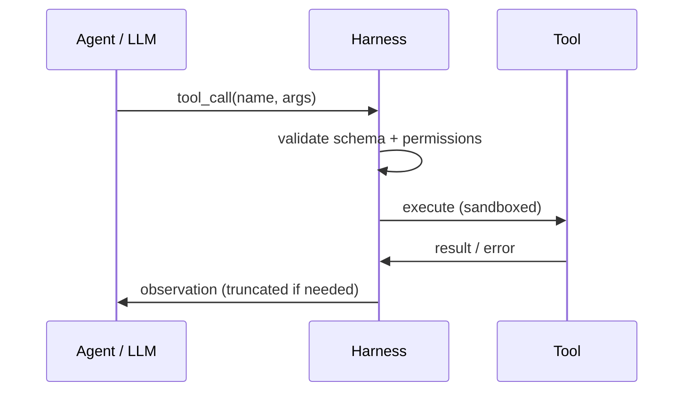
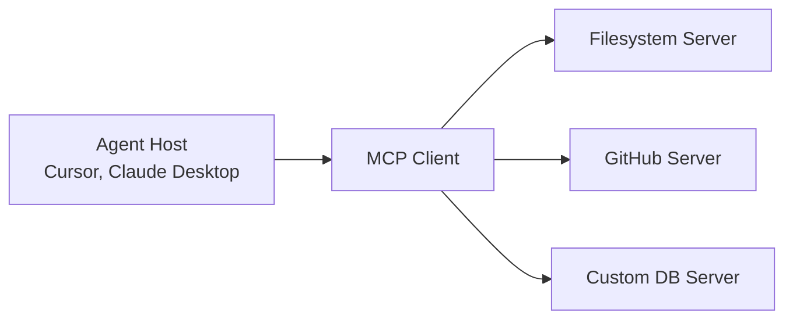

# Tools & MCP

Agents act on the world through **tools** — functions, APIs, and MCP servers.

## Tool calling flow



## Tool schema (OpenAI-style)

```json
{
  "type": "function",
  "function": {
    "name": "search_docs",
    "description": "Search internal documentation by keyword",
    "parameters": {
      "type": "object",
      "properties": {
        "query": {"type": "string", "description": "Search query"},
        "limit": {"type": "integer", "default": 5}
      },
      "required": ["query"]
    }
  }
}
```

Good descriptions **change which tool the model picks**. Be specific about when to use and when *not* to use each tool.

## Harness responsibilities

| Concern | Harness handles |
|---------|-----------------|
| Schema validation | Reject malformed args before execution |
| Timeouts | Kill hung API calls |
| Retries | Transient failures only |
| Output truncation | Prevent 100KB JSON flooding context |
| Error messages | Return actionable text to the model |

Full lesson: [M18 · Tools and Function Calling](../build/module-18-agent-harness-tools-runtime/lessons/03-tools-and-function-calling.md)

## Model Context Protocol (MCP)

**MCP** standardizes how agents discover and call external capabilities.



| Concept | Meaning |
|---------|---------|
| **Host** | IDE or app running the agent |
| **MCP client** | Built into host; speaks MCP wire protocol |
| **MCP server** | Exposes tools + resources (files, schemas) |
| **Resources** | Readable context (not actions) |
| **Tools** | Callable functions |

Example servers: filesystem, GitHub, Postgres, Slack.

Full lesson: [M18 · MCP](../build/module-18-agent-harness-tools-runtime/lessons/04-mcp-model-context-protocol.md)

## Tool design principles

1. **Small surface area** — one tool, one job
2. **Idempotent reads** — safe to retry `get_*`, careful with `delete_*`
3. **Structured errors** — `{"error": "NOT_FOUND", "hint": "..."}` not stack traces
4. **Composable** — `list_files` + `read_file` beats monolithic `do_everything`

## Security

| Risk | Mitigation |
|------|------------|
| Prompt injection via tool output | Sanitize, separate system channel |
| Destructive tools | Allowlist + HITL confirmation |
| Credential leakage | Tools use server-side secrets, never return keys |

**Next:** [Harness Engineering →](04-harness-engineering.md)
