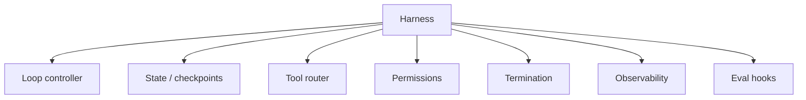

# Harness Engineering

The **harness** is everything wrapping the LLM that turns a chat completion into a **reliable agent**. This is the core of modern agent engineering in 2025–2026.

## Prerequisites

- [The Agent Loop](01-agent-loop.md) — what the harness wraps
- [Tools & MCP](03-tools-and-mcp.md) — tool router responsibilities
- [M10 · LLMOps](../production/module-10-llmops-production-systems/index.md) — production ops mindset

## What You'll Learn

| Concept | Why it matters |
|---------|---------------|
| Harness vs framework | Runtime guarantees vs graph DSL |
| Seven primitives | Loop, state, tools, permissions, termination, observability, evals |
| Checkpointing | Resume long tasks after failure |
| Permission tiers | Read / write / destructive + HITL |
| Reference architecture | How pieces connect in one diagram |

---

## Intuition: the LLM is not the product

Customers buy **reliable outcomes** — refunded tickets, merged PRs, resolved support cases. The LLM is a component inside a **supervised process** that enforces budgets, blocks destructive actions, records traces, and stops infinite loops.

Frameworks like LangGraph give you graph primitives; **harness engineering** is the discipline of making any agent trustworthy: whether built on LangGraph, raw Python, Claude Code, or Cursor.

---

## Harness vs framework

| | Framework (LangGraph, CrewAI) | Harness |
|---|------------------------------|---------|
| **Provides** | Patterns, graph DSL, multi-agent templates | Runtime guarantees |
| **You still need** | Permissions, budgets, tracing, eval hooks | — |
| **Analogy** | Web framework (Express) | Process supervisor (systemd) |

Frameworks *include* harness features; **harness engineering** is the discipline of getting those primitives right regardless of framework.

## The seven primitives



### 1. Loop controller

- Max iterations
- Backoff on repeated identical tool calls
- Detect "stuck" patterns (same error 3×)

### 2. State & checkpoints

```python
@dataclass
class AgentState:
    messages: list[dict]
    step: int
    cost_usd: float
    status: Literal["running", "done", "failed"]

def checkpoint(state: AgentState, path: str):
    json.dump(asdict(state), open(path, "w"))
```

Resume long coding tasks after crash or rate limit.

### 3. Tool router

- Map tool name → implementation
- Enforce argument schemas (Pydantic / JSON Schema)
- Route to sandbox (Docker, WASM, subprocess)

### 4. Permissions

| Level | Example |
|-------|---------|
| **Read-only** | `read_file`, `search` |
| **Write** | `write_file` — requires path allowlist |
| **Destructive** | `delete_file`, `send_email` — HITL |

Full lesson: [M18 · Permissions](../build/module-18-agent-harness-tools-runtime/lessons/05-permissions-and-safety-in-the-harness.md)

### 5. Termination

\[
\text{stop} \iff (\text{goal met}) \lor (\text{steps} \geq N) \lor (\text{cost} \geq C) \lor (\text{timeout})
\]

### 6. Observability

Every harness step emits a span. See [Observability & Tracing](06-observability-and-tracing.md).

### 7. Eval hooks

Record full trajectory for offline scoring. See [Agent Evals](07-agent-evals.md).

## Reference architecture

```
User request
    │
    ▼
┌─────────────────────────────────────┐
│  HARNESS                            │
│  ┌─────────┐  ┌──────────────────┐  │
│  │ Policy  │  │ Loop (max 25)    │  │
│  │ engine  │──│ State checkpoint │  │
│  └─────────┘  └────────┬─────────┘  │
│                          │            │
│              ┌───────────▼──────────┐ │
│              │ LLM + tool schema    │ │
│              └───────────┬──────────┘ │
│                          │            │
│              ┌───────────▼──────────┐ │
│              │ Tool sandbox + MCP   │ │
│              └──────────────────────┘ │
│  Traces ──► Langfuse / OTel          │
└─────────────────────────────────────┘
```

## OSS references

- [Awesome Harness Engineering](https://github.com/ai-boost/awesome-harness-engineering)
- [Agents Towards Production](https://github.com/NirDiamant/agents-towards-production)
- Full module: [M18 · Agent Harness, Tools & Runtime](../build/module-18-agent-harness-tools-runtime/index.md)

---

## Worked example: coding agent harness

**Task:** `"Fix failing test in tests/test_auth.py"`

### Harness execution log

| Primitive | What happened |
|-----------|---------------|
| **Loop** | Step 1–8; max 25 |
| **Permissions** | `read_file` auto-approved; `write_file` allowed only under `tests/`; `bash` requires confirm |
| **Tool router** | `pytest` routed to sandbox subprocess, 120s timeout |
| **Termination** | Stopped at step 8 — tests pass, model returned final answer |
| **State** | Checkpoint at step 4 (before edit) and step 8 (success) |
| **Observability** | Trace `tr_coding_44` — 8 spans, $0.18 total |
| **Eval hook** | Trajectory saved for `coding-agent-golden-v2` |

### Stuck-loop detection

```python
def detect_stuck(recent_calls: list[tuple[str, dict]]) -> bool:
    if len(recent_calls) < 3:
        return False
    last_three = recent_calls[-3:]
    return len(set(str(c) for c in last_three)) == 1  # same tool+args 3×
```

If `read_file(path="test_auth.py")` repeats 3×, harness injects: `"You already have this file; proceed to edit or explain blocker."`

### Permission escalation

```
Step 5: model requests write_file(path="src/auth/secrets.py")
Harness: DENY — path not in allowlist
Observation: {"error": "PERMISSION_DENIED", "hint": "secrets.py is blocked; fix test only"}
Step 6: model writes tests/test_auth.py instead ✓
```

---

## Edge cases & misconceptions

| Myth | Reality |
|------|---------|
| "OpenAI function calling = harness" | Function calling is **one feature**; harness is the full runtime |
| "We'll add permissions later" | First prod incident will be a model running `rm -rf` or spamming email |
| "Checkpoints are for long jobs only" | Even 30s runs benefit — resume after 429 rate limit |
| "Framework handles it" | Frameworks **offer** hooks; you must configure caps and policies |
| "Same harness for coding and customer support" | Different tool allowlists, budgets, and eval suites |

### Termination logic (combined)

\[
\text{stop} \iff (\text{goal met}) \lor (s \geq N) \lor (c \geq C) \lor (t \geq T) \lor \text{stuck}()
\]

Implement **all** disjuncts — not just max steps.

---

## Production connection

### Harness maturity model

| Level | Capabilities |
|-------|--------------|
| **L0** | Bare loop, no caps — demo only |
| **L1** | max_steps + basic tracing |
| **L2** | Permissions, truncation, cost cap |
| **L3** | Checkpoints, eval hooks, CI golden trajectories |
| **L4** | Per-tenant policies, HITL, automated rollback on eval regression |

Ship at **L2 minimum** for internal tools; **L3** for customer-facing agents.

### Deployment checklist

- [ ] Tool allowlist per environment (staging may write; prod read-only default)
- [ ] Secrets never in model context — server-side only
- [ ] `trace_id` returned to client for support lookup
- [ ] Eval suite blocks deploy if success rate drops >5%
- [ ] Runbook for kill switch (`AGENT_ENABLED=false`)

---

## Key takeaways

- The harness is the product; the LLM is a component
- Permissions and termination prevent runaway agents
- Checkpoints enable long-running and resumable tasks
- Framework choice matters less than harness discipline

### Comparing harness maturity to team size

| Team size | Minimum harness |
|-----------|-----------------|
| Solo dev / internal tool | L2 — caps + tracing |
| Small product team | L3 — evals in CI |
| Customer-facing multi-tenant | L4 — per-tenant policy + HITL |

Invest in checkpoints before you need them — the first 45-minute coding agent run that dies at step 38 will convince stakeholders.

### Failure recovery walkthrough

```
Step 22: write_file → success, checkpoint saved
Step 23: llm.reason → 429 rate limit from provider
Harness: pause 60s, resume from checkpoint step 22
Step 23 (retry): llm.reason → success
Step 24–28: complete task
```

Without checkpoint at step 22, the agent re-reads 20 files and re-runs tests — doubling cost and latency. Checkpoint granularity: every **mutating** tool call or every 5 steps, whichever comes first.

### Practice exercise (45 min)

Draw your agent's reference architecture on paper: label all seven primitives. For each, write one sentence on your current implementation status (done / partial / missing). Pick the missing primitive that would cause the worst incident and implement a minimal version this week.

### Framework mapping (LangGraph, CrewAI, raw Python)

| Primitive | LangGraph | Your responsibility |
|-----------|-----------|---------------------|
| Loop | Graph edges, conditional routing | Set recursion limits |
| State | `AgentState` reducer | Checkpoint to disk |
| Tools | `bind_tools` | Sandboxing, truncation |
| Permissions | Not default | Allowlist + HITL |
| Observability | Callbacks | Export OTel spans |
| Evals | None built-in | Trajectory capture hook |

Framework choice is adoption and ergonomics — **harness discipline is non-optional** regardless of label on the box.

!!! note "Incident-driven roadmap"
    Rank harness primitives by last production incident: if runaway cost → budgets first; if wrong file written → permissions first; if undebuggable failure → tracing first.

### Kill switch contract

Document for on-call: environment variable or feature flag name, who can flip it, expected behavior when off (graceful user message vs hard 503), and whether in-flight runs are cancelled or drained. A kill switch nobody trusts is worse than none — test it quarterly.

### Minimum viable harness (week 1)

1. `max_steps=15` 2. `cost_cap_usd=0.50` 3. stdout JSON log per step 4. truncate tool output at 2K tokens 5. one integration test that asserts loop terminates. Ship that before adding memory, MCP, or multi-agent routing.

**Next:** [Orchestration →](05-orchestration.md)

## Related papers

| Paper | Link |
|-------|------|
| SWE-agent — agent-computer interfaces | [arXiv:2405.15703](https://arxiv.org/abs/2405.15703) |
| Voyager — skill library + harness loop | [arXiv:2305.16291](https://arxiv.org/abs/2305.16291) |
| Reflexion — verbal RL in the loop | [arXiv:2303.11366](https://arxiv.org/abs/2303.11366) |

[Full list →](related-papers.md)
