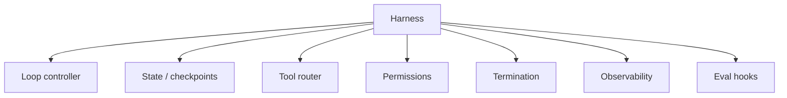

# Harness Engineering

The **harness** is everything wrapping the LLM that turns a chat completion into a **reliable agent**. This is the core of modern agent engineering in 2025–2026.

## Harness vs framework

| | Framework (LangGraph, CrewAI) | Harness |
|---|------------------------------|---------|
| **Provides** | Patterns, graph DSL, multi-agent templates | Runtime guarantees |
| **You still need** | Permissions, budgets, tracing, eval hooks | — |
| **Analogy** | Web framework (Express) | Process supervisor (systemd) |

Frameworks *include* harness features; **harness engineering** is the discipline of getting those primitives right regardless of framework.

## The seven primitives



### 1. Loop controller

- Max iterations
- Backoff on repeated identical tool calls
- Detect "stuck" patterns (same error 3×)

### 2. State & checkpoints

```python
@dataclass
class AgentState:
    messages: list[dict]
    step: int
    cost_usd: float
    status: Literal["running", "done", "failed"]

def checkpoint(state: AgentState, path: str):
    json.dump(asdict(state), open(path, "w"))
```

Resume long coding tasks after crash or rate limit.

### 3. Tool router

- Map tool name → implementation
- Enforce argument schemas (Pydantic / JSON Schema)
- Route to sandbox (Docker, WASM, subprocess)

### 4. Permissions

| Level | Example |
|-------|---------|
| **Read-only** | `read_file`, `search` |
| **Write** | `write_file` — requires path allowlist |
| **Destructive** | `delete_file`, `send_email` — HITL |

Full lesson: [M18 · Permissions](../build/module-18-agent-harness-tools-runtime/lessons/05-permissions-and-safety-in-the-harness.md)

### 5. Termination

\[
\text{stop} \iff (\text{goal met}) \lor (\text{steps} \geq N) \lor (\text{cost} \geq C) \lor (\text{timeout})
\]

### 6. Observability

Every harness step emits a span. See [Observability & Tracing](06-observability-and-tracing.md).

### 7. Eval hooks

Record full trajectory for offline scoring. See [Agent Evals](07-agent-evals.md).

## Reference architecture

```
User request
    │
    ▼
┌─────────────────────────────────────┐
│  HARNESS                            │
│  ┌─────────┐  ┌──────────────────┐  │
│  │ Policy  │  │ Loop (max 25)    │  │
│  │ engine  │──│ State checkpoint │  │
│  └─────────┘  └────────┬─────────┘  │
│                          │            │
│              ┌───────────▼──────────┐ │
│              │ LLM + tool schema    │ │
│              └───────────┬──────────┘ │
│                          │            │
│              ┌───────────▼──────────┐ │
│              │ Tool sandbox + MCP   │ │
│              └──────────────────────┘ │
│  Traces ──► Langfuse / OTel          │
└─────────────────────────────────────┘
```

## OSS references

- [Awesome Harness Engineering](https://github.com/ai-boost/awesome-harness-engineering)
- [Agents Towards Production](https://github.com/NirDiamant/agents-towards-production)
- Full module: [M18 · Agent Harness, Tools & Runtime](../build/module-18-agent-harness-tools-runtime/index.md)

## Key takeaways

- The harness is the product; the LLM is a component
- Permissions and termination prevent runaway agents
- Checkpoints enable long-running and resumable tasks
- Framework choice matters less than harness discipline

**Next:** [Orchestration →](05-orchestration.md)
