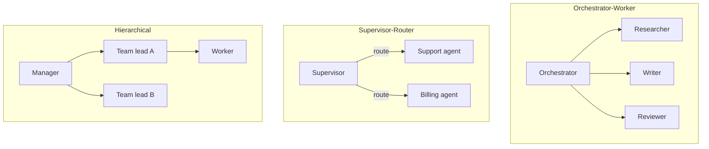

# Orchestration

When one agent isn't enough, **orchestration** coordinates multiple agents toward a single goal.

## Prerequisites

- [The Agent Loop](01-agent-loop.md) — single-agent perceive → reason → act → observe
- [Harness Engineering](04-harness-engineering.md) — permissions, budgets, termination per agent
- [Memory Systems](02-memory.md) — shared state and handoff packets

## What You'll Learn

| Concept | Why it matters |
|---------|---------------|
| Orchestrator-worker vs supervisor-router | Pick the right topology before writing code |
| Handoff packets | Prevent context loss when delegating |
| LangGraph-style graphs | Encode workflow vs agent decisions explicitly |
| Failure modes (ping-pong, duplicate work) | What breaks multi-agent systems in production |
| Budget inheritance | One runaway worker can bankrupt the whole trace |

---

## Intuition: one brain vs a team

A single agent is like one generalist employee handling every request. That works until tasks need **specialization** (legal review + code generation), **parallelism** (research three vendors at once), or **governance** (a supervisor must approve spend).

Orchestration answers: *who decides the next step, who owns state, and how do agents hand work off without losing context?*

```
User: "Research competitors, draft a one-pager, get legal to flag risks"

Single agent:  one context window, 40 tool calls, confused priorities
Orchestrated:  Researcher → Writer → Legal reviewer (structured handoffs)
```

!!! note "Orchestration ≠ always better"
    If your task is a fixed 4-step pipeline with no branching, a **workflow** (deterministic graph) beats N LLM routers. See [M11 L10 · Workflow vs Agent](../build/module-11-ai-agents-fundamentals/lessons/10-Workflow-vs-Agent.md).

---

## Patterns



| Pattern | Best for | Module |
|---------|----------|--------|
| **Orchestrator-worker** | Fixed pipeline with dynamic steps | [M12 L3](../build/module-12-multi-agent-systems/lessons/03-orchestrator-worker-pattern.md) |
| **Supervisor-router** | Route by intent | [M12 L5](../build/module-12-multi-agent-systems/lessons/05-supervisor-and-router-patterns.md) |
| **Hierarchical** | Large decomposable tasks | [M12 L4](../build/module-12-multi-agent-systems/lessons/04-hierarchical-agent-patterns.md) |
| **Handoff** | Specialist takes over mid-run | [M12 L6](../build/module-12-multi-agent-systems/lessons/06-agent-handoffs-and-delegation.md) |
| **Parallel** | Independent subtasks | [M12 L7](../build/module-12-multi-agent-systems/lessons/07-parallel-vs-sequential-execution.md) |

## LangGraph-style orchestration

```python
from langgraph.graph import StateGraph

graph = StateGraph(AgentState)
graph.add_node("researcher", research_node)
graph.add_node("writer", write_node)
graph.add_node("reviewer", review_node)
graph.add_edge("researcher", "writer")
graph.add_conditional_edges("reviewer", should_revise, {"revise": "writer", "done": END})
```

**Workflow** when edges are fixed; **agent** when the LLM picks the next node.

## Handoff packet

When delegating, pass structured context — not raw chat:

```json
{
  "task": "Draft PR description for commit abc123",
  "constraints": ["max 200 words", "include test plan"],
  "artifacts": {"diff_summary": "...", "linked_issues": ["#42"]},
  "parent_trace_id": "tr_8f3a..."
}
```

## Failure modes

| Failure | Mitigation |
|---------|------------|
| **Ping-pong** | Agents delegate back and forth | Max handoffs, clear ownership |
| **Duplicate work** | Two agents same task | Shared blackboard with locks |
| **Context loss** | Handoff drops details | Structured packets + trace links |
| **Cost explosion** | N agents × M steps | Per-agent budgets, supervisor caps |

Full module: [M12 · Multi-Agent Systems](../build/module-12-multi-agent-systems/index.md)

---

## Worked example: PR description pipeline

**Goal:** Given a git commit, produce a PR description with test plan.

### Setup

| Agent | Role | Tools | Budget |
|-------|------|-------|--------|
| **Orchestrator** | Decompose, delegate, merge | `assign_task`, `read_handoff` | 5 steps |
| **Researcher** | Summarize diff, linked issues | `git_diff`, `read_issue` | 8 steps |
| **Writer** | Draft PR body | `write_draft` | 6 steps |
| **Reviewer** | Check completeness | `read_draft`, `request_revision` | 4 steps |

### Trace (simplified)

```
Step 1 [Orchestrator]
  Thought: Need diff summary before writing.
  Action: assign_task(agent="researcher", task="Summarize commit abc123")

Step 2 [Researcher]
  Action: git_diff(sha="abc123") → 847 lines changed across 12 files
  Action: read_issue(#42) → "Add OAuth refresh token rotation"
  Handoff → {"diff_summary": "...", "linked_issues": ["#42"], "risk": "auth changes"}

Step 3 [Orchestrator]
  Action: assign_task(agent="writer", handoff=packet_from_step_2)

Step 4 [Writer]
  Output: draft PR (198 words) with test plan section

Step 5 [Reviewer]
  Verdict: REVISE — missing migration notes
  Action: request_revision(hint="mention alembic migration")

Step 6 [Writer]
  Output: revised draft (221 words) ✓

Step 7 [Orchestrator]
  Action: finish(answer=revised_draft)
```

**Cost:** 7 orchestrator steps + 18 worker steps = 25 LLM calls. Without orchestration caps, a single agent often exceeds 40 steps re-reading the same diff.

### Handoff packet (what actually gets passed)

```json
{
  "task": "Draft PR description for commit abc123",
  "constraints": ["max 250 words", "include test plan", "mention migrations if schema changes"],
  "artifacts": {
    "diff_summary": "12 files, auth/oauth.py major changes, new refresh endpoint",
    "linked_issues": ["#42"],
    "files_touched": ["src/auth/oauth.py", "tests/test_oauth.py"]
  },
  "parent_trace_id": "tr_8f3a2b",
  "budget_remaining_usd": 0.42
}
```

Raw chat history is **not** passed — only structured artifacts the next agent needs.

---

## Choosing a pattern

| Situation | Pattern | Why |
|-----------|---------|-----|
| Fixed stages, LLM picks tools within stage | Orchestrator-worker | Clear ownership per phase |
| Route by user intent ("billing" vs "support") | Supervisor-router | One classifier, many specialists |
| Task decomposes into sub-projects | Hierarchical | Manager → leads → workers |
| Mid-run specialist takeover | Handoff | Support agent escalates to engineer agent |
| Independent subtasks (3 web searches) | Parallel | `asyncio.gather` or parallel graph branches |

### Why not one mega-agent?

| Mega-agent problem | Orchestration fix |
|--------------------|-------------------|
| Context fills with irrelevant tool output | Each worker has a narrow tool set |
| No separation of concerns | Reviewer cannot edit, only approve/revise |
| Hard to eval | Per-agent golden trajectories |
| Blast radius on bad tool call | Writer cannot `git push` — orchestrator only reads |

---

## Edge cases & misconceptions

| Myth | Reality |
|------|---------|
| "More agents = faster" | Coordination overhead + duplicate LLM calls often **slow** simple tasks |
| "Agents negotiate like humans" | Without structured packets they **ping-pong** ("you do it" / "no you") |
| "LangGraph replaces orchestration design" | LangGraph is a **runtime**; you still choose topology and handoff schema |
| "Supervisor should be the smartest model" | Supervisor often needs **fast routing**, not deep reasoning — Sonnet-class is enough |
| "Shared memory solves everything" | Blackboards need **locks and TTL** or agents read stale state |

!!! warning "Depth limits"
    Cap nested delegation: `orchestrator → worker → sub-worker` with `max_depth=2`. Each level should inherit a **fraction** of the parent budget (`child_budget = parent_remaining * 0.4`).

---

## Production connection

Multi-agent systems fail in production for predictable reasons:

1. **No shared `trace_id`** — you cannot reconstruct who did what. Every handoff must log `parent_trace_id` and `agent_role`.
2. **Unbounded handoffs** — set `max_handoffs=3` at the harness level.
3. **Missing idempotency** — parallel workers may write the same file. Use artifact IDs and optimistic locking on shared state.
4. **Cost attribution** — tag each span with `agent_id` so finance can see Researcher vs Writer spend.

### Minimal supervisor harness sketch

```python
MAX_HANDOFFS = 3

def supervisor_loop(goal: str, specialists: dict, router_llm) -> str:
    handoffs = 0
    state = {"goal": goal, "artifacts": {}}
    while handoffs < MAX_HANDOFFS:
        route = router_llm.json_mode(
            f"Goal: {goal}\nArtifacts: {state['artifacts']}\n"
            f"Pick specialist: {list(specialists.keys())} or FINISH"
        )
        if route["action"] == "FINISH":
            return route["answer"]
        packet = build_handoff_packet(state, route["task"])
        result = specialists[route["specialist"]].run(packet)
        state["artifacts"].update(result.artifacts)
        handoffs += 1
    raise RuntimeError("Max handoffs exceeded")
```

Deploy with the same observability primitives as single agents — one trace, many child spans. See [Observability & Tracing](06-observability-and-tracing.md).

---

## Key takeaways

- Orchestration is **topology + handoff schema + budgets**, not "run more ChatGPTs"
- Pass **structured packets**, not raw chat, when delegating
- Supervisor-router for intent; orchestrator-worker for pipelines; parallel for independent work
- Cap handoffs, inherit budgets, and share one `trace_id` across all agents
- Prefer deterministic workflows when the graph is fixed — reserve LLM routing for branching tasks

### Testing orchestration in isolation

Unit-test each specialist with **fixed handoff packets** before testing the full graph:

```python
def test_writer_produces_test_plan():
    packet = load_fixture("handoff_researcher_to_writer.json")
    result = writer_agent.run(packet)
    assert "test plan" in result.text.lower()
    assert result.step_count <= 6
```

Router tests: given artifact state X, supervisor must pick `legal` not `writer`. Golden routing cases catch prompt regressions cheaply.

### Cost model for multi-agent runs

\[
\text{cost} \approx \sum_{a \in \text{agents}} (\text{steps}_a \times \text{tokens per step}_a \times \text{price})
\]

A supervisor that re-reads full artifacts every step doubles tokens. **Compress handoffs**: pass summaries + artifact IDs, not full document text. Cap orchestrator at 5 steps unless task is genuinely open-ended.

### Practice exercise (30 min)

On paper, design a 3-agent pipeline for a task you own (incident response, content pipeline, data pull). Define handoff packet JSON fields, max handoffs, and per-agent budgets. Identify one step that should be a deterministic workflow edge instead of LLM routing.

### Supervisor prompt anti-pattern

Avoid: *"You are a helpful supervisor that coordinates agents."*  
Prefer: *"Pick exactly one: researcher | writer | FINISH. Input: artifact JSON. Output: JSON with `specialist` and `task` fields only."*

Structured routing outputs parse reliably; prose routing invites ambiguous delegation and ping-pong.

**Next:** [Observability & Tracing →](06-observability-and-tracing.md)

## Related papers

| Paper | Link |
|-------|------|
| AutoGen — multi-agent conversation | [arXiv:2308.08155](https://arxiv.org/abs/2308.08155) |
| MetaGPT — role-based agent teams | [arXiv:2308.00352](https://arxiv.org/abs/2308.00352) |
| Generative Agents — multi-agent coordination | [arXiv:2304.03442](https://arxiv.org/abs/2304.03442) |

[Full list →](related-papers.md)
