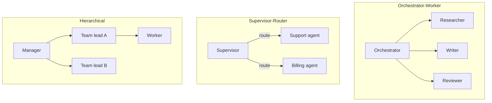

# Orchestration

When one agent isn't enough, **orchestration** coordinates multiple agents toward a single goal.

## Patterns



| Pattern | Best for | Module |
|---------|----------|--------|
| **Orchestrator-worker** | Fixed pipeline with dynamic steps | [M12 L3](../build/module-12-multi-agent-systems/lessons/03-orchestrator-worker-pattern.md) |
| **Supervisor-router** | Route by intent | [M12 L5](../build/module-12-multi-agent-systems/lessons/05-supervisor-and-router-patterns.md) |
| **Hierarchical** | Large decomposable tasks | [M12 L4](../build/module-12-multi-agent-systems/lessons/04-hierarchical-agent-patterns.md) |
| **Handoff** | Specialist takes over mid-run | [M12 L6](../build/module-12-multi-agent-systems/lessons/06-agent-handoffs-and-delegation.md) |
| **Parallel** | Independent subtasks | [M12 L7](../build/module-12-multi-agent-systems/lessons/07-parallel-vs-sequential-execution.md) |

## LangGraph-style orchestration

```python
from langgraph.graph import StateGraph

graph = StateGraph(AgentState)
graph.add_node("researcher", research_node)
graph.add_node("writer", write_node)
graph.add_node("reviewer", review_node)
graph.add_edge("researcher", "writer")
graph.add_conditional_edges("reviewer", should_revise, {"revise": "writer", "done": END})
```

**Workflow** when edges are fixed; **agent** when the LLM picks the next node.

## Handoff packet

When delegating, pass structured context — not raw chat:

```json
{
  "task": "Draft PR description for commit abc123",
  "constraints": ["max 200 words", "include test plan"],
  "artifacts": {"diff_summary": "...", "linked_issues": ["#42"]},
  "parent_trace_id": "tr_8f3a..."
}
```

## Failure modes

| Failure | Mitigation |
|---------|------------|
| **Ping-pong** | Agents delegate back and forth | Max handoffs, clear ownership |
| **Duplicate work** | Two agents same task | Shared blackboard with locks |
| **Context loss** | Handoff drops details | Structured packets + trace links |
| **Cost explosion** | N agents × M steps | Per-agent budgets, supervisor caps |

Full module: [M12 · Multi-Agent Systems](../build/module-12-multi-agent-systems/index.md)

**Next:** [Observability & Tracing →](06-observability-and-tracing.md)
