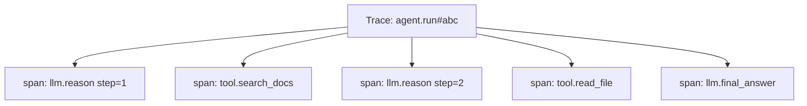

# Observability & Tracing

Agents fail in **steps**, not single requests. You need traces that show every loop iteration, tool call, and token spend.

## Prerequisites

- [The Agent Loop](01-agent-loop.md) — what a "step" means
- [Harness Engineering](04-harness-engineering.md) — where spans are emitted
- Basic familiarity with distributed tracing (spans, traces, attributes)

## What You'll Learn

| Concept | Why it matters |
|---------|---------------|
| Span hierarchy for agent runs | Debug which step failed without re-running |
| Token and cost attribution | Finance and SLA accountability per task |
| Trace-linked debugging workflow | From user report → root cause in minutes |
| Production dashboards | What to alert on before users complain |
| Replay in eval harness | Turn a failed trace into a regression test |

---

## Intuition: flight recorder for agents

A chat completion log tells you the final answer. An **agent trace** tells you the story: which tools fired, in what order, with what arguments, how long each took, and how many tokens each reasoning step consumed.

When a user says "the agent deleted the wrong file," you need:

```
trace_id: tr_a91f
  step 3: tool.write_file(path="config.yaml")  ← culprit
  step 2: tool.list_files(dir=".")           ← model saw wrong directory
  step 1: llm.reason (input: 4,200 tokens)  ← bloated context?
```

Without this timeline, you are guessing whether the bug is prompt, tool schema, permissions, or model drift.

---

## What to trace



| Field | Why |
|-------|-----|
| `trace_id` | Correlate user report → full run |
| `step` | Loop iteration number |
| `tool_name` / `tool_args` | Reproduce failures |
| `input_tokens` / `output_tokens` | Cost attribution |
| `latency_ms` | SLA monitoring |
| `status` | ok / error / timeout |

## Span per agent step

```python
def run_agent_step(state, tracer):
    with tracer.start_span("llm.reason", attributes={"step": state.step}) as span:
        response = llm.chat(state.messages)
        span.set_attribute("tokens_in", response.usage.input)
        span.set_attribute("tokens_out", response.usage.output)
    if response.tool_calls:
        for call in response.tool_calls:
            with tracer.start_span("tool." + call.name) as tspan:
                tspan.set_attribute("args", json.dumps(call.args)[:500])
                result = execute_tool(call)
                tspan.set_attribute("status", "ok" if result.ok else "error")
    return response
```

## Tools

| Tool | Strength |
|------|----------|
| [Langfuse](https://langfuse.com/) | LLM-native traces, scores, datasets |
| [LangSmith](https://smith.langchain.com/) | LangChain/LangGraph integration |
| **OpenTelemetry** | Vendor-neutral; export to Grafana/Datadog |
| [Arize Phoenix](https://phoenix.arize.com/) | Open-source LLM observability |

Full lessons:
- [M18 · Observability in the Harness](../build/module-18-agent-harness-tools-runtime/lessons/06-observability-in-the-harness.md)
- [M10 · LLMOps Observability](../production/module-10-llmops-production-systems/lessons/02-Observability-and-Monitoring.md)

## Dashboards to build

| Metric | Alert when |
|--------|------------|
| P95 latency per agent | > 30s |
| Cost per successful task | > 2× baseline |
| Tool error rate | > 5% |
| Steps to completion | > max_steps × 0.8 |
| User thumbs-down rate | spikes day-over-day |

## Debugging workflow

1. Get `trace_id` from user or logs
2. Open trace timeline — find failing span
3. Inspect tool args + raw observation
4. Replay step in eval harness with same inputs
5. Fix prompt, tool, or permission — add regression eval

---

## Worked example: tracing a failed support agent

**Scenario:** User asks "Cancel my subscription." Agent sends email to wrong customer.

### Trace timeline

| Step | Span | Duration | Tokens | Status |
|------|------|----------|--------|--------|
| 1 | `llm.reason` | 1.2s | 3,100 in / 180 out | ok |
| 2 | `tool.lookup_user` | 0.3s | — | ok |
| 3 | `llm.reason` | 0.9s | 3,400 in / 95 out | ok |
| 4 | `tool.send_email` | 2.1s | — | **error** |
| 5 | `llm.reason` | 1.0s | 3,500 in / 120 out | ok |

### Span detail for step 2 (root cause)

```json
{
  "span": "tool.lookup_user",
  "args": {"email": "user@gmail.com"},
  "result": {"user_id": "u_999", "name": "Wrong Person"},
  "attributes": {
    "session_user_id": "u_123",
    "mismatch": true
  }
}
```

**Diagnosis:** `lookup_user` searched by email string from chat, not session-bound `user_id`. Fix: harness injects `session.user_id` into tool context; model cannot override.

### Replay for regression

```python
def test_cancel_subscription_uses_session_user(trace_fixture):
    trace = replay_trace("tr_failed_cancel", patch={"session.user_id": "u_123"})
    assert trace.tool_calls[-1].name == "send_email"
    assert trace.tool_calls[-1].args["user_id"] == "u_123"
```

---

## Edge cases & misconceptions

| Myth | Reality |
|------|---------|
| "Logs are enough" | Logs lack parent-child structure; spans show **causal order** |
| "Trace everything at full payload" | Store truncated args in spans; full payloads in object storage linked by `artifact_id` |
| "P95 latency is the key metric" | **Cost per success** and **steps to completion** predict user satisfaction better for agents |
| "Tracing is only for debugging" | Traces feed **eval datasets** — production failures become golden tests |
| "One trace per HTTP request" | Long agents may span multiple HTTP requests; use **session_id** + **trace_id** |

### Sampling in production

At 10k agent runs/day, tracing 100% may be expensive. Common approach:

| Traffic | Sample rate |
|---------|-------------|
| Errors | 100% |
| Thumbs-down | 100% |
| New model version | 100% for first 48h |
| Happy path | 5–10% |

Always sample **complete trajectories**, not individual spans — partial traces mislead.

---

## Production connection

### OpenTelemetry attribute convention (agent-specific)

```python
span.set_attribute("gen_ai.request.model", "claude-sonnet-4")
span.set_attribute("agent.step", state.step)
span.set_attribute("agent.tool_name", call.name)
span.set_attribute("gen_ai.usage.input_tokens", usage.input)
span.set_attribute("gen_ai.usage.output_tokens", usage.output)
span.set_attribute("agent.cost_usd", step_cost)
```

Export to Grafana, Datadog, or Langfuse. Align with [OpenTelemetry GenAI semantic conventions](https://opentelemetry.io/docs/specs/semconv/gen-ai/).

### On-call runbook snippet

1. User reports bad outcome → get `trace_id` from UI footer or support ticket
2. Filter traces: `trace_id=tr_x` → sort spans by `agent.step`
3. Find first `status=error` or unexpected `tool.*` span
4. Compare `tool_args` to golden trajectory in eval repo
5. Patch harness (permissions, schema) or prompt → add regression case → deploy

### Dashboard panels worth building

| Panel | Query idea | Alert |
|-------|------------|-------|
| Token burn rate | `sum(input_tokens+output_tokens) by agent_name` | >2× 7-day baseline |
| Tool error heatmap | `count by tool_name, status` | any tool >5% errors |
| Stuck agents | `steps >= 0.8 * max_steps` | >10% of runs |
| Judge score drift | `avg(eval_score) by model_version` | drop >0.5 vs prior week |

---

## Key takeaways

- Agents fail in **steps** — trace every loop iteration, not just the final LLM call
- Include `step`, `tool_args` (truncated), tokens, cost, and `status` on every span
- Link production traces to **eval replay** for regression prevention
- Sample intelligently: always trace errors and failures; sample happy path
- Dashboards: cost per success, tool error rate, and steps-to-completion beat vanity latency metrics

### Cost attribution example

```
trace tr_support_991 — total $0.34
  llm.reason  step 1: $0.08
  tool.lookup:        $0.00
  llm.reason  step 2: $0.09
  tool.send_email:    $0.00  ← failed
  llm.reason  step 3: $0.11
  llm.reason  step 4: $0.06
```

Leadership asks "why did support agents cost 2× last week?" — attribute to model change (more steps) vs traffic (more runs) using span-level token fields.

### Red flags in trace review (weekly ritual)

Spend 30 minutes on the five slowest or costliest traces:

- **Repeated identical tool calls** → stuck-loop detection too weak
- **Single observation > 8K tokens** → truncation policy missing
- **High step count, success outcome** → efficiency eval gap
- **Permission denied then workaround** → model found unsafe path — add safety eval
- **Latency spike on one tool** → downstream API, not LLM — fix timeout/retry

### Practice exercise (30 min)

Take any multi-step agent log. Manually annotate spans: `llm.reason`, `tool.*`, tokens (estimate if needed), status. Identify the failing or wasteful span. Write one regression test description that would catch the same failure class on the next deploy.

### Trace retention policy

| Data | Retention | Notes |
|------|-----------|-------|
| Full traces (errors) | 90 days | Include tool args |
| Sampled happy path | 14 days | Cost optimization |
| PII fields | Redact at ingest | Never store raw prompts with secrets |
| Aggregated metrics | 1 year | Tokens, cost, success rate |

Align retention with compliance — traces often contain user data by accident.

!!! tip "Start with Langfuse or OTel"
    Pick one tracing backend in week one of agent development. Switching later means losing historical baselines for cost and step-count regressions.

### User-facing trace_id

Expose a short `trace_id` in the agent UI footer or API response header. Support teams that cannot grep logs will still paste one ID into your dashboard — cutting median time-to-diagnosis dramatically.

### Correlation IDs across services

When a tool calls your internal API, pass `trace_id` as a header. Backend logs for that HTTP request then join the agent trace — essential when failures are in microservices, not the LLM.

### Latency breakdown chart

Plot per-trace: LLM time vs tool time vs queue time. Teams routinely discover agents are **API-bound**, not model-bound — fix retries and caching before switching to a faster LLM.

**Next:** [Agent Evals →](07-agent-evals.md)

## Related papers

| Paper | Link |
|-------|------|
| AgentBench — evaluating LLMs as agents | [arXiv:2308.03688](https://arxiv.org/abs/2308.03688) |
| WebArena — realistic web agent environment | [arXiv:2307.13854](https://arxiv.org/abs/2307.13854) |

Also: [OpenTelemetry GenAI conventions](https://opentelemetry.io/docs/specs/semconv/gen-ai/) · [Full list →](related-papers.md)
