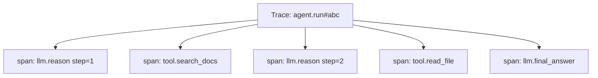

# Observability & Tracing

Agents fail in **steps**, not single requests. You need traces that show every loop iteration, tool call, and token spend.

## What to trace



| Field | Why |
|-------|-----|
| `trace_id` | Correlate user report → full run |
| `step` | Loop iteration number |
| `tool_name` / `tool_args` | Reproduce failures |
| `input_tokens` / `output_tokens` | Cost attribution |
| `latency_ms` | SLA monitoring |
| `status` | ok / error / timeout |

## Span per agent step

```python
def run_agent_step(state, tracer):
    with tracer.start_span("llm.reason", attributes={"step": state.step}) as span:
        response = llm.chat(state.messages)
        span.set_attribute("tokens_in", response.usage.input)
        span.set_attribute("tokens_out", response.usage.output)
    if response.tool_calls:
        for call in response.tool_calls:
            with tracer.start_span("tool." + call.name) as tspan:
                tspan.set_attribute("args", json.dumps(call.args)[:500])
                result = execute_tool(call)
                tspan.set_attribute("status", "ok" if result.ok else "error")
    return response
```

## Tools

| Tool | Strength |
|------|----------|
| [Langfuse](https://langfuse.com/) | LLM-native traces, scores, datasets |
| [LangSmith](https://smith.langchain.com/) | LangChain/LangGraph integration |
| **OpenTelemetry** | Vendor-neutral; export to Grafana/Datadog |
| [Arize Phoenix](https://phoenix.arize.com/) | Open-source LLM observability |

Full lessons:
- [M18 · Observability in the Harness](../build/module-18-agent-harness-tools-runtime/lessons/06-observability-in-the-harness.md)
- [M10 · LLMOps Observability](../production/module-10-llmops-production-systems/lessons/02-Observability-and-Monitoring.md)

## Dashboards to build

| Metric | Alert when |
|--------|------------|
| P95 latency per agent | > 30s |
| Cost per successful task | > 2× baseline |
| Tool error rate | > 5% |
| Steps to completion | > max_steps × 0.8 |
| User thumbs-down rate | spikes day-over-day |

## Debugging workflow

1. Get `trace_id` from user or logs
2. Open trace timeline — find failing span
3. Inspect tool args + raw observation
4. Replay step in eval harness with same inputs
5. Fix prompt, tool, or permission — add regression eval

**Next:** [Agent Evals →](07-agent-evals.md)

## Related papers

| Paper | Link |
|-------|------|
| AgentBench — evaluating LLMs as agents | [arXiv:2308.03688](https://arxiv.org/abs/2308.03688) |
| WebArena — realistic web agent environment | [arXiv:2307.13854](https://arxiv.org/abs/2307.13854) |

Also: [OpenTelemetry GenAI conventions](https://opentelemetry.io/docs/specs/semconv/gen-ai/) · [Full list →](related-papers.md)
