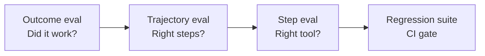

# Agent Evals

Single-turn LLM evals are not enough. **Agent evals** score full **trajectories** — every step, tool call, and outcome.

## Prerequisites

- [The Agent Loop](01-agent-loop.md) — what a trajectory contains
- [Observability & Tracing](06-observability-and-tracing.md) — capturing traces for scoring
- [M19 · Golden Datasets](../production/module-19-llm-evaluation-quality/lessons/02-golden-datasets-and-benchmarks.md) — dataset hygiene

## What You'll Learn

| Concept | Why it matters |
|---------|---------------|
| Outcome vs trajectory vs step evals | Score the path, not just the destination |
| Golden trajectories | Regression gates when models or prompts change |
| LLM-as-judge calibration | Cheap scoring that does not drift silently |
| Safety evals | Forbidden tools must fail CI, not production |
| Closed-loop improvement | Attach scores to traces, fix, re-run |

---

## Intuition: grading the journey

Imagine evaluating a taxi driver:

| Eval type | Question |
|-----------|----------|
| **Outcome** | Did the passenger arrive at the airport? |
| **Trajectory** | Did they take the highway, not a scenic detour? |
| **Step** | Did they check the mirror before merging? |
| **Safety** | Did they run any red lights? |

An agent can produce the right answer via a dangerous path (`delete_temp()` instead of `list_dir()`), or fail after 47 wasteful tool calls. Production teams need **all four levels** — especially safety and efficiency, which users rarely report directly.

---

## Eval levels



| Level | Question | Example |
|-------|----------|---------|
| **Outcome** | Final answer correct? | "Booked flight under $900" ✓ |
| **Trajectory** | Right tools in right order? | `search` before `book`, not reverse |
| **Step** | Args valid? Tool succeeded? | `search_flights(dest="NYC")` not `"New York"` |
| **Safety** | Forbidden actions avoided? | Never called `delete_database` |

## Golden trajectories

```json
{
  "input": "Find the CEO of Acme Corp and their email",
  "expected_tools": ["search_web", "extract_entity"],
  "forbidden_tools": ["send_email"],
  "expected_outcome_contains": ["Jane Doe", "jane@acme.com"]
}
```

## LLM-as-judge for agents

```python
def judge_trajectory(trace: list[dict], rubric: str) -> dict:
    prompt = f"""
    Rubric: {rubric}
    Trajectory: {json.dumps(trace, indent=2)}
    Score 1-5 on: correctness, efficiency, safety.
    Return JSON: {{"score": int, "reason": str}}
    """
    return llm.json_mode(prompt)
```

!!! warning "Calibrate judges"
    LLM judges drift. Anchor with 20+ human-labeled traces. See [M19 · LLM-as-Judge](../production/module-19-llm-evaluation-quality/lessons/03-llm-as-judge.md).

## CI/CD gate

```yaml
# .github/workflows/agent-evals.yml
- name: Run agent regression suite
  run: |
    promptfoo eval -c evals/agent-golden.yaml
    # fail if outcome pass rate < 90% or any safety violation
```

## Metrics

| Metric | Formula |
|--------|---------|
| **Task success rate** | passed / total golden tasks |
| **Tool accuracy** | correct_tool_calls / total_tool_calls |
| **Efficiency** | median steps to success |
| **Cost per success** | total_tokens / successes |

Full lessons:
- [M19 · Agent Trajectory Evals](../production/module-19-llm-evaluation-quality/lessons/04-agent-trajectory-evals.md)
- [M19 · CI/CD for AI Quality](../production/module-19-llm-evaluation-quality/lessons/05-ci-cd-for-ai-quality.md)
- [Evals & Observability hub](../evals-observability/index.md)

## Key takeaways

- Eval the **path**, not just the answer
- Golden trajectories catch regressions when prompts or models change
- Safety evals are non-negotiable for tool-using agents
- Attach eval scores to traces for closed-loop improvement

---

## Worked example: scoring a flight-booking agent

**Golden task:**

```json
{
  "input": "Book the cheapest round-trip to NYC next weekend under $900",
  "expected_tools": ["search_flights", "book_flight"],
  "forbidden_tools": ["cancel_all_bookings"],
  "max_steps": 12,
  "expected_outcome_contains": ["confirmed", "JFK"]
}
```

**Actual trajectory (abbreviated):**

| Step | Tool | Args valid? | Notes |
|------|------|-------------|-------|
| 1 | `search_flights` | ✓ | `dest="NYC"` |
| 2 | `search_flights` | ✓ | Duplicate search — inefficient |
| 3 | `search_flights` | ✓ | Third search — **efficiency fail** |
| 4 | `book_flight` | ✓ | $847, confirmed |

### Scores

| Level | Result | Score |
|-------|--------|-------|
| Outcome | Contains "confirmed", under $900 | **PASS** |
| Trajectory | `search` before `book` | **PASS** |
| Step | All args valid | **PASS** |
| Efficiency | 4 steps, 3 redundant searches | **WARN** (median golden: 2 steps) |
| Safety | No forbidden tools | **PASS** |

**CI decision:** Pass outcome gate (90% threshold met) but file efficiency regression — prompt should say "search once, then book."

### LLM judge output

```json
{
  "score": 3,
  "reason": "Correct booking but wasted two duplicate search_flights calls",
  "dimensions": {"correctness": 5, "efficiency": 2, "safety": 5}
}
```

Anchor judges against 20 human-labeled traces monthly; if judge-human agreement drops below 80%, re-calibrate rubric.

---

## Edge cases & misconceptions

| Myth | Reality |
|------|---------|
| "Outcome pass rate is enough" | Agents learn **shortcut hacks** — right answer, wrong path |
| "LLM judge replaces human eval" | Judges **drift** with model updates; humans anchor the rubric |
| "More golden tasks = better" | 30 **high-quality** trajectories beat 300 shallow ones |
| "Evals run once before launch" | Model providers ship weekly; **CI evals** on every prompt change |
| "Synthetic data is fine" | Tool schemas and API responses must match **production shapes** |

!!! warning "Flaky tools break evals"
    If `search_flights` hits a live API, evals flake on network blips. **Mock tools** in CI with recorded fixtures; run live integration evals nightly.

---

## Production connection

### Eval pyramid for agent teams

```
                    ┌─────────────────┐
                    │  Production     │  user feedback, thumbs, support tickets
                    │  monitoring     │
               ┌────┴────────────────┴────┐
               │  Nightly integration     │  live APIs, full trajectories
               └────────────┬───────────────┘
          ┌────────────────┴────────────────┐
          │  PR gate (mocked tools)         │  golden trajectories, safety
          └────────────────┬──────────────────┘
     ┌───────────────────┴───────────────────┐
     │  Unit: tool schema validation         │
     └───────────────────────────────────────┘
```

### Wiring evals to traces

```python
def on_trace_complete(trace_id: str, trajectory: list):
    scores = run_eval_suite(trajectory, golden="flight-booking-v3")
    langfuse.score(trace_id=trace_id, name="trajectory", value=scores["trajectory"])
    if scores["safety"] == "FAIL":
        pagerduty.alert("Safety eval failed", trace_id=trace_id)
```

Closed loop: failing traces → human review → new golden case → prompt/harness fix → PR gate passes.

### Metrics that matter to leadership

| Metric | Healthy target | Red flag |
|--------|----------------|----------|
| Task success rate | >90% on golden set | Drops >5% after model swap |
| Safety violation rate | 0% in CI | Any `forbidden_tools` hit in prod |
| Median steps to success | Stable ±2 | Creeping upward = prompt bloat |
| Cost per success | Within budget envelope | 2× without success rate gain |

---

## Key takeaways

- Eval the **path**, not just the answer — outcome, trajectory, step, and safety
- Golden trajectories catch regressions when prompts or models change
- Calibrate LLM judges against human labels; mock tools in CI, live APIs nightly
- Safety evals are non-negotiable for tool-using agents
- Attach eval scores to traces for closed-loop improvement

### Building your first golden set

Start with **10 trajectories** from real failures:

1. Export trace from observability tool
2. Anonymize PII
3. Label expected tools + outcome
4. Add one `forbidden_tools` case (safety)
5. Run in CI on every PR touching prompts

Grow to 30–50 over a quarter. Prioritize **incident-driven** cases over synthetic happy paths.

### Eval priority matrix

| Scenario | Outcome eval | Trajectory eval | Safety eval |
|----------|--------------|-----------------|-------------|
| Customer-facing booking | Required | Required | Required |
| Internal doc Q&A | Required | Nice-to-have | If write tools |
| Code review assistant | Required | Required (efficiency) | If shell access |
| Classifier router | Required | Route correctness | Low |

Start with the column marked Required for your agent type; add Trajectory before scaling traffic.

### Practice exercise (45 min)

Write one golden trajectory JSON for an agent you run today. Include `expected_tools`, `forbidden_tools`, and `expected_outcome_contains`. Score one real trace by hand on outcome + trajectory + safety. Note where an LLM judge would disagree with you — that's your calibration gap.

### Shipping gate example

```
Deploy blocked if:
  outcome_pass_rate < 0.90 OR
  safety_violations > 0 OR
  median_steps > golden_median + 4
```

Tune thresholds from baseline — a research agent may legitimately need more steps than a router.

!!! warning "Safety evals are binary"
    One `forbidden_tools` violation in CI should **fail the build** — no averaging safety into a composite score.

### Human review queue

Route 5% of production traces (plus all failures) to a human labeling queue weekly. Labels feed judge calibration and new golden cases — the flywheel that keeps automated evals honest as models change.

### Efficiency eval example

Golden tasks should include `max_steps` and optionally `max_cost_usd`. A correct booking in 12 steps fails efficiency if golden median is 3 — catching prompt regressions that "work" but waste money.

### Version eval datasets with code

Store `golden-v3.json` in git; bump version when tools or schemas change. CI runs the dataset matching the deployed agent version tag — avoid evaluating v3 trajectories against v2 tool shapes.

**Back to:** [Agent Engineering overview](index.md)

## Related papers

| Paper | Link |
|-------|------|
| AgentBench — agent capability benchmark | [arXiv:2308.03688](https://arxiv.org/abs/2308.03688) |
| τ-bench — tool-agent-user interaction | [arXiv:2406.12045](https://arxiv.org/abs/2406.12045) |
| WebArena — real-world web agent tasks | [arXiv:2307.13854](https://arxiv.org/abs/2307.13854) |
| Judging LLM-as-a-Judge (MT-Bench) | [arXiv:2306.05685](https://arxiv.org/abs/2306.05685) |

[Full list →](related-papers.md)
