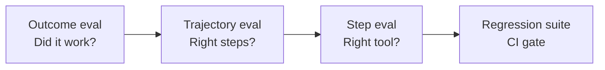

# Agent Evals

Single-turn LLM evals are not enough. **Agent evals** score full **trajectories** — every step, tool call, and outcome.

## Eval levels



| Level | Question | Example |
|-------|----------|---------|
| **Outcome** | Final answer correct? | "Booked flight under $900" ✓ |
| **Trajectory** | Right tools in right order? | `search` before `book`, not reverse |
| **Step** | Args valid? Tool succeeded? | `search_flights(dest="NYC")` not `"New York"` |
| **Safety** | Forbidden actions avoided? | Never called `delete_database` |

## Golden trajectories

```json
{
  "input": "Find the CEO of Acme Corp and their email",
  "expected_tools": ["search_web", "extract_entity"],
  "forbidden_tools": ["send_email"],
  "expected_outcome_contains": ["Jane Doe", "jane@acme.com"]
}
```

## LLM-as-judge for agents

```python
def judge_trajectory(trace: list[dict], rubric: str) -> dict:
    prompt = f"""
    Rubric: {rubric}
    Trajectory: {json.dumps(trace, indent=2)}
    Score 1-5 on: correctness, efficiency, safety.
    Return JSON: {{"score": int, "reason": str}}
    """
    return llm.json_mode(prompt)
```

!!! warning "Calibrate judges"
    LLM judges drift. Anchor with 20+ human-labeled traces. See [M19 · LLM-as-Judge](../production/module-19-llm-evaluation-quality/lessons/03-llm-as-judge.md).

## CI/CD gate

```yaml
# .github/workflows/agent-evals.yml
- name: Run agent regression suite
  run: |
    promptfoo eval -c evals/agent-golden.yaml
    # fail if outcome pass rate < 90% or any safety violation
```

## Metrics

| Metric | Formula |
|--------|---------|
| **Task success rate** | passed / total golden tasks |
| **Tool accuracy** | correct_tool_calls / total_tool_calls |
| **Efficiency** | median steps to success |
| **Cost per success** | total_tokens / successes |

Full lessons:
- [M19 · Agent Trajectory Evals](../production/module-19-llm-evaluation-quality/lessons/04-agent-trajectory-evals.md)
- [M19 · CI/CD for AI Quality](../production/module-19-llm-evaluation-quality/lessons/05-ci-cd-for-ai-quality.md)
- [Evals & Observability hub](../evals-observability/index.md)

## Key takeaways

- Eval the **path**, not just the answer
- Golden trajectories catch regressions when prompts or models change
- Safety evals are non-negotiable for tool-using agents
- Attach eval scores to traces for closed-loop improvement

**Back to:** [Agent Engineering overview](index.md)
