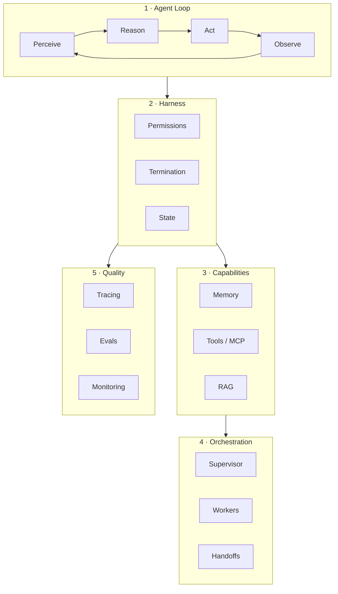

# Agent Engineering

A **dedicated track** for everything involved in shipping autonomous AI systems — not scattered across modules, but organized as one engineering discipline.

## Read in order

| # | Topic | Page | Also in courses |
|---|-------|------|-----------------|
| 1 | **Agent loop** | [The Agent Loop](01-agent-loop.md) | [Course 07 L1–3](../build/module-11-ai-agents-fundamentals/index.md) |
| 2 | **Memory** | [Memory Systems](02-memory.md) | [Course 07 L5](../build/module-11-ai-agents-fundamentals/lessons/05-Agent-Memory.md) |
| 3 | **Tools & MCP** | [Tools & MCP](03-tools-and-mcp.md) | [Course 08 L3–4](../build/module-18-agent-harness-tools-runtime/index.md) |
| 4 | **Harness engineering** | [Harness Engineering](04-harness-engineering.md) | [Course 08](../build/module-18-agent-harness-tools-runtime/index.md) |
| 5 | **Orchestration** | [Orchestration](05-orchestration.md) | [Course 09](../build/module-12-multi-agent-systems/index.md) |
| 6 | **Observability & tracing** | [Observability & Tracing](06-observability-and-tracing.md) | [Course 08 L6](../build/module-18-agent-harness-tools-runtime/lessons/06-observability-in-the-harness.md), [Course 12](../production/module-10-llmops-production-systems/index.md) |
| 7 | **Agent evals** | [Agent Evals](07-agent-evals.md) | [Course 13 L4](../production/module-19-llm-evaluation-quality/lessons/04-agent-trajectory-evals.md) |

## What is harness engineering?

**Harness engineering** is the discipline of building the **runtime** around an LLM agent — not the model, not the prompt alone, but the system that makes agents reliable:

| Primitive | What it does |
|-----------|--------------|
| **Loop** | Perceive → reason → act → observe until done |
| **State** | Checkpoint conversation, tool results, plan |
| **Tools** | Sandboxed execution, schemas, MCP servers |
| **Permissions** | Allowlists, human-in-the-loop, budget caps |
| **Termination** | Max steps, success criteria, timeout |
| **Observability** | Spans per step, token/cost attribution |
| **Evals** | Trajectory regression, tool-call correctness |

Inspired by [Awesome Harness Engineering](https://github.com/ai-boost/awesome-harness-engineering) and [Agents Towards Production](https://github.com/NirDiamant/agents-towards-production).

## Quick reference

| I need to… | Go to |
|------------|-------|
| Understand ReAct | [Agent Loop](01-agent-loop.md) |
| Persist context across sessions | [Memory](02-memory.md) |
| Connect to APIs / filesystem | [Tools & MCP](03-tools-and-mcp.md) |
| Make a coding agent safe | [Harness Engineering](04-harness-engineering.md) |
| Run multiple specialists | [Orchestration](05-orchestration.md) |
| Debug a failed run | [Observability](06-observability-and-tracing.md) |
| Gate a release | [Agent Evals](07-agent-evals.md) |

## Related

- [2026 Skills](../ai-engineering-2026/index.md) — Claude Code, skills, loop engineering
- [Evals & Observability hub](../evals-observability/index.md)
- [Glossary — harness, MCP, trajectory eval](../glossary.md)
- [Related papers](related-papers.md) — ReAct, Toolformer, MemGPT, AgentBench, and more
