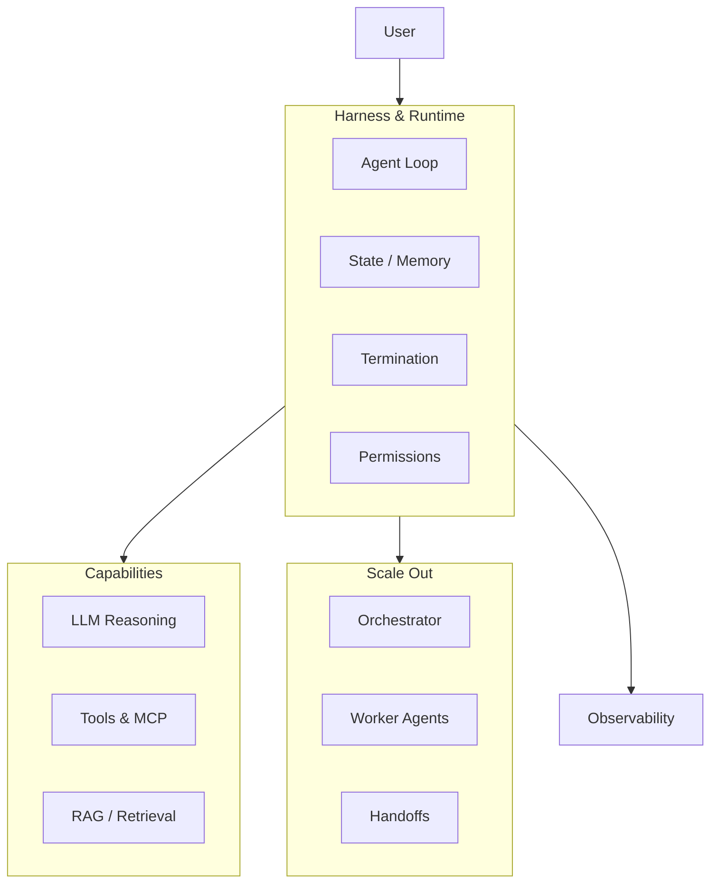

# Agentic AI — One-Stop Guide

Everything you need to design, build, and ship **autonomous AI systems**.

!!! tip "Dedicated Agent Engineering track"
    For a structured curriculum on loops, memory, tools, harness, orchestration, observability, and evals — see **[Agent Engineering](../agent-engineering/index.md)**.

!!! tip "2026 skills"
    Claude Code, skills files, loop engineering → **[AI Engineering 2026](../ai-engineering-2026/index.md)**

## The agentic stack

## Learning path (agentic track)

| Step | Course | What you'll learn |
|------|--------|-------------------|
| 1 | [Course 07 · AI Agents](../build/module-11-ai-agents-fundamentals/index.md) | Agent loop, ReAct, tool use, frameworks |
| 2 | [Course 08 · Harness & Tools](../build/module-18-agent-harness-tools-runtime/index.md) | Runtime primitives, MCP, safety, tracing |
| 3 | [Course 09 · Multi-Agent](../build/module-12-multi-agent-systems/index.md) | Orchestration, coordination, patterns |
| 4 | [Course 06 · RAG](../build/module-09-rag-retrieval-augmented-generation/index.md) | Retrieval-driven agents |
| 5 | [Course 16 · Capstones](../advanced/module-17-capstone-projects/index.md) | End-to-end agent projects |

## Core concepts

| Concept | Handbook | OSS inspiration |
|---------|----------|-----------------|
| **Agent loop** | [Course 07 · Intro to agents](../build/module-11-ai-agents-fundamentals/lessons/01-Introduction-to-Agents.md) | [Microsoft AI Agents for Beginners](https://github.com/microsoft/ai-agents-for-beginners) |
| **Harness** | [Course 08](../build/module-18-agent-harness-tools-runtime/index.md) | [Awesome Harness Engineering](https://github.com/ai-boost/awesome-harness-engineering) |
| **Tools & MCP** | [Course 08 · Tools & MCP](../build/module-18-agent-harness-tools-runtime/index.md) | [Model Context Protocol](https://modelcontextprotocol.io/) |
| **Orchestration** | [Course 09](../build/module-12-multi-agent-systems/index.md) | [Agents Towards Production](https://github.com/NirDiamant/agents-towards-production) |
| **Workflow vs agent** | [Course 07 · Workflow vs agent](../build/module-11-ai-agents-fundamentals/lessons/10-Workflow-vs-Agent.md) | LangGraph docs |

## When to use what

| Problem | Pattern | Course |
|---------|---------|--------|
| Single task with tools | ReAct agent | 07 |
| Long-running coding agent | Harness + sandbox | 08 |
| Research across sources | Multi-agent + RAG | 09, 06 |
| Deterministic pipeline | Workflow (not agent) | 07 |
| Customer support | Orchestrator + specialists | 09 |

## Visual references

- [The Illustrated Transformer](https://jalammar.github.io/illustrated-transformer/) — attention foundation for reasoning models
- [How GPT-3 Works](https://jalammar.github.io/how-gpt3-works-visualizations-animations/) — token prediction → tool selection analogy

## Related

- [Evals & Observability](../evals-observability/index.md) — measure and debug agent runs
- [Topic Map](../topic-map.md) — find any concept
- [Glossary](../glossary.md) — agent, harness, MCP, trajectory eval
