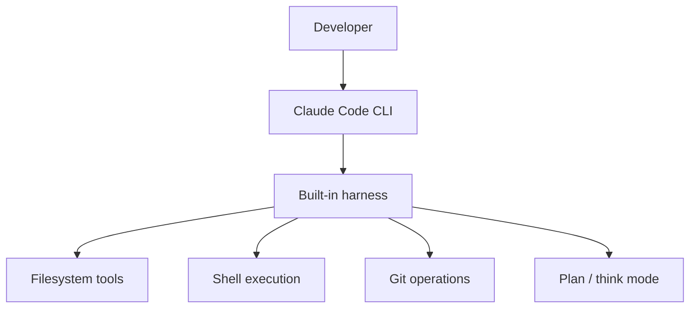

# Claude Code

**Claude Code** is Anthropic's agentic coding tool — an LLM with terminal, filesystem, and git access running in a **harness** designed for software engineering tasks.

## Prerequisites

- [Harness Engineering](../agent-engineering/04-harness-engineering.md) — permissions, termination
- [Skills & Rules](skills-and-rules.md) — CLAUDE.md project context
- [Loop Engineering](loop-engineering.md) — session-level inner loops

## What You'll Learn

| Concept | Why it matters |
|---------|---------------|
| Claude Code architecture | CLI + built-in harness + tools |
| Permission model | Maps to production HITL patterns |
| CLAUDE.md | Persistent context engineering |
| Subagents | Isolated context for parallel work |
| Lessons for custom agents | What to steal for your product |

---

## Intuition: senior engineer pair-programmer with guardrails

Claude Code is not "ChatGPT in a terminal." It is a **coding harness** that:

1. Loads your repo context (`CLAUDE.md`, file tree)
2. Runs a multi-step agent loop with bash, read, write, git
3. **Asks permission** before risky operations
4. Can plan before executing large diffs

The product insight: developers trust it because the **harness** is visible — you see the command before it runs, you can deny, you can require plan mode.

---

## What it is

| Aspect | Detail |
|--------|--------|
| **Interface** | Terminal CLI + IDE integrations |
| **Model** | Claude (Sonnet/Opus class) |
| **Capabilities** | Read/write files, run bash, git, search codebase |
| **Harness** | Built-in permissions, plan mode, subagents |



## Core workflows

### 1. Interactive session

```bash
claude   # start REPL-style session in project directory
```

The agent reads `CLAUDE.md` (project instructions) automatically — see [Skills & Rules](skills-and-rules.md).

### 2. One-shot task

```bash
claude -p "Fix the failing test in tests/test_auth.py"
```

### 3. Plan-first (safer for large changes)

Use plan mode to review approach before edits — analogous to human-in-the-loop in [Harness Engineering](../agent-engineering/04-harness-engineering.md).

## Permission model

Claude Code asks before:

- Writing outside project directory
- Running destructive shell commands
- Network calls (depending on config)

This maps directly to harness **permissions** primitives:

| Claude Code | Harness concept |
|-------------|-----------------|
| Allow once / always | Tool allowlist |
| Deny | Permission denial |
| Plan mode | HITL before act |

## CLAUDE.md — project context

Place at repo root:

```markdown
# Project instructions

## Stack
- Python 3.12, FastAPI, pytest

## Rules
- Run tests after every change: `pytest tests/`
- Never commit secrets
- Match existing code style in src/
```

This is **context engineering** — persistent instructions loaded every session.

## Subagents (2026 pattern)

Claude Code can spawn **subagents** for parallel research or isolated tasks — a form of [orchestration](../agent-engineering/05-orchestration.md) with separate context windows.

## When to use Claude Code vs custom agent

| Use Claude Code | Build custom agent |
|-----------------|-------------------|
| Local dev, refactoring, tests | Product feature for end users |
| You trust the developer machine | Sandboxed multi-tenant environment |
| Fast iteration | Custom tools, MCP, eval pipelines |

## Production lessons to steal

1. **Project-level instructions file** → your app's system prompt + policy docs
2. **Permission prompts** → harness allowlist + HITL
3. **Plan before execute** → supervisor pattern for risky ops
4. **Tool result truncation** → context limits in long sessions

---

## Worked example: fix a failing test session

**Prompt:** `"tests/test_auth.py::test_refresh_token is failing — fix it"`

### Session trace (abbreviated)

| Step | Action | Harness |
|------|--------|---------|
| 1 | `read_file("tests/test_auth.py")` | Auto-approved (read) |
| 2 | `read_file("src/auth/oauth.py")` | Auto-approved |
| 3 | `bash("pytest tests/test_auth.py::test_refresh_token -x")` | User confirms once |
| 4 | Observe: `AssertionError: expected 401, got 200` | Output truncated to 2K tokens |
| 5 | `write_file("src/auth/oauth.py", patch=...)` | Allowed — under `src/` |
| 6 | `bash("pytest ...")` | Auto-approved (allowlisted) |
| 7 | Final: "Fixed expiry check; tests pass" | Loop terminates |

**Cost:** ~12K input tokens × 7 steps ≈ $0.04–$0.15 depending on model.

### Plan mode variant

For `refactor auth module` (large blast radius):

```
1. User enables plan mode
2. Agent outputs plan only — no writes
3. User edits plan: "Don't touch session store"
4. User approves → execution phase begins
```

This is **HITL before act** — same primitive as destructive tool gates in custom harnesses.

### CLAUDE.md impact

Without project rules, step 5 might edit the wrong file. With:

```markdown
## Rules
- Auth logic lives in src/auth/
- Run pytest tests/ after every change
- Never edit migrations without asking
```

…the agent self-corrects earlier — fewer loop iterations, lower cost.

---

## Edge cases & misconceptions

| Myth | Reality |
|------|---------|
| "Claude Code replaces CI" | It assists **local** iteration; CI + evals still gate merge |
| "Allow always is fine" | `bash` allow-always on a laptop can still `git push --force` — scope allowlists |
| "Subagents are free" | Each subagent is a **full context window** — parallel = parallel cost |
| "CLAUDE.md is just a prompt" | It's **context engineering** — loaded every session, reduces drift |
| "Same setup for monorepo and microservice" | Tune CLAUDE.md per package; too broad = wrong conventions |

---

## Production connection

Patterns to port to customer-facing coding agents:

| Claude Code feature | Your harness equivalent |
|-------------------|-------------------------|
| Permission prompt | Tool allowlist + HITL webhook |
| Plan mode | `dry_run=true` on write tools |
| CLAUDE.md | Tenant-scoped policy docs in context assembly |
| Subagents | Orchestrator-worker with isolated budgets |
| Project directory scope | Sandbox chroot / path allowlist |

Never expose raw shell to end users without sandboxing (Docker, Firecracker, WASM). Claude Code assumes a **trusted developer machine** — your SaaS does not.

### IDE integration patterns

| Integration | Behavior |
|-------------|----------|
| Terminal CLI | Full REPL; best for multi-step tasks |
| VS Code / JetBrains | Diff preview in editor; narrower context |
| CI headless | `claude -p` one-shot; needs non-interactive permission profile |

Headless CI usage should pre-allow `read_file` and `pytest`, deny `write_file` unless running on a dedicated bot branch with path restrictions.

### Diagnostic: is Claude Code the right tool?

| Question | If yes → Claude Code | If no → custom agent |
|----------|----------------------|----------------------|
| Trusted developer on own machine? | ✓ | Build sandboxed harness |
| Task is local code change? | ✓ | Product feature for end users |
| Need custom MCP + eval CI? | Use CC locally; still build harness for prod | ✓ |
| Multi-tenant customer data? | Never raw CC | ✓ with per-tenant policy |

### Practice exercise (30 min)

In a throwaway branch, add a `CLAUDE.md` with stack, test command, and three "Do not" rules. Ask Claude Code to fix a small failing test. Review the permission prompts you accepted or denied. Note one harness primitive (truncation, plan mode, allowlist) you would copy into a production coding agent.

### Subagent cost warning

Spawning three subagents for parallel research triples **baseline context cost** — each window loads project rules and tool schemas independently. Use subagents when parallelism saves wall-clock time worth the spend (large refactors, multi-file exploration), not for tasks a single loop handles in under 10 steps.

!!! note "Read next"
    Pair Claude Code sessions with [Skills & Rules](skills-and-rules.md) so project conventions load automatically — fewer correction loops, lower token spend.

### Comparison to Cursor agent

Both are harnessed coding agents; differences are mostly **host integration** and **permission UX**. Patterns transfer: instructions file, plan-first, subagent isolation, tool truncation. Your product harness should implement the primitive, not the brand.

### Local vs remote execution boundary

Claude Code assumes code runs on the developer machine. Production agents need containerized tool execution with network egress controls. Copy the **permission UX** (preview, confirm, deny); replace the **trust model** with sandbox isolation.

### Headless CI recipe

Use non-interactive flags; pre-allow read and test tools; deny write on `main`; run on feature branches only with path allowlist matching your codeowners file.

## Key takeaways

- Claude Code is a **harnessed** coding agent, not a chat wrapper
- Permissions and plan mode are the trust layer — replicate in production
- CLAUDE.md is persistent context engineering — invest in it
- Subagents = orchestration with separate windows and costs
- Steal patterns (instructions file, truncation, plan-first); don't copy security model blindly

## References

- [Anthropic Claude Code documentation](https://docs.anthropic.com/en/docs/claude-code)
- [Agent Engineering → Harness](../agent-engineering/04-harness-engineering.md)
- [M18 · Agent Harness](../build/module-18-agent-harness-tools-runtime/index.md)

**Next:** [Skills & Rules →](skills-and-rules.md)

## Related papers

| Paper | Link |
|-------|------|
| SWE-agent — agent-computer interfaces for coding | [arXiv:2405.15703](https://arxiv.org/abs/2405.15703) |
| SWE-bench — real GitHub issue benchmark | [arXiv:2310.06770](https://arxiv.org/abs/2310.06770) |
| ReAct — iterative reason + act | [arXiv:2210.03629](https://arxiv.org/abs/2210.03629) |

[Full list →](related-papers.md)
