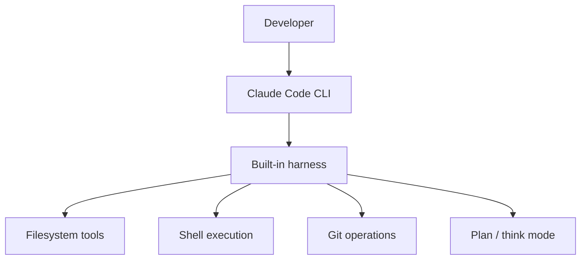

# Claude Code

**Claude Code** is Anthropic's agentic coding tool — an LLM with terminal, filesystem, and git access running in a **harness** designed for software engineering tasks.

## What it is

| Aspect | Detail |
|--------|--------|
| **Interface** | Terminal CLI + IDE integrations |
| **Model** | Claude (Sonnet/Opus class) |
| **Capabilities** | Read/write files, run bash, git, search codebase |
| **Harness** | Built-in permissions, plan mode, subagents |



## Core workflows

### 1. Interactive session

```bash
claude   # start REPL-style session in project directory
```

The agent reads `CLAUDE.md` (project instructions) automatically — see [Skills & Rules](skills-and-rules.md).

### 2. One-shot task

```bash
claude -p "Fix the failing test in tests/test_auth.py"
```

### 3. Plan-first (safer for large changes)

Use plan mode to review approach before edits — analogous to human-in-the-loop in [Harness Engineering](../agent-engineering/04-harness-engineering.md).

## Permission model

Claude Code asks before:

- Writing outside project directory
- Running destructive shell commands
- Network calls (depending on config)

This maps directly to harness **permissions** primitives:

| Claude Code | Harness concept |
|-------------|-----------------|
| Allow once / always | Tool allowlist |
| Deny | Permission denial |
| Plan mode | HITL before act |

## CLAUDE.md — project context

Place at repo root:

```markdown
# Project instructions

## Stack
- Python 3.12, FastAPI, pytest

## Rules
- Run tests after every change: `pytest tests/`
- Never commit secrets
- Match existing code style in src/
```

This is **context engineering** — persistent instructions loaded every session.

## Subagents (2026 pattern)

Claude Code can spawn **subagents** for parallel research or isolated tasks — a form of [orchestration](../agent-engineering/05-orchestration.md) with separate context windows.

## When to use Claude Code vs custom agent

| Use Claude Code | Build custom agent |
|-----------------|-------------------|
| Local dev, refactoring, tests | Product feature for end users |
| You trust the developer machine | Sandboxed multi-tenant environment |
| Fast iteration | Custom tools, MCP, eval pipelines |

## Production lessons to steal

1. **Project-level instructions file** → your app's system prompt + policy docs
2. **Permission prompts** → harness allowlist + HITL
3. **Plan before execute** → supervisor pattern for risky ops
4. **Tool result truncation** → context limits in long sessions

## References

- [Anthropic Claude Code documentation](https://docs.anthropic.com/en/docs/claude-code)
- [Agent Engineering → Harness](../agent-engineering/04-harness-engineering.md)
- [M18 · Agent Harness](../build/module-18-agent-harness-tools-runtime/index.md)

**Next:** [Skills & Rules →](skills-and-rules.md)
