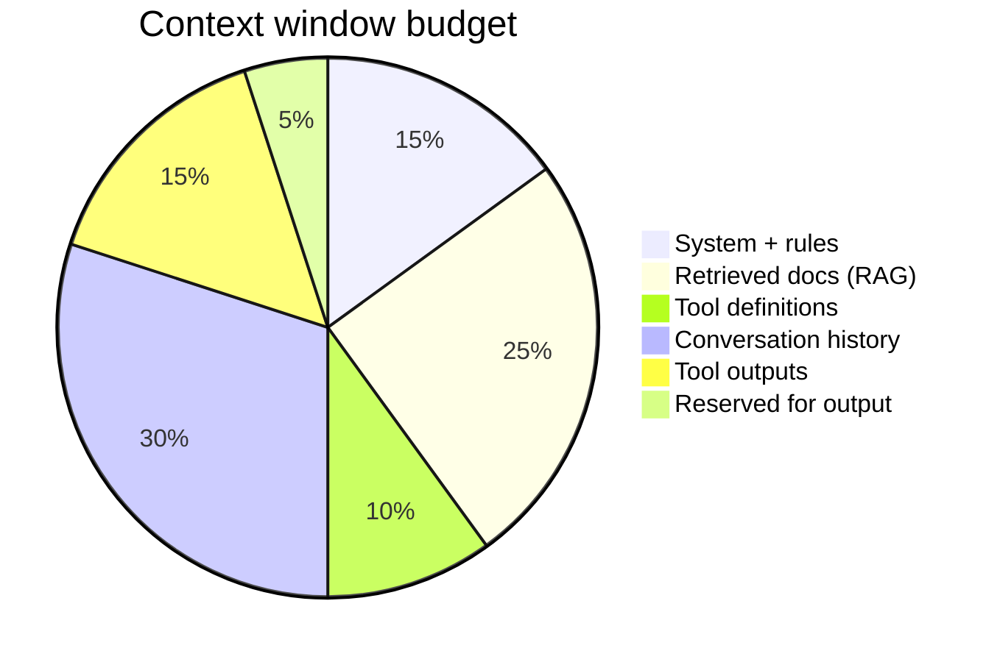

# Context Engineering

**Context engineering** is the discipline of selecting, ordering, and compressing information in the LLM's context window. In 2026, it's as important as prompt engineering was in 2023.

## Prerequisites

- [M01 · Tokens and Costs](../foundations/module-01-ai-engineering-essentials/lessons/03-tokens-and-costs.md) — token budgets
- [Memory Systems](../agent-engineering/02-memory.md) — working vs long-term memory
- [Deep Dive · Tokenization](../deep-dives/tokenization-internals.md) — how text becomes tokens

## What You'll Learn

| Concept | Why it matters |
|---------|---------------|
| Context budget allocation | Every token competes; unbounded sections degrade quality |
| Layered context assembly | Policy, project, task, retrieved, episodic, tool |
| JIT retrieval vs preload | Agent pulls what it needs |
| Tool output shaping | Prevent one observation from eating the window |
| Measuring context quality | Signals that your assembly is broken |

---

## Intuition: packing a carry-on, not a moving truck

The context window is a **fixed-size carry-on**. You cannot bring every file, log, and conversation ever. Context engineering is the art of packing exactly what the model needs for *this* step — and leaving the rest in the cargo hold (vector DB, filesystem, S3) with retrieval tools to fetch on demand.

Prompt engineering asks *how to phrase instructions*. Context engineering asks *what evidence and history should exist at all* when the model reasons.

---

## The context budget

Every token competes:



\[
\text{total\_tokens} = T_{\text{system}} + T_{\text{tools}} + T_{\text{history}} + T_{\text{rag}} + T_{\text{output}} \leq C_{\max}
\]

If any section grows unbounded, quality **degrades** — models attend poorly to middle context ("lost in the middle").

## Layers of context

| Layer | Content | Control |
|-------|---------|---------|
| **Policy** | Safety, brand, format | System prompt |
| **Project** | CLAUDE.md, rules, skills | Files on disk |
| **Task** | User message | Per request |
| **Retrieved** | RAG chunks | Retrieval + rerank |
| **Episodic** | Past session summary | Memory system |
| **Tool** | Schemas + recent outputs | Harness truncation |

## Techniques

### 1. Just-in-time retrieval

Don't preload everything — let the agent pull via tools:

```
Bad:  Dump 50 PDFs into context
Good: search_docs(query) → read top 3 chunks
```

Agentic RAG: [M09 L9](../build/module-09-rag-retrieval-augmented-generation/lessons/09-Agentic-RAG.md)

### 2. Progressive disclosure

Start minimal; expand on demand:

```python
context = {"summary": one_line_goal}
if agent.requests_detail:
    context["files"] = load_relevant_files_only()
```

### 3. Tool output shaping

```python
def truncate_tool_output(raw: str, max_tokens: int = 2000) -> str:
    if count_tokens(raw) <= max_tokens:
        return raw
    return summarize(raw, max_tokens) + "\n...[truncated, use read_file for full]"
```

### 4. Conversation summarization

After turn 10, compress turns 1–8 into a summary block; keep turns 9–10 verbatim.

### 5. Structured over prose

JSON status blocks beat paragraphs for machine consumption:

```json
{"plan": ["search", "compare", "respond"], "current_step": 1, "findings": []}
```

## Context vs prompt engineering

| Prompt engineering | Context engineering |
|--------------------|---------------------|
| Wording of instructions | What information is present |
| "Be concise" | Remove 20K tokens of logs |
| Few-shot examples | Select 3 relevant examples dynamically |
| Static system prompt | Dynamic assembly per task |

## Measuring context quality

| Signal | Action |
|--------|--------|
| High input tokens, wrong answer | Retrieval noise — tighten RAG |
| Model ignores system prompt | Buried — move critical rules to end or repeat |
| Repeats tool calls | Observation too large — truncate |
| Degrades after long session | Summarize history |

---

## Worked example: support ticket agent

**Ticket:** `"Error 429 when calling /api/v2/invoices — started after yesterday's deploy"`

### Bad assembly (22K tokens, wrong answer)

```
System prompt: 2K
ALL API docs (50 files dumped): 14K
Full deploy log from yesterday: 5K
Conversation: 1K
→ Model fixates on unrelated /api/v1 section, misses rate-limit config
```

### Good assembly (6K tokens, correct answer)

```
System + policy: 1.5K
Project CLAUDE.md (deploy runbook pointer): 400
Ticket + user message: 200
search_docs("429 rate limit") → top 3 chunks: 1.2K
grep_logs("deploy", last=24h) → truncated excerpt: 800
Tool schemas: 900
Reserved output: 1K
→ Model identifies new rate-limit middleware in deploy notes
```

### Assembly code sketch

```python
def build_context(ticket: str, project_rules: str) -> list[dict]:
    chunks = search_docs(ticket, k=3)
    logs = grep_logs(since="24h", query="deploy", max_tokens=800)
    return [
        {"role": "system", "content": policy + project_rules},
        {"role": "user", "content": ticket},
        {"role": "system", "content": f"<retrieved>{chunks}</retrieved>"},
        {"role": "system", "content": f"<logs>{logs}</logs>"},
    ]
```

### Placement matters

Critical rule repeated at **end** of system block (recency bias):

```
...
REMINDER: Prefer /api/v2 docs; v1 is deprecated.
```

---

## Edge cases & misconceptions

| Myth | Reality |
|------|---------|
| "Bigger context = better" | Models **lose focus** in the middle; more noise hurts |
| "RAG replaces context engineering" | RAG is one **source**; you still order, trim, and prioritize |
| "Static system prompt is fine" | Dynamic per-task assembly beats one 10K prompt for all jobs |
| "Truncate tool output = lose data" | Store full payload externally; pass `artifact_id` for re-fetch |
| "Copy the whole repo into Claude Code" | `.cursorignore` / selective search — same discipline |

---

## Production connection

| Signal | Root cause | Fix |
|--------|------------|-----|
| Correct answer, high cost | Over-retrieval | Lower `k`, add reranker |
| Ignores brand policy | Policy buried mid-prompt | Move to start + end |
| Tool loop | Observation too large | `truncate_tool_output(max=2000)` |
| Session degrades after turn 20 | No compaction | Summarize turns 1–N-4 |

Instrument `tokens_by_layer` per request in traces — when `T_rag` > 40% of budget, tune retrieval before rewriting prompts.

---

## Key takeaways

- Context engineering selects **what exists** in the window; prompt engineering selects **how it's phrased**
- Budget across system, tools, history, RAG, and output — unbounded growth degrades quality
- Prefer JIT retrieval and progressive disclosure over dumping corpora
- Shape and truncate tool outputs; store full artifacts externally
- Measure: input tokens vs correctness, mid-session degradation, tool repeat rate

### Context budget worksheet (fill per agent)

| Layer | Target % of C_max | This agent |
|-------|-------------------|------------|
| System + policy | 10–15% | ___ |
| Tool schemas | 8–12% | ___ |
| Retrieved (RAG) | 20–30% | ___ |
| History + tool output | 35–45% | ___ |
| Output reserve | 5–10% | ___ |

If any row exceeds target for 3+ consecutive traces, fix assembly before tuning the model.

### A/B testing context assembly

Split traffic 50/50 on two assembly strategies for a week:

- **Variant A:** preload top-10 RAG chunks
- **Variant B:** JIT `search_docs` only

Compare: task success rate, median input tokens, P95 latency. JIT often wins on cost; preload wins when latency SLA is tight and corpus is small.

### Practice exercise (45 min)

Export one long agent trace from your observability tool (or simulate with a 15-turn chat). Categorize every token into the budget worksheet layers. Identify the largest bucket. Rewrite assembly to cut that bucket by 30% without removing safety policy. Re-run the same task and compare outcome quality and total input tokens.

### Critical information placement

Models weight **start and end** of context more than the middle. Put non-negotiable safety rules in the system block opening **and** a one-line reminder after the last retrieved chunk. Repeat project-specific constraints in `CLAUDE.md` rather than only in turn 1 of chat — compaction will erase turn 1.

!!! tip "Measure before rewriting prompts"
    When answers degrade, log `tokens_by_layer` first. A 30% RAG noise reduction often beats a full system-prompt rewrite.

### File tree discipline

Agents with `list_dir` + `read_file` outperform agents that preload entire repos. Pair with `.cursorignore` / ignore globs so search and list operations skip `node_modules`, `dist`, and secrets directories — saving tokens and reducing leak risk.

### System prompt length guardrail

Keep always-on system policy under **1,500 tokens**. Move situational guidance to skills, RAG, or tools. Long static system prompts crowd out retrieved evidence — the most common self-inflicted context bug in 2026.

### Conversation vs retrieval priority

When history and RAG compete for budget, prefer **fresh retrieval** over old chat turns for factual questions; prefer **recent turns** for collaborative tasks (coding, drafting). Wrong priority causes "forgetting" the PRD mid-session or ignoring updated docs.

### Quick audit checklist

- [ ] System policy < 1,500 tokens  
- [ ] Tool schemas reviewed this sprint  
- [ ] Tool output truncation enabled  
- [ ] History compaction after N turns  
- [ ] `tokens_by_layer` logged on traces  

**Back to:** [2026 Skills overview](index.md)

## Related papers

| Paper | Link |
|-------|------|
| Lost in the Middle — long context degradation | [arXiv:2307.03172](https://arxiv.org/abs/2307.03172) |
| MemGPT — virtual memory for context management | [arXiv:2310.08560](https://arxiv.org/abs/2310.08560) |
| RAG — retrieval-augmented generation | [arXiv:2005.11401](https://arxiv.org/abs/2005.11401) |

[Full list →](related-papers.md)
