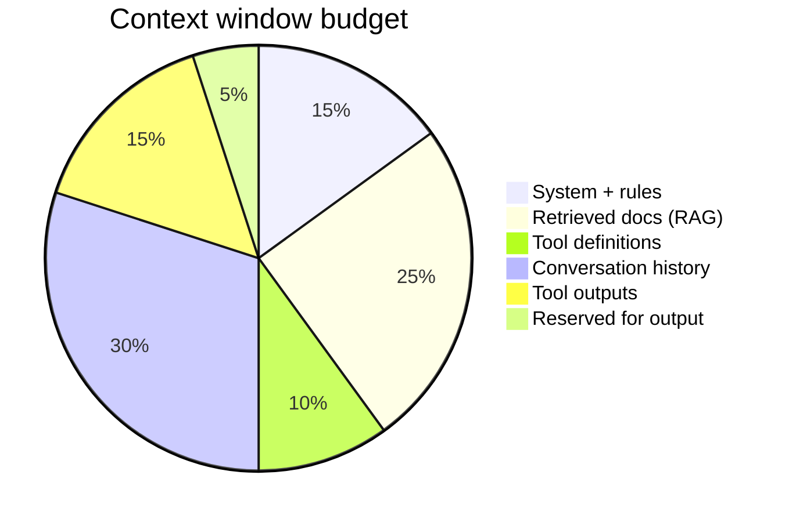

# Context Engineering

**Context engineering** is the discipline of selecting, ordering, and compressing information in the LLM's context window. In 2026, it's as important as prompt engineering was in 2023.

## The context budget

Every token competes:



\[
\text{total\_tokens} = T_{\text{system}} + T_{\text{tools}} + T_{\text{history}} + T_{\text{rag}} + T_{\text{output}} \leq C_{\max}
\]

If any section grows unbounded, quality **degrades** — models attend poorly to middle context ("lost in the middle").

## Layers of context

| Layer | Content | Control |
|-------|---------|---------|
| **Policy** | Safety, brand, format | System prompt |
| **Project** | CLAUDE.md, rules, skills | Files on disk |
| **Task** | User message | Per request |
| **Retrieved** | RAG chunks | Retrieval + rerank |
| **Episodic** | Past session summary | Memory system |
| **Tool** | Schemas + recent outputs | Harness truncation |

## Techniques

### 1. Just-in-time retrieval

Don't preload everything — let the agent pull via tools:

```
Bad:  Dump 50 PDFs into context
Good: search_docs(query) → read top 3 chunks
```

Agentic RAG: [M09 L9](../build/module-09-rag-retrieval-augmented-generation/lessons/09-Agentic-RAG.md)

### 2. Progressive disclosure

Start minimal; expand on demand:

```python
context = {"summary": one_line_goal}
if agent.requests_detail:
    context["files"] = load_relevant_files_only()
```

### 3. Tool output shaping

```python
def truncate_tool_output(raw: str, max_tokens: int = 2000) -> str:
    if count_tokens(raw) <= max_tokens:
        return raw
    return summarize(raw, max_tokens) + "\n...[truncated, use read_file for full]"
```

### 4. Conversation summarization

After turn 10, compress turns 1–8 into a summary block; keep turns 9–10 verbatim.

### 5. Structured over prose

JSON status blocks beat paragraphs for machine consumption:

```json
{"plan": ["search", "compare", "respond"], "current_step": 1, "findings": []}
```

## Context vs prompt engineering

| Prompt engineering | Context engineering |
|--------------------|---------------------|
| Wording of instructions | What information is present |
| "Be concise" | Remove 20K tokens of logs |
| Few-shot examples | Select 3 relevant examples dynamically |
| Static system prompt | Dynamic assembly per task |

## Measuring context quality

| Signal | Action |
|--------|--------|
| High input tokens, wrong answer | Retrieval noise — tighten RAG |
| Model ignores system prompt | Buried — move critical rules to end or repeat |
| Repeats tool calls | Observation too large — truncate |
| Degrades after long session | Summarize history |

## References

- [Memory Systems](../agent-engineering/02-memory.md)
- [M01 · Tokens and Costs](../foundations/module-01-ai-engineering-essentials/lessons/03-tokens-and-costs.md)
- [Deep Dive · Tokenization](../deep-dives/tokenization-internals.md)
- Simon Willison: [context engineering](https://simonwillison.net/) (ongoing essays)

**Back to:** [2026 Skills overview](index.md)
