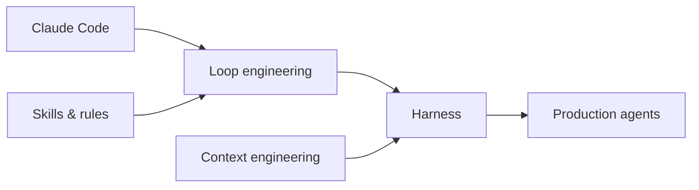

# AI Engineering in 2026

New primitives that didn't exist in the 2023 "just call the API" era. This section covers **skills you need now** — complementary to the core curriculum.

## Who should read this section?

| Background | Start here |
|------------|------------|
| Finished M01–M07 foundations | [Context Engineering](context-engineering.md) → [Loop Engineering](loop-engineering.md) |
| Building agents (M11/M18) | [Claude Code](claude-code.md) + [Skills & Rules](skills-and-rules.md) |
| Production LLMOps (M10/M19) | [Loop Engineering](loop-engineering.md) outer loop + [Agent Evals](../agent-engineering/07-agent-evals.md) |

These pages are **practitioner guides** — they connect 2026 tooling (Claude Code, Cursor skills, MCP) to the handbook's modules without replacing depth lessons in Foundations or Build.

## Topics in this section

| Topic | What you'll learn | Page |
|-------|-------------------|------|
| **Claude Code** | Agentic terminal coding, permissions, workflows | [Claude Code](claude-code.md) |
| **Skills & rules** | SKILL.md, Cursor skills, persistent agent instructions | [Skills & Rules](skills-and-rules.md) |
| **Loop engineering** | Inner/outer loops, /loop, scheduled agents, harness cycles | [Loop Engineering](loop-engineering.md) |
| **Context engineering** | What goes in the window — the new prompt engineering | [Context Engineering](context-engineering.md) |

## How this fits the handbook

| 2026 skill | Handbook foundation |
|------------|---------------------|
| Claude Code | [Agent Engineering](../agent-engineering/index.md) → [Harness](../agent-engineering/04-harness-engineering.md) |
| Skills files | [M14 · Prompts](../build/module-14-prompt-engineering-mastery/index.md) |
| Loop engineering | [Agent Loop](../agent-engineering/01-agent-loop.md), [M18](../build/module-18-agent-harness-tools-runtime/index.md) |
| Context engineering | [M01 · Tokens](../foundations/module-01-ai-engineering-essentials/lessons/03-tokens-and-costs.md), [Memory](../agent-engineering/02-memory.md) |

## What's still evolving (2026)

| Trend | Status | Handbook coverage |
|-------|--------|-------------------|
| Reasoning models (o3, R1) | Production | [M07 L11](../foundations/module-07-large-language-models-llms/lessons/11-reasoning-models-and-test-time-compute.md) |
| MCP everywhere | Standardizing | [M18 L4](../build/module-18-agent-harness-tools-runtime/lessons/04-mcp-model-context-protocol.md) |
| Computer use agents | Early production | Planned |
| Agent skills marketplaces | Emerging | [Skills & Rules](skills-and-rules.md) |
| Eval-driven development | Best practice | [M19](../production/module-19-llm-evaluation-quality/index.md) |

## How to study this section (2-week add-on)

| Week | Focus | Pages | Hands-on |
|------|-------|-------|----------|
| **1** | Context + skills | [Context Engineering](context-engineering.md), [Skills & Rules](skills-and-rules.md) | Write a `CLAUDE.md` or `SKILL.md` for a repo you own |
| **2** | Loops + tooling | [Claude Code](claude-code.md), [Loop Engineering](loop-engineering.md) | Run a local agent session; add one golden eval case |

Pair with [Agent Engineering](../agent-engineering/index.md) for harness, memory, and orchestration depth.

## Depth standard for this section

Each page targets **1,500+ words** with worked examples, misconceptions, and production ties — same bar as [DEPTH_STANDARDS.md](https://github.com/psssnikhil/learn-ai-engineering/blob/main/DEPTH_STANDARDS.md) beginner intros. Read in order: Claude Code → Skills → Loop → Context.

## OSS hubs to watch

- [Awesome Harness Engineering](https://github.com/ai-boost/awesome-harness-engineering)
- [Anthropic Claude Code docs](https://docs.anthropic.com/en/docs/claude-code)
- [Cursor Skills](https://cursor.com/docs/context/skills) (ecosystem)
- [Related papers](related-papers.md) — DeepSeek-R1, SWE-agent, DSPy, Lost in the Middle, and more

**Start:** [Claude Code →](claude-code.md)
