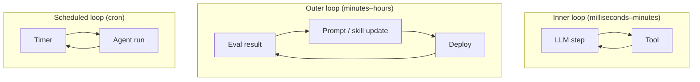
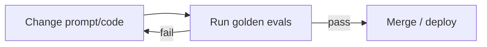

# Loop Engineering

**Loop engineering** is designing *which loops run, when, and with what termination* — the control architecture of agentic systems in 2026.

## Prerequisites

- [The Agent Loop](../agent-engineering/01-agent-loop.md) — inner loop mechanics
- [Harness Engineering](../agent-engineering/04-harness-engineering.md) — termination and checkpoints
- [Agent Evals](../agent-engineering/07-agent-evals.md) — outer eval loop

## What You'll Learn

| Concept | Why it matters |
|---------|---------------|
| Inner vs outer vs scheduled loops | Different periods, different failure modes |
| Loop parameters | max_steps, timeout, cost_cap tradeoffs |
| Cursor `/loop` pattern | Scheduled agent with harness constraints |
| Eval-driven outer loop | Maintainability across model changes |
| Anti-patterns | Unbounded nesting, missing observability |

---

## Intuition: clocks inside clocks

A wall clock ticks once per second. A calendar reminds you weekly. A quarterly review changes strategy. Agent systems stack **loops at different timescales**:

- **Inner loop** (seconds): reason → tool → observe until done
- **Session loop** (minutes–hours): one Claude Code session until exit
- **Outer loop** (hours–days): eval fails → fix prompt → redeploy
- **Scheduled loop** (cron): nightly report agent

Loop engineering is making sure each clock has **batteries and off-switches** — not designing one infinite spiral.

---

## Loop types



| Loop | Period | Example |
|------|--------|---------|
| **Inner (agent)** | Per request | ReAct: reason → tool → observe |
| **Session** | User session | Claude Code until `/exit` |
| **Outer (improvement)** | Daily / per PR | Eval fails → fix prompt → re-run |
| **Scheduled** | Cron | Nightly data pipeline agent |
| **Human** | Ad hoc | Engineer reviews trace, adjusts skill |

## Inner loop design

Parameters that matter:

\[
\text{run} = \text{loop}(\text{max\_steps}, \text{budget}, \text{tools}, \text{state})
\]

| Knob | Typical value | Tradeoff |
|------|-----------------|----------|
| `max_steps` | 10–50 | Higher = more capable, more cost |
| `timeout` | 60–300s | User patience |
| `cost_cap` | $0.10–$5.00 | Prevents runaway |
| `parallel_tools` | 0–5 | Speed vs complexity |

See [Agent Loop](../agent-engineering/01-agent-loop.md).

## Cursor `/loop` pattern

Cursor supports **recurring agent prompts** (loop skill) — run a check on an interval:

```
/loop 5m check CI status and fix lint errors
```

This is an **outer scheduler + inner agent loop**:

1. Timer fires every 5 minutes
2. Agent runs with constrained scope
3. Harness should still enforce max steps and permissions

## Outer loop — eval-driven development



The outer loop is what makes agents **maintainable** — without it, every model update is a gamble.

Implementation: [M19 · CI/CD for AI Quality](../production/module-19-llm-evaluation-quality/lessons/05-ci-cd-for-ai-quality.md)

## Composing loops (anti-patterns)

| Anti-pattern | Problem | Fix |
|--------------|---------|-----|
| **Loop in loop unbounded** | Agent spawns agent spawns agent | Depth limit, budget inheritance |
| **No termination on outer loop** | Infinite "self-improvement" | Human approval gate |
| **Same prompt every cron** | Duplicate work | Idempotency keys, state check |
| **Missing observability** | Can't debug which loop failed | Shared trace_id across loops |

## Loop engineering checklist

- [ ] Inner loop has `max_steps`, timeout, cost cap
- [ ] State checkpointed for loops > 30s
- [ ] Outer eval loop runs on every PR
- [ ] Scheduled loops are idempotent
- [ ] Every loop emits traces with shared `trace_id`
- [ ] Human escalation path defined

---

## Worked example: PR quality outer loop

### Inner loop (per PR comment)

Developer asks Claude Code: `"Address review comment on auth.py"`

```
max_steps=20, timeout=180s, cost_cap=$0.50
→ 6 steps, tests pass, PR updated
```

### Outer loop (CI on every push)

```yaml
on: pull_request
jobs:
  agent-evals:
    steps:
      - run: promptfoo eval -c evals/pr-agent-golden.yaml
      - run: |
          if outcome_rate < 0.9; then exit 1; fi
```

```
Change merged → eval pass rate 94% → deploy
Model upgrade → pass rate 81% → BLOCKED → engineer adjusts CLAUDE.md → 93% → merge
```

### Scheduled loop (nightly)

```
Cron: 0 2 * * *
Task: "Scan open issues labeled flaky-test; attempt fix; open draft PR"
Harness: max_steps=30, read-only prod, write only on branch bot/*
Idempotency: skip if draft PR already exists for issue
```

### Shared trace across loops

```
trace_id: tr_outer_88
  child: tr_inner_ci_run (eval harness)
  child: tr_inner_nightly_2026-07-12 (cron agent)
```

Same `trace_id` family links scheduled runs to eval regressions.

---

## Edge cases & misconceptions

| Myth | Reality |
|------|---------|
| "Outer loop = run eval sometimes" | Outer loop must **gate deploys** or model drift ships silently |
| "/loop in IDE replaces cron" | IDE loops lack central observability — mirror critical jobs server-side |
| "Self-improving agents need no human" | Unbounded outer loops **amplify** bad prompts — HITL on policy changes |
| "One max_steps for everything" | Coding: 25–50; classifier router: 3–5 |
| "Checkpoints optional for cron" | Nightly jobs hit rate limits — resume from step 14, not step 0 |

---

## Production connection

### Loop parameter defaults (starting point)

| Agent type | max_steps | timeout | cost_cap |
|------------|-----------|---------|----------|
| Router / classifier | 5 | 15s | $0.02 |
| RAG Q&A | 10 | 60s | $0.10 |
| Coding agent | 40 | 300s | $2.00 |
| Nightly batch | 50 | 600s | $5.00 |

Tune from trace data: if P90 steps = 8, set max_steps = 12 (headroom), not 50.

### Kill switches

- Per-user daily budget
- Global `AGENT_CRON_ENABLED` flag
- Circuit breaker: if error rate > 20% in 5 min, pause scheduled loops

### Session loop vs inner loop

Claude Code sessions illustrate the **session loop**: one outer boundary (user opens terminal → exits) containing many inner loops (per user message). Design session-level policies separately:

| Policy | Session-level | Per-message inner loop |
|--------|---------------|------------------------|
| Total budget | $10/day per developer | $0.50/message |
| Git writes | Allowed on feature branch | — |
| Max duration | 2 hours idle timeout | 300s per message |

Document both in CLAUDE.md so developer habits and harness defaults align.

### Diagnostic questions before shipping a loop

Ask these in design review — if any answer is "no," fix before launch:

1. What **stops** the inner loop? (max steps, cost, timeout, stuck detection — list all four)
2. What **stops** the outer loop? (eval threshold, human approval on policy change)
3. Can a scheduled run **safely rerun** on the same input without duplicating side effects?
4. Does every loop emission share a **trace_id** root for debugging?
5. If the model provider ships a new version Friday night, what **blocks** Monday deploy without eval?

### Practice exercise (60 min)

Implement a minimal outer loop: create 3 golden JSON trajectories for a trivial agent (calculator or weather). Wire a CI step that fails if outcome pass rate drops below 100%. Change the system prompt to break one trajectory; confirm CI fails. Revert; confirm green. You have the skeleton of eval-driven loop engineering.

### Nesting depth rule

If an inner agent can spawn another inner agent, enforce `max_depth=2` and multiply budget down each level (`child_cap = parent_cap * 0.35`). Unbounded nesting is how a "$0.10 request" becomes a "$40 overnight cron disaster."

!!! note "Pair with evals"
    Every outer loop needs a failing example to prove it works — break a prompt intentionally once per quarter and confirm CI catches it.

### Cron idempotency pattern

Before a scheduled agent mutates state, check a durable idempotency key (`job_date + task_hash`). If a successful run record exists, exit 0 immediately. Nightly jobs that double-send emails or double-charge are almost always missing this guard.

### Human-in-the-loop on outer loops

Policy changes (system prompt, skill library, model version) should require human approval in the outer loop — automated self-modification without review is how agents drift into unsafe tool allowlists over a weekend.

## Key takeaways

- Stack loops at different timescales — inner (request), session, outer (eval), scheduled (cron)
- Every loop needs termination: steps, time, cost, stuck detection
- Outer eval loop gates merges; without it, model updates are roulette
- Scheduled loops must be idempotent; share trace IDs across nested loops
- Use the checklist before shipping any recurring agent

## References

- [Harness Engineering](../agent-engineering/04-harness-engineering.md)
- [Awesome Harness Engineering](https://github.com/ai-boost/awesome-harness-engineering)
- [M18 · Agent Loop and State](../build/module-18-agent-harness-tools-runtime/lessons/02-agent-loop-and-state.md)

**Next:** [Context Engineering →](context-engineering.md)

## Related papers

| Paper | Link |
|-------|------|
| Reflexion — verbal reinforcement in agent loops | [arXiv:2303.11366](https://arxiv.org/abs/2303.11366) |
| Tree of Thoughts — branching reasoning loops | [arXiv:2305.10601](https://arxiv.org/abs/2305.10601) |
| Scaling LLM Test-Time Compute | [arXiv:2408.03314](https://arxiv.org/abs/2408.03314) |
| DSPy — outer-loop pipeline optimization | [arXiv:2310.03714](https://arxiv.org/abs/2310.03714) |

[Full list →](related-papers.md)
