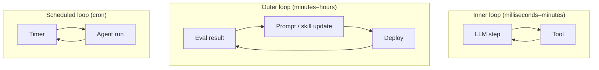
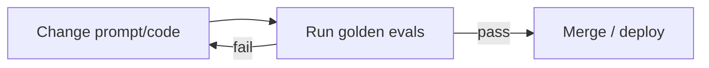

# Loop Engineering

**Loop engineering** is designing *which loops run, when, and with what termination* — the control architecture of agentic systems in 2026.

## Loop types



| Loop | Period | Example |
|------|--------|---------|
| **Inner (agent)** | Per request | ReAct: reason → tool → observe |
| **Session** | User session | Claude Code until `/exit` |
| **Outer (improvement)** | Daily / per PR | Eval fails → fix prompt → re-run |
| **Scheduled** | Cron | Nightly data pipeline agent |
| **Human** | Ad hoc | Engineer reviews trace, adjusts skill |

## Inner loop design

Parameters that matter:

\[
\text{run} = \text{loop}(\text{max\_steps}, \text{budget}, \text{tools}, \text{state})
\]

| Knob | Typical value | Tradeoff |
|------|-----------------|----------|
| `max_steps` | 10–50 | Higher = more capable, more cost |
| `timeout` | 60–300s | User patience |
| `cost_cap` | $0.10–$5.00 | Prevents runaway |
| `parallel_tools` | 0–5 | Speed vs complexity |

See [Agent Loop](../agent-engineering/01-agent-loop.md).

## Cursor `/loop` pattern

Cursor supports **recurring agent prompts** (loop skill) — run a check on an interval:

```
/loop 5m check CI status and fix lint errors
```

This is an **outer scheduler + inner agent loop**:

1. Timer fires every 5 minutes
2. Agent runs with constrained scope
3. Harness should still enforce max steps and permissions

## Outer loop — eval-driven development



The outer loop is what makes agents **maintainable** — without it, every model update is a gamble.

Implementation: [M19 · CI/CD for AI Quality](../production/module-19-llm-evaluation-quality/lessons/05-ci-cd-for-ai-quality.md)

## Composing loops (anti-patterns)

| Anti-pattern | Problem | Fix |
|--------------|---------|-----|
| **Loop in loop unbounded** | Agent spawns agent spawns agent | Depth limit, budget inheritance |
| **No termination on outer loop** | Infinite "self-improvement" | Human approval gate |
| **Same prompt every cron** | Duplicate work | Idempotency keys, state check |
| **Missing observability** | Can't debug which loop failed | Shared trace_id across loops |

## Loop engineering checklist

- [ ] Inner loop has `max_steps`, timeout, cost cap
- [ ] State checkpointed for loops > 30s
- [ ] Outer eval loop runs on every PR
- [ ] Scheduled loops are idempotent
- [ ] Every loop emits traces with shared `trace_id`
- [ ] Human escalation path defined

## References

- [Harness Engineering](../agent-engineering/04-harness-engineering.md)
- [Awesome Harness Engineering](https://github.com/ai-boost/awesome-harness-engineering)
- [M18 · Agent Loop and State](../build/module-18-agent-harness-tools-runtime/lessons/02-agent-loop-and-state.md)

**Next:** [Context Engineering →](context-engineering.md)

## Related papers

| Paper | Link |
|-------|------|
| Reflexion — verbal reinforcement in agent loops | [arXiv:2303.11366](https://arxiv.org/abs/2303.11366) |
| Tree of Thoughts — branching reasoning loops | [arXiv:2305.10601](https://arxiv.org/abs/2305.10601) |
| Scaling LLM Test-Time Compute | [arXiv:2408.03314](https://arxiv.org/abs/2408.03314) |
| DSPy — outer-loop pipeline optimization | [arXiv:2310.03714](https://arxiv.org/abs/2310.03714) |

[Full list →](related-papers.md)
