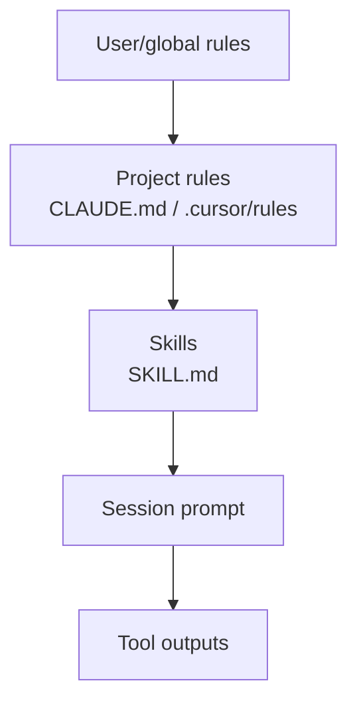

# Skills & Rules

In 2026, the highest-leverage artifact isn't always a prompt — it's a **skill file**: reusable instructions that agents load automatically.

## Prerequisites

- [Context Engineering](context-engineering.md) — how skills fit the context budget
- [Claude Code](claude-code.md) — CLAUDE.md pattern
- [M14 · Prompt Engineering](../build/module-14-prompt-engineering-mastery/index.md) — instruction design

## What You'll Learn

| Concept | Why it matters |
|---------|---------------|
| Skills stack (global → project → skill → session) | Layered instructions without one giant prompt |
| SKILL.md anatomy | Description triggers, steps, verification |
| Rules vs skills vs prompts | Lifetime and scope for each artifact |
| Authoring quality bar | Executable steps, not vague goals |
| Security | Untrusted repos and over-broad descriptions |

---

## Intuition: runbooks the agent reads itself

Traditional software has runbooks humans follow. **Skills** are runbooks the **agent** loads when the task matches — "deploy to staging," "open a PR," "run agent evals."

**Rules** are always-on constraints ("never edit `dist/`"). **Skills** are on-demand procedures. **Prompts** are one-shot task descriptions. Confusing these leads to either bloated system prompts or skills that fire on every message.

---

## The skills stack



| Layer | File / location | Scope |
|-------|-----------------|-------|
| **IDE rules** | `.cursor/rules/*.mdc` | Cursor projects |
| **Claude Code** | `CLAUDE.md`, `CLAUDE.local.md` | Repo / personal |
| **Skills** | `SKILL.md` in skill directory | Portable, shareable |
| **MCP instructions** | Server README | Tool-specific |

## Cursor Skills

Cursor **Agent Skills** are folders with a `SKILL.md` that teach the agent a specialized workflow:

```
my-skill/
  SKILL.md          # Required — when to use, step-by-step instructions
  scripts/          # Optional helper scripts
  references/       # Optional docs
```

Example `SKILL.md` frontmatter:

```yaml
---
name: deploy-checklist
description: Run pre-deploy checks for this FastAPI service. Use when user says deploy, release, or ship.
---
```

Skills are **invoked automatically** when the description matches the task — like function calling for instructions.

Official guide: [Cursor Skills documentation](https://cursor.com/docs/context/skills)

## CLAUDE.md pattern

```markdown
# CLAUDE.md

## Build & test
npm test && npm run lint

## Architecture
- API routes in src/routes/
- DB models in src/models/

## Do not
- Edit generated files in dist/
- Add dependencies without asking
```

Loaded every Claude Code session — reduces repeated corrections.

## Rules vs skills vs prompts

| Artifact | Lifetime | Best for |
|----------|----------|----------|
| **System prompt** | Per deployment | Brand voice, safety |
| **Rules** | Per project | Conventions, always-on constraints |
| **Skills** | On-demand | Specialized workflows (deploy, PR, eval) |
| **User message** | One turn | Specific task |

## Authoring a good skill

1. **Description** — include trigger phrases ("Use when user asks to...")
2. **Steps** — numbered, executable (not vague goals)
3. **Verification** — how to know success (`pytest`, `curl`, diff)
4. **Boundaries** — what the skill must not do
5. **Links** — internal docs, runbooks

## Handbook skill

This repo includes authoring guidance in [DEPTH_STANDARDS.md](https://github.com/psssnikhil/learn-ai-engineering/blob/main/DEPTH_STANDARDS.md) — use the same rigor for skills.

## Security

| Risk | Mitigation |
|------|------------|
| Skill injection via untrusted repo | Review skills before enabling |
| Over-broad descriptions | Skills fire on wrong tasks — be specific |
| Secrets in skill files | Never — use env vars |

---

## Worked example: `deploy-checklist` skill

### SKILL.md

```markdown
---
name: deploy-checklist
description: Run pre-deploy checks for FastAPI service. Use when user says deploy, release, or ship to staging/production.
---

# Deploy checklist

## Steps
1. Run `pytest tests/ -q` — stop if any failure
2. Run `npm run lint` in frontend/ if UI changed
3. Compare `git diff main..HEAD --stat` — confirm scope matches user request
4. Run `curl -f localhost:8000/health` against staging
5. Summarize pass/fail in a table for the user

## Verification
All steps green before suggesting `kubectl apply`

## Do not
- Deploy to production without explicit user saying "production"
- Skip tests because "it's a small change"
```

### When it fires vs when it should not

| User message | Skill fires? |
|--------------|--------------|
| "Ready to deploy to staging?" | ✓ |
| "Ship it" (after deploy context) | ✓ |
| "Explain how deploy works" | ✗ — too broad; use docs |
| "Fix typo in README" | ✗ — description mismatch |

### Layering with CLAUDE.md

```
CLAUDE.md (always):     stack, test command, architecture
deploy-checklist skill: 5-step procedure when deploying
User message:           "deploy Friday's auth fix to staging"
```

Total context stays smaller than one 8K system prompt covering every workflow.

---

## Edge cases & misconceptions

| Myth | Reality |
|------|---------|
| "More skills = smarter agent" | Too many overlapping descriptions → **wrong skill** fires |
| "Skills replace documentation" | Skills **orchestrate**; docs are retrieved via tools |
| "Description can be vague" | Description is the **router** — include trigger phrases |
| "Copy skills from internet unchecked" | Malicious skill = prompt injection — review like code |
| "Rules and skills are interchangeable" | Rules = always; skills = on-demand — different scopes |

### Authoring checklist

1. Description includes **when to use** and **when not to**
2. Steps are **commands**, not goals ("Run pytest" not "ensure quality")
3. Verification block defines **done**
4. Boundaries list forbidden actions
5. Under 500 lines — link to `references/` for depth

---

## Production connection

For **product** agents (not IDE):

| IDE pattern | Product equivalent |
|-------------|-------------------|
| SKILL.md | Workflow templates in DB, selected by intent classifier |
| `.cursor/rules` | Tenant policy stored server-side |
| Auto-invoke on description match | Explicit user picks workflow OR high-confidence router |
| `scripts/` in skill | Backend microservices, not local shell |

Store skills versioned (`skill_id@v3`); attach skill version to traces for eval regression when instructions change.

---

## Key takeaways

- Skills are on-demand runbooks; rules are always-on constraints
- Description field is the router — be specific with trigger phrases
- Good skills have executable steps and explicit verification
- Layer global → project → skill → session to control context budget
- Review third-party skills like code; never embed secrets

### Migrating from monolithic system prompt

| Step | Action |
|------|--------|
| 1 | Audit 8K system prompt — highlight always-on vs situational |
| 2 | Move situational blocks to skills with trigger descriptions |
| 3 | Keep safety + brand in system (under 1.5K tokens) |
| 4 | Measure tool-selection accuracy before/after |
| 5 | Version skills; run eval suite on each skill change |

### Skill smoke test

Before committing a new skill, run three prompts in a scratch project:

1. **Should trigger** — skill steps appear in agent behavior
2. **Should not trigger** — skill absent from context
3. **Edge case** — adjacent phrasing; confirm router behavior

### Practice exercise (30 min)

Pick a repo you maintain. Create a `SKILL.md` for one repetitive workflow (release, eval run, incident triage). Include description triggers, five numbered steps, verification command, and a "Do not" section. Run two user prompts that should trigger and two that should not. Iterate on the description until routing is correct.

### Rules file example (Cursor)

```markdown
---
description: Always apply — Python FastAPI conventions
globs: src/**/*.py
---
- Use Pydantic v2 field validators
- Async routes must not call blocking IO
- Match import order in existing modules
```

Rules with `globs` scope always-on constraints to relevant files — better than dumping all conventions into every prompt.

!!! warning "Review third-party skills"
    Cloning a skill from a template repo without reading it is like `curl | bash` — inspect steps, scripts, and network calls before enabling.

### Team skill library

Treat skills like internal packages: `skill-name/CHANGELOG.md`, owner team, review in PR, version in trace attributes. A shared library beats each engineer maintaining a private mega-prompt.

### Anti-pattern: mega-skill

One skill that covers deploy + test + security review + docs will fire too often and burn context. Split into composable skills with narrow descriptions; the agent can chain them across turns when needed.

### Rules vs skills decision tree

Always-on convention? → `.cursor/rules` or `CLAUDE.md`. Multi-step workflow triggered by intent? → `SKILL.md`. One-off task detail? → user message only.

### Onboarding new teammates

Point them to project `CLAUDE.md` and list enabled skills in README. Document which skills are **required** vs optional — reduces "why did the agent deploy without tests" incidents. Review skills quarterly as stack conventions evolve.

**Next:** [Loop Engineering →](loop-engineering.md)

## Related papers

| Paper | Link |
|-------|------|
| Voyager — growing a skill library from experience | [arXiv:2305.16291](https://arxiv.org/abs/2305.16291) |
| LLMs as Tool Makers — agents creating reusable tools | [arXiv:2305.17126](https://arxiv.org/abs/2305.17126) |
| DSPy — self-improving prompt pipelines | [arXiv:2310.03714](https://arxiv.org/abs/2310.03714) |

[Full list →](related-papers.md)
