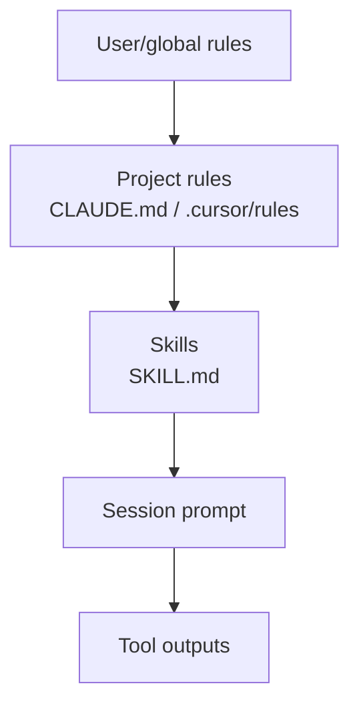

# Skills & Rules

In 2026, the highest-leverage artifact isn't always a prompt — it's a **skill file**: reusable instructions that agents load automatically.

## The skills stack



| Layer | File / location | Scope |
|-------|-----------------|-------|
| **IDE rules** | `.cursor/rules/*.mdc` | Cursor projects |
| **Claude Code** | `CLAUDE.md`, `CLAUDE.local.md` | Repo / personal |
| **Skills** | `SKILL.md` in skill directory | Portable, shareable |
| **MCP instructions** | Server README | Tool-specific |

## Cursor Skills

Cursor **Agent Skills** are folders with a `SKILL.md` that teach the agent a specialized workflow:

```
my-skill/
  SKILL.md          # Required — when to use, step-by-step instructions
  scripts/          # Optional helper scripts
  references/       # Optional docs
```

Example `SKILL.md` frontmatter:

```yaml
---
name: deploy-checklist
description: Run pre-deploy checks for this FastAPI service. Use when user says deploy, release, or ship.
---
```

Skills are **invoked automatically** when the description matches the task — like function calling for instructions.

Official guide: [Cursor Skills documentation](https://cursor.com/docs/context/skills)

## CLAUDE.md pattern

```markdown
# CLAUDE.md

## Build & test
npm test && npm run lint

## Architecture
- API routes in src/routes/
- DB models in src/models/

## Do not
- Edit generated files in dist/
- Add dependencies without asking
```

Loaded every Claude Code session — reduces repeated corrections.

## Rules vs skills vs prompts

| Artifact | Lifetime | Best for |
|----------|----------|----------|
| **System prompt** | Per deployment | Brand voice, safety |
| **Rules** | Per project | Conventions, always-on constraints |
| **Skills** | On-demand | Specialized workflows (deploy, PR, eval) |
| **User message** | One turn | Specific task |

## Authoring a good skill

1. **Description** — include trigger phrases ("Use when user asks to...")
2. **Steps** — numbered, executable (not vague goals)
3. **Verification** — how to know success (`pytest`, `curl`, diff)
4. **Boundaries** — what the skill must not do
5. **Links** — internal docs, runbooks

## Handbook skill

This repo includes authoring guidance in [DEPTH_STANDARDS.md](https://github.com/psssnikhil/learn-ai-engineering/blob/main/DEPTH_STANDARDS.md) — use the same rigor for skills.

## Security

| Risk | Mitigation |
|------|------------|
| Skill injection via untrusted repo | Review skills before enabling |
| Over-broad descriptions | Skills fire on wrong tasks — be specific |
| Secrets in skill files | Never — use env vars |

**Next:** [Loop Engineering →](loop-engineering.md)
