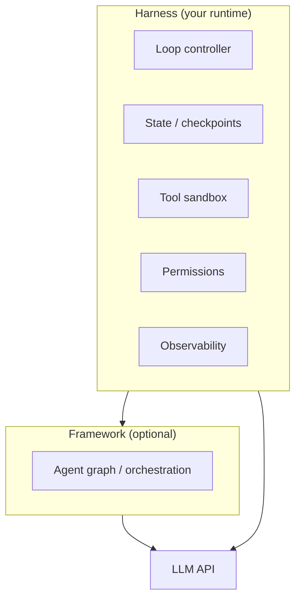

# What Is an Agent Harness?

## What You'll Learn

| Objective | Time | Difficulty |
|-----------|------|------------|
| Define an agent harness and why it exists | 40 min | Intermediate |
| Distinguish harness from framework and model | | |
| Understand the three core primitives: loop, state, termination | | |
| Map harness responsibilities to production concerns | | |

---

## The Missing Layer

In [M11 Lesson 1](../../module-11-ai-agents-fundamentals/lessons/01-Introduction-to-Agents.md), you learned that an agent is a **perceive → reason → act** loop wrapped around an LLM. That loop is the *behavior*. The **harness** is the *runtime* that makes the behavior safe, repeatable, and debuggable in production.

```
┌─────────────────────────────────────────────────────────────┐
│                      AGENT HARNESS                          │
│  ┌─────────┐  ┌─────────┐  ┌──────────┐  ┌─────────────┐  │
│  │  Loop   │  │  State  │  │  Tools   │  │ Termination │  │
│  │ control │  │  store  │  │  sandbox │  │   policy    │  │
│  └────┬────┘  └────┬────┘  └────┬─────┘  └──────┬──────┘  │
│       │            │            │               │         │
│       └────────────┴────────────┴───────────────┘         │
│                         │                                  │
│                    ┌────▼────┐                             │
│                    │   LLM   │  (reasoning engine)          │
│                    └─────────┘                             │
└─────────────────────────────────────────────────────────────┘
```

Without a harness, you have a prompt and a `while` loop. With a harness, you have a system you can ship: permissions, checkpoints, tracing, and predictable failure modes.

!!! tip "Curated reading"
    The [Awesome Harness Engineering](https://github.com/ai-boost/awesome-harness-engineering) repo catalogs harness primitives, patterns, and open-source runtimes. Use it as a checklist when designing your own.

---

## Harness vs Framework vs Model

These three terms are often conflated. They occupy different layers:

| Layer | What it is | Examples | You control |
|-------|-----------|----------|-------------|
| **Model** | The LLM that reasons and emits tool calls | GPT-4.1, Claude, Llama | Prompting, model choice |
| **Framework** | Libraries that structure agent logic | LangGraph, CrewAI, AutoGen | Graphs, roles, workflows |
| **Harness** | The runtime envelope around any agent | Cursor agent, Claude Code, custom runtime | Permissions, sandbox, limits |



A **framework** helps you *compose* agent logic — nodes, edges, multi-agent roles. A **harness** is what *runs* that logic in a controlled environment regardless of which framework (or no framework) you use.

!!! note "Frameworks embed harness concerns"
    LangGraph ships checkpointing and interrupts; Cursor ships permission prompts and MCP tool routing. In practice, frameworks increasingly include harness features — but the concepts remain separable. When something breaks in production, ask: is this a *reasoning* bug (model/framework) or a *runtime* bug (harness)?

---

## The Three Core Primitives

Every production harness implements variations of three primitives. Master these before adding complexity.

### 1. The Loop

The loop is the heartbeat of the agent. Each iteration:

1. **Assemble context** — system prompt, user goal, prior steps, tool results
2. **Call the model** — get text and/or tool calls
3. **Execute side effects** — run tools inside the sandbox
4. **Evaluate** — should we continue, pause, or stop?

```python
from dataclasses import dataclass, field
from enum import Enum
from typing import Any

class LoopDecision(Enum):
    CONTINUE = "continue"
    FINISH = "finish"
    PAUSE_FOR_HUMAN = "pause_for_human"

@dataclass
class AgentState:
    messages: list[dict] = field(default_factory=list)
    step_count: int = 0
    metadata: dict[str, Any] = field(default_factory=dict)

def agent_loop(
    state: AgentState,
    model_fn,          # (messages) -> ModelResponse
    tool_executor,     # (tool_call) -> str
    max_steps: int = 15,
) -> AgentState:
    """Minimal harness loop — no framework required."""
    while state.step_count < max_steps:
        response = model_fn(state.messages)

        if response.tool_calls:
            for call in response.tool_calls:
                result = tool_executor(call)
                state.messages.append({
                    "role": "tool",
                    "tool_call_id": call.id,
                    "content": result,
                })
        else:
            # Model returned final text — loop ends
            state.messages.append({"role": "assistant", "content": response.text})
            break

        state.step_count += 1

    return state
```

The harness owns **how many times** this runs, **what happens on errors**, and **when a human must intervene** — not the model.

### 2. State

State is everything the harness persists between loop iterations and across sessions:

| State type | Scope | Examples |
|------------|-------|----------|
| **Conversation** | Single run | Message history, tool outputs |
| **Working memory** | Single run | Scratchpad, plan, retrieved docs |
| **Session** | Multi-turn chat | User preferences, thread ID |
| **Checkpoint** | Durable | Serializable snapshot for resume/audit |

```python
import json
from datetime import datetime, timezone

def checkpoint(state: AgentState, path: str) -> None:
    """Persist harness state for resume or debugging."""
    payload = {
        "version": 1,
        "saved_at": datetime.now(timezone.utc).isoformat(),
        "step_count": state.step_count,
        "messages": state.messages,
        "metadata": state.metadata,
    }
    with open(path, "w") as f:
        json.dump(payload, f, indent=2)

def restore(path: str) -> AgentState:
    with open(path) as f:
        payload = json.load(f)
    return AgentState(
        messages=payload["messages"],
        step_count=payload["step_count"],
        metadata=payload.get("metadata", {}),
    )
```

State management is where harness engineering diverges from prompt engineering. The model sees a *view* of state (trimmed messages); the harness holds the *full* truth (token counts, raw tool payloads, approval records).

### 3. Termination

Agents do not stop by themselves reliably. The harness defines **when the loop ends**:

| Termination trigger | Purpose |
|---------------------|---------|
| **Goal met** | Model returns final answer with no tool calls |
| **Step budget** | `max_steps` prevents runaway loops |
| **Token/cost budget** | Hard cap on spend per task |
| **Timeout** | Wall-clock limit for the entire run |
| **Human halt** | User clicks stop or rejects an action |
| **Policy violation** | Disallowed tool or failed safety check |

```python
@dataclass
class TerminationPolicy:
    max_steps: int = 15
    max_cost_usd: float = 2.00
    max_wall_seconds: float = 300.0

def should_terminate(state: AgentState, policy: TerminationPolicy,
                     elapsed_seconds: float, cost_so_far: float) -> LoopDecision:
    if state.step_count >= policy.max_steps:
        return LoopDecision.FINISH
    if cost_so_far >= policy.max_cost_usd:
        return LoopDecision.FINISH
    if elapsed_seconds >= policy.max_wall_seconds:
        return LoopDecision.FINISH
    return LoopDecision.CONTINUE
```

!!! warning "Always set a step budget"
    Unbounded loops are the fastest path to surprise bills and hung sessions. Every harness — even prototypes — needs `max_steps` and a cost estimate before the first real user.

---

## What Else Belongs in the Harness?

Beyond the three primitives, production harnesses typically add:

| Concern | Harness responsibility |
|---------|------------------------|
| **Tool sandbox** | Isolate execution, validate inputs, enforce allowlists |
| **Permissions** | Human-in-the-loop for sensitive actions |
| **Observability** | Traces, spans, structured logs per step |
| **Context window** | Trimming, summarization, compaction |
| **Retries** | Model API failures, transient tool errors |

These are covered in Lessons 3–6. The key insight: they are **runtime concerns**, not model capabilities.

---

## Harness in the Wild

| Product | Harness highlights |
|---------|-------------------|
| **Cursor** | MCP tool routing, permission prompts, sandboxed terminal |
| **Claude Desktop** | MCP servers, per-tool approval, computer use sandbox |
| **Devin / coding agents** | Repo-scoped filesystem, CI integration, step limits |
| **Custom API agents** | Your code owns loop + policy entirely |

The [Agents Towards Production](https://github.com/NirDiamant/agents-towards-production) repo walks through building each layer — from basic loops to deployed services with monitoring.

---

## Harness vs "Just Use a Framework"

```python
# Framework-only thinking: "LangGraph handles it"
graph = build_react_graph(tools)
result = graph.invoke({"messages": [user_message]})

# Harness thinking: "What wraps the graph?"
result = harness.run(
    graph=graph,
    input=user_message,
    policies=TerminationPolicy(max_steps=10, max_cost_usd=0.50),
    permissions=PermissionSet(allow=["search", "read_file"], deny=["send_email"]),
    on_step=my_trace_callback,
)
```

Frameworks accelerate development. Harnesses keep you out of trouble when a user asks the agent to delete a production database at 2 a.m.

---

## Key Takeaways

- An **agent harness** is the runtime layer: loop control, state, tools, permissions, and termination
- **Frameworks** structure agent logic; **harnesses** enforce policies and make runs observable
- The three primitives are **loop**, **state**, and **termination** — implement these first
- Production harnesses add sandboxing, human approval, and tracing on top of the primitives
- Study [Awesome Harness Engineering](https://github.com/ai-boost/awesome-harness-engineering) and [Agents Towards Production](https://github.com/NirDiamant/agents-towards-production) for patterns and reference implementations

---

## Further Reading

- [How GPT-3 Works (Visualizations)](https://jalammar.github.io/how-gpt3-works-visualizations-animations/) — Jay Alammar's guide to what happens inside the model on each loop iteration
- [M11 · Introduction to AI Agents](../../module-11-ai-agents-fundamentals/lessons/01-Introduction-to-Agents.md) — agent loop fundamentals

---

## Next Lesson

**Lesson 2: Agent Loop and State** — Deep dive into perceive-reason-act, state schemas, and checkpoint strategies for resumable runs.
