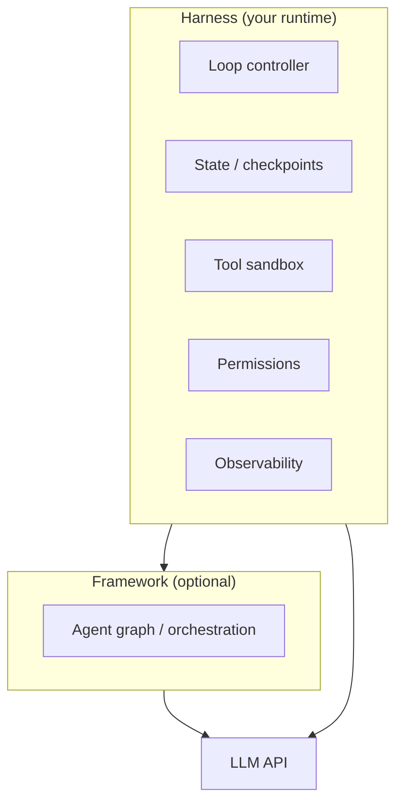

# What Is an Agent Harness?

## Prerequisites

- [M11 · Introduction to AI Agents](../../module-11-ai-agents-fundamentals/lessons/01-Introduction-to-Agents.md): the perceive → reason → act loop and what distinguishes agents from chatbots
- Comfortable reading Python classes and dataclasses
- Familiarity with LLM API function calling (tool use) at a basic level

---

## What You'll Learn

| Objective | Time | Difficulty |
|-----------|------|------------|
| Define an agent harness and explain why it exists separately from the model | 55 min | Intermediate |
| Distinguish harness from framework and from the model itself | | |
| Implement the three core primitives: loop, state, termination | | |
| Map harness responsibilities to specific production concerns | | |

---

## Intuition First

A rocket engine provides thrust. The rocket **harness** — the guidance system, stage separation logic, abort mechanisms, and telemetry — is what makes the thrust useful, safe, and observable. Without the engine you have nothing; without the harness you have an uncontrolled explosion.

An LLM is the engine: it reasons and emits tool calls. The **agent harness** is everything that wraps it:

- *How many times* does the engine fire? (loop control)
- *What does it remember* between firings? (state)
- *What stops it* from firing indefinitely? (termination)
- *Which tools* is it allowed to trigger? (sandbox + permissions)
- *What happened* during each firing? (observability)

Without a harness, you have a prompt and a `while True:` loop. With a harness, you have a system you can ship, debug, and bill predictably.

**The insight that makes harness engineering click:** The model is stateless. It receives messages and emits tokens. Everything else — remembering prior steps, enforcing limits, catching errors, routing tool calls — is the harness's job. If something goes wrong in an agent run, the fix is almost always in the harness, not the model.

---

## The Missing Layer

In [M11 Lesson 1](../../module-11-ai-agents-fundamentals/lessons/01-Introduction-to-Agents.md), you learned that an agent is a **perceive → reason → act** loop wrapped around an LLM. That loop is the *behavior*. The **harness** is the *runtime* that makes the behavior safe, repeatable, and debuggable in production.

```
┌─────────────────────────────────────────────────────────────┐
│                      AGENT HARNESS                          │
│  ┌─────────┐  ┌─────────┐  ┌──────────┐  ┌─────────────┐  │
│  │  Loop   │  │  State  │  │  Tools   │  │ Termination │  │
│  │ control │  │  store  │  │  sandbox │  │   policy    │  │
│  └────┬────┘  └────┬────┘  └────┬─────┘  └──────┬──────┘  │
│       │            │            │               │         │
│       └────────────┴────────────┴───────────────┘         │
│                         │                                  │
│                    ┌────▼────┐                             │
│                    │   LLM   │  (reasoning engine)          │
│                    └─────────┘                             │
└─────────────────────────────────────────────────────────────┘
```

Without a harness, you have a prompt and a `while` loop. With a harness, you have a system you can ship: permissions, checkpoints, tracing, and predictable failure modes.

!!! tip "Curated reading"
    The [Awesome Harness Engineering](https://github.com/ai-boost/awesome-harness-engineering) repo catalogs harness primitives, patterns, and open-source runtimes. Use it as a checklist when designing your own.

---

## Harness vs Framework vs Model

These three terms are often conflated. They occupy different layers:

| Layer | What it is | Examples | You control |
|-------|-----------|----------|-------------|
| **Model** | The LLM that reasons and emits tool calls | GPT-4.1, Claude, Llama | Prompting, model choice |
| **Framework** | Libraries that structure agent logic | LangGraph, CrewAI, AutoGen | Graphs, roles, workflows |
| **Harness** | The runtime envelope around any agent | Cursor agent, Claude Code, custom runtime | Permissions, sandbox, limits |



A **framework** helps you *compose* agent logic — nodes, edges, multi-agent roles. A **harness** is what *runs* that logic in a controlled environment regardless of which framework (or no framework) you use.

**Concrete example — the same code with and without harness thinking:**

```python
# Framework-only thinking: "LangGraph handles it"
graph = build_react_graph(tools)
result = graph.invoke({"messages": [user_message]})

# Harness thinking: "What wraps the graph?"
result = harness.run(
    graph=graph,
    input=user_message,
    policies=TerminationPolicy(max_steps=10, max_cost_usd=0.50),
    permissions=PermissionSet(allow=["search", "read_file"], deny=["send_email"]),
    on_step=my_trace_callback,
)
```

Frameworks accelerate development. Harnesses keep you out of trouble when a user asks the agent to delete a production database at 2 a.m.

!!! note "Frameworks embed harness concerns"
    LangGraph ships checkpointing and interrupts; Cursor ships permission prompts and MCP tool routing. In practice, frameworks increasingly include harness features — but the concepts remain separable. When something breaks in production, ask: is this a *reasoning* bug (model/framework) or a *runtime* bug (harness)?

---

## The Three Core Primitives

Every production harness implements variations of three primitives. Master these before adding complexity.

### 1. The Loop

The loop is the heartbeat of the agent. Each iteration:

1. **Assemble context** — system prompt, user goal, prior steps, tool results
2. **Call the model** — get text and/or tool calls
3. **Execute side effects** — run tools inside the sandbox
4. **Evaluate** — should we continue, pause, or stop?

```python
from dataclasses import dataclass, field
from enum import Enum
from typing import Any

class LoopDecision(Enum):
    CONTINUE = "continue"
    FINISH = "finish"
    PAUSE_FOR_HUMAN = "pause_for_human"

@dataclass
class AgentState:
    messages: list[dict] = field(default_factory=list)
    step_count: int = 0
    metadata: dict[str, Any] = field(default_factory=dict)

def agent_loop(
    state: AgentState,
    model_fn,          # (messages) -> ModelResponse
    tool_executor,     # (tool_call) -> str
    max_steps: int = 15,
) -> AgentState:
    """Minimal harness loop — no framework required."""
    while state.step_count < max_steps:
        response = model_fn(state.messages)

        if response.tool_calls:
            for call in response.tool_calls:
                result = tool_executor(call)
                state.messages.append({
                    "role": "tool",
                    "tool_call_id": call.id,
                    "content": result,
                })
        else:
            # Model returned final text — loop ends
            state.messages.append({"role": "assistant", "content": response.text})
            break

        state.step_count += 1

    return state
```

The harness owns **how many times** this runs, **what happens on errors**, and **when a human must intervene** — not the model.

**Worked example — tracing a 3-step loop:**

```
Step 1:
  Model receives: [system, user: "Find the pricing for plan A and plan B"]
  Model emits: tool_call("search_docs", {"query": "plan A pricing"})
  Harness executes: search_docs → "Plan A: $49/month, annual only"
  State: 2 messages + 1 tool result

Step 2:
  Model receives: [system, user, assistant(tool_call), tool_result] 
  Model emits: tool_call("search_docs", {"query": "plan B pricing"})
  Harness executes: search_docs → "Plan B: $29/month, monthly or annual"
  State: 4 messages + 2 tool results

Step 3:
  Model receives: all prior messages + tool results
  Model emits: "Plan A costs $49/month (annual only). Plan B costs $29/month..."
  No tool calls → loop terminates at step 3
```

The model never "knew" how many steps it would take. The harness managed the accumulation of context and the stop condition.

### 2. State

State is everything the harness persists between loop iterations and across sessions:

| State type | Scope | Examples |
|------------|-------|----------|
| **Conversation** | Single run | Message history, tool outputs |
| **Working memory** | Single run | Scratchpad, plan, retrieved docs |
| **Session** | Multi-turn chat | User preferences, thread ID |
| **Checkpoint** | Durable | Serializable snapshot for resume/audit |

```python
import json
from datetime import datetime, timezone

def checkpoint(state: AgentState, path: str) -> None:
    """Persist harness state for resume or debugging."""
    payload = {
        "version": 1,
        "saved_at": datetime.now(timezone.utc).isoformat(),
        "step_count": state.step_count,
        "messages": state.messages,
        "metadata": state.metadata,
    }
    with open(path, "w") as f:
        json.dump(payload, f, indent=2)

def restore(path: str) -> AgentState:
    with open(path) as f:
        payload = json.load(f)
    return AgentState(
        messages=payload["messages"],
        step_count=payload["step_count"],
        metadata=payload.get("metadata", {}),
    )
```

State management is where harness engineering diverges from prompt engineering. The model sees a *view* of state (trimmed messages); the harness holds the *full* truth (token counts, raw tool payloads, approval records).

### 3. Termination

Agents do not stop by themselves reliably. The harness defines **when the loop ends**:

| Termination trigger | Purpose |
|---------------------|---------|
| **Goal met** | Model returns final answer with no tool calls |
| **Step budget** | `max_steps` prevents runaway loops |
| **Token/cost budget** | Hard cap on spend per task |
| **Timeout** | Wall-clock limit for the entire run |
| **Human halt** | User clicks stop or rejects an action |
| **Policy violation** | Disallowed tool or failed safety check |

```python
@dataclass
class TerminationPolicy:
    max_steps: int = 15
    max_cost_usd: float = 2.00
    max_wall_seconds: float = 300.0

def should_terminate(state: AgentState, policy: TerminationPolicy,
                     elapsed_seconds: float, cost_so_far: float) -> LoopDecision:
    if state.step_count >= policy.max_steps:
        return LoopDecision.FINISH
    if cost_so_far >= policy.max_cost_usd:
        return LoopDecision.FINISH
    if elapsed_seconds >= policy.max_wall_seconds:
        return LoopDecision.FINISH
    return LoopDecision.CONTINUE
```

!!! warning "Always set a step budget"
    Unbounded loops are the fastest path to surprise bills and hung sessions. Every harness — even prototypes — needs `max_steps` and a cost estimate before the first real user.

---

## What Else Belongs in the Harness?

Beyond the three primitives, production harnesses typically add:

| Concern | Harness responsibility |
|---------|------------------------|
| **Tool sandbox** | Isolate execution, validate inputs, enforce allowlists |
| **Permissions** | Human-in-the-loop for sensitive actions |
| **Observability** | Traces, spans, structured logs per step |
| **Context window** | Trimming, summarization, compaction |
| **Retries** | Model API failures, transient tool errors |

These are covered in Lessons 3–6. The key insight: they are **runtime concerns**, not model capabilities.

---

## Harness in the Wild

| Product | Harness highlights |
|---------|-------------------|
| **Cursor** | MCP tool routing, permission prompts, sandboxed terminal |
| **Claude Desktop** | MCP servers, per-tool approval, computer use sandbox |
| **Devin / coding agents** | Repo-scoped filesystem, CI integration, step limits |
| **Custom API agents** | Your code owns loop + policy entirely |

The [Agents Towards Production](https://github.com/NirDiamant/agents-towards-production) repo walks through building each layer — from basic loops to deployed services with monitoring.

---

## Context Window Management as a Harness Concern

One harness responsibility that is easy to overlook until it breaks in production: managing the model's context window.

Every loop iteration appends messages: tool call records, tool results, partial reasoning. After 10–20 steps, the accumulated context can exceed the model's token limit, causing either a hard API error or a silent truncation that causes the model to "forget" earlier work.

The harness owns the solution:

```python
def count_tokens_rough(messages: list[dict]) -> int:
    """Rough token estimate: 1 token ≈ 4 characters."""
    total_chars = sum(len(str(m.get("content", "") or "")) for m in messages)
    return total_chars // 4

def trim_to_fit(
    messages: list[dict],
    max_tokens: int = 120_000,
    preserve_head: int = 2,  # system prompt + original user goal
) -> list[dict]:
    """
    Trim message history to fit within token budget.
    Always preserve the first `preserve_head` messages.
    Drops oldest tool results first.
    """
    if count_tokens_rough(messages) <= max_tokens:
        return messages

    head = messages[:preserve_head]
    tail = list(messages[preserve_head:])

    # Remove oldest tool messages first (least context value)
    while count_tokens_rough(head + tail) > max_tokens and tail:
        # Find and remove the oldest tool message
        for i, msg in enumerate(tail):
            if msg["role"] == "tool":
                tail.pop(i)
                break
        else:
            # No tool messages left — truncate the oldest assistant message
            if tail:
                tail.pop(0)

    return head + [{"role": "system", "content": "[Some earlier steps omitted to fit context window]"}] + tail
```

This is a runtime responsibility the model cannot handle itself — it can't see its own token count. Your harness should check token budget at the top of every perceive phase and trim before calling the model.

---

## Common Misconceptions

**"My framework handles everything, I don't need to think about the harness."** Frameworks like LangGraph handle graph execution, but they don't dictate your step budget, your permission model, your observability format, or your cost accounting. These are yours to define.

**"The system prompt is the harness."** A system prompt is instructions to the model — it affects the model's reasoning, not the runtime behavior. The harness executes *after* the model responds. A system prompt that says "always ask permission before deleting files" does not prevent deletion if the harness sandbox allows the delete tool.

**"Termination happens naturally when the task is done."** This is true in happy paths. In practice, models can enter loops (tool → result → same tool → same result), exhaust context windows, or simply fail to emit a final answer. The harness must enforce hard limits.

**"I'll add the harness layer later."** Harness concerns (step limits, error handling, state schema) are much cheaper to add from day one than retrofitted after the first production incident. A step budget takes five lines of code when the loop is new; finding and stopping an infinite tool loop in production at 2 a.m. takes hours. Add the budget first.

**"The model will tell me when something goes wrong."** Models emit helpful-sounding final answers even when they have looped, timed out, or hallucinated. The harness — through its structured state, budget checks, and error logs — is your source of truth about what actually happened during a run, not the model's output.

---

## Production Tips

- **Design state schema before writing the loop.** What fields do you need? What gets persisted? Changing state schema after you have checkpoint files in production is painful.
- **Log every step.** Even a simple `print(f"Step {state.step_count}: {response.tool_calls}")` during development reveals loop bugs in minutes instead of hours.
- **Test termination paths explicitly.** Write unit tests for: step budget exhausted, cost budget exhausted, timeout, and tool policy violation. These paths are off the happy path and easy to miss.
- **Set conservative defaults.** `max_steps=5` for your first deployment, not 50. You can always increase it. The only direction you can't go is backward after a user runs up a large bill.
- **Separate the harness from the business logic.** The harness should work the same whether the agent is answering customer support questions or writing code. Business logic lives in the tools and the system prompt.

---

## Key Takeaways

- An **agent harness** is the runtime layer: loop control, state, tools, permissions, and termination
- **Frameworks** structure agent logic; **harnesses** enforce policies and make runs observable
- The three primitives are **loop**, **state**, and **termination** — implement these first
- Production harnesses add sandboxing, human approval, and tracing on top of the primitives
- The model is stateless — everything that "remembers" across steps is the harness's responsibility
- Study [Awesome Harness Engineering](https://github.com/ai-boost/awesome-harness-engineering) and [Agents Towards Production](https://github.com/NirDiamant/agents-towards-production) for patterns and reference implementations

---

## Related Papers

| Paper | Year | Key contribution |
|-------|------|-----------------|
| [ReAct: Synergizing Reasoning and Acting in Language Models](https://arxiv.org/abs/2210.03629) | 2022 | Interleaved reasoning and tool-use traces — the behavioral pattern harnesses execute |
| [Generative Agents: Interactive Simulacra of Human Behavior](https://arxiv.org/abs/2304.03442) | 2023 | Agent memory architecture and loop design for long-running simulations |
| [OpenAgents: An Open Platform for Language Agents in the Wild](https://arxiv.org/abs/2310.10634) | 2023 | Production harness design: tool sandbox, user interaction, safety constraints |
| [AgentBench: Evaluating LLMs as Agents](https://arxiv.org/abs/2308.03688) | 2023 | Benchmark reveals that harness quality varies dramatically across agent implementations |

---

## Further Reading

- [How GPT-3 Works (Visualizations)](https://jalammar.github.io/how-gpt3-works-visualizations-animations/) — Jay Alammar's guide to what happens inside the model on each loop iteration
- [M11 · Introduction to AI Agents](../../module-11-ai-agents-fundamentals/lessons/01-Introduction-to-Agents.md) — agent loop fundamentals

---

## Next Lesson

**[Lesson 2: Agent Loop and State](02-agent-loop-and-state.md)** — Deep dive into perceive-reason-act, typed state schemas, and checkpoint strategies for resumable runs.
