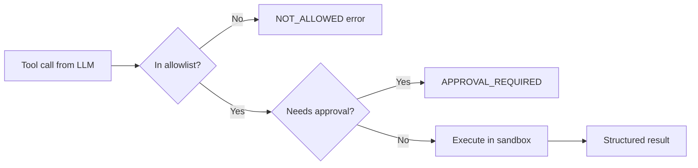

# Tools and Function Calling

## What You'll Learn

| Objective | Time | Difficulty |
|-----------|------|------------|
| Design JSON Schema tool definitions the model can use reliably | 40 min | Advanced |
| Build a sandboxed tool execution layer in the harness | | |
| Return structured errors that help the agent recover | | |
| Organize tools in a registry with validation and timeouts | | |

---

## The Split: Model Decides, Harness Executes

[M11 Lesson 4](../../module-11-ai-agents-fundamentals/lessons/04-Tool-Use.md) established the core contract: the LLM outputs **which** tool to call and **with what arguments**. The harness **executes** the tool and returns the result. That separation is non-negotiable in production.

```
  User goal
      │
      ▼
┌─────────────┐    tool_call(name, args)    ┌──────────────────┐
│     LLM     │ ──────────────────────────▶ │  HARNESS         │
│  (reason)   │                               │  ┌────────────┐  │
└─────────────┘                               │  │ validate   │  │
      ▲                                       │  │ allowlist  │  │
      │         tool_result (string/json)     │  │ timeout    │  │
      └───────────────────────────────────────│  │ execute    │  │
                                              │  └────────────┘  │
                                              └──────────────────┘
```

!!! note "Why the harness must execute"
    If the model could execute tools directly, prompt injection would become remote code execution. The sandbox sits between intent and side effects.

---

## Tool Schemas That Work

Tool definitions use JSON Schema. Quality of the schema directly affects agent reliability.

```python
SEARCH_TOOL = {
    "type": "function",
    "function": {
        "name": "search_web",
        "description": (
            "Search the web for current information. Use when the answer "
            "requires facts after your knowledge cutoff, recent events, or "
            "live data. Do NOT use for pure math or logic."
        ),
        "parameters": {
            "type": "object",
            "properties": {
                "query": {
                    "type": "string",
                    "description": "Concise search query, e.g. '2024 Tokyo population'",
                },
                "max_results": {
                    "type": "integer",
                    "description": "Number of results to return (1-5).",
                    "minimum": 1,
                    "maximum": 5,
                },
            },
            "required": ["query"],
        },
    },
}
```

| Schema practice | Why it matters |
|-----------------|----------------|
| **When to use / not use** in `description` | Reduces wrong-tool calls |
| **`enum` for fixed choices** | Prevents invented values |
| **`minimum` / `maximum`** | Bounds runaway parameters |
| **Examples in descriptions** | Grounds the model in valid formats |
| **Fewer tools, sharper descriptions** | 5 great tools beat 20 vague ones |

---

## The Tool Registry

Centralize schemas and handlers in one place:

```python
import json
import time
from typing import Callable, Any

class ToolRegistry:
    def __init__(self):
        self._tools: dict[str, dict] = {}

    def register(
        self,
        name: str,
        description: str,
        parameters: dict,
        handler: Callable[..., str],
        *,
        timeout_seconds: float = 30.0,
        requires_approval: bool = False,
    ):
        self._tools[name] = {
            "schema": {
                "type": "function",
                "function": {
                    "name": name,
                    "description": description,
                    "parameters": parameters,
                },
            },
            "handler": handler,
            "timeout_seconds": timeout_seconds,
            "requires_approval": requires_approval,
        }

    @property
    def schemas(self) -> list[dict]:
        return [t["schema"] for t in self._tools.values()]

    def execute(self, name: str, arguments: str | dict) -> str:
        if name not in self._tools:
            return self._error("UNKNOWN_TOOL", f"Tool '{name}' is not registered.")

        args = json.loads(arguments) if isinstance(arguments, str) else arguments
        tool = self._tools[name]

        validation_error = self._validate_args(name, args)
        if validation_error:
            return validation_error

        start = time.perf_counter()
        try:
            result = tool["handler"](**args)
            elapsed = (time.perf_counter() - start) * 1000
            return self._success(result, elapsed_ms=elapsed)
        except TimeoutError:
            return self._error("TIMEOUT", f"Tool '{name}' exceeded time limit.")
        except Exception as e:
            return self._error("EXECUTION_FAILED", str(e))

    def _validate_args(self, name: str, args: dict) -> str | None:
        if not isinstance(args, dict):
            return self._error("INVALID_ARGS", "Arguments must be a JSON object.")
        # Extend with jsonschema validation in production
        for key, value in args.items():
            if isinstance(value, str) and len(value) > 50_000:
                return self._error("ARG_TOO_LARGE", f"Argument '{key}' exceeds size limit.")
        return None

    def _success(self, result: Any, elapsed_ms: float) -> str:
        payload = {"ok": True, "result": result, "elapsed_ms": round(elapsed_ms, 1)}
        return json.dumps(payload)

    def _error(self, code: str, message: str) -> str:
        return json.dumps({"ok": False, "error": {"code": code, "message": message}})
```

Structured JSON responses let the model distinguish "tool not found" from "bad query" from "timeout" — critical for recovery.

---

## The Execution Sandbox

The sandbox is the harness boundary around side effects:

```python
import subprocess
import tempfile
from pathlib import Path

class ToolSandbox:
    """Isolate tool execution with filesystem and network policies."""

    def __init__(
        self,
        allowed_tools: set[str],
        work_dir: str | None = None,
        allow_network: bool = False,
    ):
        self.allowed_tools = allowed_tools
        self.work_dir = Path(work_dir or tempfile.mkdtemp(prefix="agent_"))
        self.allow_network = allow_network

    def run(self, registry: ToolRegistry, name: str, arguments: dict) -> str:
        if name not in self.allowed_tools:
            return registry._error(
                "NOT_ALLOWED",
                f"Tool '{name}' is not in the allowlist: {sorted(self.allowed_tools)}",
            )

        tool = registry._tools[name]
        if tool["requires_approval"]:
            return registry._error(
                "APPROVAL_REQUIRED",
                f"Tool '{name}' requires human approval before execution.",
            )

        # Route to sandboxed handler wrapper
        return registry.execute(name, arguments)

def run_python_sandboxed(code: str, work_dir: Path) -> str:
    """Execute Python in an isolated subprocess with no network."""
    script_path = work_dir / "snippet.py"
    script_path.write_text(code)
    try:
        proc = subprocess.run(
            ["python", str(script_path)],
            capture_output=True,
            text=True,
            timeout=10,
            cwd=work_dir,
            env={"PATH": "/usr/bin", "HOME": str(work_dir)},  # minimal env
        )
        if proc.returncode != 0:
            return f"stderr: {proc.stderr.strip()}"
        return proc.stdout.strip() or "(no output)"
    except subprocess.TimeoutExpired:
        raise TimeoutError("Python execution timed out")
```



!!! warning "Never eval() user-influenced code without a sandbox"
    `run_python` tools are high-risk. Use subprocess isolation, timeouts, disabled network, and a dedicated temp directory. See [Agents Towards Production](https://github.com/NirDiamant/agents-towards-production) for container-level isolation patterns.

---

## Error Handling the Agent Can Use

Vague errors ("something went wrong") cause retry loops. Structured errors enable recovery:

```python
# BAD — opaque string
return "Error"

# GOOD — actionable JSON
return json.dumps({
    "ok": False,
    "error": {
        "code": "INVALID_CITY",
        "message": "City 'Atlantis' not found. Use a real city name.",
        "retryable": True,
        "suggestion": "Try nearby major cities or verify spelling.",
    },
})
```

Harness error handling checklist:

| Error type | Harness action | What the model sees |
|------------|----------------|---------------------|
| Unknown tool | Reject before execution | `UNKNOWN_TOOL` + list of valid tools |
| Validation failure | Reject bad args | `INVALID_ARGS` + which field failed |
| Timeout | Kill subprocess | `TIMEOUT` + retryable flag |
| External API 429 | Retry with backoff | `RATE_LIMITED` + wait hint |
| Success with empty result | Pass through | `ok: true, result: []` — let model adapt |

```python
def execute_with_retry(registry, name, args, max_retries=2):
    for attempt in range(max_retries + 1):
        result = registry.execute(name, args)
        parsed = json.loads(result)
        if parsed.get("ok"):
            return result
        code = parsed.get("error", {}).get("code")
        if code == "RATE_LIMITED" and attempt < max_retries:
            time.sleep(2 ** attempt)
            continue
        return result
    return result
```

---

## Parallel Tool Calls

Modern APIs return multiple tool calls per turn. The harness should execute independent calls concurrently:

```python
import asyncio

async def execute_parallel(registry: ToolRegistry, tool_calls: list) -> list[str]:
    async def run_one(call):
        return await asyncio.to_thread(
            registry.execute, call.name, call.arguments
        )

    return await asyncio.gather(
        *[run_one(c) for c in tool_calls],
        return_exceptions=True,
    )
```

Preserve **tool_call_id** mapping when appending results — mismatched IDs break the conversation for most providers.

---

## Key Takeaways

- The model **proposes** tool calls; the harness **validates, sandboxes, and executes** them
- Invest in **schema quality** — descriptions, enums, and bounds reduce failure rates
- Return **structured JSON errors** with codes and retry hints so the agent can recover
- The **sandbox** enforces allowlists, timeouts, approval gates, and isolation
- Use a **tool registry** to keep schemas, handlers, and policies in one place

---

## Further Reading

- [M11 · Tool Use & Function Calling](../../module-11-ai-agents-fundamentals/lessons/04-Tool-Use.md) — registry and validation patterns
- [Awesome Harness Engineering](https://github.com/ai-boost/awesome-harness-engineering) — sandbox and tool execution references

---

## Next Lesson

**Lesson 4: MCP — Model Context Protocol** — Standardize how harnesses discover and invoke external tool servers.
