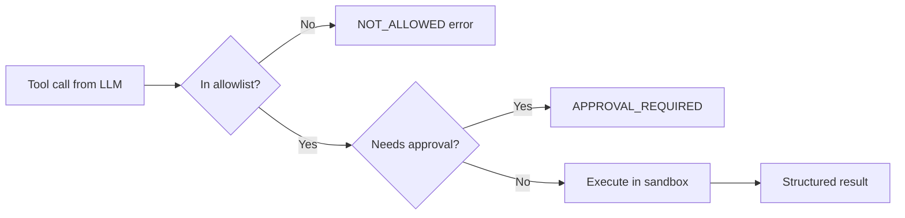

# Tools and Function Calling

## Prerequisites

- [Lesson 1 — What Is an Agent Harness?](01-what-is-an-agent-harness.md): harness primitives
- [Lesson 2 — Agent Loop and State](02-agent-loop-and-state.md): typed state and the act phase
- [M11 Lesson 4 — Tool Use](../../module-11-ai-agents-fundamentals/lessons/04-Tool-Use.md): basic tool schemas and the model-calls-harness-executes contract
- Comfortable with JSON Schema, Python subprocess, and exception handling

---

## What You'll Learn

| Objective | Time | Difficulty |
|-----------|------|------------|
| Design JSON Schema tool definitions the model can use reliably | 55 min | Advanced |
| Understand what makes a tool schema work — and what fails in practice | | |
| Build a sandboxed tool execution layer with timeouts and allowlists | | |
| Return structured errors that help the agent recover rather than retry blindly | | |
| Execute independent tool calls in parallel with asyncio | | |

---

## Intuition First

Think of tools as APIs the model calls through a strictly controlled gateway. The model writes the call; the harness validates the authorization, executes in a safe environment, and returns a structured result — like a bank authorizing a payment versus a customer initiating one.

This split is not a performance optimization. It is the security boundary between *intent* and *side effects*. If the model could execute tools directly, prompt injection would become remote code execution. The harness is what prevents a user who pastes malicious content into the chat from having the agent delete their coworkers' files.

Three qualities define a well-built tool layer:

1. **Schema quality** — clear enough that the model calls the right tool with valid arguments
2. **Sandbox depth** — narrow enough that a buggy or malicious call can't escape to unintended targets
3. **Error fidelity** — specific enough that the model can recover from failures without human help

---

## The Split: Model Decides, Harness Executes

[M11 Lesson 4](../../module-11-ai-agents-fundamentals/lessons/04-Tool-Use.md) established the core contract: the LLM outputs **which** tool to call and **with what arguments**. The harness **executes** the tool and returns the result. That separation is non-negotiable in production.

```
  User goal
      │
      ▼
┌─────────────┐    tool_call(name, args)    ┌──────────────────┐
│     LLM     │ ──────────────────────────▶ │  HARNESS         │
│  (reason)   │                               │  ┌────────────┐  │
└─────────────┘                               │  │ validate   │  │
      ▲                                       │  │ allowlist  │  │
      │         tool_result (string/json)     │  │ timeout    │  │
      └───────────────────────────────────────│  │ execute    │  │
                                              │  └────────────┘  │
                                              └──────────────────┘
```

!!! note "Why the harness must execute"
    If the model could execute tools directly, prompt injection would become remote code execution. The sandbox sits between intent and side effects.

---

## Tool Schemas That Work

Tool definitions use JSON Schema. Schema quality directly affects agent reliability — a vague schema means the model guesses arguments; a precise schema means the model uses valid arguments.

### A Well-Designed Schema

```python
SEARCH_TOOL = {
    "type": "function",
    "function": {
        "name": "search_web",
        "description": (
            "Search the web for current information. Use when the answer "
            "requires facts after your knowledge cutoff, recent events, or "
            "live data. Do NOT use for pure math or logic."
        ),
        "parameters": {
            "type": "object",
            "properties": {
                "query": {
                    "type": "string",
                    "description": "Concise search query, e.g. '2024 Tokyo population'",
                },
                "max_results": {
                    "type": "integer",
                    "description": "Number of results to return (1-5).",
                    "minimum": 1,
                    "maximum": 5,
                },
            },
            "required": ["query"],
        },
    },
}
```

### Good Schema vs Bad Schema

| Aspect | Bad | Good |
|--------|-----|------|
| **Description** | "Search the web" | "Search the web for current information. Use when... Do NOT use for..." |
| **Parameter description** | "The query" | "Concise search query, e.g. '2024 Tokyo population'" |
| **Bounds** | `"type": "integer"` | `"type": "integer", "minimum": 1, "maximum": 5` |
| **Enum for choices** | `"type": "string"` for category | `"enum": ["billing", "api", "security"]` |
| **Required fields** | Missing `"required"` key | `"required": ["query"]` explicitly listed |

**Why examples in descriptions work:** Large language models predict the most likely completion given the context. An example like `"e.g. '2024 Tokyo population'"` in a description shifts the probability distribution toward concise, well-formed queries rather than verbose natural language questions.

```python
# Enum example — prevents invented values
WEATHER_TOOL = {
    "type": "function",
    "function": {
        "name": "get_weather",
        "description": "Get current weather for a city.",
        "parameters": {
            "type": "object",
            "properties": {
                "city": {"type": "string", "description": "City name, e.g. 'Tokyo'"},
                "unit": {
                    "type": "string",
                    "enum": ["celsius", "fahrenheit"],
                    "description": "Temperature unit. Default: celsius.",
                },
            },
            "required": ["city"],
        },
    },
}
```

Without the `enum`, a model might pass `"unit": "Celsius"` (wrong case), `"unit": "C"`, or `"unit": "metric"`. With the enum, only valid values can be emitted.

---

## The Tool Registry

Centralize schemas and handlers in one place:

```python
import json
import time
from typing import Callable, Any

class ToolRegistry:
    def __init__(self):
        self._tools: dict[str, dict] = {}

    def register(
        self,
        name: str,
        description: str,
        parameters: dict,
        handler: Callable[..., str],
        *,
        timeout_seconds: float = 30.0,
        requires_approval: bool = False,
    ):
        self._tools[name] = {
            "schema": {
                "type": "function",
                "function": {
                    "name": name,
                    "description": description,
                    "parameters": parameters,
                },
            },
            "handler": handler,
            "timeout_seconds": timeout_seconds,
            "requires_approval": requires_approval,
        }

    @property
    def schemas(self) -> list[dict]:
        return [t["schema"] for t in self._tools.values()]

    def execute(self, name: str, arguments: str | dict) -> str:
        if name not in self._tools:
            return self._error("UNKNOWN_TOOL", f"Tool '{name}' is not registered. Available tools: {list(self._tools)}")

        args = json.loads(arguments) if isinstance(arguments, str) else arguments
        tool = self._tools[name]

        validation_error = self._validate_args(name, args)
        if validation_error:
            return validation_error

        start = time.perf_counter()
        try:
            result = tool["handler"](**args)
            elapsed = (time.perf_counter() - start) * 1000
            return self._success(result, elapsed_ms=elapsed)
        except TimeoutError:
            return self._error("TIMEOUT", f"Tool '{name}' exceeded {tool['timeout_seconds']}s time limit.")
        except ValueError as e:
            return self._error("INVALID_INPUT", str(e))
        except Exception as e:
            return self._error("EXECUTION_FAILED", f"{type(e).__name__}: {e}")

    def _validate_args(self, name: str, args: dict) -> str | None:
        if not isinstance(args, dict):
            return self._error("INVALID_ARGS", "Arguments must be a JSON object.")
        for key, value in args.items():
            if isinstance(value, str) and len(value) > 50_000:
                return self._error("ARG_TOO_LARGE", f"Argument '{key}' exceeds size limit.")
        return None

    def _success(self, result: Any, elapsed_ms: float) -> str:
        payload = {"ok": True, "result": result, "elapsed_ms": round(elapsed_ms, 1)}
        return json.dumps(payload)

    def _error(self, code: str, message: str) -> str:
        return json.dumps({"ok": False, "error": {"code": code, "message": message}})
```

**Worked example — tracing a tool call through the registry:**

```python
registry = ToolRegistry()

def search_docs(query: str, top_k: int = 5) -> str:
    return f"Found {top_k} results for '{query}': [doc_1, doc_2, ...]"

registry.register(
    name="search_docs",
    description="Search internal knowledge base.",
    parameters={
        "type": "object",
        "properties": {
            "query": {"type": "string"},
            "top_k": {"type": "integer", "minimum": 1, "maximum": 10},
        },
        "required": ["query"],
    },
    handler=search_docs,
)

# Successful call
result = registry.execute("search_docs", {"query": "API rate limits", "top_k": 3})
print(result)  # {"ok": true, "result": "Found 3 results...", "elapsed_ms": 0.5}

# Unknown tool
result = registry.execute("delete_everything", {})
print(result)  # {"ok": false, "error": {"code": "UNKNOWN_TOOL", ...}}

# Argument too large (prompt injection attempt with huge payload)
result = registry.execute("search_docs", {"query": "x" * 100_000})
print(result)  # {"ok": false, "error": {"code": "ARG_TOO_LARGE", ...}}
```

---

## The Execution Sandbox

The sandbox is the harness boundary around side effects:

```python
import subprocess
import tempfile
from pathlib import Path

class ToolSandbox:
    """Isolate tool execution with filesystem and network policies."""

    def __init__(
        self,
        allowed_tools: set[str],
        work_dir: str | None = None,
        allow_network: bool = False,
    ):
        self.allowed_tools = allowed_tools
        self.work_dir = Path(work_dir or tempfile.mkdtemp(prefix="agent_"))
        self.allow_network = allow_network

    def run(self, registry: ToolRegistry, name: str, arguments: dict) -> str:
        if name not in self.allowed_tools:
            return registry._error(
                "NOT_ALLOWED",
                f"Tool '{name}' is not in the allowlist: {sorted(self.allowed_tools)}",
            )

        tool = registry._tools[name]
        if tool["requires_approval"]:
            return registry._error(
                "APPROVAL_REQUIRED",
                f"Tool '{name}' requires human approval before execution.",
            )

        return registry.execute(name, arguments)

def run_python_sandboxed(code: str, work_dir: Path) -> str:
    """Execute Python in an isolated subprocess with no network."""
    script_path = work_dir / "snippet.py"
    script_path.write_text(code)
    try:
        proc = subprocess.run(
            ["python", str(script_path)],
            capture_output=True,
            text=True,
            timeout=10,
            cwd=work_dir,
            env={"PATH": "/usr/bin", "HOME": str(work_dir)},  # minimal env
        )
        if proc.returncode != 0:
            return f"stderr: {proc.stderr.strip()}"
        return proc.stdout.strip() or "(no output)"
    except subprocess.TimeoutExpired:
        raise TimeoutError("Python execution timed out")
```



!!! warning "Never eval() user-influenced code without a sandbox"
    `run_python` tools are high-risk. Use subprocess isolation, timeouts, disabled network, and a dedicated temp directory. See [Agents Towards Production](https://github.com/NirDiamant/agents-towards-production) for container-level isolation patterns.

---

## Error Handling the Agent Can Use

Vague errors ("something went wrong") cause blind retry loops. Structured errors enable recovery:

```python
# BAD — opaque, agent retries with the same bad arguments
return "Error"

# GOOD — actionable, agent can self-correct
return json.dumps({
    "ok": False,
    "error": {
        "code": "INVALID_CITY",
        "message": "City 'Atlantis' not found. Use a real city name.",
        "retryable": True,
        "suggestion": "Try nearby major cities or verify spelling.",
    },
})
```

**Error code taxonomy:**

| Error type | Harness action | Code | Model can recover? |
|------------|----------------|------|--------------------|
| Unknown tool | Reject before execution | `UNKNOWN_TOOL` + list of valid tools | Yes — pick correct tool |
| Validation failure | Reject bad args | `INVALID_ARGS` + which field | Yes — fix argument |
| Timeout | Kill subprocess | `TIMEOUT` + retryable flag | Maybe — retry or skip |
| External API 429 | Retry with backoff | `RATE_LIMITED` + wait hint | Yes — back off |
| Not in allowlist | Block silently | `NOT_ALLOWED` + allowlist | Yes — use different tool |
| Success, empty result | Pass through | `ok: true, result: []` | Yes — model adapts |

```python
def execute_with_retry(registry, name, args, max_retries=2):
    for attempt in range(max_retries + 1):
        result = registry.execute(name, args)
        parsed = json.loads(result)
        if parsed.get("ok"):
            return result
        code = parsed.get("error", {}).get("code")
        if code == "RATE_LIMITED" and attempt < max_retries:
            time.sleep(2 ** attempt)  # exponential backoff: 1s, 2s
            continue
        if code == "TIMEOUT" and attempt < max_retries:
            time.sleep(0.5)
            continue
        return result  # other errors: don't retry
    return result
```

---

## Parallel Tool Calls

Modern LLM APIs return multiple tool calls per turn. The harness should execute independent calls concurrently:

```python
import asyncio

async def execute_parallel(registry: ToolRegistry, tool_calls: list) -> list[tuple[str, str]]:
    """
    Execute multiple tool calls in parallel.
    Returns list of (tool_call_id, result) pairs.
    """
    async def run_one(call):
        result = await asyncio.to_thread(
            registry.execute, call.name, call.arguments
        )
        return call.id, result

    pairs = await asyncio.gather(
        *[run_one(c) for c in tool_calls],
        return_exceptions=True,
    )

    # Handle any exceptions from gather
    results = []
    for call, pair in zip(tool_calls, pairs):
        if isinstance(pair, Exception):
            results.append((call.id, registry._error("EXECUTION_FAILED", str(pair))))
        else:
            results.append(pair)

    return results


def append_parallel_results(state, tool_call_id_result_pairs):
    """Append parallel tool results to state, preserving tool_call_id mapping."""
    for tool_call_id, result in tool_call_id_result_pairs:
        state.messages.append({
            "role": "tool",
            "tool_call_id": tool_call_id,  # must match the tool_call in the assistant message
            "content": result,
        })
```

!!! warning "Preserve tool_call_id mapping"
    Mismatched IDs between `tool_calls` in the assistant message and `tool_call_id` in tool result messages break the conversation for most providers and cause cryptic errors. Always pair results to calls by ID, not by position.

---

## Registering Real Tools — End-to-End Example

```python
import httpx  # pip install httpx

registry = ToolRegistry()

def web_search(query: str, max_results: int = 5) -> str:
    """Call a real search API (Brave, Serper, etc.)."""
    resp = httpx.get(
        "https://api.search.example.com/search",
        params={"q": query, "count": max_results},
        headers={"Authorization": "Bearer $API_KEY"},
        timeout=10.0,
    )
    resp.raise_for_status()
    items = resp.json().get("webPages", {}).get("value", [])
    return json.dumps([{"title": i["name"], "url": i["url"], "snippet": i["snippet"]} for i in items])

def read_file(path: str) -> str:
    p = Path(path).resolve()
    if not str(p).startswith("/workspace"):
        raise ValueError(f"Path {path} is outside allowed workspace.")
    return p.read_text()[:10_000]  # cap at 10k chars

registry.register(
    name="search_web",
    description="Search the web for current information. Use for recent events, live data, or facts outside training knowledge.",
    parameters={
        "type": "object",
        "properties": {
            "query": {"type": "string", "description": "Concise search query"},
            "max_results": {"type": "integer", "minimum": 1, "maximum": 10},
        },
        "required": ["query"],
    },
    handler=web_search,
    timeout_seconds=15.0,
)

registry.register(
    name="read_file",
    description="Read a file from the workspace. Returns up to 10,000 characters.",
    parameters={
        "type": "object",
        "properties": {
            "path": {"type": "string", "description": "Absolute path within /workspace"},
        },
        "required": ["path"],
    },
    handler=read_file,
    timeout_seconds=5.0,
    requires_approval=False,
)
```

---

## Common Misconceptions

**"More tools = more capable agent."** Research consistently shows that agents with 5–8 well-specified tools outperform agents with 20 vague tools. Cognitive overload in the model's tool selection degrades performance. Curate and describe your tool set carefully.

**"The description doesn't matter — the model figures it out from the name."** Function names like `search` are ambiguous. Does it search documents? The web? A database? A vague name forces the model to guess, which leads to wrong tool calls. Descriptions are the primary input for tool selection.

**"Returning a string error is fine — the model understands it."** Plain string errors like `"Error: file not found"` don't tell the model *whether to retry*, *what to try instead*, or *what was wrong with the call*. Structured JSON errors with `code`, `message`, `retryable`, and `suggestion` fields enable self-correction.

**"Parallel tool calls are too complex to implement."** The harness `asyncio.gather` pattern above is ~15 lines of code. The latency savings are significant — two 500ms tool calls in parallel take 500ms total instead of 1,000ms serially.

---

## Production Tips

- **Validate arguments with JSON Schema libraries.** The `_validate_args` above is a lightweight version. For production, use `jsonschema.validate(args, tool["schema"]["function"]["parameters"])` to enforce types, enums, and bounds from the schema.
- **Log every tool call with arguments (redacted for PII).** You'll regret not having this log when debugging a production agent that behaved unexpectedly.
- **Version your tool schemas.** When you change a tool's parameters, the model's cached behavior may reference the old schema. Use a schema version field in your tool metadata.
- **Set conservative timeouts.** A web search tool that hangs for 60 seconds will stall the entire agent loop. Default 15–30s for external APIs; 10s for compute; 5s for file I/O.
- **Test tool handlers independently.** Unit-test each handler with valid args, invalid args, and edge cases before plugging into the harness. Tool bugs are much easier to find outside the loop than inside it.

---

## Key Takeaways

- The model **proposes** tool calls; the harness **validates, sandboxes, and executes** them — this split is the security boundary
- Invest in **schema quality**: descriptions with use-cases, enums for fixed choices, examples in descriptions, bounds on numeric args
- Return **structured JSON errors** with error codes and retry hints — opaque strings cause blind retry loops
- The **sandbox** enforces allowlists, timeouts, approval gates, and argument-level path/command validation
- Use a **tool registry** to keep schemas, handlers, timeouts, and approval flags in one authoritative place
- Execute independent tool calls in **parallel** with `asyncio.gather` — preserve `tool_call_id` mapping when appending results

---

## Related Papers

| Paper | Year | Key contribution |
|-------|------|-----------------|
| [Toolformer: Language Models Can Teach Themselves to Use Tools](https://arxiv.org/abs/2302.04761) | 2023 | Self-supervised approach to learning tool use from examples |
| [ToolBench: Facilitating Large Language Models to Use APIs](https://arxiv.org/abs/2307.16789) | 2023 | Benchmark for tool selection accuracy across 16,000 real APIs |
| [TALM: Tool Augmented Language Models](https://arxiv.org/abs/2205.12255) | 2022 | Early work on structured tool calls in LLM fine-tuning |
| [HuggingGPT: Solving AI Tasks with ChatGPT](https://arxiv.org/abs/2303.04671) | 2023 | Multi-tool orchestration with task planning and result assembly |

---

## Further Reading

- [M11 · Tool Use & Function Calling](../../module-11-ai-agents-fundamentals/lessons/04-Tool-Use.md) — registry and validation patterns
- [Awesome Harness Engineering](https://github.com/ai-boost/awesome-harness-engineering) — sandbox and tool execution references

---

## Next Lesson

**[Lesson 4: MCP — Model Context Protocol](04-mcp-model-context-protocol.md)** — Standardize how harnesses discover and invoke external tool servers without writing custom integration code.
