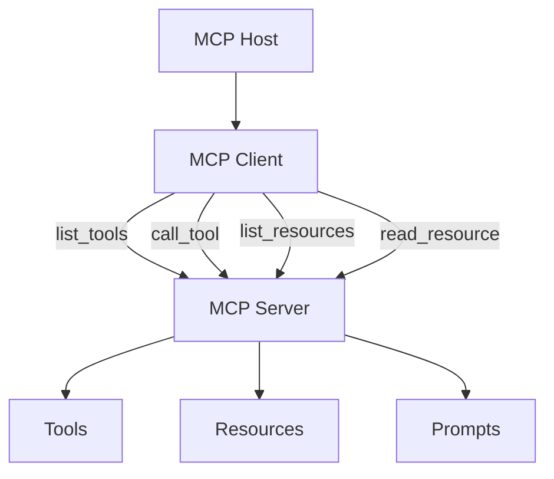

# MCP — Model Context Protocol

## Prerequisites

- [Lesson 3 — Tools and Function Calling](03-tools-and-function-calling.md): tool registry, schemas, and sandboxed execution
- [Lesson 2 — Agent Loop and State](02-agent-loop-and-state.md): harness architecture
- Familiarity with JSON-RPC concepts (request/response over a protocol)
- Python async basics and subprocess management

---

## What You'll Learn

| Objective | Time | Difficulty |
|-----------|------|------------|
| Explain MCP architecture: hosts, clients, servers, and transports | 55 min | Intermediate |
| Distinguish tools, resources, and prompts in MCP | | |
| Understand how Cursor and Claude Desktop wire MCP into their harness | | |
| Build a minimal MCP server from scratch | | |
| Adapt MCP tools into a harness tool registry with unified sandbox policy | | |
| Identify MCP security boundaries and mitigations | | |

---

## Intuition First

Before MCP, every AI product invented its own plugin format. Slack bots needed one integration pattern, IDE extensions needed another, CLI wrappers needed a third. Each had different schemas, different authentication flows, different error formats. Building the same "GitHub integration" for three different agent products meant writing three different integrations from scratch.

**MCP** solves this with a common vocabulary: *hosts* (harnesses) speak the same language as *servers* (tool providers). Once you build a GitHub MCP server, it works in Cursor, Claude Desktop, and any other MCP-compatible harness.

Think of it as USB for AI tool integrations. USB defined a standard so that keyboards, mice, and drives work with any computer. MCP defines a standard so that filesystem tools, database tools, and web search tools work with any agent harness.

The protocol defines *discovery* and *transport* — how the host finds out what a server can do, and how it sends calls and gets results back. The harness still owns *authorization*, *sandboxing*, and *policy enforcement*.

---

## Why MCP Exists

Before MCP, every agent product invented its own plugin format. Slack bots, browser extensions, IDE integrations, and CLI wrappers each required bespoke glue code. **Model Context Protocol (MCP)** — introduced by Anthropic and now widely adopted — standardizes how an **MCP host** (the harness) discovers and calls capabilities exposed by **MCP servers**.

```
┌─────────────────────────────────────────────────────────────────┐
│                     MCP HOST (Harness)                          │
│   Cursor · Claude Desktop · Custom agent runtime                │
│                                                                 │
│   ┌─────────────┐   JSON-RPC    ┌─────────────┐                │
│   │ MCP Client  │◀────────────▶│ MCP Server  │  (filesystem)   │
│   └──────┬──────┘               └─────────────┘                │
│          │           JSON-RPC    ┌─────────────┐                │
│          ├──────────────────────▶│ MCP Server  │  (GitHub)      │
│          │                       └─────────────┘                │
│          │           JSON-RPC    ┌─────────────┐                │
│          └──────────────────────▶│ MCP Server  │  (database)    │
│                                  └─────────────┘                │
│          │                                                      │
│          ▼                                                      │
│   ┌─────────────┐                                               │
│   │     LLM     │  sees tools/resources as function definitions │
│   └─────────────┘                                               │
└─────────────────────────────────────────────────────────────────┘
```

One protocol, many servers. The harness translates MCP tools into model-facing function schemas — the same layer you built in [Lesson 3](03-tools-and-function-calling.md).

!!! tip "Official spec"
    Read the [Model Context Protocol specification](https://modelcontextprotocol.io/) for transport details (stdio, SSE), message formats, and capability negotiation.

---

## MCP Architecture in Depth

### The Four Roles

| Role | What it is | Examples |
|------|-----------|---------|
| **Host** | The agent runtime that integrates MCP | Cursor, Claude Desktop, your custom harness |
| **Client** | The in-process MCP client inside the host | Library in the host that sends JSON-RPC |
| **Server** | An external process exposing capabilities | `@modelcontextprotocol/server-filesystem`, custom Python servers |
| **Transport** | How client and server communicate | stdio (subprocess), SSE (HTTP), WebSocket |

### Transport Options

**stdio transport** (most common for local tools):
- Host spawns server as a subprocess
- Communication via stdin/stdout as line-delimited JSON-RPC
- Simple, no network required, great for local tools

**SSE transport** (HTTP-based, for remote services):
- Server runs as an HTTP server
- Client connects via Server-Sent Events
- Useful for shared tools (e.g., a team database server)

```
stdio transport:
  Host → spawn process → subprocess stdin/stdout → JSON-RPC messages

SSE transport:
  Host → HTTP GET /sse → Server-Sent Events stream → JSON-RPC over HTTP
```

### MCP Primitives

| Primitive | Purpose | Example |
|-----------|---------|---------|
| **Tools** | Callable functions with side effects | `search_web`, `create_issue`, `run_query` |
| **Resources** | Readable data by URI | `file:///README.md`, `db://schema/users` |
| **Prompts** | Reusable prompt templates | `code_review`, `summarize_thread` |



**Tools** map directly to function calling. **Resources** let the harness fetch context without pretending it's a function — useful for files, schemas, and config. **Prompts** are less common in coding agents but valuable for standardized workflows.

---

## MCP Session Lifecycle

Understanding the lifecycle helps debug connection issues:

```
1. Host spawns server (subprocess) or connects (HTTP)
2. Client sends: initialize {protocolVersion, capabilities}
3. Server responds: {serverInfo, capabilities}
4. Client sends: initialized (notification)
5. Client sends: tools/list → Server responds: {tools: [...]}
6. Client sends: resources/list → Server responds: {resources: [...]}
7. [Normal operation: tools/call, resources/read]
8. Client sends: shutdown → Server terminates gracefully
```

A healthy session logs `initialize` and `initialized` at startup. If your MCP server isn't showing tools in the host, the failure is usually at step 2–5.

---

## How Cursor Uses MCP

Cursor is an MCP host. When you enable an MCP server in settings, Cursor:

1. Spawns the server process (usually stdio transport)
2. Calls `tools/list` to discover available tools
3. Converts each tool's `inputSchema` to the model's function-calling format
4. On model tool call → routes to the correct server via `tools/call`
5. Returns the result to the conversation

Example `~/.cursor/mcp.json` configuration:

```json
{
  "mcpServers": {
    "firecrawl": {
      "command": "npx",
      "args": ["-y", "firecrawl-mcp"],
      "env": {
        "FIRECRAWL_API_KEY": "<your-key>"
      }
    },
    "github": {
      "command": "npx",
      "args": ["-y", "@modelcontextprotocol/server-github"],
      "env": {
        "GITHUB_PERSONAL_ACCESS_TOKEN": "<your-token>"
      }
    }
  }
}
```

Each entry is an MCP server the harness manages. The LLM never talks to GitHub directly — Cursor's harness validates, prompts for permission if needed, and executes the MCP call.

!!! note "Resources in Cursor"
    MCP resources appear in the host's context layer (e.g., file trees, fetched docs). The agent can request `read_resource` without a full tool round-trip — reducing tokens for static context.

---

## How Claude Desktop Uses MCP

Claude Desktop follows the same host/client model. Users add servers in `claude_desktop_config.json`:

```json
{
  "mcpServers": {
    "filesystem": {
      "command": "npx",
      "args": [
        "-y",
        "@modelcontextprotocol/server-filesystem",
        "/Users/me/projects"
      ]
    }
  }
}
```

The filesystem server exposes tools like `read_file`, `write_file`, and `list_directory` — scoped to the allowed path. The harness enforces that scope; the model only sees the tool interface.

| Concern | Claude Desktop behavior |
|---------|------------------------|
| **Discovery** | Tools listed at session start |
| **Approval** | User may approve sensitive writes per action |
| **Scope** | Server args define filesystem root or API credentials |

---

## Building a Minimal MCP Server

MCP servers are lightweight processes. Here's a Python server exposing one tool:

```python
# minimal_mcp_server.py
from mcp.server import Server
from mcp.server.stdio import stdio_server
from mcp.types import Tool, TextContent
import httpx

app = Server("weather-server")

@app.list_tools()
async def list_tools() -> list[Tool]:
    return [
        Tool(
            name="get_weather",
            description=(
                "Get current weather for a city. "
                "Use when the user asks about current temperature, conditions, or forecasts."
            ),
            inputSchema={
                "type": "object",
                "properties": {
                    "city": {
                        "type": "string",
                        "description": "City name, e.g. 'Tokyo' or 'New York'",
                    },
                    "unit": {
                        "type": "string",
                        "enum": ["celsius", "fahrenheit"],
                        "description": "Temperature unit. Default: celsius.",
                    },
                },
                "required": ["city"],
            },
        )
    ]

@app.call_tool()
async def call_tool(name: str, arguments: dict) -> list[TextContent]:
    if name != "get_weather":
        raise ValueError(f"Unknown tool: {name}")

    city = arguments["city"]
    unit = arguments.get("unit", "celsius")

    # In production: replace with real weather API call
    result = f"Weather in {city}: 22°C (partly cloudy). Unit requested: {unit}."
    return [TextContent(type="text", text=result)]

async def main():
    async with stdio_server() as (read, write):
        await app.run(read, write, app.create_initialization_options())

if __name__ == "__main__":
    import asyncio
    asyncio.run(main())
```

Register it in your host config:

```json
{
  "mcpServers": {
    "weather": {
      "command": "python",
      "args": ["/path/to/minimal_mcp_server.py"]
    }
  }
}
```

The harness spawns `python minimal_mcp_server.py`, communicates over stdin/stdout, and exposes `get_weather` to the model.

### Adding Resources to Your Server

Resources let the host fetch context data — schemas, README files, config — without a tool call round-trip:

```python
from mcp.types import Resource, TextResourceContents
import pathlib

@app.list_resources()
async def list_resources() -> list[Resource]:
    return [
        Resource(
            uri="file:///workspace/schema.sql",
            name="Database Schema",
            description="Current database schema — read this to understand table structure before writing queries.",
            mimeType="text/plain",
        )
    ]

@app.read_resource()
async def read_resource(uri: str) -> TextResourceContents:
    if uri == "file:///workspace/schema.sql":
        content = pathlib.Path("/workspace/schema.sql").read_text()
        return TextResourceContents(uri=uri, mimeType="text/plain", text=content)
    raise ValueError(f"Unknown resource: {uri}")
```

---

## MCP vs Inline Tool Registry

| Approach | When to use |
|----------|-------------|
| **Inline registry** (Lesson 3) | Single-process agents, full control, low latency |
| **MCP servers** | Shared tools across products, language-agnostic, team-owned services |
| **Both** | Host wraps MCP tools into the same sandbox/allowlist as native tools |

### The Bridge Pattern

The bridge adapts MCP tools into the same harness tool registry so they share the same sandbox policy as native tools:

```python
class McpToolBridge:
    """Adapt MCP tools into the harness ToolRegistry."""

    def __init__(self, mcp_client, registry: "ToolRegistry"):
        self.mcp_client = mcp_client
        self.registry = registry

    async def sync_tools(self):
        """Fetch MCP tools and register them in the harness registry."""
        mcp_tools = await self.mcp_client.list_tools()
        for tool in mcp_tools:
            self.registry.register(
                name=tool.name,
                description=tool.description,
                parameters=tool.inputSchema,
                handler=self._make_handler(tool.name),
                # MCP tools inherit the same timeout policy
                timeout_seconds=30.0,
                # Mark as requiring approval if destructive
                requires_approval=self._is_destructive(tool.name),
            )

    def _make_handler(self, tool_name: str):
        """Create a synchronous wrapper around the async MCP call."""
        import asyncio

        def handler(**kwargs):
            result = asyncio.run(self.mcp_client.call_tool(tool_name, kwargs))
            # MCP returns list[Content]; join text content
            return "\n".join(c.text for c in result if hasattr(c, "text"))

        return handler

    def _is_destructive(self, tool_name: str) -> bool:
        destructive_keywords = {"write", "delete", "create", "update", "send", "run", "execute"}
        return any(kw in tool_name.lower() for kw in destructive_keywords)
```

The bridge pattern keeps **one sandbox policy** regardless of whether a tool is native or MCP-backed.

---

## Testing Your MCP Server

Before plugging into a harness, test your server in isolation:

```python
# test_mcp_server.py
import asyncio
import subprocess
import json

async def test_mcp_server():
    # Start server as subprocess
    proc = await asyncio.create_subprocess_exec(
        "python", "minimal_mcp_server.py",
        stdin=asyncio.subprocess.PIPE,
        stdout=asyncio.subprocess.PIPE,
    )

    async def send(message: dict):
        line = json.dumps(message) + "\n"
        proc.stdin.write(line.encode())
        await proc.stdin.drain()
        response_line = await proc.stdout.readline()
        return json.loads(response_line)

    # 1. Initialize
    await send({"jsonrpc": "2.0", "id": 1, "method": "initialize",
                "params": {"protocolVersion": "0.1", "capabilities": {}}})
    await send({"jsonrpc": "2.0", "method": "initialized", "params": {}})

    # 2. List tools
    tools_response = await send({"jsonrpc": "2.0", "id": 2, "method": "tools/list", "params": {}})
    print("Tools:", [t["name"] for t in tools_response["result"]["tools"]])

    # 3. Call tool
    result = await send({
        "jsonrpc": "2.0", "id": 3, "method": "tools/call",
        "params": {"name": "get_weather", "arguments": {"city": "Tokyo"}},
    })
    print("Result:", result["result"]["content"])

    proc.terminate()

asyncio.run(test_mcp_server())
```

---

## Security Considerations

MCP moves trust boundaries:

| Risk | Mitigation |
|------|------------|
| **Over-privileged server** | Scope tokens and paths in server config args |
| **Malicious server** | Only install servers from trusted sources; review source code |
| **Credential leakage via model** | Pass secrets via env vars, never through tool descriptions or arguments |
| **Prompt injection → tool abuse** | Harness allowlists + human approval (Lesson 5) |
| **Server process escapes sandbox** | Run server in container or restricted user; use seccomp/AppArmor |

!!! warning "MCP is not a sandbox by itself"
    An MCP server runs as a process with whatever credentials you give it. The harness must still gate calls — MCP standardizes *discovery and transport*, not *authorization*. Your sandbox policy (allowlist, approval gates) applies equally to MCP tools and native tools.

---

## Common Misconceptions

**"MCP replaces my tool registry."** MCP is a transport and discovery protocol. You still need a harness registry with allowlists, timeouts, and approval gates. MCP tells the host *what* tools exist; the harness decides *which* ones are allowed and *how* they execute.

**"I need MCP to use external tools."** MCP is optional. The inline tool registry from Lesson 3 works fine for single-process agents. Use MCP when you want tools shared across multiple harnesses, or written in different languages, or owned by different teams.

**"All MCP servers are equally trustworthy."** No. Community-published MCP servers vary in code quality and security posture. Review the source code before running any server with access to your filesystem, credentials, or APIs.

**"stdio MCP servers are slow."** Subprocess startup adds ~50–200ms overhead at session start. After the session is initialized, individual tool calls over stdio are typically < 5ms of protocol overhead. The bottleneck is the tool's own network call, not the MCP transport.

---

## Production Tips

- **Health-check MCP servers at startup.** Call `tools/list` at harness startup and alert if any configured server fails to respond. Silently missing tools are worse than visible errors.
- **Restart crashed servers automatically.** Subprocess death should trigger a respawn with exponential backoff — not a silent hang. Monitor the subprocess PID.
- **Pin MCP server versions.** `npx -y @modelcontextprotocol/server-github` installs the latest version. In production, pin with a specific version tag to avoid breaking changes.
- **Scope credentials tightly.** A GitHub token for an MCP server should have only the permissions needed for the tools it exposes (e.g., `repo:read` for read-only file access, not `repo:write`).
- **Log MCP call latency.** MCP tool calls over SSE to remote servers can be slow (100–2,000ms). Track latency per server and alert if a remote server becomes slow or unresponsive.

---

## Key Takeaways

- **MCP** standardizes how harnesses connect to external **tool and resource servers** with a single JSON-RPC protocol
- Primitives: **tools** (callable with side effects), **resources** (readable by URI without a tool call), **prompts** (reusable templates)
- **Cursor** and **Claude Desktop** are MCP hosts — they discover tools at startup and route calls at runtime
- Build custom servers with the Python MCP SDK to expose internal APIs to any MCP-compatible harness
- The **bridge pattern** wraps MCP tools into the same registry as native tools, so one sandbox policy governs everything
- MCP handles wiring; the harness still owns **permissions, observability, and termination**

---

## Related Papers

| Paper | Year | Key contribution |
|-------|------|-----------------|
| [Model Context Protocol Specification](https://modelcontextprotocol.io/specification) | 2024 | Official MCP spec: transport, primitives, message formats |
| [Gorilla: Large Language Model Connected with Massive APIs](https://arxiv.org/abs/2305.15334) | 2023 | Challenges of tool selection across large API catalogs |
| [ToolLLM: Facilitating Large Language Models to Master APIs](https://arxiv.org/abs/2307.16789) | 2023 | Training and evaluating LLMs on real-world API usage |
| [AnyTool: Self-Reflective, Hierarchical Agents for Large-Scale API Calls](https://arxiv.org/abs/2402.04253) | 2024 | Hierarchical tool routing for large API catalogs — relevant to MCP server management |

---

## Further Reading

- [Model Context Protocol docs](https://modelcontextprotocol.io/) — specification and SDKs
- [Awesome Harness Engineering](https://github.com/ai-boost/awesome-harness-engineering) — MCP integrations and host patterns
- [Agents Towards Production](https://github.com/NirDiamant/agents-towards-production) — tool integration tutorials

---

## Next Lesson

**[Lesson 5: Permissions and Safety in the Harness](05-permissions-and-safety-in-the-harness.md)** — Allowlists, human-in-the-loop approval gates, and budget limits as first-class runtime policies that protect users from agent mistakes.
