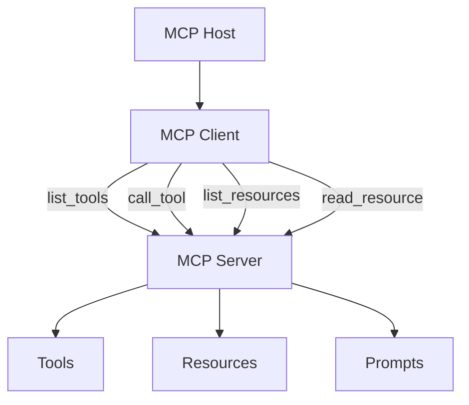

# MCP — Model Context Protocol

## What You'll Learn

| Objective | Time | Difficulty |
|-----------|------|------------|
| Explain MCP architecture and core primitives | 40 min | Intermediate |
| Distinguish tools, resources, and prompts in MCP | | |
| Connect MCP servers to a harness (Cursor, Claude Desktop) | | |
| Build a minimal MCP server for a custom tool | | |

---

## Why MCP Exists

Before MCP, every agent product invented its own plugin format. Slack bots, browser extensions, IDE integrations, and CLI wrappers each required bespoke glue code. **Model Context Protocol (MCP)** — introduced by Anthropic and now widely adopted — standardizes how an **MCP host** (the harness) discovers and calls capabilities exposed by **MCP servers**.

```
┌─────────────────────────────────────────────────────────────────┐
│                     MCP HOST (Harness)                          │
│   Cursor · Claude Desktop · Custom agent runtime                │
│                                                                 │
│   ┌─────────────┐   JSON-RPC    ┌─────────────┐                │
│   │ MCP Client  │◀────────────▶│ MCP Server  │  (filesystem)   │
│   └──────┬──────┘               └─────────────┘                │
│          │           JSON-RPC    ┌─────────────┐                │
│          ├──────────────────────▶│ MCP Server  │  (GitHub)      │
│          │                       └─────────────┘                │
│          │           JSON-RPC    ┌─────────────┐                │
│          └──────────────────────▶│ MCP Server  │  (database)    │
│                                  └─────────────┘                │
│          │                                                      │
│          ▼                                                      │
│   ┌─────────────┐                                               │
│   │     LLM     │  sees tools/resources as function definitions │
│   └─────────────┘                                               │
└─────────────────────────────────────────────────────────────────┘
```

One protocol, many servers. The harness translates MCP tools into model-facing function schemas — the same layer you built in [Lesson 3](03-tools-and-function-calling.md).

!!! tip "Official spec"
    Read the [Model Context Protocol specification](https://modelcontextprotocol.io/) for transport details (stdio, SSE), message formats, and capability negotiation.

---

## MCP Primitives

| Primitive | Purpose | Example |
|-----------|---------|---------|
| **Tools** | Callable functions with side effects | `search_web`, `create_issue`, `run_query` |
| **Resources** | Readable data by URI | `file:///README.md`, `db://schema/users` |
| **Prompts** | Reusable prompt templates | `code_review`, `summarize_thread` |



**Tools** map directly to function calling. **Resources** let the harness fetch context without pretending it's a function — useful for files, schemas, and config. **Prompts** are less common in coding agents but valuable for standardized workflows.

---

## How Cursor Uses MCP

Cursor is an MCP host. When you enable an MCP server in settings, Cursor:

1. Spawns the server process (usually stdio transport)
2. Calls `tools/list` to discover available tools
3. Converts each tool's `inputSchema` to the model's function-calling format
4. On model tool call → routes to the correct server via `tools/call`
5. Returns the result to the conversation

Example `~/.cursor/mcp.json` configuration:

```json
{
  "mcpServers": {
    "firecrawl": {
      "command": "npx",
      "args": ["-y", "firecrawl-mcp"],
      "env": {
        "FIRECRAWL_API_KEY": "<your-key>"
      }
    },
    "github": {
      "command": "npx",
      "args": ["-y", "@modelcontextprotocol/server-github"],
      "env": {
        "GITHUB_PERSONAL_ACCESS_TOKEN": "<your-token>"
      }
    }
  }
}
```

Each entry is an MCP server the harness manages. The LLM never talks to GitHub directly — Cursor's harness validates, prompts for permission if needed, and executes the MCP call.

!!! note "Resources in Cursor"
    MCP resources appear in the host's context layer (e.g., file trees, fetched docs). The agent can request `read_resource` without a full tool round-trip — reducing tokens for static context.

---

## How Claude Desktop Uses MCP

Claude Desktop follows the same host/client model. Users add servers in `claude_desktop_config.json`:

```json
{
  "mcpServers": {
    "filesystem": {
      "command": "npx",
      "args": [
        "-y",
        "@modelcontextprotocol/server-filesystem",
        "/Users/me/projects"
      ]
    }
  }
}
```

The filesystem server exposes tools like `read_file`, `write_file`, and `list_directory` — scoped to the allowed path. The harness enforces that scope; the model only sees the tool interface.

| Concern | Claude Desktop behavior |
|---------|------------------------|
| **Discovery** | Tools listed at session start |
| **Approval** | User may approve sensitive writes per action |
| **Scope** | Server args define filesystem root or API credentials |

---

## Building a Minimal MCP Server

MCP servers are lightweight processes. Here's a Python server exposing one tool:

```python
# minimal_mcp_server.py — illustrative structure
from mcp.server import Server
from mcp.server.stdio import stdio_server
from mcp.types import Tool, TextContent

app = Server("weather-server")

@app.list_tools()
async def list_tools() -> list[Tool]:
    return [
        Tool(
            name="get_weather",
            description="Get current weather for a city.",
            inputSchema={
                "type": "object",
                "properties": {
                    "city": {"type": "string", "description": "City name"},
                },
                "required": ["city"],
            },
        )
    ]

@app.call_tool()
async def call_tool(name: str, arguments: dict) -> list[TextContent]:
    if name != "get_weather":
        raise ValueError(f"Unknown tool: {name}")
    city = arguments["city"]
    # Replace with real API call
    result = f"Weather in {city}: 22°C, partly cloudy"
    return [TextContent(type="text", text=result)]

async def main():
    async with stdio_server() as (read, write):
        await app.run(read, write, app.create_initialization_options())

if __name__ == "__main__":
    import asyncio
    asyncio.run(main())
```

Register it in your host config:

```json
{
  "mcpServers": {
    "weather": {
      "command": "python",
      "args": ["/path/to/minimal_mcp_server.py"]
    }
  }
}
```

The harness spawns `python minimal_mcp_server.py`, communicates over stdin/stdout, and exposes `get_weather` to the model.

---

## MCP vs Inline Tool Registry

| Approach | When to use |
|----------|-------------|
| **Inline registry** (Lesson 3) | Single-process agents, full control, low latency |
| **MCP servers** | Shared tools across products, language-agnostic, team-owned services |
| **Both** | Host wraps MCP tools into the same sandbox/allowlist as native tools |

```python
class McpToolBridge:
    """Adapt MCP tools into the harness ToolRegistry."""

    def __init__(self, mcp_client, registry: ToolRegistry):
        self.mcp_client = mcp_client
        self.registry = registry

    async def sync_tools(self):
        for tool in await self.mcp_client.list_tools():
            self.registry.register(
                name=tool.name,
                description=tool.description,
                parameters=tool.inputSchema,
                handler=self._make_handler(tool.name),
            )

    def _make_handler(self, name: str):
        def handler(**kwargs):
            return self.mcp_client.call_tool_sync(name, kwargs)
        return handler
```

The bridge pattern keeps **one sandbox policy** regardless of whether a tool is native or MCP-backed.

---

## Security Considerations

MCP moves trust boundaries:

| Risk | Mitigation |
|------|------------|
| **Over-privileged server** | Scope tokens and paths in server config |
| **Malicious server** | Only install servers from trusted sources |
| **Credential leakage** | Pass secrets via env vars, never through the model |
| **Prompt injection → tool abuse** | Harness allowlists + human approval (Lesson 5) |

!!! warning "MCP is not a sandbox by itself"
    An MCP server runs as a process with whatever credentials you give it. The harness must still gate calls — MCP standardizes *discovery and transport*, not *authorization*.

---

## Key Takeaways

- **MCP** standardizes how harnesses connect to external **tool and resource servers**
- Primitives: **tools** (callable), **resources** (readable URIs), **prompts** (templates)
- **Cursor** and **Claude Desktop** are MCP hosts — they discover, route, and permission MCP calls
- Build custom servers to expose internal APIs; use a **bridge** to unify MCP and native tools under one sandbox
- MCP handles wiring; the harness still owns **permissions, observability, and termination**

---

## Further Reading

- [Model Context Protocol docs](https://modelcontextprotocol.io/) — specification and SDKs
- [Awesome Harness Engineering](https://github.com/ai-boost/awesome-harness-engineering) — MCP integrations and host patterns
- [Agents Towards Production](https://github.com/NirDiamant/agents-towards-production) — tool integration tutorials

---

## Next Lesson

**Lesson 5: Permissions and Safety in the Harness** — Allowlists, human-in-the-loop approval, and budget limits as first-class runtime policies.
