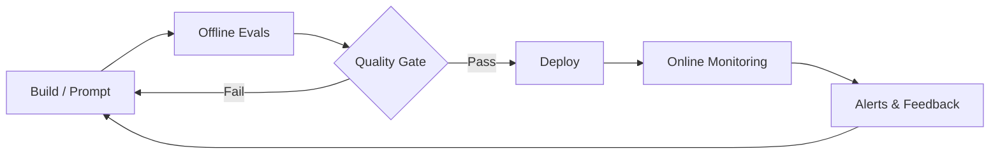

# Evals & Observability

Production AI fails silently without **measurement**. This hub ties together evaluation, tracing, monitoring, and safety across the handbook.

## The quality loop

## Learning path

| Step | Module | Focus |
|------|--------|-------|
| 1 | [M19 · LLM Evals](../production/module-19-llm-evaluation-quality/index.md) | Golden sets, LLM-as-judge, CI/CD gates |
| 2 | [M10 · LLMOps](../production/module-10-llmops-production-systems/index.md) | Observability, caching, A/B tests |
| 3 | [M18 L6](../build/module-18-agent-harness-tools-runtime/lessons/06-observability-in-the-harness.md) | Agent step tracing |
| 4 | [M16 · Safety](../production/module-16-ai-safety-ethics/index.md) | Red teaming, adversarial evals |
| 5 | [M09 L8](../build/module-09-rag-retrieval-augmented-generation/lessons/08-RAG-Evaluation-Metrics.md) | RAG-specific metrics |

## Eval types

| Type | When | Handbook |
|------|------|----------|
| **Unit / regression** | Every PR | [M19 L1, L5](../production/module-19-llm-evaluation-quality/index.md) |
| **RAG retrieval** | Chunking / index changes | [M09 L8](../build/module-09-rag-retrieval-augmented-generation/lessons/08-RAG-Evaluation-Metrics.md) |
| **Agent trajectory** | Tool-use agents | [M19 L4](../production/module-19-llm-evaluation-quality/lessons/04-agent-trajectory-evals.md) |
| **Safety / red team** | Pre-release | [M16 L8](../production/module-16-ai-safety-ethics/lessons/08-lesson-08.md) |
| **Online / drift** | Production | [M19 L6](../production/module-19-llm-evaluation-quality/lessons/06-production-monitoring-and-alerts.md) |

## Observability pillars

| Pillar | What to capture | Tools (OSS) |
|--------|-----------------|-------------|
| **Traces** | Full request path, agent steps | Langfuse, OpenTelemetry, LangSmith |
| **Logs** | Prompts, tool I/O (redacted) | structlog, CloudWatch |
| **Metrics** | Latency, tokens, cost, error rate | Prometheus, Grafana |
| **Feedback** | Thumbs, edits, escalations | Custom + M19 L6 |

## OSS hubs

- [Awesome Agent Evals](https://github.com/benchflow-ai/awesome-evals) — eval frameworks catalog
- [DeepEval](https://github.com/confident-ai/deepeval) — pytest-style LLM tests
- [Promptfoo](https://github.com/promptfoo/promptfoo) — red team + CI evals
- [RAGAS](https://github.com/explodinggradients/ragas) — RAG metrics

## Related

- [Agentic AI](../agentic-ai/index.md) — what you're measuring
- [Essential Papers](../resources/essential-papers.md) — HELM, MT-Bench, etc.
- [Roadmap](../roadmap.md) — planned observability labs
