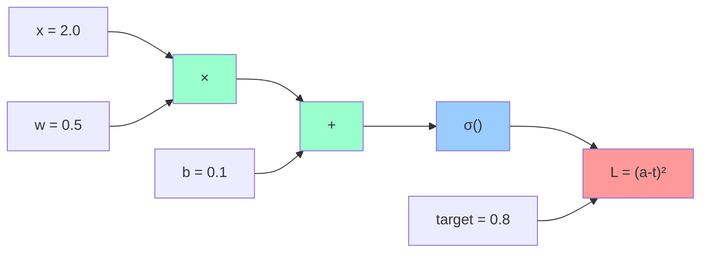

# Mathematical Foundations for Deep Learning

## Prerequisites

- [Lesson 01: Prerequisites](01-prerequisites.md) — vectors, dot products, matrix multiplication, softmax

## What You'll Learn

| Objective | Why It Matters |
|-----------|---------------|
| Understand what a neural network is computing | Makes every architecture decision interpretable |
| Build intuition for partial derivatives | Gradient computation is the foundation of training |
| Understand the chain rule | Enables backpropagation through arbitrary network depths |
| Connect loss → gradient → weight update cycle | The core training loop never changes, only the details |
| Recognize how these concepts appear in Transformers | You will see them in every lesson that follows |

---

## Intuition First: What Is a Neural Network Actually Doing?

Before any formulas, here is the mental model: a neural network is a **parameterized function**. It takes inputs, applies a series of mathematical operations controlled by learnable numbers (weights), and produces outputs. Training finds the weights that make the function most useful.

Every AI system — from GPT to an image classifier to a recommender system — follows this identical pattern:

```
1. Take an input (text tokens, pixels, user behavior)
2. Multiply by learned weight matrices (linear transformations)
3. Apply non-linear functions (activation functions)
4. Produce an output (next-token probabilities, class scores, ratings)
5. Measure how wrong the output is (loss function)
6. Compute which direction to adjust each weight (gradient)
7. Adjust weights by a small amount in the right direction (gradient descent)
8. Repeat for millions of training examples
```

The remarkable thing is that step 7 — move each weight a tiny bit in the direction that reduces error — when applied to billions of examples, produces systems that can write code, understand language, and reason through complex problems. The simplicity of the mechanism is staggering given the capability of the result.

---

## The Training Loop in Code

```python
import numpy as np

def relu(x: np.ndarray) -> np.ndarray:
    """ReLU activation: zeros out negative values, passes positive values through."""
    return np.maximum(0, x)

def softmax(x: np.ndarray) -> np.ndarray:
    """Convert logits to probabilities. Row-wise for batches."""
    exp_x = np.exp(x - np.max(x, axis=-1, keepdims=True))
    return exp_x / exp_x.sum(axis=-1, keepdims=True)

# A minimal 2-layer neural network
def forward_pass(X, W1, b1, W2, b2):
    """
    X:  (batch, input_dim)
    W1: (input_dim, hidden_dim)
    b1: (hidden_dim,)
    W2: (hidden_dim, output_dim)
    b2: (output_dim,)

    Returns: logits of shape (batch, output_dim)
    """
    hidden  = relu(X @ W1 + b1)  # (batch, hidden_dim)
    logits  = hidden @ W2 + b2   # (batch, output_dim)
    return logits

# Initialize with small random weights (important — we will come back to this)
np.random.seed(42)
input_dim, hidden_dim, output_dim = 8, 16, 3

W1 = np.random.randn(input_dim, hidden_dim) * 0.01
b1 = np.zeros(hidden_dim)
W2 = np.random.randn(hidden_dim, output_dim) * 0.01
b2 = np.zeros(output_dim)

# Dummy data: 4 examples, 8 features each
X      = np.random.randn(4, input_dim)
y_true = np.array([0, 1, 2, 0])   # class labels for 4 examples

logits = forward_pass(X, W1, b1, W2, b2)
probs  = softmax(logits)
print(f"Output probabilities shape: {probs.shape}")  # (4, 3)
print(f"Row sums: {probs.sum(axis=1).round(4)}")     # [1. 1. 1. 1.]
```

The weights `W1, b1, W2, b2` are what the network *learns*. Everything else — the architecture, the activation function, the loss function — is a design choice.

---

## Loss Functions — Measuring "How Wrong"

### The Role of the Loss Function

The loss function is the feedback signal that drives learning. Without a well-designed loss, a network cannot improve. Two properties matter:

1. **Differentiable**: we need to compute gradients with respect to the loss
2. **Meaningful**: low loss should actually correspond to good predictions

### Cross-Entropy Loss for Classification

Cross-entropy is the standard loss for classification and language modeling. Recall from the previous lesson:

\[
\mathcal{L} = -\frac{1}{N} \sum_{i=1}^{N} \log p_\theta(y_i \mid x_i)
\]

In words: for each example, look at the model's probability for the *correct* class. Take the negative log. Average across all examples.

```python
def cross_entropy_loss(logits: np.ndarray, labels: np.ndarray) -> float:
    """
    logits: (batch, num_classes) — raw scores BEFORE softmax
    labels: (batch,)             — integer class indices
    """
    # Computing softmax then log can be numerically unstable.
    # log-sum-exp is the stable equivalent of log(softmax(logits)).
    log_sum_exp = np.log(np.sum(np.exp(logits - logits.max(axis=1, keepdims=True)),
                                axis=1)) + logits.max(axis=1)
    # log probability of the correct class for each example
    log_probs   = logits[np.arange(len(labels)), labels] - log_sum_exp
    return -np.mean(log_probs)

loss = cross_entropy_loss(logits, y_true)
print(f"Initial loss: {loss:.4f}")
# With random initialization and 3 classes, we expect loss ≈ ln(3) ≈ 1.099
# because a random model assigns ~1/3 probability to each class
```

!!! note "The Random Initialization Benchmark"
    For a classification problem with K classes, a random model assigns 1/K probability to each class, giving loss = -log(1/K) = log(K). If your initial loss is far from log(K), something is wrong with your initialization.

    - 10-class problem (ImageNet): initial loss ≈ 2.303 (= log 10)
    - 50,000-class problem (GPT vocabulary): initial loss ≈ 10.82 (= log 50000)

### Mean Squared Error for Regression

When predicting continuous values (stock prices, temperatures, embeddings), use MSE:

\[
\mathcal{L}_{\text{MSE}} = \frac{1}{N} \sum_{i=1}^{N} (y_i - \hat{y}_i)^2
\]

```python
def mse_loss(predicted: np.ndarray, actual: np.ndarray) -> float:
    """Mean squared error for regression tasks."""
    return np.mean((predicted - actual) ** 2)

# Example: predicting embedding similarity scores
predicted = np.array([0.8, 0.3, 0.9, 0.1])
actual    = np.array([0.9, 0.2, 0.8, 0.0])
print(f"MSE: {mse_loss(predicted, actual):.4f}")  # 0.010
```

**Why not MSE for classification?** MSE treats the output as a continuous value and applies equal penalty regardless of confidence. Cross-entropy heavily penalizes *confident wrong predictions*, which is the behavior you want: if the model says "99% chance of class A" and the answer is class B, that should be treated very differently from "55% chance of class A."

---

## Gradients — The Direction of Improvement

### What Is a Gradient?

A gradient is a vector of partial derivatives. For a function with multiple inputs, it tells us: "for each input, how much does the output change if we nudge that input slightly?"

**Single variable:** For `f(x)`, the derivative `df/dx` tells us the slope.

**Multiple variables:** For `f(w₁, w₂, w₃, ...)`, the gradient `∇f = [∂f/∂w₁, ∂f/∂w₂, ∂f/∂w₃, ...]` tells us the slope in every direction simultaneously.

```python
# Numerical gradient — the "definition" version
# (This is slow; backpropagation computes the same thing in one pass)

def numerical_gradient(f, x: np.ndarray, eps: float = 1e-5) -> np.ndarray:
    """
    Estimate the gradient of f at x using finite differences.
    This is correct but requires 2*len(x) function evaluations.
    """
    grad = np.zeros_like(x)
    for i in range(len(x)):
        x_plus  = x.copy(); x_plus[i]  += eps
        x_minus = x.copy(); x_minus[i] -= eps
        grad[i] = (f(x_plus) - f(x_minus)) / (2 * eps)
    return grad

# Example: gradient of f(x) = x₁² + 3x₂ + x₁x₂
def f(x):
    return x[0]**2 + 3*x[1] + x[0]*x[1]

x = np.array([2.0, 1.0])

# Analytic gradient: df/dx₁ = 2x₁ + x₂ = 2(2)+1 = 5
#                   df/dx₂ = 3 + x₁ = 3+2 = 5
analytic  = np.array([2*x[0] + x[1],  3 + x[0]])  # [5.0, 5.0]
numerical = numerical_gradient(f, x)

print(f"Analytic gradient:  {analytic}")   # [5.0, 5.0]
print(f"Numerical gradient: {numerical.round(4)}")  # [5.0, 5.0]
```

### Why the Gradient Points "Uphill"

The gradient gives the direction of *steepest increase*. Since we want to *minimize* loss, we move in the *opposite* direction — this is gradient descent.

```
Weight space with loss function plotted as height:

         High Loss
              ↑
    ~~~~🏔️~~~~~│~~~~~🏔️~~~~
    ~~~~~\~~~~~│~~~~~/~~~~~
    ~~~~~~\────│────/~~~~~~  ← gradient points uphill
    ~~~~~~~\   │   /~~~~~~~
    ~~~~~~~~\  │  /~~~~~~~~
    ~~~~~~~~~\ │ /~~~~~~~~~
    ~~~~~~~~~~🔵──────────  ← current weights (high loss)
    ~~~~~~~~~~~~~~~🟢~~~~~~  ← target (minimum loss)

    Step direction = -gradient (downhill)
```

---

## Gradient Descent — The Update Rule

### The Core Equation

\[
w \leftarrow w - \alpha \cdot \nabla_w \mathcal{L}
\]

- \(w\): the current weight value
- \(\alpha\): the learning rate (how big a step to take)
- \(\nabla_w \mathcal{L}\): the gradient of the loss with respect to that weight

```python
def gradient_descent_demo():
    """
    Minimize f(x) = (x - 3)² using gradient descent.
    Minimum is at x = 3, where f(x) = 0.

    Analytic gradient: f'(x) = 2(x - 3)
    """
    x             = 10.0    # starting point (far from minimum)
    learning_rate = 0.1

    print(f"{'Step':>4}  {'x':>8}  {'loss':>10}  {'gradient':>10}")
    print("-" * 40)

    for step in range(20):
        loss     = (x - 3) ** 2        # current loss
        gradient = 2 * (x - 3)         # direction of steepest increase
        x        = x - learning_rate * gradient  # step opposite to gradient

        if step % 4 == 0:
            print(f"{step:>4}  {x:>8.4f}  {loss:>10.4f}  {gradient:>10.4f}")

gradient_descent_demo()
# Step     x         loss      gradient
# ---   ---------   ---------  ---------
#    0   8.6000     49.0000    14.0000
#    4   3.4305      1.6787     5.8000
#    8   3.0466      0.2163     0.9320
#   12   3.0063      0.0279     0.1209
#   16   3.0009      0.0036     0.0157
```

### Learning Rate: The Most Important Hyperparameter

The learning rate controls step size. Too large and you overshoot the minimum (or diverge). Too small and training takes forever.

```python
import numpy as np

def show_lr_effect(learning_rates=[0.001, 0.1, 0.9]):
    """Demonstrate how learning rate affects convergence speed and stability."""
    for lr in learning_rates:
        x = 10.0
        for _ in range(100):
            x = x - lr * 2 * (x - 3)

        final_loss = (x - 3)**2
        status = "converged" if final_loss < 0.01 else "diverged" if abs(x) > 100 else "slow"
        print(f"LR={lr:5.3f}: final x={x:8.4f}, loss={final_loss:10.6f} ({status})")

show_lr_effect()
# LR=0.001: final x=  8.2384, loss=  27.560 (slow)
# LR=0.100: final x=  3.0000, loss=   0.000 (converged)
# LR=0.900: final x= 3.0000, loss=   0.000 (converged, but can oscillate)
```

!!! warning "Learning Rate Schedule"
    In practice, using a fixed learning rate throughout training is suboptimal. Modern training uses **learning rate schedules**: start warm (or with warmup), decay to a small value by the end. The most common schedules are cosine annealing, linear warmup + linear decay, and OneCycleLR.

---

## The Chain Rule — Foundation of Backpropagation

### What It Means

When a function is composed of multiple operations, the chain rule tells us how to compute gradients through the composition. This is the mathematical engine behind backpropagation.

**Single-variable chain rule:**

If \(L = f(g(x))\), then:

\[
\frac{dL}{dx} = \frac{dL}{dg} \cdot \frac{dg}{dx}
\]

**Multi-variable chain rule (neural networks):**

If the network has layers `x → z₁ → a₁ → z₂ → a₂ → L`, then:

\[
\frac{\partial L}{\partial x} = \frac{\partial L}{\partial a_2} \cdot \frac{\partial a_2}{\partial z_2} \cdot \frac{\partial z_2}{\partial a_1} \cdot \frac{\partial a_1}{\partial z_1} \cdot \frac{\partial z_1}{\partial x}
\]

Each factor is computed at its respective layer, and the gradient is accumulated by multiplication — hence "backward propagation."

### Worked Example: One Step of Backpropagation

```python
# Forward pass through a single neuron with sigmoid activation
import numpy as np

def sigmoid(z):
    return 1 / (1 + np.exp(-z))

def sigmoid_grad(z):
    """Derivative of sigmoid: σ(z)(1 - σ(z))"""
    s = sigmoid(z)
    return s * (1 - s)

# Input, weight, bias
x = 2.0
w = 0.5
b = 0.1
target = 0.8

# Forward pass
z    = w * x + b        # 0.5×2.0 + 0.1 = 1.1
a    = sigmoid(z)       # σ(1.1) ≈ 0.7503
loss = (a - target)**2  # (0.7503 - 0.8)² ≈ 0.00247

print(f"z={z:.4f}, a={a:.4f}, loss={loss:.5f}")

# Backward pass — chain rule applied layer by layer
dL_da = 2 * (a - target)              # ∂L/∂a = 2(a - target) = -0.0993
da_dz = sigmoid_grad(z)               # ∂a/∂z = σ'(z)         ≈  0.1875
dL_dz = dL_da * da_dz                 # chain rule             ≈ -0.0186

dz_dw = x                             # ∂z/∂w = x (the input)
dL_dw = dL_dz * dz_dw                 # ∂L/∂w                  ≈ -0.0373

dz_db = 1                             # ∂z/∂b = 1 (always)
dL_db = dL_dz * dz_db                 # ∂L/∂b                  ≈ -0.0186

print(f"Gradient w.r.t. w: {dL_dw:.4f}")
print(f"Gradient w.r.t. b: {dL_db:.4f}")

# Update weights (learning rate = 0.1)
w_new = w - 0.1 * dL_dw  # 0.5 - 0.1×(-0.0373) = 0.5037
b_new = b - 0.1 * dL_db  # 0.1 - 0.1×(-0.0186) = 0.1019

# Verify: new weights produce smaller loss
z_new    = w_new * x + b_new
a_new    = sigmoid(z_new)
loss_new = (a_new - target)**2

print(f"Old loss: {loss:.5f}")
print(f"New loss: {loss_new:.5f}")   # Should be smaller
```

The gradient shows us exactly how much each weight contributed to the error, and in which direction. Subtracting the gradient times the learning rate makes each weight "more correct" by a tiny amount.

---

## Why These Concepts Appear Everywhere in Transformers

Every concept from this lesson appears directly in the Transformer architecture you will study in lessons 5–7:

| Math Concept | Where It Appears in Transformers |
|-------------|----------------------------------|
| **Matrix multiply** | Attention score computation `Q @ K.T`, feed-forward layers, output projection |
| **Softmax** | Converting attention scores to attention weights; next-token probability output |
| **Cross-entropy loss** | Training objective: predict the next token correctly |
| **Gradient** | Backpropagation computes ∂L/∂w for all ~billion parameters during training |
| **Chain rule** | Backpropagation through attention layers, layer norm, residual connections |
| **Learning rate** | Critical hyperparameter; GPT-3 used a peak LR of 6×10⁻⁵ with warmup |

Understanding these foundations means you can reason about what is happening during training, debug numerical issues, and interpret training curves meaningfully.

---

## Edge Cases and Misconceptions

**"Setting weights to zero is a safe initialization."** Wrong — if all weights are identical, all neurons compute identical outputs and receive identical gradients. The network never breaks symmetry and all neurons stay identical throughout training. Always initialize with small *random* values.

**"A larger neural network always performs better."** Not without sufficient data and regularization. An overparameterized model memorizes the training data instead of learning generalizable patterns. This is called overfitting.

**"The gradient is the direction we should move the weights."** The gradient is the direction that *increases* the loss. We move in the *opposite* direction (subtract the gradient) to *decrease* the loss.

**"You need to understand all the backpropagation math before building AI systems."** No — frameworks like PyTorch and JAX compute gradients automatically (autograd). However, understanding the principle helps you diagnose NaN losses, vanishing gradients, and other common training failures.

---

## Computational Graph Perspective

Modern frameworks represent the computation as a directed acyclic graph (DAG). Each node stores its forward output and a function to compute gradients during the backward pass:



During the backward pass, gradients flow *right to left* through the same graph, with each node multiplying by its local derivative (the chain rule in action).

---

## Key Takeaways

- A neural network is a parameterized function; training finds weights that minimize a loss function
- **Loss functions** measure prediction error — choose cross-entropy for classification, MSE for regression
- The **gradient** is the vector of partial derivatives; it points in the direction of steepest increase
- **Gradient descent** steps in the opposite direction of the gradient, reducing loss incrementally
- The **chain rule** enables efficient gradient computation through composed operations (backpropagation)
- The **learning rate** is the most important training hyperparameter — too large diverges, too small is slow
- These same concepts govern the training of every neural network, from a simple classifier to GPT-4

---

## Further Reading

- [3Blue1Brown: Gradient Descent, How Neural Networks Learn](https://www.youtube.com/watch?v=IHZwWFHWa-w) — the best visual explanation of this lesson (21 min)
- [3Blue1Brown: Backpropagation Calculus](https://www.youtube.com/watch?v=tIeHLnjs5U8) — works through the chain rule with actual derivatives (10 min)
- [Andrej Karpathy: micrograd](https://github.com/karpathy/micrograd) — a 150-line implementation of autograd that shows the entire backprop engine
- [Jay Alammar: A Visual and Interactive Guide to Neural Networks](https://jalammar.github.io/visual-interactive-guide-basics-neural-networks/) — builds up from single neurons with interactive visualizations

---

**Next:** [NLP Fundamentals — How Computers Process Language](03-nlp-fundamentals.md)
