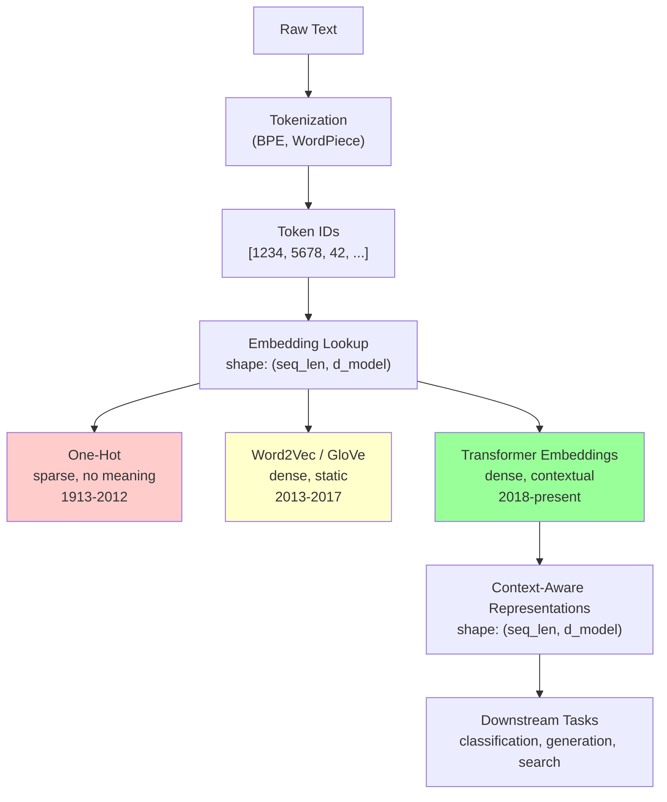

# NLP Fundamentals — How Computers Process Language

## Prerequisites

- [Lesson 01: Prerequisites](01-prerequisites.md) — vectors, dot products, cosine similarity
- [Lesson 02: Math Foundations](02-math-foundations.md) — loss functions, gradient descent

## What You'll Learn

| Objective | Why It Matters |
|-----------|---------------|
| Understand the core challenge: language to numbers | Every downstream technique is a solution to this problem |
| Trace how tokenization works, including BPE internals | You will encounter tokenization issues in production daily |
| Understand why one-hot encoding fails at scale | Motivates the need for dense embeddings |
| Understand Word2Vec's training objective and what it learns | The origin of the vector space semantic geometry still used today |
| Understand why static embeddings cannot handle polysemy | Motivates the Transformer architecture introduced in Lesson 5 |
| Use embedding APIs correctly and measure similarity | Core AI engineering skill |

---

## The Fundamental Problem

Computers work with numbers. Language is made of symbols. The entire history of NLP — from the 1950s to GPT-4 — is about solving one question: **How do we represent language as numbers in a way that preserves meaning, scales to large vocabularies, and supports efficient computation?**

```
"The cat sat on the mat"
         ↓  ??? 
[0.23, -0.45, 0.87, 0.12, ...]  ← 1536 numbers per word/token
```

Getting this representation right is the difference between a model that understands "bank" means a financial institution in one sentence and a riverbank in another, and a model that treats them as identical.

---

## Step 1: Tokenization

Before any numerical processing, text must be split into **tokens** — the atomic units the model works with. This is not as simple as splitting on whitespace.

### Why Whitespace Splitting Fails

```python
text = "don't tokenize state-of-the-art ChatGPT-4"

# Naive approach:
tokens = text.split()   # ["don't", "tokenize", "state-of-the-art", "ChatGPT-4"]

# Problems:
# 1. "don't" — is this one word or two? What about the apostrophe?
# 2. "state-of-the-art" — hyphenated compound
# 3. "ChatGPT-4" — brand name with numbers
# 4. Every unique word → one entry in vocabulary → vocab size explodes
# 5. "run", "runs", "running", "ran" = four separate tokens with no shared representation
# 6. Unknown words at inference time: the model has never seen "Nikhilpentapalli"
```

### Byte-Pair Encoding (BPE) — What Modern LLMs Use

BPE starts with individual characters and iteratively merges the most frequent adjacent pairs. The result is a vocabulary of ~50,000 subword units that can represent any text by decomposing unknown words.

**BPE Algorithm — step by step on a tiny corpus:**

```python
# Toy corpus: word frequencies
corpus = {
    "low":   5,
    "lower": 2,
    "newest": 6,
    "wider":  3,
}

# Step 1: Initialize vocabulary as characters + end-of-word marker
# "low"   → ['l', 'o', 'w', '</w>']
# "lower" → ['l', 'o', 'w', 'e', 'r', '</w>']
# etc.

def count_pairs(vocab: dict) -> dict:
    """Count frequency of all adjacent symbol pairs."""
    pairs = {}
    for word, freq in vocab.items():
        symbols = word.split()
        for i in range(len(symbols) - 1):
            pair = (symbols[i], symbols[i+1])
            pairs[pair] = pairs.get(pair, 0) + freq
    return pairs

def merge_pair(pair: tuple, vocab: dict) -> dict:
    """Merge the most frequent pair into a new symbol."""
    new_vocab = {}
    bigram = ' '.join(pair)
    replacement = ''.join(pair)
    for word, freq in vocab.items():
        new_word = word.replace(bigram, replacement)
        new_vocab[new_word] = freq
    return new_vocab

# Starting vocabulary (characters separated by spaces, </w> marks word end)
vocab = {
    'l o w </w>':     5,
    'l o w e r </w>': 2,
    'n e w e s t </w>': 6,
    'w i d e r </w>': 3,
}

print("Initial vocab:", list(vocab.keys()))

# Iteration 1: find most frequent pair
pairs = count_pairs(vocab)
most_frequent = max(pairs, key=pairs.get)
print(f"\nMost frequent pair: {most_frequent} (count={pairs[most_frequent]})")
# → ('e', 'r') with count 2+3=5  OR  ('e', 's') etc.

vocab = merge_pair(most_frequent, vocab)
print("Vocab after merge:", list(vocab.keys()))
```

After ~10,000 iterations on a real corpus, BPE produces a vocabulary where common words are single tokens and rare words are decomposed into familiar subwords:

```
"unhappiness"  → ["un", "happiness"]
"tokenization" → ["token", "ization"]
"ChatGPT"      → ["Chat", "G", "PT"]
"nikhilpentapalli" → ["ni", "khi", "l", "pen", "ta", "pal", "li"]  (handles OOV!)
"hello"        → ["hello"]  (common word, single token)
```

### Tokenization in Practice

```python
import tiktoken

enc = tiktoken.encoding_for_model("gpt-4o")

examples = [
    "Hello, world!",
    "tokenization",
    "supercalifragilistic",
    "The Transformer architecture",
    "def fibonacci(n: int) -> int:",
]

for text in examples:
    ids     = enc.encode(text)
    decoded = [enc.decode([i]) for i in ids]
    print(f"{text!r:40s} → {len(ids):3d} tokens: {decoded}")
```

!!! note "Token Count Rules of Thumb"
    - 1 token ≈ 4 characters in English
    - 1 token ≈ ¾ of a word
    - English text is more token-efficient than code or non-English languages
    - Code often uses 1 token per identifier character (e.g., `variable_name` may be 3-4 tokens)

!!! warning "Tokenization Is Model-Specific"
    GPT-4 and Claude use different tokenizers. A 10,000-token document for one model may be 12,000 tokens for another. Always use the correct tokenizer when counting tokens for billing or context window calculations.

---

## Step 2: From Tokens to Numbers

Once we have tokens, we need numerical representations. This problem has been solved increasingly well over the past decade.

### One-Hot Encoding (1950s–2010s) — The Baseline

Represent each word as a vector with a 1 in its position and 0s everywhere else:

```python
import numpy as np

vocabulary = ["cat", "dog", "mat", "sat", "the"]
word_to_idx = {word: i for i, word in enumerate(vocabulary)}

def one_hot(word: str, vocab: dict) -> np.ndarray:
    """Create one-hot vector for a word."""
    vec = np.zeros(len(vocab))
    vec[vocab[word]] = 1.0
    return vec

cat_vec = one_hot("cat", word_to_idx)
dog_vec = one_hot("dog", word_to_idx)
mat_vec = one_hot("mat", word_to_idx)

print("cat:", cat_vec)   # [1. 0. 0. 0. 0.]
print("dog:", dog_vec)   # [0. 1. 0. 0. 0.]
print("mat:", mat_vec)   # [0. 0. 1. 0. 0.]

# Problem 1: Huge vectors
# For a vocabulary of 50,000 words, every word is a 50,000-dim vector
# A sentence of 100 words = 100 × 50,000 = 5,000,000 numbers!

# Problem 2: Zero similarity between ALL word pairs
print(np.dot(cat_vec, dog_vec))  # 0.0 — cat and dog are "equally different" as cat and mat
print(np.dot(cat_vec, mat_vec))  # 0.0 — same! But semantically these are very different
```

One-hot encoding has zero semantic information: "cat" and "dog" are just as different as "cat" and "democracy." The model cannot transfer knowledge from one word to related words.

### Word2Vec (2013) — Dense Vectors with Semantic Meaning

The breakthrough insight from Mikolov et al. (2013): **train a neural network to predict words from context, and the internal representations it learns will encode semantic similarity**.

Words that appear in similar contexts (surrounding words) get similar vectors. This is the Distributional Hypothesis: "a word is known by the company it keeps."

**The Skip-gram training objective:**

Given a center word, predict the surrounding context words. Train by gradient descent. The word vectors that minimize this prediction loss end up encoding semantic relationships.

```python
# Simplified illustration of the Skip-gram idea
# (Real Word2Vec uses more efficient negative sampling)

# Corpus: "the cat sat on the mat"
# For center word "sat" with window=2:
#   Context words: ["cat", "on"]  ← model must predict these

# The training creates pairs:
training_pairs = [
    ("sat", "the"),   # center, context
    ("sat", "cat"),
    ("sat", "on"),
    ("sat", "mat"),
]

# The model learns:
#   1. Embedding for "sat"  (the INPUT embedding, V)
#   2. Embedding for each context word  (the OUTPUT embedding, U)
#
# Goal: maximize P("cat" | "sat") = softmax(V_sat · U_cat)
# i.e., the dot product of center and context vectors should be high for true contexts

# After training on a large corpus, similar words share similar embeddings
# because they appear in similar contexts
```

```python
import numpy as np

# Simplified numerical example of what trained Word2Vec vectors look like
# (Real embeddings are 100-300 dimensions; we use 4 for illustration)

embeddings = {
    "king":   np.array([ 0.50,  0.30,  0.80,  0.10]),
    "queen":  np.array([ 0.48,  0.35,  0.75,  0.40]),  # similar to king
    "man":    np.array([ 0.40,  0.20, -0.30,  0.05]),
    "woman":  np.array([ 0.42,  0.25,  0.25,  0.38]),
    "Paris":  np.array([ 0.70, -0.50,  0.30,  0.20]),
    "France": np.array([ 0.60, -0.55,  0.20,  0.15]),
    "Rome":   np.array([ 0.68, -0.45,  0.35,  0.22]),  # similar direction to Paris
    "Italy":  np.array([ 0.58, -0.52,  0.18,  0.13]),
}

def cosine_sim(a: np.ndarray, b: np.ndarray) -> float:
    return float(np.dot(a, b) / (np.linalg.norm(a) * np.linalg.norm(b)))

# The famous analogy: king - man + woman ≈ queen
result = embeddings["king"] - embeddings["man"] + embeddings["woman"]

# Find nearest word to the result vector
print("king - man + woman:")
for word, vec in embeddings.items():
    sim = cosine_sim(result, vec)
    print(f"  {word:8s}: {sim:.3f}")
# Output should show "queen" with the highest similarity

# Geography analogy: Paris - France + Italy ≈ Rome
result2 = embeddings["Paris"] - embeddings["France"] + embeddings["Italy"]
print("\nParis - France + Italy:")
for word, vec in embeddings.items():
    sim = cosine_sim(result2, vec)
    print(f"  {word:8s}: {sim:.3f}")
```

This vector arithmetic works because the vector space encodes *relationships*, not just identities. The vector from "man" to "king" (the "royalty" direction) is parallel to the vector from "woman" to "queen".

---

## Step 3: The Evolution of Representations

Understanding this history explains *why* the Transformer was designed the way it was:

| Era | Method | Training Objective | Key Limitation |
|-----|--------|-------------------|---------------|
| Pre-2013 | One-hot / Bag-of-Words | Count occurrences | No semantic meaning; huge, sparse vectors |
| 2013 | Word2Vec (Mikolov et al.) | Predict context words | **One vector per word** — cannot handle polysemy |
| 2014 | GloVe (Pennington et al.) | Factorize co-occurrence matrix | Same limitation as Word2Vec |
| 2018 | ELMo (Peters et al.) | Bidirectional LM with LSTM | Context-dependent but **sequential** (slow) |
| 2018 | BERT (Devlin et al.) | Masked language modeling | Context-dependent, parallel, but **encoder-only** |
| 2018+ | GPT (Radford et al.) | Next-token prediction | Context-dependent, parallel, generative |

### The Context Problem — The Key Limitation of Word2Vec

Word2Vec gives each word *one* vector, forever. But natural language is ambiguous:

```
"He went to the bank to cash a check"    → bank = financial institution
"He went to the bank to catch a fish"    → bank = river bank
"The blood bank was running low"         → bank = storage facility
```

With Word2Vec, "bank" gets a single vector — some average of all its usages. A classifier trained on this representation cannot distinguish which sense is meant.

Transformers solve this by producing a *different* vector for each occurrence of "bank" depending on the surrounding context. The same input embedding passes through 12-96 attention layers that progressively incorporate contextual information until the final representation is fully context-aware.

This is the fundamental insight that makes the Transformer revolutionary: **context-dependent representations**.

---

## Step 4: Modern Embeddings in Practice

Today, you call an API and get a contextual embedding from a pre-trained Transformer. Understanding what this means helps you use it correctly.

```python
from openai import OpenAI
import numpy as np

client = OpenAI()

def get_embedding(text: str, model: str = "text-embedding-3-small") -> np.ndarray:
    """
    Returns a 1536-dimensional embedding vector for the input text.
    This vector encodes the semantic meaning of the entire text.
    """
    response = client.embeddings.create(input=text, model=model)
    return np.array(response.data[0].embedding)

def cosine_similarity(a: np.ndarray, b: np.ndarray) -> float:
    return float(np.dot(a, b) / (np.linalg.norm(a) * np.linalg.norm(b)))

# Test 1: Semantic similarity
emb_cat    = get_embedding("The cat sat on the mat")
emb_kitten = get_embedding("A kitten rested on the rug")
emb_stock  = get_embedding("Stock prices rose sharply today")

print(f"Cat vs Kitten: {cosine_similarity(emb_cat, emb_kitten):.3f}")  # ≈ 0.85
print(f"Cat vs Stocks: {cosine_similarity(emb_cat, emb_stock):.3f}")   # ≈ 0.12

# Test 2: Context-dependent representations
# Unlike Word2Vec, "bank" gets different embeddings in different contexts!
emb_financial_bank = get_embedding("I went to the bank to deposit money")
emb_river_bank     = get_embedding("We sat on the river bank watching fish")

# These two should be less similar than in Word2Vec (where both map to same vector)
print(f"\nFinancial bank vs River bank: {cosine_similarity(emb_financial_bank, emb_river_bank):.3f}")
# ≈ 0.65-0.75 (similar words, different contexts)
# In Word2Vec these would have similarity = 1.0 (same vector!)
```

### Embedding Dimensions and What They Encode

```python
# OpenAI's text-embedding-3-small: 1536 dimensions
# OpenAI's text-embedding-3-large: 3072 dimensions
# 
# Each dimension doesn't have a clean human-interpretable meaning —
# they emerge from training. However, directions in the space do:

# Semantic similarity: similar texts cluster together
# Analogy: vector arithmetic often preserves relationships
# Clustering: documents on the same topic form clusters

# For RAG (Retrieval-Augmented Generation), you:
# 1. Embed all your documents → store in vector database
# 2. Embed the user's query
# 3. Find the k nearest document embeddings by cosine similarity
# 4. Feed those documents + query to the LLM

# This only works because embeddings capture semantic meaning,
# not just syntactic form.
```

---

## Mermaid: Evolution of NLP Representations



---

## Edge Cases and Misconceptions

**"Tokenization is just splitting on spaces."** No — modern tokenizers use subword algorithms (BPE, WordPiece, SentencePiece) that handle unseen words, minimize vocabulary size, and balance granularity. The tokenizer is a critical part of the model — switching tokenizers changes the model.

**"Word embeddings directly measure conceptual distance."** Cosine similarity measures directional alignment in the learned embedding space. This correlates well with human semantic similarity judgments but is not identical. The geometry depends heavily on the training corpus — biases in the corpus (e.g., gender stereotypes) are reflected in the embeddings.

**"More dimensions always means better embeddings."** Above a certain point, additional dimensions show diminishing returns for most tasks. The key is whether the training objective and corpus adequately cover the semantic relationships needed for your downstream task.

**"Embeddings are stable — the same word always maps to the same vector."** For static embeddings (Word2Vec, GloVe), yes. For contextual embeddings (BERT, GPT), no — the same token produces different vectors depending on surrounding context. This is a feature, not a bug.

**"You can compare embeddings from different models."** No — cosine similarity only makes sense within the same embedding space. Embeddings from `text-embedding-3-small` and `text-embedding-ada-002` cannot be compared directly.

---

## Production Connection

| Concept | Production Usage |
|---------|-----------------|
| **Tokenization** | Billing (you pay per token), context window management, chunking strategies for RAG |
| **Embeddings** | Semantic search, RAG document retrieval, classification, clustering, deduplication |
| **Cosine similarity** | Vector database queries (Pinecone, Chroma, pgvector, Weaviate) |
| **Vocabulary size** | Determines the output layer size of the language model (~50K weights just for the final projection) |

When you build a RAG system in later modules, you will use embeddings to find relevant documents from thousands stored in a vector database. The quality of retrieval depends entirely on how well the embedding model captures semantic similarity — so understanding what embeddings encode (and their limitations) is critical for debugging retrieval failures.

---

## Key Takeaways

- **Tokenization** splits text into subword units using BPE; modern LLMs use vocabularies of ~50,000 tokens
- **One-hot encoding** fails at scale: sparse, huge vectors with no semantic information
- **Word2Vec** learned that words appearing in similar contexts have similar representations — enabling vector arithmetic (king − man + woman ≈ queen)
- The key limitation of Word2Vec and GloVe: **one vector per word regardless of context** (polysemy is averaged away)
- **Transformers** (from Lesson 5 onward) produce different vectors for the same word in different contexts
- Modern embedding APIs encapsulate a full Transformer; calling `get_embedding(text)` gives you a context-aware dense vector suitable for semantic search
- Cosine similarity only makes sense within the same embedding space

---

## Further Reading

- [Jay Alammar: The Illustrated Word2Vec](https://jalammar.github.io/illustrated-word2vec/) — the best visual guide to how Word2Vec training works
- [Mikolov et al. (2013): Efficient Estimation of Word Representations in Vector Space](https://arxiv.org/abs/1301.3781) — the original Word2Vec paper
- [Andrej Karpathy: Let's Build the GPT Tokenizer](https://www.youtube.com/watch?v=zduSFxRajkE) — walks through BPE from scratch (2 hours, very thorough)
- [OpenAI Embeddings Documentation](https://platform.openai.com/docs/guides/embeddings) — production usage of embedding APIs

---

**Next:** [From Word2Vec to Contextual Embeddings](04-contextual-embeddings.md)
