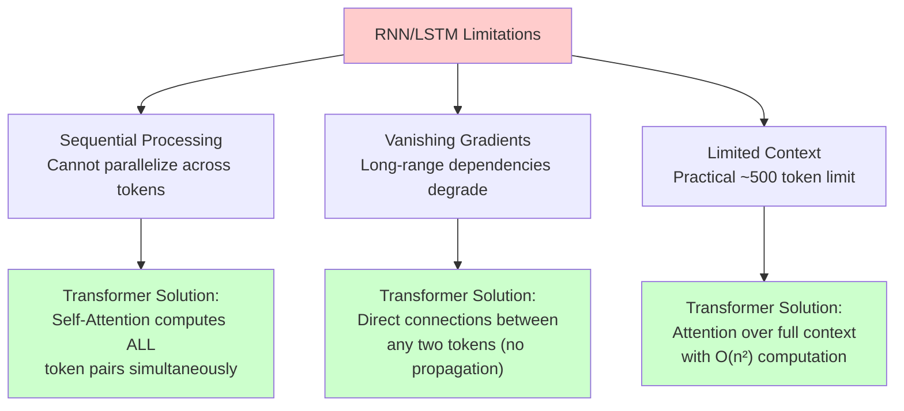

# From Word2Vec to Contextual Embeddings

## Prerequisites

- [Lesson 03: NLP Fundamentals](03-nlp-fundamentals.md) — tokenization, Word2Vec, the context problem

## What You'll Learn

| Objective | Why It Matters |
|-----------|---------------|
| Understand the mechanics of RNN hidden states | Reveals why sequential processing is the bottleneck |
| Understand LSTM gates numerically | Shows what "long-term memory" actually means computationally |
| Understand why bidirectional models (ELMo) were a breakthrough | Context from both directions changes representation quality |
| Identify the three fundamental bottlenecks of sequential models | Each becomes a design goal for the Transformer |
| Trace how every Transformer design choice addresses an RNN limitation | Makes architecture decisions feel inevitable, not arbitrary |

---

## The Context Problem — Revisited Precisely

In the last lesson we established that Word2Vec assigns one vector per word regardless of context. Let us be precise about what this means and why it matters:

```python
import numpy as np

# With Word2Vec, "bank" always maps to the SAME vector
# regardless of what surrounds it:

word2vec_bank = np.array([0.31, -0.12, 0.87, 0.45, ...])  # fixed forever

sentence_1 = "He went to the bank to cash a check"
sentence_2 = "He sat on the river bank watching fish"
sentence_3 = "The blood bank is running critically low"

# All three occurrences of "bank" get the same embedding.
# A downstream model cannot distinguish them!

# What we want:
# context_embedding("bank", sentence_1) ≠ context_embedding("bank", sentence_2)
# The representation should reflect the meaning in this specific context.
```

The challenge: to produce a context-aware embedding for "bank" in sentence 1, the model must process the *surrounding words* ("cash", "check", "went") and incorporate their information. How can a model see all the surrounding words and produce one rich vector per word?

---

## Attempt 1: Recurrent Neural Networks

The natural solution (circa 2013): process words sequentially, maintaining a **hidden state** that accumulates information as the model reads left to right.

```
Input:   "The"  → "cat"  → "sat"  → "on"  → "bank"
State:   [h₀]  →  [h₁]  →  [h₂]  →  [h₃]  →  [h₄]

h₄ encodes: "saw 'The', 'cat', 'sat', 'on', 'bank'"
```

### RNN Forward Pass — The Math

At each time step t, the RNN computes:

\[
h_t = \tanh(W_h \cdot h_{t-1} + W_x \cdot x_t + b)
\]

Where:
- \(h_{t-1}\): previous hidden state (memory of past words)
- \(x_t\): current word embedding
- \(W_h, W_x, b\): learned parameters (same at every step)
- \(\tanh\): keeps values bounded in [-1, 1]

```python
import numpy as np

def rnn_step(x_t: np.ndarray, h_prev: np.ndarray,
             W_h: np.ndarray, W_x: np.ndarray,
             b: np.ndarray) -> np.ndarray:
    """
    One RNN step.
    x_t:    (d_embed,) — current word embedding
    h_prev: (d_hidden,) — previous hidden state
    Returns: h_t of shape (d_hidden,)
    """
    return np.tanh(W_h @ h_prev + W_x @ x_t + b)

# Tiny example: 3-dim embeddings, 4-dim hidden state
np.random.seed(42)
d_embed, d_hidden = 3, 4

W_h = np.random.randn(d_hidden, d_hidden) * 0.1
W_x = np.random.randn(d_hidden, d_embed)  * 0.1
b   = np.zeros(d_hidden)

# Simulate processing "The cat sat on the bank"
words = ["The", "cat", "sat", "on", "the", "bank"]
word_embeddings = {w: np.random.randn(d_embed) for w in set(words)}

h = np.zeros(d_hidden)   # initial hidden state

for i, word in enumerate(words):
    x_t = word_embeddings[word]
    h   = rnn_step(x_t, h, W_h, W_x, b)
    print(f"After '{word}' (step {i}): h = {h.round(3)}")
```

The hidden state after "bank" (h₅) contains some information about all previous words. But how much information from step 0 ("The") survives to step 5 ("bank")?

### The Vanishing Gradient Problem

This is where RNNs fundamentally break. During backpropagation, gradients flow backward through time. At each step, they are multiplied by `W_h` and the derivative of tanh. For long sequences, this multiplication compresses the gradient exponentially:

```
Gradient at step 0 ≈ (W_h × tanh_grad)^L × gradient_at_step_L
                   ≈ (something < 1)^{100} × gradient
                   ≈ effectively 0
```

```python
# Numerical demonstration of vanishing gradients

W_h_small = np.array([[0.5, 0.0],   # singular values < 1
                       [0.0, 0.5]])

gradient = np.array([1.0, 1.0])

print("Gradient magnitude after N steps backward:")
g = gradient.copy()
for step in [1, 10, 50, 100]:
    for _ in range(step - (step - 1) if step == 1 else 1):
        g = W_h_small @ g
    print(f"  Step -{step:3d}: {np.linalg.norm(g):.8f}")

# Step   -1: ~0.707
# Step  -10: ~0.001
# Step  -50: ≈ 3e-15
# Step -100: ≈ 0 (machine epsilon)
```

Result: the RNN cannot learn dependencies between words more than ~10-20 steps apart. This is catastrophic for understanding long sentences.

---

## Attempt 2: Long Short-Term Memory (LSTM)

The LSTM (Hochreiter & Schmidhuber, 1997) addresses vanishing gradients with **gating mechanisms** that learn what to remember and what to forget.

### LSTM — The Key Idea

Instead of one hidden state, LSTM maintains two:
- **h_t**: the short-term memory (same as RNN hidden state)
- **c_t**: the long-term cell state (highway for gradients to flow without shrinking)

Four gates control information flow:

| Gate | Function | Formula |
|------|----------|---------|
| **Forget gate** f_t | How much of c_{t-1} to keep | σ(W_f [h_{t-1}, x_t] + b_f) |
| **Input gate** i_t | How much of new info to store | σ(W_i [h_{t-1}, x_t] + b_i) |
| **Cell candidate** g_t | New information candidate | tanh(W_g [h_{t-1}, x_t] + b_g) |
| **Output gate** o_t | How much of c_t to expose as h_t | σ(W_o [h_{t-1}, x_t] + b_o) |

```python
def lstm_step(x_t, h_prev, c_prev, W, b):
    """
    One LSTM step.
    x_t:    (d_embed,)  — current input
    h_prev: (d_hidden,) — previous short-term memory
    c_prev: (d_hidden,) — previous long-term cell state
    W:      (4*d_hidden, d_embed+d_hidden) — all gate weights concatenated
    b:      (4*d_hidden,) — all biases

    Returns: (h_t, c_t)
    """
    d_hidden = len(h_prev)

    # Concatenate input and previous hidden state
    combined = np.concatenate([x_t, h_prev])   # (d_embed + d_hidden,)

    # Compute all four gates in one matrix multiply (efficient!)
    gates = np.tanh if False else (W @ combined + b)  # (4*d_hidden,)

    # Slice into the four gates
    f = 1 / (1 + np.exp(-gates[0*d_hidden : 1*d_hidden]))  # forget gate  (sigmoid)
    i = 1 / (1 + np.exp(-gates[1*d_hidden : 2*d_hidden]))  # input gate   (sigmoid)
    g = np.tanh(gates[2*d_hidden : 3*d_hidden])             # cell cand.   (tanh)
    o = 1 / (1 + np.exp(-gates[3*d_hidden : 4*d_hidden]))  # output gate  (sigmoid)

    # Update cell state: selectively forget old info, add new info
    c_t = f * c_prev + i * g

    # Output hidden state: filtered version of cell state
    h_t = o * np.tanh(c_t)

    return h_t, c_t
```

### Why LSTM Helps (But Does Not Fully Solve)

The cell state `c_t` provides an "information highway" where gradients can flow without being multiplied by weights repeatedly. The forget gate can learn to preserve important information across hundreds of steps. This significantly helps.

```
RNN:  gradient × W_h × W_h × W_h × ... (L times) → vanishes
LSTM: gradient flows through c_t with forget gate additions → preserved longer
```

However, LSTMs still have three fundamental problems:

1. **Still sequential**: must process word n before computing word n+1 (no parallelization)
2. **Limited context**: practical limit of ~500 tokens before information degrades
3. **Slow training**: sequential processing means GPUs cannot be fully utilized

---

## Attempt 3: Bidirectional Models (ELMo, 2018)

ELMo (Embeddings from Language Models, Peters et al.) ran two LSTMs — one forward, one backward — and concatenated their outputs:

```
Forward LSTM:   "The" → "cat" → "sat" → "on" → "bank"
Backward LSTM:  "The" ← "cat" ← "sat" ← "on" ← "bank"

For "bank", ELMo sees:
  Forward:  has seen {"The", "cat", "sat", "on"}
  Backward: has seen {"<end>"}  (in a sentence)
  Combined: context from BOTH directions!
```

```python
# Conceptually, ELMo produces:
def elmo_embedding(word_position: int, forward_hidden_states, backward_hidden_states):
    """
    Combine forward and backward LSTM hidden states for context-aware embedding.
    """
    forward_context  = forward_hidden_states[word_position]   # what came before
    backward_context = backward_hidden_states[word_position]  # what comes after

    # Concatenate: the embedding now "sees" the full sentence context
    return np.concatenate([forward_context, backward_context])

# ELMo was the first model to show substantially different vectors for
# "bank" in financial vs. river contexts. Evaluated on word-in-context tasks,
# ELMo improved over GloVe by 6+ points on multiple NLP benchmarks.
```

**ELMo's contribution**: proved that contextual embeddings are dramatically more useful than static embeddings for downstream NLP tasks.

**ELMo's remaining problem**: still uses LSTMs → still sequential → still slow.

---

## The Three Bottlenecks That Demanded a New Architecture

By 2018, the NLP community had established a clear picture of what was needed and what was blocking it:



| Bottleneck | What It Prevented | Transformer Solution |
|-----------|------------------|---------------------|
| **Sequential processing** | GPU utilization <10%; 1 word at a time | Self-attention: all words in one matrix multiply |
| **Vanishing gradients** | Cannot learn dependencies > 20-50 tokens | Direct path between any token pair, O(1) distance |
| **Limited context** | Cannot process long documents | Attention over full sequence (limited by compute, not architecture) |

Every design choice in the Transformer — self-attention, positional encoding, multi-head attention — is a direct response to one of these three bottlenecks. Understanding the bottlenecks makes the Transformer feel inevitable rather than arbitrary.

---

## Quantitative Comparison

| Model | Context | Parallelization | Training Speed | Long-range Deps |
|-------|---------|----------------|---------------|-----------------|
| Word2Vec | None (static) | N/A | Very fast | None (no context) |
| RNN | Left-to-right only | None | Slow | Poor (vanishing grad) |
| LSTM | Better long-range | None | Slow | Moderate |
| Bi-LSTM (ELMo) | Both directions | Limited | Very slow | Good but slow |
| **Transformer** | **Full sequence** | **Fully parallel** | **Fast** | **Excellent** |

For GPT-3 with 96 layers and 175B parameters, the Transformer's parallelization made training feasible. A sequential model would have taken orders of magnitude longer and could not have been parallelized across thousands of GPUs.

---

## Edge Cases and Misconceptions

**"LSTMs are obsolete."** For small datasets or streaming scenarios (online learning, real-time sequences), LSTMs remain practical. They have fewer parameters than Transformers and can process tokens one at a time without needing the full sequence upfront. For production transcription and time-series forecasting, LSTMs still appear.

**"Bidirectional attention is always better."** For generation (predicting the next token), you cannot look at future tokens — you must use causal (unidirectional) attention. Bidirectional attention (like BERT) is optimal for understanding tasks (classification, NER) where the full context is available.

**"The Transformer solved vanishing gradients."** Attention avoids the problem by computing direct connections, but very deep Transformers still need residual connections and layer normalization to train stably. The architecture choice reduces the problem; the training tricks eliminate it.

---

## Production Connection

Understanding sequential model limitations helps you reason about production systems:

- **Streaming inference**: LLM generation is still sequential (one token at a time) at *inference time* even though the architecture is a Transformer. The reason: you need token N to generate token N+1. GPU parallelization helps during *training* (all tokens in the training sequence can be processed in parallel) and *prefill* (processing the input prompt).

- **KV cache**: During autoregressive generation, Transformers avoid re-computing all attention scores at each step by caching key and value matrices. This is why "KV cache" is a critical optimization for production LLM serving — it avoids quadratic growth in compute as the generated sequence gets longer.

- **Context length limits**: Transformer attention is O(n²) in the sequence length n. A 128K-token context window requires 128K × 128K = 16 billion attention score computations per layer. This is why models with very long contexts are more expensive to run.

---

## Key Takeaways

- RNNs process text sequentially, building a hidden state that accumulates context — but gradients vanish for long sequences
- LSTMs use gating mechanisms (forget, input, output) to give gradients a highway through the cell state, enabling longer dependencies
- ELMo proved contextual embeddings work by running forward and backward LSTMs; "bank" in a financial context gets a different vector than "bank" in a geographical context
- Three bottlenecks made RNN-family models inadequate: sequential processing, vanishing gradients, limited context window
- The Transformer addresses all three simultaneously with self-attention: all tokens attend to all other tokens in one parallel matrix operation
- Every design choice in the Transformer is a response to a specific RNN limitation

---

## Further Reading

- [Jay Alammar: Visualizing A Neural Machine Translation Model](https://jalammar.github.io/visualizing-neural-machine-translation-mechanics-of-seq2seq-models-with-attention/) — the sequence-to-sequence paper that first introduced attention, the direct predecessor of self-attention
- [Christopher Olah: Understanding LSTM Networks](https://colah.github.io/posts/2015-08-Understanding-LSTMs/) — the clearest explanation of LSTM mechanics, with excellent diagrams
- [Peters et al. (2018): Deep Contextualized Word Representations (ELMo)](https://arxiv.org/abs/1802.05365) — the original ELMo paper
- [Stanford CS224N Lecture: RNNs and Language Models](https://www.youtube.com/watch?v=PLryWeHPcBs) — comprehensive lecture covering the full sequential model lineage

---

**Next:** [The Attention Mechanism — "Attention Is All You Need"](05-attention-mechanism.md)
