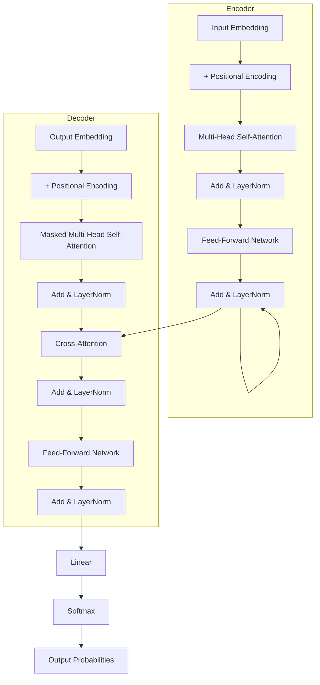

# The Complete Transformer Architecture

## Prerequisites

- [Lesson 05: The Attention Mechanism](05-attention-mechanism.md)
- [Lesson 06: Self-Attention and Multi-Head Attention](06-self-attention-multi-head.md)
- [Lesson 02: Math Foundations](02-math-foundations.md) — layer normalization, residual connections

## What You'll Learn

| Objective | Why It Matters |
|-----------|---------------|
| Understand why positional encoding is necessary | Attention is permutation-invariant; you must add order information explicitly |
| Understand sinusoidal PE and modern alternatives | RoPE is in every modern LLM (LLaMA, Mistral, Gemini) |
| Build the full encoder block with correct shapes | The encoder is the module in BERT, embeddings APIs |
| Understand residual connections and layer norm mathematically | These are why 96-layer Transformers train stably |
| Distinguish encoder-only, decoder-only, encoder-decoder | Determines model capability and task fit |
| Read scale tables for modern LLMs | Translates architecture knowledge to production context |

---

## Architecture Overview

The original "Attention Is All You Need" Transformer has an encoder-decoder structure. Modern LLMs use only the decoder half. Understanding the full architecture first makes the decoder-only simplification obvious.



Each encoder and decoder block can be stacked N times (N=6 in the original paper; N=96 in GPT-3).

---

## Component 1: Input Embeddings

Every token ID maps to a learned dense vector. The embedding matrix has shape (vocab_size, d_model):

```python
import numpy as np

vocab_size = 50257   # GPT-2 vocabulary
d_model    = 768     # GPT-2 small embedding dimension

# The embedding matrix — each row is the embedding for one token
embedding_matrix = np.random.randn(vocab_size, d_model) * 0.02

def embed_tokens(token_ids: list, embedding_matrix: np.ndarray) -> np.ndarray:
    """
    Convert token IDs to embeddings via lookup.
    token_ids: list of integers (shape: seq_len)
    Returns: (seq_len, d_model)
    """
    return embedding_matrix[token_ids]   # NumPy fancy indexing

# Example: "The cat sat" (token IDs are illustrative)
token_ids  = [464, 3797, 3332]   # "The", "cat", "sat"
embeddings = embed_tokens(token_ids, embedding_matrix)
print(f"Token IDs: {token_ids}")
print(f"Embeddings shape: {embeddings.shape}")   # (3, 768)
```

!!! note "Tying Input and Output Embeddings"
    In most modern LLMs (GPT-2, LLaMA, Mistral), the output projection matrix (used to compute next-token logits) is tied to the same embedding matrix used for input. This reduces parameters significantly: for a 50K vocabulary × 4096 d_model, that is 200M parameters saved.

---

## Component 2: Positional Encoding

Self-attention is **permutation-invariant**: if you shuffle all the tokens, the attention outputs are shuffled the same way but the pairwise scores are identical. The model cannot distinguish "cat sat" from "sat cat" without explicit position information.

### Original Sinusoidal Encoding

The 2017 paper used fixed sinusoidal patterns:

\[
PE_{(pos, 2i)} = \sin\!\left(\frac{pos}{10000^{2i/d_\text{model}}}\right), \quad
PE_{(pos, 2i+1)} = \cos\!\left(\frac{pos}{10000^{2i/d_\text{model}}}\right)
\]

```python
def sinusoidal_positional_encoding(max_seq_len: int, d_model: int) -> np.ndarray:
    """
    Fixed sinusoidal positional encoding.

    Returns (max_seq_len, d_model) matrix where each row encodes
    one position with a unique pattern of sines and cosines.

    Properties:
    - Different frequencies at different dimensions → unique per position
    - Relative position patterns are consistent (PE(pos+k) is a linear function of PE(pos))
    - Generalizes to positions not seen during training
    """
    position = np.arange(max_seq_len)[:, np.newaxis]   # (seq_len, 1)
    dim_idx  = np.arange(d_model)[np.newaxis, :]        # (1, d_model)

    # Divide positions by different frequencies for each dimension
    div_term = np.power(10000.0, (2 * (dim_idx // 2)) / d_model)  # (1, d_model)
    angles   = position / div_term                                   # (seq_len, d_model)

    pe = np.zeros((max_seq_len, d_model))
    pe[:, 0::2] = np.sin(angles[:, 0::2])   # Even dimensions → sine
    pe[:, 1::2] = np.cos(angles[:, 1::2])   # Odd dimensions → cosine

    return pe

pe = sinusoidal_positional_encoding(max_seq_len=512, d_model=128)

# The model input is: token embedding + positional encoding
# x = embeddings + pe[:seq_len]   — same shape, element-wise addition

print(f"PE shape: {pe.shape}")           # (512, 128)
print(f"PE[:3, :4]:\n{pe[:3, :4].round(3)}")
# Position 0: [0.000, 1.000, 0.000, 1.000]  (sin(0)=0, cos(0)=1 at all freqs)
# Position 1: [0.841, 0.540, 0.010, 1.000]  (different pattern)
# Position 2: [0.909, -0.416, 0.020, 1.000]  (unique per position)
```

### Why Not Learned Positional Embeddings?

GPT-2 and BERT use **learned** positional embeddings — a (max_seq_len, d_model) matrix treated as parameters. Advantages: potentially better for positions seen during training. Disadvantage: cannot generalize beyond max_seq_len.

### Modern Alternative: Rotary Positional Embedding (RoPE)

LLaMA, Mistral, Gemini, GPT-4 (reportedly), and most models since 2022 use RoPE. Instead of adding a positional vector to the embedding, RoPE rotates the Q and K vectors by an angle proportional to the position. This encodes *relative* position directly into the attention scores.

```python
def apply_rope(q: np.ndarray, k: np.ndarray, positions: np.ndarray) -> tuple:
    """
    Simplified RoPE (Rotary Position Embedding).

    Key property: Q_i · K_j depends only on (i - j), the relative distance.
    This allows the model to generalize to longer sequences than seen during training.

    q, k: (seq_len, d_k)
    positions: (seq_len,) — integer position indices
    """
    d_k = q.shape[-1]
    # Pair up dimensions and rotate each pair by angle θ_j × position
    theta = 1.0 / (10000 ** (np.arange(0, d_k, 2) / d_k))  # (d_k/2,)

    def rotate_half(x):
        x1 = x[..., :d_k//2]
        x2 = x[..., d_k//2:]
        return np.concatenate([-x2, x1], axis=-1)

    angles = positions[:, np.newaxis] * theta[np.newaxis, :]  # (seq_len, d_k/2)
    cos_a  = np.repeat(np.cos(angles), 2, axis=-1)            # (seq_len, d_k)
    sin_a  = np.repeat(np.sin(angles), 2, axis=-1)            # (seq_len, d_k)

    q_rot = q * cos_a + rotate_half(q) * sin_a
    k_rot = k * cos_a + rotate_half(k) * sin_a

    return q_rot, k_rot

# After rotation, q_rot @ k_rot[j] depends on |i-j|, not absolute positions
print("RoPE applied — attention now uses relative positions")
```

---

## Component 3: The Encoder Block

Each encoder block applies two sub-layers, each wrapped in a residual connection and layer normalization:

```python
def layer_norm(x: np.ndarray, gamma: np.ndarray, beta: np.ndarray,
               eps: float = 1e-6) -> np.ndarray:
    """
    Layer normalization — normalize across the feature dimension (d_model).

    For each token position, normalize to zero mean and unit variance,
    then apply learned scale (gamma) and shift (beta).

    Note: LayerNorm normalizes across d_model for each token independently.
    This is different from BatchNorm, which normalizes across the batch.
    LayerNorm works well even with batch size 1 — critical for inference.
    """
    mean    = x.mean(axis=-1, keepdims=True)      # (seq_len, 1)
    var     = x.var(axis=-1, keepdims=True)        # (seq_len, 1)
    x_norm  = (x - mean) / np.sqrt(var + eps)     # (seq_len, d_model)
    return gamma * x_norm + beta                   # learned affine transform

def feed_forward_network(x: np.ndarray,
                          W1: np.ndarray, b1: np.ndarray,
                          W2: np.ndarray, b2: np.ndarray) -> np.ndarray:
    """
    Position-wise feed-forward network.

    Applied independently to each token position.
    Typically: d_model → 4 × d_model (with activation) → d_model

    In the original paper: d_model=512 → d_ff=2048 → d_model=512
    In GPT-3: d_model=12288 → d_ff=49152 → d_model=12288

    The 4x expansion gives the model capacity to perform more complex
    per-token transformations after the attention aggregation step.
    Modern models often use 8/3 × d_model with SwiGLU activation.
    """
    # (seq_len, d_model) @ (d_model, d_ff) + (d_ff,) → (seq_len, d_ff)
    hidden = np.maximum(0, x @ W1 + b1)   # ReLU activation
    # (seq_len, d_ff) @ (d_ff, d_model) + (d_model,) → (seq_len, d_model)
    return hidden @ W2 + b2

def encoder_block(X: np.ndarray,
                  # multi-head attention parameters
                  W_Qs, W_Ks, W_Vs, W_O,
                  # feed-forward parameters
                  W1, b1, W2, b2,
                  # layer norm parameters
                  gamma1, beta1, gamma2, beta2) -> np.ndarray:
    """
    One Transformer encoder block.

    Pre-LN variant (used by most modern models):
      X → LayerNorm → MultiHeadAttn → Residual
      X → LayerNorm → FFN → Residual

    Original paper used Post-LN:
      X → MultiHeadAttn → Residual → LayerNorm
    """
    # Sub-layer 1: Multi-Head Self-Attention
    X_norm   = layer_norm(X, gamma1, beta1)
    attn_out = multi_head_attention(X_norm, W_Qs, W_Ks, W_Vs, W_O)
    X        = X + attn_out               # residual connection

    # Sub-layer 2: Feed-Forward Network
    X_norm = layer_norm(X, gamma2, beta2)
    ff_out = feed_forward_network(X_norm, W1, b1, W2, b2)
    X      = X + ff_out                   # residual connection

    return X
```

### Why Residual Connections?

Without residual connections, gradients vanish in deep networks. The residual ensures a direct gradient path from the loss to every layer:

```
Without residual: gradient at layer 1 = product of 95 Jacobians (for 96 layers)
                  → typically vanishes to 0

With residual:    gradient at layer 1 = 1 (from the skip path)
                  + small correction from the learned function
                  → stable gradient flow regardless of depth
```

Residual connections are what allow Transformers to be stacked 96+ layers deep without gradient issues. They were first introduced for CNNs (ResNet, He et al. 2016) and adopted wholesale for Transformers.

### Pre-LayerNorm vs. Post-LayerNorm

The original paper used **Post-LN** (normalize after the residual). Most modern models (GPT-3, LLaMA) use **Pre-LN** (normalize before the sub-layer):

```
Post-LN (original paper): X → SubLayer → Add → LayerNorm
Pre-LN  (modern default): X → LayerNorm → SubLayer → Add
```

Pre-LN is more stable during training (learning rates can be larger) and is now the standard.

---

## Component 4: The Decoder Block

The decoder has three sub-layers instead of two:

1. **Masked multi-head self-attention** — causal, attends to previous output tokens only
2. **Cross-attention** — queries from decoder, keys/values from encoder output
3. **Feed-forward network** — same as encoder

```python
def decoder_block(decoder_X: np.ndarray,
                  encoder_output: np.ndarray,
                  # all the weight matrices ...
                  ) -> np.ndarray:
    """
    One Transformer decoder block.

    decoder_X:      (tgt_seq_len, d_model)   — partial output being generated
    encoder_output: (src_seq_len, d_model)   — full encoder output

    Sub-layer 1: Causal self-attention (decoder attends to itself)
    Sub-layer 2: Cross-attention (decoder attends to encoder)
    Sub-layer 3: Feed-forward
    """
    # Sub-layer 1: Masked self-attention (decoder only sees past tokens)
    causal_mask = make_causal_mask(decoder_X.shape[0])
    attn_out, _ = self_attention(decoder_X, W_Q_self, W_K_self, W_V_self, mask=causal_mask)
    decoder_X   = layer_norm(decoder_X + attn_out, ...)

    # Sub-layer 2: Cross-attention
    # Queries: from decoder (what the decoder is looking for)
    # Keys/Values: from encoder output (the source sequence information)
    Q_cross = decoder_X @ W_Q_cross              # queries from decoder
    K_cross = encoder_output @ W_K_cross         # keys from encoder
    V_cross = encoder_output @ W_V_cross         # values from encoder

    d_k     = K_cross.shape[-1]
    scores  = Q_cross @ K_cross.T / np.sqrt(d_k)
    weights = softmax(scores, axis=-1)
    cross_out = weights @ V_cross
    decoder_X = layer_norm(decoder_X + cross_out, ...)

    # Sub-layer 3: Feed-forward
    ff_out    = feed_forward_network(decoder_X, ...)
    decoder_X = layer_norm(decoder_X + ff_out, ...)

    return decoder_X
```

---

## Component 5: Output Projection

The final linear layer projects from d_model to vocab_size, then softmax gives next-token probabilities:

```python
def output_projection(X: np.ndarray, W_embed: np.ndarray) -> np.ndarray:
    """
    Project decoder output to vocabulary logits.

    X:       (seq_len, d_model)
    W_embed: (vocab_size, d_model)   — shared with input embeddings (weight tying)

    Returns: (seq_len, vocab_size)   — one logit per vocab entry per position
    """
    # (seq_len, d_model) @ (d_model, vocab_size) → (seq_len, vocab_size)
    logits = X @ W_embed.T   # weight tying: same matrix as input embeddings, transposed
    return logits

# For generation: sample or argmax from the last position
# next_token = np.argmax(logits[-1])   # greedy decoding
# next_token = np.random.choice(vocab_size, p=softmax(logits[-1]))  # sampling
```

---

## Three Transformer Variants

| Variant | Architecture | Pre-training Task | Models | Best For |
|---------|-------------|------------------|--------|----------|
| **Encoder-only** | Only encoder stack with bidirectional attention | Masked language modeling (predict [MASK]) | BERT, RoBERTa, DeBERTa | Classification, NER, search embeddings |
| **Decoder-only** | Only decoder stack with causal attention | Next-token prediction | GPT, Claude, LLaMA, Mistral | Text generation, code, chatbots |
| **Encoder-decoder** | Both stacks with cross-attention | Seq2seq (translate, summarize) | T5, BART, original Transformer | Translation, summarization, structured generation |

```
Encoder-only (BERT):
  Input:  "The [MASK] sat on the mat"
  Output: probability distribution for [MASK] → "cat" (0.72), "dog" (0.15)...
  Use:    Extract representations for downstream tasks

Decoder-only (GPT/Claude):
  Input:  ["The", "cat", "sat", "on", "the"]
  Output: next token → "mat" (0.65), "floor" (0.12), ...
  Use:    Chat, generation, code, reasoning

Encoder-decoder (T5):
  Source input → encoder → encoder_output
  Target generation → decoder attends to encoder_output
  Use:    Translation, summarization, structured output
```

---

## Scale of Modern Transformers

| Model | Parameters | Layers | Heads | d_model | d_ff | Context |
|-------|-----------|--------|-------|---------|------|---------|
| Original Transformer | 65M | 6 | 8 | 512 | 2048 | 512 |
| GPT-2 small | 117M | 12 | 12 | 768 | 3072 | 1024 |
| GPT-2 XL | 1.5B | 48 | 25 | 1600 | 6400 | 1024 |
| GPT-3 | 175B | 96 | 96 | 12288 | 49152 | 2048 |
| LLaMA 3 8B | 8B | 32 | 32 | 4096 | 14336 | 128K |
| LLaMA 3 70B | 70B | 80 | 64 | 8192 | 28672 | 128K |

The architecture is fundamentally identical. Scale is the primary variable. A solid understanding of the 65M-parameter original gives you the blueprint for all of them.

---

## Modern Architectural Improvements

The original 2017 architecture has been refined. Here is what changed and why:

| Change | Original Paper | Modern Default | Reason |
|--------|---------------|---------------|--------|
| **Position encoding** | Sinusoidal fixed | RoPE (learned, relative) | Better length generalization |
| **Layer norm placement** | Post-LN | Pre-LN | Training stability |
| **Activation function** | ReLU in FFN | SwiGLU | Empirically better quality |
| **Attention pattern** | Multi-head | Grouped Query (GQA) | 4-8x KV cache reduction |
| **FFN ratio** | 4× d_model | 8/3× d_model | Matched compute with SwiGLU |
| **Dropout** | Yes | Often removed in LLMs | Scale makes it unnecessary |

---

## Edge Cases and Misconceptions

**"The Transformer is slow at inference because it reads the whole context every time."** Partially true for the attention computation. KV caching (storing past K and V matrices) means the model only needs to compute attention for the new token — not re-read the entire context.

**"Layer norm and batch norm are the same."** They differ in which dimension is normalized. Batch norm normalizes across the batch dimension (per feature); Layer norm normalizes across the feature dimension (per example). Layer norm works with batch size 1, which batch norm does not.

**"The 'Add' in 'Add & LayerNorm' adds some special constant."** 'Add' means the residual connection — adding the sub-layer's input to its output. This is what allows gradient flow through deep networks.

**"Encoder-only models cannot generate text."** They can, but they are not designed for it. BERT can do masked prediction but not open-ended generation. Decoder-only models like GPT excel at generation.

---

## Production Connection

| Component | Production Relevance |
|-----------|---------------------|
| **Embedding matrix** | For a 50K vocab × 4096 d_model model: 200M parameters just for embeddings. This is why smaller models still have meaningful embedding quality. |
| **Layer count** | More layers → better quality but higher latency. LLaMA 3 8B: 32 layers; each adds one serial dependency during generation. |
| **d_ff** | The FFN is ~67% of total Transformer parameters. A 70B model with d_ff=28672 has ~50B parameters in FFN layers alone. |
| **KV cache** | Size = 2 × seq_len × d_v × num_heads × num_layers × 2 bytes (fp16). For LLaMA 3 70B at 8192 context: ~18 GB per sequence. This is the memory bottleneck for long-context inference. |

---

## Key Takeaways

- Positional encoding is required because self-attention is permutation-invariant; modern models use RoPE for relative position awareness
- Encoder block = Multi-head self-attention + FFN, each wrapped in residual + LayerNorm
- Residual connections provide a direct gradient path enabling 96+ layer training; Pre-LN is now standard
- The FFN expands to ~4× d_model internally, providing per-token transformation capacity
- Decoder-only (GPT, Claude, LLaMA) is the dominant modern architecture for generation
- The 2017 architecture is fundamentally intact at any scale — what changed are the details (RoPE, SwiGLU, GQA, Pre-LN)

---

## Further Reading

- [Jay Alammar: The Illustrated Transformer](https://jalammar.github.io/illustrated-transformer/) — the definitive visual guide; read before or alongside this lesson
- [Interactive Transformer Explainer](https://poloclub.github.io/transformer-explainer/) — feed real text into a GPT-2 model and watch attention weights, residual streams, and token probabilities update in real time
- [Vaswani et al. (2017): Attention Is All You Need](https://arxiv.org/abs/1706.03762) — the original paper; Section 3 (model architecture) is required reading
- [Andrej Karpathy: Let's Build GPT from Scratch](https://www.youtube.com/watch?v=kCc8FmEb1nY) — 2-hour video building a complete Transformer in PyTorch with excellent commentary on each architectural choice

---

**Next:** [From Transformers to Large Language Models](08-transformers-to-llms.md)
