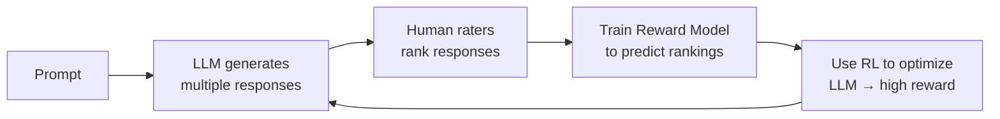

# From Transformers to Large Language Models

## Prerequisites

- [Lesson 07: The Complete Transformer Architecture](07-transformer-architecture.md)
- [Lesson 02: Math Foundations](02-math-foundations.md) — loss functions, gradient descent

## What You'll Learn

| Objective | Why It Matters |
|-----------|---------------|
| Understand why next-token prediction produces general intelligence | The fundamental insight that made LLMs possible |
| Trace the GPT lineage from GPT-1 to modern models | Shows that scale, not fundamentally new architecture, drove progress |
| Understand what "emergence" means precisely | Helps distinguish capability from hype |
| Understand SFT, RLHF, and DPO | These are what make a base model into an assistant |
| Connect each LLM concept to the rest of this curriculum | Unifies everything you have learned so far |

---

## The Key Insight: What Does Next-Token Prediction Actually Learn?

The Transformer was designed for machine translation. OpenAI's GPT-1 team had a different idea: what if we pre-train on a self-supervised task (predict the next word) using massive data, and then fine-tune for downstream tasks?

The surprising depth of this insight:

> **A model that reliably predicts the next token must have implicitly learned grammar, facts, reasoning patterns, and world knowledge — because all of these are needed to make good predictions.**

```python
# The diversity of knowledge required for good next-token prediction:

examples = [
    # Grammar
    ("The cat sat on the", "mat"),       # grammaticality, word order

    # Geography
    ("The capital of France is", "Paris"), # factual recall

    # Math
    ("2 + 2 =", "4"),                     # arithmetic

    # Code
    ("def fibonacci(n):\n    if n <= 1:\n        return n\n    return", "fibonacci(n-1) + fibonacci(n-2)"),

    # Reasoning
    ("If all A are B, and all B are C, then all A are", "C"),  # syllogism

    # Style
    ("To be, or not to be,", "that is the question"),  # literary knowledge
]

# Getting these right simultaneously requires:
# - World knowledge (geography, science, math)
# - Language understanding (grammar, syntax, pragmatics)
# - Reasoning capability (logic, code execution)
# - Cultural knowledge (literature, idioms)

# The pre-training objective provides all of this "for free"
# because the training signal comes from the text itself.
```

This is why the pre-training paradigm was revolutionary: the training signal (predict the next token) is *derived from the data itself*. No human labeling required. This enables training on petabytes of text.

---

## Pre-Training: The Process

```
Stage: PRE-TRAINING

Data:   Trillions of tokens from the web, books, code, scientific papers
        (Common Crawl, The Pile, RedPajama, etc.)

Task:   Given tokens [t₁, t₂, ..., tₙ], predict tₙ₊₁
        Autoregressive: process all positions in parallel (causal mask)

Loss:   Cross-entropy over the vocabulary at each position
        L = -1/n × Σᵢ log P(tᵢ | t₁,...,tᵢ₋₁)

Cost:   Millions to tens of millions of dollars in compute
        GPT-3: ~$4.6M in cloud compute (2020 prices)
        LLaMA 3 70B: estimated $2-5M

Result: A "base model" that is an excellent next-token predictor
        but does NOT follow instructions or have a conversational interface
```

```python
import numpy as np

def compute_lm_loss(logits: np.ndarray, target_ids: np.ndarray) -> float:
    """
    Language modeling loss — the objective for pre-training.

    logits:     (seq_len, vocab_size)  — model's raw predictions at each position
    target_ids: (seq_len,)             — the actual next tokens

    For each position i, we compute: -log P(target_ids[i] | context)
    Then average across all positions.
    """
    seq_len, vocab_size = logits.shape

    # Numerically stable log-softmax
    log_probs = logits - np.log(np.sum(np.exp(logits - logits.max(axis=-1, keepdims=True)),
                                        axis=-1, keepdims=True)) - logits.max(axis=-1, keepdims=True)

    # Select the log probability of the correct token at each position
    token_losses = -log_probs[np.arange(seq_len), target_ids]

    return float(token_losses.mean())

# For a random model with 50K vocab:
# Expected loss = -log(1/50000) = log(50000) ≈ 10.82
# After training: 2-3 for a good model (perplexity ≈ 7-20)
```

### What Is Perplexity?

Perplexity is the standard evaluation metric for language models:

\[
\text{PPL} = e^{\mathcal{L}} = e^{-\frac{1}{n}\sum_i \log P(t_i | t_1,...,t_{i-1})}
\]

Lower perplexity = better model (less "perplexed" by the test text). A random model has perplexity ≈ vocabulary size (~50K). GPT-3 achieved ~20 perplexity on Penn Treebank — meaning the model assigns an average rank of 20 to the correct next token.

---

## The GPT Lineage: Scale as the Driver

| Model | Year | Params | Training Tokens | Key Contribution |
|-------|------|--------|----------------|-----------------|
| GPT-1 | 2018 | 117M | 1B | Pre-training transfers to downstream tasks |
| GPT-2 | 2019 | 1.5B | 40B | Coherent long-form generation; zero-shot abilities begin |
| GPT-3 | 2020 | 175B | 300B | In-context learning emerges; few-shot performance |
| InstructGPT | 2022 | 175B | — | RLHF makes models useful as assistants |
| GPT-4 | 2023 | ~1T? | — | Multimodal, dramatically better reasoning |

The architecture did not fundamentally change from GPT-1 to GPT-3. The gains came from:
1. More parameters (larger weight matrices)
2. More training data
3. Longer training runs
4. Better hardware

### Emergent Capabilities

A striking finding: some capabilities appear suddenly at specific scale thresholds. Below a threshold, performance is near-random. Above it, the capability materializes:

```
Few-shot learning:        emerges ~50B parameters
Multi-step arithmetic:    emerges ~100B parameters
Chain-of-thought reasoning: emerges ~100B parameters
Code generation:          emerges ~12B parameters (with code-focused training)
```

!!! note "Understanding Emergence"
    "Emergence" does not mean the model suddenly "woke up." It means a task requires the combination of multiple sub-capabilities, and only above a certain scale threshold does the model have all of them simultaneously. Emergence in LLMs is a measurement artifact of using pass/fail metrics — with continuous metrics, the capability growth is often smooth.

---

## The BERT Alternative: Encoder-Only Models

While GPT pursued generation (decoder-only), Google took a different path:

```
BERT (2018) — Bidirectional Encoder Representations from Transformers

Pre-training task 1: Masked Language Modeling (MLM)
  Input:  "The [MASK] sat on the [MASK]"
  Output: P("cat" | context) and P("mat" | context)
  Difference from GPT: BERT sees BOTH left and right context when predicting!

Pre-training task 2: Next Sentence Prediction (NSP)
  Input:  [CLS] Sentence A [SEP] Sentence B [SEP]
  Output: Is sentence B the actual next sentence after A?
```

BERT dominated NLP understanding benchmarks from 2018-2022. The trade-off:

| | BERT (encoder-only) | GPT (decoder-only) |
|---|---|---|
| **Attention direction** | Bidirectional (full context) | Causal (left only) |
| **Strength** | Understanding, embedding | Generation |
| **Use cases** | Classification, NER, semantic search | Chat, code, writing, reasoning |
| **Pre-training objective** | Predict masked tokens | Predict next token |

Modern embedding APIs (OpenAI `text-embedding-3`, Google `text-embedding`) use encoder-style Transformers. When you embed a document for RAG, you are getting BERT-style bidirectional representations.

---

## Making LLMs Useful: Instruction Tuning and RLHF

A raw pre-trained model is a next-token predictor. It completes text in the style of its training data. It does NOT:
- Follow instructions ("summarize this")
- Refuse harmful requests
- Maintain conversational context appropriately
- Produce reliable, well-structured outputs

Three techniques transform a base model into an assistant:

### Step 1: Supervised Fine-Tuning (SFT)

Continue training on a small dataset of high-quality (instruction, response) pairs:

```
Instruction: "Summarize this article in 3 bullet points: [article]"
Response:    "• Point 1\n• Point 2\n• Point 3"

Instruction: "Write a Python function to sort a list in descending order"
Response:    "def sort_desc(lst):\n    return sorted(lst, reverse=True)"

Instruction: "What is the capital of Japan?"
Response:    "The capital of Japan is Tokyo."
```

The training objective is identical to pre-training (cross-entropy on next tokens), but the distribution shifts toward instruction-following format. Typical dataset size: 10K–500K examples. Cost: much lower than pre-training.

### Step 2: Reinforcement Learning from Human Feedback (RLHF)

SFT teaches the *format* of helpfulness but not the subtleties of what humans prefer. RLHF teaches the model to generate responses that humans rank highly:



```
Prompt: "Explain quantum entanglement"

Response A: Accurate, clear, appropriate length, good analogies    → Rank 1
Response B: Accurate but overly technical for the question asked   → Rank 2
Response C: Clear but contains a factual error about Bell's theorem → Rank 3

The Reward Model learns: "A-style responses are preferred"
PPO then updates the LLM to produce more A-style responses
```

RLHF is what makes modern LLMs:
- **Helpful**: they answer the question asked, not just complete text
- **Honest**: they express uncertainty rather than fabricating
- **Harmless**: they decline genuinely dangerous requests

### Step 3: Direct Preference Optimization (DPO) — The Modern Alternative

RLHF requires training a separate reward model and using reinforcement learning (unstable, complex). DPO (Rafailov et al. 2023) achieves similar alignment by directly optimizing on preference pairs using a modified cross-entropy objective:

\[
\mathcal{L}_\text{DPO} = -\mathbb{E}_{(x, y_w, y_l)} \left[\log \sigma\!\left(\beta \log \frac{\pi_\theta(y_w|x)}{\pi_\text{ref}(y_w|x)} - \beta \log \frac{\pi_\theta(y_l|x)}{\pi_\text{ref}(y_l|x)}\right)\right]
\]

where \(y_w\) is the preferred response, \(y_l\) the less preferred, and \(\pi_\text{ref}\) is the reference (SFT) model.

In practice: DPO is simpler to implement, more stable, and now widely used (Zephyr, Mistral models, and others). Most open-source models use DPO or variants.

---

## The Modern LLM Training Pipeline

```
Stage 1: PRE-TRAINING (weeks to months)
  Data:   1T–15T tokens from internet, books, code
  Task:   Predict next token (autoregressive)
  Cost:   $1M–$100M+
  Result: Base model (powerful but raw)

Stage 2: SUPERVISED FINE-TUNING (hours to days)
  Data:   10K–500K instruction-response pairs (human-curated)
  Task:   Same cross-entropy, different data distribution
  Cost:   $10K–$500K
  Result: Instruction-following model (usable but rough)

Stage 3: RLHF or DPO (days to weeks)
  Data:   Human preference rankings
  Task:   Maximize reward model score / preference log-likelihood
  Cost:   $100K–$5M
  Result: Aligned assistant (helpful, honest, safe)

Stage 4: DEPLOYMENT
  Serving:  Quantization (INT8/INT4), batching, KV caching
  Safety:   Content filters, rate limiting, monitoring
  Cost:     Ongoing (compute, bandwidth, safety)
```

---

## The Current Landscape

| Family | Creator | Architecture | Distinctive Features |
|--------|---------|-------------|---------------------|
| GPT-4o | OpenAI | Decoder-only | Multimodal (text+image+audio), strong reasoning |
| Claude 3.5/4 | Anthropic | Decoder-only | Constitutional AI, long context (200K), code |
| Gemini 2.5 | Google | Decoder-only | Multimodal, very long context (1M+) |
| LLaMA 3 | Meta | Decoder-only | Open weights, widely fine-tuned, RoPE+GQA |
| Mistral | Mistral AI | Decoder-only | Efficient, sliding window attention |
| Qwen | Alibaba | Decoder-only | Strong in Chinese + multilingual |

Every one of these is a Transformer decoder with the same fundamental architecture from Lesson 7. The differences are in training data, scale, alignment process, and architectural tweaks (RoPE, GQA, SwiGLU, etc.).

---

## Connecting to the Rest of This Curriculum

You now have the foundation to understand every advanced topic that follows. Here is the connection:

| Curriculum Topic | Foundation Connection |
|-----------------|----------------------|
| **Prompt Engineering** | You are crafting inputs that guide the causal attention mechanism's next-token distribution |
| **Token counting and costs** | Directly follows from BPE tokenization and the per-token pricing model |
| **RAG (Retrieval-Augmented Generation)** | Retrieved context is prepended to the model's input; attention incorporates it as part of the sequence |
| **Fine-tuning** | Continues gradient descent on the pre-trained weights toward a specific task distribution |
| **Embeddings and vector search** | Uses the encoder (or encoder-like) portion of a Transformer; cosine similarity over the embedding space |
| **Agents** | Chains multiple Transformer forward passes; tool outputs are fed back into the input sequence |
| **Evaluation (MMLU, HumanEval, etc.)** | Measures quality of the model's probability distribution over correct answers |
| **Quantization** | Reduces the precision of the weight matrices (W_Q, W_K, W_V, W_O, etc.) for faster inference |
| **KV caching** | Stores the K and V tensors from previous Transformer layers to avoid recomputation |

---

## Edge Cases and Misconceptions

**"Training on more data always helps."** Not without data quality control. Low-quality or toxic data degrades model behavior. Modern training pipelines spend significant effort on data deduplication, quality filtering, and toxicity removal.

**"RLHF makes models truthful."** RLHF optimizes for responses that human raters prefer, which correlates with but is not identical to truthfulness. Raters may prefer confident answers over uncertain ones, creating alignment pressure toward overconfidence.

**"The base model has no personality or values."** Base models learn the values and writing styles present in the training data. The SFT and RLHF stages shape these further, but the base already contains embedded perspectives from its training corpus.

**"Larger models always outperform smaller ones."** A well-fine-tuned 7B model often outperforms a poorly-aligned 70B model on specific tasks. Model quality depends on pre-training data, fine-tuning quality, and alignment — not just parameter count.

---

## Key Takeaways

- Pre-training on next-token prediction implicitly teaches the model language, facts, reasoning, and world knowledge — because predicting text well requires all of these
- Scale (parameters × tokens) drove most capability improvements from GPT-1 to GPT-3 — the architecture was nearly identical
- BERT (encoder-only) dominated understanding tasks; GPT (decoder-only) dominated generation; modern LLMs are almost all decoder-only
- SFT teaches the format of helpfulness; RLHF/DPO aligns preferences; together they transform a base model into an assistant
- Every advanced AI engineering concept — RAG, agents, fine-tuning, evaluation — builds directly on the Transformer foundations from this module
- The current landscape (GPT-4o, Claude, Gemini, LLaMA) all uses the same decoder-only architecture with architectural refinements (RoPE, GQA, SwiGLU)

---

## Further Reading

- [Andrej Karpathy: Intro to Large Language Models](https://www.youtube.com/watch?v=zjkBMFhNj_g) — 1-hour overview covering the full LLM lifecycle (highly recommended)
- [Jay Alammar: How GPT-3 Works](https://jalammar.github.io/how-gpt3-works-visualizations-animations/) — animated and visual explanation of GPT-3 inference
- [Ouyang et al. (2022): Training language models to follow instructions with human feedback (InstructGPT)](https://arxiv.org/abs/2203.02155) — the original RLHF paper
- [Rafailov et al. (2023): Direct Preference Optimization](https://arxiv.org/abs/2305.18290) — the paper introducing DPO as an RLHF alternative
- [Anthropic: Constitutional AI](https://www.anthropic.com/research/constitutional-ai-harmlessness-from-ai-feedback) — how Anthropic aligns Claude using AI feedback instead of human feedback

---

Congratulations — you have completed Module 00 and now have a solid foundation in every concept that powers modern AI. The next modules build directly on this: you will build RAG systems, write agents, and understand fine-tuning in terms of the Transformer components you now know deeply.

**Next:** [Module 01: AI Engineering Essentials — What Is AI Engineering?](../../module-01-ai-engineering-essentials/lessons/01-what-is-ai-engineering.md)
