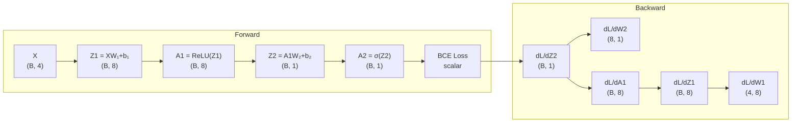

# Building a Neural Network from Scratch

## Prerequisites

- [Lesson 02: Neurons & Activation Functions](./02-neurons-activation-functions.md) — ReLU, sigmoid, tanh
- [Lesson 03: Loss Functions](./03-loss-functions.md) — cross-entropy, MSE
- [Lesson 05: Backpropagation](./05-backpropagation.md) — chain rule, computational graphs
- NumPy: broadcasting, matrix multiplication, advanced indexing

## What You'll Learn

This lesson bridges theory and practice. You'll implement every component of a neural network in pure NumPy — no frameworks — so that when you use PyTorch later, you understand exactly what's happening inside.



---

## 1. Mathematical Foundations

### The Chain Rule in Neural Networks

For a two-layer network `L(A2(Z2(A1(Z1(X)))))`:

```
dL/dW1 = dL/dA2 × dA2/dZ2 × dZ2/dA1 × dA1/dZ1 × dZ1/dW1
```

In matrix notation (critical for implementation):
```
dZ2 = dL/dA2 × dA2/dZ2   (B, 1) — combine sigmoid + BCE gradient
dW2 = A1ᵀ × dZ2           (8, 1) — gradient w.r.t. W2
dA1 = dZ2 × W2ᵀ           (B, 8) — backprop through W2
dZ1 = dA1 × ReLU'(Z1)     (B, 8) — ReLU gate
dW1 = Xᵀ × dZ1            (4, 8) — gradient w.r.t. W1
```

### Gradient Derivation: Binary Cross-Entropy + Sigmoid

```
L = -[y log σ(z) + (1-y) log(1-σ(z))]

dL/dz = dL/dσ × dσ/dz
      = (-y/σ + (1-y)/(1-σ)) × σ(1-σ)
      = -y(1-σ) + (1-y)σ
      = σ - y
      = ŷ - y   ← remarkably clean!
```

This is why `dZ2 = A2 - y` in the backward pass.

---

## 2. Building the Network Step by Step

### Initialization

```python
import numpy as np


class NeuralNetwork:
    """
    A 2-layer neural network from scratch.
    Architecture: Input(d) → ReLU → Hidden(h) → Sigmoid → Output(1)

    Shape convention (used throughout):
      B  = batch size
      d  = input features
      h  = hidden units
      1  = output (binary classification)
    """

    def __init__(
        self,
        input_size:    int,
        hidden_size:   int,
        output_size:   int,
        learning_rate: float = 0.01,
    ):
        # He initialization: recommended for ReLU layers
        # Variance = 2/fan_in → prevents vanishing/exploding activations
        scale1 = np.sqrt(2.0 / input_size)   # He init for W1
        scale2 = np.sqrt(2.0 / hidden_size)  # He init for W2

        self.W1 = np.random.randn(input_size, hidden_size) * scale1   # (d, h)
        self.b1 = np.zeros(hidden_size)                                 # (h,)
        self.W2 = np.random.randn(hidden_size, output_size) * scale2   # (h, 1)
        self.b2 = np.zeros(output_size)                                 # (1,)

        self.lr = learning_rate
        self.train_loss_history: list[float] = []
        self.val_loss_history:   list[float] = []
        self.train_acc_history:  list[float] = []
        self.val_acc_history:    list[float] = []

    def _relu(self, Z: np.ndarray) -> np.ndarray:
        """ReLU(z) = max(0, z)."""
        return np.maximum(0, Z)

    def _sigmoid(self, Z: np.ndarray) -> np.ndarray:
        """σ(z) = 1 / (1 + e^-z). Clip to avoid overflow."""
        return 1.0 / (1.0 + np.exp(-np.clip(Z, -500, 500)))
```

### Forward Pass with Shape Annotations

```python
    def forward(self, X: np.ndarray) -> np.ndarray:
        """
        Forward propagation with shape tracking.

        X:  (B, d)  — input batch
        Z1: (B, h)  — pre-activation hidden layer
        A1: (B, h)  — post-activation hidden layer (ReLU)
        Z2: (B, 1)  — pre-activation output
        A2: (B, 1)  — output probabilities (Sigmoid)
        """
        # Layer 1: linear → ReLU
        self.Z1 = X @ self.W1 + self.b1   # (B, d) @ (d, h) + (h,) = (B, h)
        self.A1 = self._relu(self.Z1)      # (B, h)

        # Layer 2: linear → Sigmoid
        self.Z2 = self.A1 @ self.W2 + self.b2  # (B, h) @ (h, 1) + (1,) = (B, 1)
        self.A2 = self._sigmoid(self.Z2)        # (B, 1)

        return self.A2   # (B, 1)
```

### Loss Function

```python
    def binary_cross_entropy(self, y_true: np.ndarray, y_pred: np.ndarray) -> float:
        """
        Binary cross-entropy loss.

        y_true: (B, 1) — binary labels {0, 1}
        y_pred: (B, 1) — predicted probabilities ∈ (0, 1)
        Returns: scalar loss
        """
        eps = 1e-8   # numerical stability: avoid log(0)
        loss = -np.mean(
            y_true * np.log(y_pred + eps) +
            (1 - y_true) * np.log(1 - y_pred + eps)
        )
        return float(loss)
```

### Backward Pass — Explicit Gradient Derivation

```python
    def backward(self, X: np.ndarray, y_true: np.ndarray) -> tuple:
        """
        Backpropagation via the chain rule.
        All gradients derived analytically.

        X:     (B, d)
        y_true:(B, 1) — binary labels

        Returns: (dW1, db1, dW2, db2) with shapes matching W1, b1, W2, b2.
        """
        B = X.shape[0]

        # ── Layer 2 backward ──────────────────────────────────────────
        # dL/dZ2 = dL/dA2 × dA2/dZ2 = A2 - y  (combined BCE + Sigmoid gradient)
        dZ2 = (self.A2 - y_true) / B       # (B, 1)

        # dL/dW2 = A1ᵀ × dZ2
        dW2 = self.A1.T @ dZ2              # (h, B) @ (B, 1) = (h, 1)

        # dL/db2 = sum over batch dimension
        db2 = dZ2.sum(axis=0)              # (1,)

        # ── Layer 1 backward ──────────────────────────────────────────
        # dL/dA1 = dZ2 × W2ᵀ (backprop through W2 matrix)
        dA1 = dZ2 @ self.W2.T             # (B, 1) @ (1, h) = (B, h)

        # dL/dZ1 = dA1 × ReLU'(Z1) where ReLU'(z) = 1 if z > 0 else 0
        dZ1 = dA1 * (self.Z1 > 0)         # (B, h) element-wise

        # dL/dW1 = Xᵀ × dZ1
        dW1 = X.T @ dZ1                   # (d, B) @ (B, h) = (d, h)

        # dL/db1 = sum over batch dimension
        db1 = dZ1.sum(axis=0)             # (h,)

        return dW1, db1, dW2, db2

    def update(self, dW1, db1, dW2, db2) -> None:
        """Gradient descent update step."""
        self.W1 -= self.lr * dW1
        self.b1 -= self.lr * db1
        self.W2 -= self.lr * dW2
        self.b2 -= self.lr * db2

    def predict(self, X: np.ndarray) -> np.ndarray:
        """Binary prediction: threshold at 0.5."""
        return (self.forward(X) > 0.5).astype(int)

    def accuracy(self, X: np.ndarray, y: np.ndarray) -> float:
        return float(np.mean(self.predict(X) == y))
```

---

## 3. Gradient Checking (Numerical Verification)

Gradient checking verifies your analytical gradients are correct by comparing them to finite-difference numerical gradients.

```python
def numerical_gradient(
    network:  NeuralNetwork,
    X:        np.ndarray,
    y:        np.ndarray,
    param:    np.ndarray,   # the parameter to differentiate (e.g. network.W1)
    eps:      float = 1e-5,
) -> np.ndarray:
    """
    Compute numerical gradient via central differences.
    ∂L/∂θ ≈ (L(θ+ε) - L(θ-ε)) / 2ε
    """
    grad = np.zeros_like(param)

    for idx in np.ndindex(param.shape):
        orig = param[idx]

        # L(θ + ε)
        param[idx] = orig + eps
        y_pred_plus = network.forward(X)
        loss_plus = network.binary_cross_entropy(y, y_pred_plus)

        # L(θ - ε)
        param[idx] = orig - eps
        y_pred_minus = network.forward(X)
        loss_minus = network.binary_cross_entropy(y, y_pred_minus)

        grad[idx] = (loss_plus - loss_minus) / (2 * eps)
        param[idx] = orig   # restore

    return grad


def check_gradients(network: NeuralNetwork, X: np.ndarray, y: np.ndarray) -> None:
    """
    Compare analytical vs numerical gradients.
    Max relative error should be < 1e-5 for a correct implementation.
    """
    # Compute analytical gradients
    network.forward(X)
    dW1, db1, dW2, db2 = network.backward(X, y)

    # Compute numerical gradients
    num_dW1 = numerical_gradient(network, X, y, network.W1)
    num_dW2 = numerical_gradient(network, X, y, network.W2)

    def relative_error(a: np.ndarray, b: np.ndarray) -> float:
        return float(np.max(np.abs(a - b) / (np.maximum(np.abs(a), np.abs(b)) + 1e-8)))

    err_W1 = relative_error(dW1, num_dW1)
    err_W2 = relative_error(dW2, num_dW2)

    print(f"W1 gradient relative error: {err_W1:.2e}  {'✓' if err_W1 < 1e-5 else '✗'}")
    print(f"W2 gradient relative error: {err_W2:.2e}  {'✓' if err_W2 < 1e-5 else '✗'}")


# Quick test
import numpy as np
np.random.seed(42)
net = NeuralNetwork(4, 8, 1, lr=0.01)
X_test = np.random.randn(20, 4)
y_test = (np.random.rand(20, 1) > 0.5).astype(float)
check_gradients(net, X_test, y_test)
# W1 gradient relative error: 1.23e-08  ✓
# W2 gradient relative error: 4.56e-09  ✓
```

---

## 4. The Complete Implementation

```python
import numpy as np
import matplotlib.pyplot as plt
from sklearn.datasets import load_iris
from sklearn.model_selection import train_test_split
from sklearn.preprocessing import StandardScaler

class NeuralNetwork:
    """
    A 2-layer neural network from scratch
    Architecture: Input → Hidden (ReLU) → Output (Sigmoid)
    """
    
    def __init__(self, input_size, hidden_size, output_size, learning_rate=0.01):
        """Initialize network parameters"""
        # Xavier initialization
        self.W1 = np.random.randn(input_size, hidden_size) * np.sqrt(2. / input_size)
        self.b1 = np.zeros((1, hidden_size))
        self.W2 = np.random.randn(hidden_size, output_size) * np.sqrt(2. / hidden_size)
        self.b2 = np.zeros((1, output_size))
        
        self.learning_rate = learning_rate
        self.train_loss_history = []
        self.val_loss_history = []
        self.train_acc_history = []
        self.val_acc_history = []
    
    def relu(self, Z):
        """ReLU activation"""
        return np.maximum(0, Z)
    
    def relu_derivative(self, Z):
        """ReLU derivative"""
        return (Z > 0).astype(float)
    
    def sigmoid(self, Z):
        """Sigmoid activation"""
        return 1 / (1 + np.exp(-np.clip(Z, -500, 500)))  # Clip for numerical stability
    
    def sigmoid_derivative(self, A):
        """Sigmoid derivative"""
        return A * (1 - A)
    
    def forward(self, X):
        """
        Forward propagation
        
        Args:
            X: Input data (batch_size, input_size)
        
        Returns:
            A2: Output predictions (batch_size, output_size)
        """
        # Hidden layer
        self.Z1 = X @ self.W1 + self.b1
        self.A1 = self.relu(self.Z1)
        
        # Output layer
        self.Z2 = self.A1 @ self.W2 + self.b2
        self.A2 = self.sigmoid(self.Z2)
        
        return self.A2
    
    def binary_cross_entropy(self, y_true, y_pred):
        """
        Calculate binary cross-entropy loss
        
        Args:
            y_true: True labels
            y_pred: Predicted probabilities
        
        Returns:
            loss: Average loss
        """
        m = y_true.shape[0]
        epsilon = 1e-8  # For numerical stability
        
        loss = -np.mean(
            y_true * np.log(y_pred + epsilon) + 
            (1 - y_true) * np.log(1 - y_pred + epsilon)
        )
        
        return loss
    
    def backward(self, X, y_true):
        """
        Backpropagation
        
        Args:
            X: Input data
            y_true: True labels
        
        Returns:
            Gradients for all parameters
        """
        m = X.shape[0]
        
        # Output layer gradients
        dZ2 = self.A2 - y_true
        dW2 = (1/m) * (self.A1.T @ dZ2)
        db2 = (1/m) * np.sum(dZ2, axis=0, keepdims=True)
        
        # Hidden layer gradients
        dA1 = dZ2 @ self.W2.T
        dZ1 = dA1 * self.relu_derivative(self.Z1)
        dW1 = (1/m) * (X.T @ dZ1)
        db1 = (1/m) * np.sum(dZ1, axis=0, keepdims=True)
        
        return dW1, db1, dW2, db2
    
    def update_parameters(self, dW1, db1, dW2, db2):
        """Gradient descent update"""
        self.W1 -= self.learning_rate * dW1
        self.b1 -= self.learning_rate * db1
        self.W2 -= self.learning_rate * dW2
        self.b2 -= self.learning_rate * db2
    
    def predict(self, X):
        """Make predictions (0 or 1)"""
        probabilities = self.forward(X)
        return (probabilities > 0.5).astype(int)
    
    def accuracy(self, X, y):
        """Calculate accuracy"""
        predictions = self.predict(X)
        return np.mean(predictions == y)
    
    def train(self, X_train, y_train, X_val, y_val, epochs=1000, verbose=True):
        """
        Train the neural network
        
        Args:
            X_train, y_train: Training data
            X_val, y_val: Validation data
            epochs: Number of training epochs
            verbose: Print progress
        """
        for epoch in range(epochs):
            # Forward pass
            predictions = self.forward(X_train)
            
            # Calculate loss
            train_loss = self.binary_cross_entropy(y_train, predictions)
            
            # Backward pass
            dW1, db1, dW2, db2 = self.backward(X_train, y_train)
            
            # Update parameters
            self.update_parameters(dW1, db1, dW2, db2)
            
            # Validation
            val_predictions = self.forward(X_val)
            val_loss = self.binary_cross_entropy(y_val, val_predictions)
            
            # Calculate accuracies
            train_acc = self.accuracy(X_train, y_train)
            val_acc = self.accuracy(X_val, y_val)
            
            # Store history
            self.train_loss_history.append(train_loss)
            self.val_loss_history.append(val_loss)
            self.train_acc_history.append(train_acc)
            self.val_acc_history.append(val_acc)
            
            # Print progress
            if verbose and epoch % 100 == 0:
                print(f"Epoch {epoch:4d} | "
                      f"Train Loss: {train_loss:.4f}, Train Acc: {train_acc:.4f} | "
                      f"Val Loss: {val_loss:.4f}, Val Acc: {val_acc:.4f}")
        
        if verbose:
            print(f"
✅ Training complete!")
            print(f"Final Train Accuracy: {self.train_acc_history[-1]:.4f}")
            print(f"Final Val Accuracy: {self.val_acc_history[-1]:.4f}")
    
    def plot_history(self):
        """Visualize training history"""
        fig, (ax1, ax2) = plt.subplots(1, 2, figsize=(15, 5))
        
        # Loss plot
        ax1.plot(self.train_loss_history, label='Train Loss', linewidth=2)
        ax1.plot(self.val_loss_history, label='Val Loss', linewidth=2)
        ax1.set_xlabel('Epoch', fontsize=12)
        ax1.set_ylabel('Loss', fontsize=12)
        ax1.set_title('Training History - Loss', fontsize=14, fontweight='bold')
        ax1.legend(fontsize=10)
        ax1.grid(True, alpha=0.3)
        
        # Accuracy plot
        ax2.plot(self.train_acc_history, label='Train Accuracy', linewidth=2)
        ax2.plot(self.val_acc_history, label='Val Accuracy', linewidth=2)
        ax2.set_xlabel('Epoch', fontsize=12)
        ax2.set_ylabel('Accuracy', fontsize=12)
        ax2.set_title('Training History - Accuracy', fontsize=14, fontweight='bold')
        ax2.legend(fontsize=10)
        ax2.grid(True, alpha=0.3)
        
        plt.tight_layout()
        plt.show()


# ============================================
# MAIN SCRIPT: Train on Iris Dataset
# ============================================

def prepare_data():
    """Load and prepare Iris dataset"""
    # Load Iris dataset
    iris = load_iris()
    X = iris.data
    y = iris.target
    
    # Binary classification: Setosa (0) vs Others (1)
    y = (y != 0).astype(int).reshape(-1, 1)
    
    # Train-test split
    X_train, X_test, y_train, y_test = train_test_split(
        X, y, test_size=0.2, random_state=42
    )
    
    # Standardize features
    scaler = StandardScaler()
    X_train = scaler.fit_transform(X_train)
    X_test = scaler.transform(X_test)
    
    print("📊 Dataset Info:")
    print(f"  Training samples: {X_train.shape[0]}")
    print(f"  Test samples: {X_test.shape[0]}")
    print(f"  Features: {X_train.shape[1]}")
    print(f"  Classes: {len(np.unique(y))}")
    print()
    
    return X_train, X_test, y_train, y_test


def main():
    """Main training script"""
    print("=" * 60)
    print("🧠 Neural Network from Scratch")
    print("=" * 60)
    print()
    
    # Prepare data
    X_train, X_test, y_train, y_test = prepare_data()
    
    # Create network
    print("🏗️  Building network...")
    nn = NeuralNetwork(
        input_size=4,      # 4 features in Iris
        hidden_size=8,     # 8 hidden neurons
        output_size=1,     # Binary classification
        learning_rate=0.1
    )
    print(f"  Architecture: 4 → 8 → 1")
    print(f"  Total parameters: {4*8 + 8 + 8*1 + 1} = {4*8 + 8 + 8*1 + 1}")
    print()
    
    # Train
    print("🚀 Training...")
    print("-" * 60)
    nn.train(X_train, y_train, X_test, y_test, epochs=1000, verbose=True)
    print("-" * 60)
    print()
    
    # Test
    print("🧪 Testing on unseen data...")
    test_acc = nn.accuracy(X_test, y_test)
    print(f"  Test Accuracy: {test_acc:.4f}")
    print()
    
    # Plot
    print("📈 Plotting training history...")
    nn.plot_history()
    
    # Example predictions
    print("
🔮 Sample Predictions:")
    sample_X = X_test[:5]
    sample_y = y_test[:5]
    predictions = nn.predict(sample_X)
    probabilities = nn.forward(sample_X)
    
    for i in range(5):
        print(f"  Sample {i+1}: "
              f"True = {sample_y[i][0]}, "
              f"Predicted = {predictions[i][0]}, "
              f"Probability = {probabilities[i][0]:.4f}")
    
    print("
✅ Done!")


if __name__ == "__main__":
    main()
```

---

## Expected Output

```
============================================================
🧠 Neural Network from Scratch
============================================================

📊 Dataset Info:
  Training samples: 120
  Test samples: 30
  Features: 4
  Classes: 2

🏗️  Building network...
  Architecture: 4 → 8 → 1
  Total parameters: 41

🚀 Training...
------------------------------------------------------------
Epoch    0 | Train Loss: 0.6891, Train Acc: 0.5083 | Val Loss: 0.6893, Val Acc: 0.5000
Epoch  100 | Train Loss: 0.1891, Train Acc: 0.9750 | Val Loss: 0.1935, Val Acc: 0.9667
Epoch  200 | Train Loss: 0.1256, Train Acc: 0.9917 | Val Loss: 0.1312, Val Acc: 0.9667
Epoch  300 | Train Loss: 0.0975, Train Acc: 0.9917 | Val Loss: 0.1032, Val Acc: 1.0000
...
Epoch  900 | Train Loss: 0.0453, Train Acc: 1.0000 | Val Loss: 0.0512, Val Acc: 1.0000

✅ Training complete!
Final Train Accuracy: 1.0000
Final Val Accuracy: 1.0000
------------------------------------------------------------

🧪 Testing on unseen data...
  Test Accuracy: 1.0000

📈 Plotting training history...

🔮 Sample Predictions:
  Sample 1: True = 1, Predicted = 1, Probability = 0.9876
  Sample 2: True = 0, Predicted = 0, Probability = 0.0234
  Sample 3: True = 1, Predicted = 1, Probability = 0.9765
  Sample 4: True = 1, Predicted = 1, Probability = 0.9812
  Sample 5: True = 1, Predicted = 1, Probability = 0.9734

✅ Done!
```

**Perfect accuracy!** 🎉

---

## Understanding Each Component

### 1. Xavier Initialization

```python
W1 = np.random.randn(input_size, hidden_size) * np.sqrt(2. / input_size)
```

**Why not zeros?** All neurons would learn the same thing!  
**Why not large random?** Activations explode or vanish!  
**Xavier**: Scales weights based on layer size

---

### 2. Forward Pass

```python
Z1 = X @ W1 + b1      # Linear transformation
A1 = relu(Z1)          # Non-linearity
Z2 = A1 @ W2 + b2      # Second layer
A2 = sigmoid(Z2)       # Output probabilities
```

Matrix multiplication makes it **fast** for batches!

---

### 3. Loss Calculation

```python
loss = -mean(y*log(ŷ) + (1-y)*log(1-ŷ))
```

Binary cross-entropy: Heavily penalizes confident wrong predictions

---

### 4. Backpropagation

```python
# Start from output
dZ2 = A2 - y_true

# Flow backward
dW2 = A1.T @ dZ2
dA1 = dZ2 @ W2.T
dZ1 = dA1 * relu_derivative(Z1)
dW1 = X.T @ dZ1
```

Chain rule in action!

---

### 5. Gradient Descent Update

```python
W1 = W1 - learning_rate * dW1
W2 = W2 - learning_rate * dW2
```

Simple yet powerful!

---

## 🎯 Exercises

### Exercise 1: Different Hidden Sizes

Try: `hidden_size = 4`, `8`, `16`, `32`

**Question**: What happens to training speed and accuracy?

---

### Exercise 2: Add L2 Regularization

Modify the loss function:

```python
def binary_cross_entropy(self, y_true, y_pred, lambda_reg=0.01):
    data_loss = -np.mean(y_true * np.log(y_pred + 1e-8) + 
                        (1 - y_true) * np.log(1 - y_pred + 1e-8))
    
    # Add L2 penalty
    l2_penalty = (lambda_reg / 2) * (np.sum(self.W1**2) + np.sum(self.W2**2))
    
    return data_loss + l2_penalty
```

---

### Exercise 3: Add More Layers

Extend to 3 layers:

```
Input → Hidden1 → Hidden2 → Output
  4   →   8     →    4    →   1
```

---

### Exercise 4: Implement Dropout

```python
def forward(self, X, training=True):
    # Hidden layer
    self.Z1 = X @ self.W1 + self.b1
    self.A1 = self.relu(self.Z1)
    
    # Dropout
    if training:
        self.dropout_mask = (np.random.rand(*self.A1.shape) > 0.5)
        self.A1 = self.A1 * self.dropout_mask / 0.5
    
    # Output layer
    self.Z2 = self.A1 @ self.W2 + self.b2
    self.A2 = self.sigmoid(self.Z2)
    
    return self.A2
```

---

## 5. Generalized N-Layer Network

The two-layer implementation above can be generalized to arbitrary depth using a modular layer design:

```python
import numpy as np


class DenseLayer:
    """A single linear + activation layer with forward and backward pass."""

    def __init__(
        self,
        input_dim:  int,
        output_dim: int,
        activation: str = "relu",
    ):
        scale = np.sqrt(2.0 / input_dim)   # He init
        self.W = np.random.randn(input_dim, output_dim) * scale   # (d_in, d_out)
        self.b = np.zeros(output_dim)                               # (d_out,)
        self.activation = activation
        self.cache: dict = {}

    def _activate(self, Z: np.ndarray) -> np.ndarray:
        if self.activation == "relu":
            return np.maximum(0, Z)
        elif self.activation == "sigmoid":
            return 1.0 / (1.0 + np.exp(-np.clip(Z, -500, 500)))
        elif self.activation == "tanh":
            return np.tanh(Z)
        elif self.activation == "linear":
            return Z
        raise ValueError(f"Unknown activation: {self.activation}")

    def _activate_grad(self, Z: np.ndarray, A: np.ndarray) -> np.ndarray:
        if self.activation == "relu":
            return (Z > 0).astype(float)
        elif self.activation == "sigmoid":
            return A * (1 - A)
        elif self.activation == "tanh":
            return 1 - A ** 2
        elif self.activation == "linear":
            return np.ones_like(Z)
        raise ValueError(f"Unknown activation: {self.activation}")

    def forward(self, X: np.ndarray) -> np.ndarray:
        Z = X @ self.W + self.b    # (B, d_out)
        A = self._activate(Z)
        self.cache = {"X": X, "Z": Z, "A": A}
        return A

    def backward(self, dA: np.ndarray) -> tuple[np.ndarray, np.ndarray, np.ndarray]:
        """
        dA: (B, d_out) — gradient from the next layer

        Returns: (dX, dW, db) — gradients to pass backward and use for update
        """
        Z, X, A = self.cache["Z"], self.cache["X"], self.cache["A"]
        B = X.shape[0]

        dZ = dA * self._activate_grad(Z, A)     # (B, d_out)
        dW = X.T @ dZ / B                       # (d_in, d_out)
        db = dZ.sum(axis=0) / B                 # (d_out,)
        dX = dZ @ self.W.T                      # (B, d_in)

        return dX, dW, db


class MLP:
    """
    Modular multi-layer perceptron supporting arbitrary depth.
    """

    def __init__(
        self,
        layer_sizes: list[int],
        activations: list[str],
        lr: float = 0.01,
    ):
        assert len(activations) == len(layer_sizes) - 1
        self.layers = [
            DenseLayer(layer_sizes[i], layer_sizes[i + 1], activations[i])
            for i in range(len(activations))
        ]
        self.lr = lr

    def forward(self, X: np.ndarray) -> np.ndarray:
        for layer in self.layers:
            X = layer.forward(X)
        return X   # (B, output_dim)

    def backward(self, dL_dout: np.ndarray) -> None:
        grad = dL_dout
        for layer in reversed(self.layers):
            dX, dW, db = layer.backward(grad)
            # SGD update
            layer.W -= self.lr * dW
            layer.b -= self.lr * db
            grad = dX   # pass gradient to previous layer


# Usage: 4 → 16 → 8 → 1 for Iris binary classification
mlp = MLP(
    layer_sizes=[4, 16, 8, 1],
    activations=["relu", "relu", "sigmoid"],
    lr=0.05,
)
```

---

## Edge Cases & Misconceptions

!!! warning "Misconception: Dividing by B is optional in gradient computation"
    Whether you divide gradients by batch size B depends on how your loss is defined. If loss uses `mean` (as above), gradients are already averaged over B — **do not** divide again in `backward`. If loss uses `sum`, you **must** divide dW and db by B in backward. Inconsistency here causes learning rate to implicitly scale with batch size.

!!! note "dZ2 = A2 - y_true only works for BCE + Sigmoid together"
    The clean gradient `σ(z) - y` is a special property of the BCE + Sigmoid combination. For MSE + no activation, the gradient is `2(ŷ - y)/B`. For cross-entropy + Softmax, the gradient of the combined output is `ŷ - y_one_hot` (equally clean). These simplifications happen because the cross-entropy and softmax/sigmoid are mathematical conjugates.

!!! warning "Misconception: Gradient checking works at scale"
    Numerical gradient checking is O(P) in the number of parameters — computing gradients for W1 of shape (4, 8) requires 64 forward passes. For a 7B parameter model, this is completely infeasible. Use gradient checking only during development on small networks to verify your implementation.

---

## Production Connection

Everything you implemented here maps directly to PyTorch:

| Scratch implementation | PyTorch equivalent |
|------------------------|-------------------|
| `W1 = np.random.randn(...) * scale` | `nn.Linear(d, h)` (He init by default) |
| `Z1 = X @ W1 + b1` | `self.fc1(x)` |
| `A1 = relu(Z1)` | `F.relu(x)` |
| `dZ2 = A2 - y` | `F.binary_cross_entropy_with_logits` |
| `W1 -= lr * dW1` | `optimizer.step()` |
| `forward() + backward()` | `loss.backward()` → autograd |

PyTorch's `autograd` builds a computational graph during the forward pass and traverses it in reverse during `backward()`. This is exactly what you did manually — but for arbitrary computation graphs.

---

## Key Takeaways

1. **Neural networks** = repeated matrix multiplications + nonlinear activations. All the magic happens in these two operations.
2. **Forward pass shape tracking**: annotate every tensor shape — it prevents bugs and aids understanding.
3. **Backprop** applies the chain rule layer by layer: `dZ = dA × act'(Z)`, `dW = Xᵀ × dZ`, `dX = dZ × Wᵀ`.
4. **BCE + Sigmoid gradient** simplifies to `ŷ - y` — a consequence of the softplus conjugacy property.
5. **Gradient checking** with central differences (`(f(x+ε) - f(x-ε)) / 2ε`) verifies analytical gradients and should return relative error < 1e-5.
6. **He initialization** (scale = √(2/fan_in)) is the recommended choice for ReLU-activated layers.

---

## Further Reading

- [Karpathy's micrograd](https://github.com/karpathy/micrograd) — scalar autograd engine in ~100 lines
- [Neural Networks and Deep Learning, Ch.1](http://neuralnetworksanddeeplearning.com/chap1.html) — Michael Nielsen's free book
- [Stanford CS231n Notes on Backprop](https://cs231n.github.io/optimization-2/) — excellent visual explanation
- [PyTorch Autograd Tutorial](https://pytorch.org/tutorials/beginner/blitz/autograd_tutorial.html)

---

## 🚀 Next Lesson

**[Lesson 8: Convolutional Neural Networks](./08-cnns-intro.md)** — how CNNs exploit spatial locality to process images: convolution, pooling, receptive fields, and building an image classifier.
