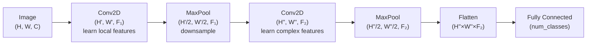

# Convolutional Neural Networks (CNNs)

## Prerequisites

- [Lesson 02: Neurons & Activation Functions](./02-neurons-activation-functions.md) — ReLU, activations
- [Lesson 07: Building NN from Scratch](./07-building-nn-from-scratch.md) — matrix ops, backprop
- Basic NumPy: indexing, broadcasting, stacking

## What You'll Learn



## Why Not Flatten Images?

Traditional neural networks treat images as flat arrays:

```
Image (28×28 pixels) → flatten to 784 numbers → feed to FC layer

Problems:
1. Spatial structure destroyed: pixel (0,0) and pixel (0,1) are adjacent
   but have no special relationship as vector elements 784 apart
2. Parameter explosion: 28×28 input, 1000 hidden units → 784,000 weights
   just in the first layer. For 224×224 color images: 150M weights!
3. No translation invariance: if a dog moves 1 pixel right, all input
   values change → needs to relearn features for every position
```

**Solution**: Convolutional Neural Networks (CNNs)!

---

## The Big Idea: Local Patterns

Images have **local patterns**:
- Edges
- Textures
- Shapes
- Objects

CNNs use **filters** (also called kernels) to detect these patterns.

---

## Convolution Operation

### What is Convolution?

Slide a small filter over the image and compute dot products:

```
Image (5×5):          Filter (3×3):       Output (3×3):
[1 2 3 4 5]           [1 0 -1]
[0 1 2 3 4]           [1 0 -1]            Convolve
[0 0 1 2 3]     *     [1 0 -1]       →    Result
[0 0 0 1 2]
[0 0 0 0 1]
```

### Step-by-Step Example

**Filter (Edge Detector)**:
```
[1  0 -1]
[1  0 -1]
[1  0 -1]
```

**Image Patch**:
```
[50 50 100]
[50 50 100]
[50 50 100]
```

**Computation**:
```
Result = 1×50 + 0×50 + (-1)×100 +
         1×50 + 0×50 + (-1)×100 +
         1×50 + 0×50 + (-1)×100
       = -150
```

Negative value = **vertical edge detected!**

---

## CNN Architecture

```
Input Image
     ↓
Convolution Layer (learn features)
     ↓
Activation (ReLU)
     ↓
Pooling Layer (reduce size)
     ↓
Convolution Layer
     ↓
Activation (ReLU)
     ↓
Pooling Layer
     ↓
Flatten
     ↓
Fully Connected Layers
     ↓
Output (class probabilities)
```

---

## Convolution Layer

### Parameters:
- **Filters**: Number of filters to learn (e.g., 32, 64)
- **Kernel Size**: Size of filter (e.g., 3×3, 5×5)
- **Stride**: How many pixels to move (usually 1)
- **Padding**: Add zeros around borders to control output size

### Example:

```python
import numpy as np

def convolve2d(image, kernel):
    """
    Perform 2D convolution
    
    Args:
        image: (H, W) array
        kernel: (k, k) array
    
    Returns:
        output: Convolved result
    """
    image_height, image_width = image.shape
    kernel_size = kernel.shape[0]
    
    # Output size (no padding, stride=1)
    output_height = image_height - kernel_size + 1
    output_width = image_width - kernel_size + 1
    
    output = np.zeros((output_height, output_width))
    
    # Slide kernel over image
    for i in range(output_height):
        for j in range(output_width):
            # Extract patch
            patch = image[i:i+kernel_size, j:j+kernel_size]
            
            # Element-wise multiply and sum
            output[i, j] = np.sum(patch * kernel)
    
    return output


# Example: Edge detection
image = np.array([
    [0, 0, 0, 200, 200],
    [0, 0, 0, 200, 200],
    [0, 0, 0, 200, 200],
    [0, 0, 0, 200, 200],
    [0, 0, 0, 200, 200]
])

# Vertical edge detector
kernel = np.array([
    [1, 0, -1],
    [1, 0, -1],
    [1, 0, -1]
])

result = convolve2d(image, kernel)
print("Convolution result:")
print(result)
# High values where there's a vertical edge!
```

---

## Common Filters

### 1. Vertical Edge Detector
```
[ 1  0 -1]
[ 1  0 -1]
[ 1  0 -1]
```

### 2. Horizontal Edge Detector
```
[ 1  1  1]
[ 0  0  0]
[-1 -1 -1]
```

### 3. Blur
```
[1/9 1/9 1/9]
[1/9 1/9 1/9]
[1/9 1/9 1/9]
```

### 4. Sharpen
```
[ 0 -1  0]
[-1  5 -1]
[ 0 -1  0]
```

**Key insight**: CNNs **learn** these filters automatically!

---

## Pooling Layers

**Purpose**: Reduce spatial dimensions while keeping important features.

### Max Pooling (Most Common)

Take the maximum value in each region:

```
Input (4×4):          Max Pooling (2×2, stride=2):
[1  3  2  4]
[5  6  7  8]     →    [6  8]
[3  2  1  2]          [3  4]
[1  1  3  4]
```

**Why it works**:
- Preserves strongest activations (features)
- Reduces computation
- Provides translation invariance (shift in input → same output)

### Average Pooling

Take the average instead of max:

```
[1  3  2  4]
[5  6  7  8]     →    [3.75  5.25]
[3  2  1  2]          [1.75  2.50]
[1  1  3  4]
```

---

## Complete CNN Implementation

```python
import numpy as np

class SimpleCNN:
    """Simple CNN for MNIST-like images"""
    
    def __init__(self):
        # Conv layer: 1 input channel, 8 filters, 3×3 kernels
        self.conv1_filters = np.random.randn(8, 3, 3) * 0.1
        self.conv1_bias = np.zeros(8)
        
        # Fully connected layer (after flattening)
        # For 28×28 input: after conv (26×26) and pool (13×13) → 13×13×8 = 1352
        self.fc_weights = np.random.randn(1352, 10) * 0.1
        self.fc_bias = np.zeros(10)
    
    def relu(self, x):
        return np.maximum(0, x)
    
    def softmax(self, x):
        exp_x = np.exp(x - np.max(x, axis=-1, keepdims=True))
        return exp_x / np.sum(exp_x, axis=-1, keepdims=True)
    
    def convolve(self, image, kernel):
        """2D convolution"""
        h, w = image.shape
        k = kernel.shape[0]
        output_h, output_w = h - k + 1, w - k + 1
        output = np.zeros((output_h, output_w))
        
        for i in range(output_h):
            for j in range(output_w):
                output[i, j] = np.sum(image[i:i+k, j:j+k] * kernel)
        
        return output
    
    def max_pool(self, image, pool_size=2):
        """Max pooling"""
        h, w = image.shape
        output_h, output_w = h // pool_size, w // pool_size
        output = np.zeros((output_h, output_w))
        
        for i in range(output_h):
            for j in range(output_w):
                patch = image[i*pool_size:(i+1)*pool_size, 
                            j*pool_size:(j+1)*pool_size]
                output[i, j] = np.max(patch)
        
        return output
    
    def forward(self, x):
        """
        Forward pass
        
        Args:
            x: Input image (28, 28)
        
        Returns:
            probabilities: Class probabilities (10,)
        """
        # Convolution layer
        conv_outputs = []
        for i in range(8):  # 8 filters
            conv = self.convolve(x, self.conv1_filters[i])
            conv = self.relu(conv + self.conv1_bias[i])
            pooled = self.max_pool(conv)
            conv_outputs.append(pooled)
        
        # Stack and flatten
        conv_stack = np.stack(conv_outputs, axis=0)  # (8, 13, 13)
        flattened = conv_stack.flatten()  # (1352,)
        
        # Fully connected layer
        logits = flattened @ self.fc_weights + self.fc_bias
        probabilities = self.softmax(logits)
        
        return probabilities


# Example usage
cnn = SimpleCNN()

# Create dummy image (28×28)
image = np.random.randn(28, 28)

# Forward pass
probs = cnn.forward(image)

print("Output probabilities:")
print(probs)
print(f"Predicted class: {np.argmax(probs)}")
```

---

## Why CNNs Work for Images

### 1. Parameter Sharing

**Traditional NN**: Each weight connects to one pixel  
**CNN**: Same filter applied to entire image

```
Traditional: 28×28×100 = 78,400 parameters (first layer!)
CNN: 3×3×32 = 288 parameters (first layer)

🎉 99% fewer parameters!
```

---

### 2. Translation Invariance

If object moves in image, CNN still detects it:

```
Cat in top-left → Detected ✅
Cat in bottom-right → Detected ✅
```

Same filter slides everywhere!

---

### 3. Hierarchical Learning

```
Layer 1: Edges, colors
Layer 2: Textures, simple shapes
Layer 3: Parts (eyes, wheels, etc.)
Layer 4: Objects (faces, cars, etc.)
```

Each layer builds on previous!

---

## Famous CNN Architectures

### LeNet-5 (1998) - The Pioneer
```
Input (32×32)
 → Conv (6 filters)
 → Pool
 → Conv (16 filters)
 → Pool
 → FC (120)
 → FC (84)
 → Output (10)
```
**Use**: Handwritten digit recognition

---

### AlexNet (2012) - ImageNet Winner
```
Input (224×224×3)
 → Conv (96 filters, 11×11)
 → Pool
 → Conv (256 filters, 5×5)
 → Pool
 → Conv (384 filters, 3×3)
 → Conv (384 filters, 3×3)
 → Conv (256 filters, 3×3)
 → Pool
 → FC (4096)
 → FC (4096)
 → Output (1000 classes)
```
**Breakthrough**: First deep CNN to win ImageNet

---

### VGG-16 (2014) - Deeper is Better
```
16 weight layers
All 3×3 convolutions
Very deep, very accurate
```

---

### ResNet (2015) - Skip Connections
```
Identity shortcuts:
x → Conv → Conv → (+) → Output
└──────────────────┘

Enables 100+ layer networks!
```

---

## Output Dimension Formula

Given input `(H, W)`, kernel `(K, K)`, padding `P`, stride `S`:
```
H_out = floor((H + 2P - K) / S) + 1
W_out = floor((W + 2P - K) / S) + 1

Examples:
  28×28 input, 3×3 kernel, P=0, S=1 → 26×26 output
  28×28 input, 3×3 kernel, P=1, S=1 → 28×28 output (same padding)
  28×28 input, 3×3 kernel, P=0, S=2 → 13×13 output (strided)
```

## Multi-Channel Convolution

Real images have 3 channels (RGB). Conv layers produce multiple feature maps.

```python
import numpy as np


def conv2d_multichannel(
    image:   np.ndarray,   # (C_in, H, W)
    kernels: np.ndarray,   # (C_out, C_in, K, K)
    bias:    np.ndarray,   # (C_out,)
    stride:  int = 1,
    padding: int = 0,
) -> np.ndarray:
    """
    Multi-channel 2D convolution.

    Each output channel = sum of convolutions across all input channels.

    Parameters:
      C_in  = input channels (e.g. 3 for RGB, 32 for hidden feature maps)
      C_out = number of filters (output channels)
      K     = kernel size (square)

    Returns: (C_out, H_out, W_out)
    """
    C_in, H, W = image.shape
    C_out, _, K, _ = kernels.shape

    if padding > 0:
        image = np.pad(image, ((0, 0), (padding, padding), (padding, padding)), mode="constant")

    H_pad, W_pad = image.shape[1], image.shape[2]
    H_out = (H_pad - K) // stride + 1
    W_out = (W_pad - K) // stride + 1

    output = np.zeros((C_out, H_out, W_out))

    for f in range(C_out):           # for each output filter
        for i in range(H_out):
            for j in range(W_out):
                h_start = i * stride
                w_start = j * stride
                patch = image[:, h_start:h_start + K, w_start:w_start + K]   # (C_in, K, K)
                output[f, i, j] = np.sum(patch * kernels[f]) + bias[f]        # scalar

    return output   # (C_out, H_out, W_out)


# Example: 3-channel (RGB) image, 8 filters, 3×3 kernels
np.random.seed(42)
image   = np.random.randn(3, 8, 8)     # (C_in=3, H=8, W=8)
kernels = np.random.randn(8, 3, 3, 3) * 0.1  # (C_out=8, C_in=3, K=3, K=3)
bias    = np.zeros(8)

output = conv2d_multichannel(image, kernels, bias)
print(f"Input:  {image.shape}")    # (3, 8, 8)
print(f"Output: {output.shape}")   # (8, 6, 6)
```

## Parameter Efficiency

```
Traditional FC layer (28×28 input, 1000 hidden):
  Parameters: 784 × 1000 = 784,000

CNN Conv layer (1 input channel, 32 filters, 3×3):
  Parameters: 32 × (3×3×1 + 1) = 320

32 conv filters learn 32 different feature detectors.
Each filter is applied to EVERY location → parameter sharing.
CNN uses 2,450× fewer parameters in the first layer!
```

## Receptive Field

The **receptive field** is how large an area of the input influences one output neuron.

```
Layer 1: 3×3 conv → each output sees 3×3 input pixels
Layer 2: 3×3 conv → each output sees 5×5 input pixels (3 + 2 from prev)
Layer 3: 3×3 conv → each output sees 7×7 input pixels

Formula: RF_L = 1 + L × (K - 1)   for stride-1, K×K convolutions

With max-pooling (stride 2):
After pool: effective stride doubles, RF grows faster
```

## PyTorch CNN for MNIST

```python
import torch
import torch.nn as nn
import torch.nn.functional as F
from torch.utils.data import DataLoader
from torchvision import datasets, transforms


class MNISTNet(nn.Module):
    """
    CNN for MNIST (28×28 grayscale, 10 classes).

    Architecture:
      (B, 1, 28, 28)
      → Conv1: (B, 32, 26, 26)   [3×3 kernel, no padding]
      → Pool1: (B, 32, 13, 13)   [2×2 max pool]
      → Conv2: (B, 64, 11, 11)   [3×3 kernel, no padding]
      → Pool2: (B, 64, 5, 5)     [2×2 max pool]
      → Flatten: (B, 1600)
      → FC1:   (B, 128)
      → FC2:   (B, 10)
    """

    def __init__(self, dropout: float = 0.3):
        super().__init__()

        # Convolutional blocks
        self.conv1 = nn.Conv2d(in_channels=1, out_channels=32, kernel_size=3, bias=False)
        self.bn1   = nn.BatchNorm2d(32)
        self.conv2 = nn.Conv2d(in_channels=32, out_channels=64, kernel_size=3, bias=False)
        self.bn2   = nn.BatchNorm2d(64)

        # Pooling
        self.pool = nn.MaxPool2d(kernel_size=2)

        # Fully connected
        self.fc1     = nn.Linear(64 * 5 * 5, 128)
        self.dropout = nn.Dropout(dropout)
        self.fc2     = nn.Linear(128, 10)

    def forward(self, x: torch.Tensor) -> torch.Tensor:
        # Block 1
        x = self.pool(F.relu(self.bn1(self.conv1(x))))  # (B, 32, 13, 13)

        # Block 2
        x = self.pool(F.relu(self.bn2(self.conv2(x))))  # (B, 64, 5, 5)

        # Classifier
        x = x.flatten(start_dim=1)     # (B, 1600)
        x = F.relu(self.fc1(x))        # (B, 128)
        x = self.dropout(x)
        x = self.fc2(x)                # (B, 10) — logits

        return x


def train_cnn(epochs: int = 5, batch_size: int = 128, lr: float = 1e-3) -> None:
    """Full training pipeline for MNIST CNN."""
    device = torch.device("cuda" if torch.cuda.is_available() else "cpu")

    # Dataset
    transform = transforms.Compose([
        transforms.ToTensor(),
        transforms.Normalize((0.1307,), (0.3081,)),   # MNIST mean, std
    ])
    train_data = datasets.MNIST(root="./data", train=True,  download=True, transform=transform)
    val_data   = datasets.MNIST(root="./data", train=False, download=True, transform=transform)

    train_loader = DataLoader(train_data, batch_size=batch_size, shuffle=True)
    val_loader   = DataLoader(val_data,   batch_size=batch_size)

    # Model
    model = MNISTNet().to(device)
    optimizer = torch.optim.Adam(model.parameters(), lr=lr, weight_decay=1e-4)
    scheduler = torch.optim.lr_scheduler.StepLR(optimizer, step_size=3, gamma=0.5)

    # Training loop
    for epoch in range(1, epochs + 1):
        model.train()
        total_loss, correct = 0.0, 0

        for x, y in train_loader:
            x, y = x.to(device), y.to(device)
            optimizer.zero_grad()
            logits = model(x)
            loss = F.cross_entropy(logits, y)
            loss.backward()
            optimizer.step()

            total_loss += loss.item() * len(x)
            correct    += (logits.argmax(dim=1) == y).sum().item()

        train_acc = correct / len(train_data)

        # Validation
        model.eval()
        val_correct = 0
        with torch.no_grad():
            for x, y in val_loader:
                x, y = x.to(device), y.to(device)
                val_correct += (model(x).argmax(dim=1) == y).sum().item()
        val_acc = val_correct / len(val_data)

        scheduler.step()
        print(f"Epoch {epoch}/{epochs}: train_acc={train_acc:.4f}, val_acc={val_acc:.4f}")


# Expected output after 5 epochs:
# Epoch 1/5: train_acc=0.9823, val_acc=0.9891
# Epoch 5/5: train_acc=0.9968, val_acc=0.9921
```

## Famous CNN Architectures Timeline

| Year | Architecture | Key Innovation | ImageNet Top-5 Error |
|------|-------------|----------------|---------------------|
| 1998 | LeNet-5 | First successful CNN | — |
| 2012 | AlexNet | Deep CNN, GPU training | 16.4% |
| 2014 | VGG-16 | Deep 3×3 convolutions | 7.3% |
| 2015 | ResNet-50 | Skip connections | 5.25% |
| 2017 | DenseNet | Dense connections | 5.29% |
| 2019 | EfficientNet | Neural architecture search | 2.9% |
| 2021 | ViT | Vision Transformer | 2.0% (post-finetuning) |

```
ResNet skip connection:
  Input (x)
     │
     ├──────────────────┐
     │                  │
     ↓                  │
  Conv → BN → ReLU      │
     ↓                  │
  Conv → BN             │
     ↓                  │
     (+)  ←─────────────┘
     ↓
    ReLU

The identity shortcut allows gradient to flow directly,
solving the vanishing gradient problem in very deep networks.
```

## Edge Cases & Misconceptions

!!! warning "Misconception: Larger kernels are always better"
    Large kernels (11×11 in AlexNet's first layer) were used early when GPU memory was limited. Modern networks use stacked 3×3 kernels: two 3×3 convolutions have a 5×5 receptive field but only `2×(9×C_in×C_out)` parameters vs one 5×5's `25×C_in×C_out`. Smaller stacked kernels have more non-linearities (ReLU between them) and fewer parameters.

!!! note "Same vs valid padding"
    - `padding=0` ("valid"): output is smaller than input (H_out = H - K + 1)
    - `padding=K//2` ("same"): output has same spatial dimensions as input
    Use "same" to preserve spatial resolution in early layers; use "valid" to reduce computation.

!!! warning "Misconception: CNNs can only process fixed-size images"
    Fully convolutional networks (FCN) remove all FC layers, replacing them with 1×1 convolutions. This makes the architecture input-size agnostic — the same model can process images of any size. Used in semantic segmentation (DeepLab, U-Net).

## Production Connection

**Transfer learning**: Pre-trained CNN weights (ResNet-50 trained on ImageNet) encode generic visual features (edges, textures, shapes). Fine-tuning these for domain-specific tasks (medical images, satellite images) requires far less data than training from scratch — typically converging in minutes on a small dataset vs days from scratch.

```python
import torchvision.models as models

# Load pre-trained ResNet-50
backbone = models.resnet50(weights=models.ResNet50_Weights.DEFAULT)

# Freeze all layers except the final classifier
for param in backbone.parameters():
    param.requires_grad = False

# Replace final layer for your number of classes
backbone.fc = nn.Linear(backbone.fc.in_features, num_classes)
# Only backbone.fc is trained — all other weights are frozen
```

## Key Takeaways

1. **Convolution** slides a kernel over an image, computing dot products to detect local patterns. Output size: `floor((H + 2P - K) / S) + 1`.
2. **Parameter sharing**: one filter is applied at all spatial locations — CNNs use orders of magnitude fewer parameters than equivalent FC layers.
3. **Translation invariance**: max pooling + parameter sharing make CNNs robust to spatial shifts.
4. **Hierarchical features**: early layers detect edges, later layers detect complex object parts and full objects.
5. **Receptive field** grows with depth — deep networks "see" larger image regions per output neuron.
6. **Transfer learning** with pre-trained ImageNet weights is the standard starting point for any CV task — don't train from scratch.

## Further Reading

- [CS231n: Convolutional Neural Networks](https://cs231n.github.io/convolutional-networks/) — Stanford notes
- [CNN Explainer](https://poloclub.github.io/cnn-explainer/) — interactive visualization
- [Understanding CNNs](https://colah.github.io/posts/2014-07-Understanding-Convolutions/) — Chris Olah's blog
- [EfficientNet paper](https://arxiv.org/abs/1905.11946) — compound scaling for CNNs

## 🚀 Next Lesson

**[Lesson 9: RNNs and LSTMs](./09-rnns-lstms.md)** — how recurrent networks process sequences with memory, the vanishing gradient problem, and how LSTMs solve it.
