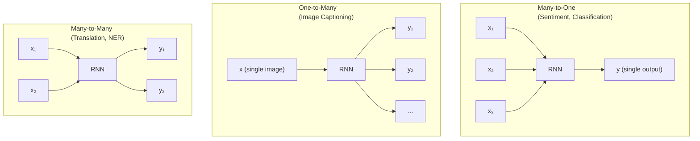

# Recurrent Neural Networks & LSTMs

## Prerequisites

- [Lesson 05: Backpropagation](./05-backpropagation.md) — chain rule, gradient flow
- [Lesson 02: Neurons & Activation Functions](./02-neurons-activation-functions.md) — tanh, sigmoid

## What You'll Learn

| Concept | Why it matters |
|---------|---------------|
| RNN hidden state | How the network carries information across timesteps |
| BPTT (Backpropagation Through Time) | Why gradients vanish in long sequences |
| LSTM gates | Forget, Input, Output gates and the cell state highway |
| GRU | Simplified LSTM with 2 gates instead of 3 |
| When to use RNNs | Time-series, audio, streaming — where Transformers don't fit |

---

## Intuition: Sequences Need Memory

Standard feed-forward networks process each input independently:

```
x₁ → NN → y₁     (x₁ has no effect on how x₂ is processed)
x₂ → NN → y₂
x₃ → NN → y₃
```

But language, audio, and time-series are different: context matters.

```
"The bank on the river bank" — "bank" has different meanings depending on context
"Yesterday 10°C, today ___" — prediction requires knowing yesterday's value
```

**Key idea**: a recurrent network maintains a **hidden state** `h_t` that summarizes the entire history seen so far and passes it to the next timestep.

---

## The Vanilla RNN

### Mathematical Formulation

At each timestep `t`, given:
- Input `x_t ∈ ℝ^{d_in}`
- Previous hidden state `h_{t-1} ∈ ℝ^{d_h}`

The RNN update:

```
h_t = tanh(W_h · h_{t-1} + W_x · x_t + b_h)

y_t = W_y · h_t + b_y
```

Where:
- `W_h ∈ ℝ^{d_h × d_h}` — hidden-to-hidden transition
- `W_x ∈ ℝ^{d_h × d_in}` — input-to-hidden projection
- `W_y ∈ ℝ^{d_out × d_h}` — hidden-to-output projection

The same weights `W_h, W_x` are **shared across all timesteps** — this is what makes RNNs parameter-efficient.

```python
import numpy as np


class VanillaRNN:
    """
    Single-layer vanilla RNN.

    Architecture: h_t = tanh(W_h @ h_{t-1} + W_x @ x_t + b_h)
    """

    def __init__(
        self,
        input_size:  int,
        hidden_size: int,
        output_size: int,
        seed: int = 42,
    ):
        rng = np.random.RandomState(seed)

        # Initialize with small random weights
        scale_h = np.sqrt(1.0 / hidden_size)
        scale_x = np.sqrt(2.0 / input_size)

        self.W_h = rng.randn(hidden_size, hidden_size) * scale_h  # (d_h, d_h)
        self.W_x = rng.randn(hidden_size, input_size)  * scale_x  # (d_h, d_in)
        self.W_y = rng.randn(output_size, hidden_size) * scale_h  # (d_out, d_h)

        self.b_h = np.zeros(hidden_size)   # (d_h,)
        self.b_y = np.zeros(output_size)   # (d_out,)

        self.hidden_size  = hidden_size

    def forward(
        self,
        X: np.ndarray,          # (T, d_in) — sequence of T inputs
        h0: np.ndarray = None,  # (d_h,) — initial hidden state
    ) -> tuple[np.ndarray, np.ndarray]:
        """
        Full forward pass over a sequence.

        Returns
        -------
        outputs : (T, d_out)  — output at each timestep
        hiddens : (T, d_h)   — hidden state at each timestep
        """
        T, d_in = X.shape

        if h0 is None:
            h0 = np.zeros(self.hidden_size)

        hiddens = np.zeros((T, self.hidden_size))  # (T, d_h)
        outputs = np.zeros((T, self.W_y.shape[0])) # (T, d_out)

        h = h0.copy()

        for t in range(T):
            # h_t = tanh(W_h @ h_{t-1} + W_x @ x_t + b_h)
            h = np.tanh(self.W_h @ h + self.W_x @ X[t] + self.b_h)  # (d_h,)

            # y_t = W_y @ h_t + b_y
            y = self.W_y @ h + self.b_y  # (d_out,)

            hiddens[t] = h
            outputs[t] = y

        return outputs, hiddens


# Test
rnn = VanillaRNN(input_size=5, hidden_size=16, output_size=3)

T = 10
X = np.random.randn(T, 5)     # sequence of T=10 input vectors

outputs, hiddens = rnn.forward(X)

print(f"Input:   {X.shape}")        # (10, 5)
print(f"Outputs: {outputs.shape}")  # (10, 3)
print(f"Hiddens: {hiddens.shape}")  # (10, 16)
```

---

## Backpropagation Through Time (BPTT)

To train the RNN, we need gradients of the loss with respect to the shared weights. The gradient of `W_h` involves multiplying Jacobians across timesteps:

```
∂L/∂W_h = Σ_t ∂L_t/∂W_h

For L_t (loss at time t), chain rule across timesteps:
∂L_t/∂h_k = ∂L_t/∂h_t × ∏_{j=k+1}^{t} ∂h_j/∂h_{j-1}

where ∂h_j/∂h_{j-1} = diag(1 - h_j²) × W_h
                                ↑tanh'     ↑shared weight
```

**The vanishing gradient problem**: if `T-k = 50` timesteps:

```python
def analyze_gradient_flow(
    W_h:      np.ndarray,   # (d_h, d_h) — hidden transition weights
    T:        int = 50,
    h_sample: np.ndarray = None,
) -> np.ndarray:
    """
    Simulate gradient magnitude through T timesteps.

    Each step multiplies by: diag(1 - h²) @ W_h
    tanh derivative: 0 ≤ 1 - tanh²(x) ≤ 1

    If saturated (h ≈ ±1): tanh'(x) ≈ 0 → gradient vanishes
    If centered   (h ≈ 0):  tanh'(x) ≈ 1 → better, but still decays
    """
    d_h = W_h.shape[0]

    if h_sample is None:
        h_sample = np.random.randn(d_h) * 0.5  # typical hidden state

    grad_magnitudes = [1.0]

    # Compute spectral radius of Jacobian ∂h_t/∂h_{t-1}
    # (approximate: use singular values of W_h)
    spectral_radius = np.linalg.norm(W_h, ord=2)

    for t in range(1, T + 1):
        # tanh' ≤ 1, so overall Jacobian norm ≤ spectral_radius
        # After t steps: norm ≤ spectral_radius^t
        approx_grad = spectral_radius ** t
        grad_magnitudes.append(approx_grad)

    return np.array(grad_magnitudes)


# Demonstrate vanishing vs exploding
import numpy as np

d_h = 16
T   = 50

# Small W_h: spectral radius < 1 → vanishing
W_small = np.random.randn(d_h, d_h) * 0.1
grads_vanish = analyze_gradient_flow(W_small, T)

# Large W_h: spectral radius > 1 → exploding
W_large = np.random.randn(d_h, d_h) * 0.5
grads_explode = analyze_gradient_flow(W_large, T)

print(f"Vanishing: gradient at T=50: {grads_vanish[-1]:.2e}")
print(f"Exploding: gradient at T=50: {grads_explode[-1]:.2e}")
# Vanishing: ~1e-50 (effectively zero — no learning signal)
# Exploding: ~1e+35 (numerical overflow)
```

This analysis shows why vanilla RNNs cannot learn dependencies longer than ~10–20 steps.

---

## LSTM: Long Short-Term Memory

LSTMs (Hochreiter & Schmidhuber, 1997) solve the vanishing gradient problem via an explicit **cell state** `c_t` and three learned gates.

### The Cell State Highway

The key innovation: `c_t` flows through the network with only **additive** updates. Additive paths don't multiply gradients — they add them, preventing vanishing:

```
c_t = f_t ⊙ c_{t-1}  +  i_t ⊙ ĉ_t
       ↑ forget gate       ↑ input gate
```

This is a constant error carousel: gradients for `c_t` backpropagate directly to `c_{t-k}` without multiplication by the recurrent weights.

### The Four LSTM Equations

```
f_t = σ(W_f · [h_{t-1}, x_t] + b_f)     # forget gate: what to forget from c
i_t = σ(W_i · [h_{t-1}, x_t] + b_i)     # input gate: what new info to write
ĉ_t = tanh(W_c · [h_{t-1}, x_t] + b_c)  # candidate cell update
o_t = σ(W_o · [h_{t-1}, x_t] + b_o)     # output gate: what to read from c

c_t = f_t ⊙ c_{t-1} + i_t ⊙ ĉ_t        # update cell state
h_t = o_t ⊙ tanh(c_t)                    # compute hidden state
```

```python
class LSTMCell:
    """
    Single LSTM cell.

    State:
    - c_t: cell state (long-term memory)  shape: (d_h,)
    - h_t: hidden state (short-term)      shape: (d_h,)

    The 4 weight matrices are often concatenated for GPU efficiency.
    """

    def __init__(self, input_size: int, hidden_size: int, seed: int = 42):
        rng = np.random.RandomState(seed)
        self.hidden_size = hidden_size

        # Combined weight matrix: [W_f; W_i; W_c; W_o]
        # Each is (hidden_size, input_size + hidden_size)
        in_total = input_size + hidden_size
        scale = np.sqrt(2.0 / in_total)

        # Stacked: (4 * hidden_size, input_size + hidden_size)
        self.W = rng.randn(4 * hidden_size, in_total) * scale
        self.b = np.zeros(4 * hidden_size)

        # Bias forget gate to 1 initially (helps long-term memory at start)
        self.b[hidden_size:2 * hidden_size] = 1.0

    @staticmethod
    def sigmoid(x: np.ndarray) -> np.ndarray:
        return 1.0 / (1.0 + np.exp(-np.clip(x, -500, 500)))

    def step(
        self,
        x_t:    np.ndarray,   # (d_in,) — input at current timestep
        h_prev: np.ndarray,   # (d_h,) — previous hidden state
        c_prev: np.ndarray,   # (d_h,) — previous cell state
    ) -> tuple[np.ndarray, np.ndarray]:
        """
        One LSTM timestep.

        Returns (h_t, c_t) — both shape (d_h,)
        """
        d_h = self.hidden_size

        # Concatenate h and x: (d_h + d_in,)
        combined = np.concatenate([h_prev, x_t])

        # All gates at once: (4*d_h,)
        gates = self.W @ combined + self.b

        # Split into 4 gate activations
        f_t  = self.sigmoid(gates[0*d_h : 1*d_h])   # forget: (d_h,)
        i_t  = self.sigmoid(gates[1*d_h : 2*d_h])   # input:  (d_h,)
        c_hat= np.tanh(    gates[2*d_h : 3*d_h])    # candidate: (d_h,)
        o_t  = self.sigmoid(gates[3*d_h : 4*d_h])   # output: (d_h,)

        # Cell state update
        c_t = f_t * c_prev + i_t * c_hat   # (d_h,) — additive update (no vanishing)

        # Hidden state
        h_t = o_t * np.tanh(c_t)           # (d_h,)

        return h_t, c_t


class LSTM:
    """Full LSTM over a sequence."""

    def __init__(self, input_size: int, hidden_size: int, output_size: int):
        self.cell = LSTMCell(input_size, hidden_size)
        self.W_y  = np.random.randn(output_size, hidden_size) * 0.01  # (d_out, d_h)
        self.b_y  = np.zeros(output_size)
        self.hidden_size = hidden_size

    def forward(
        self,
        X: np.ndarray,   # (T, d_in)
    ) -> tuple[np.ndarray, np.ndarray, np.ndarray]:
        """
        Returns
        -------
        outputs : (T, d_out)
        hiddens : (T, d_h)
        cells   : (T, d_h)
        """
        T, d_in = X.shape

        h = np.zeros(self.hidden_size)
        c = np.zeros(self.hidden_size)

        outputs = np.zeros((T, self.W_y.shape[0]))
        hiddens = np.zeros((T, self.hidden_size))
        cells   = np.zeros((T, self.hidden_size))

        for t in range(T):
            h, c = self.cell.step(X[t], h, c)
            outputs[t] = self.W_y @ h + self.b_y
            hiddens[t] = h
            cells[t]   = c

        return outputs, hiddens, cells


# Test
lstm = LSTM(input_size=10, hidden_size=32, output_size=5)

T = 20
X = np.random.randn(T, 10)  # (T, d_in)

outputs, hiddens, cells = lstm.forward(X)

print(f"Outputs: {outputs.shape}")  # (20, 5)
print(f"Hiddens: {hiddens.shape}")  # (20, 32)
print(f"Cells:   {cells.shape}")    # (20, 32)

# Verify gates are bounded: f,i,o ∈ [0,1], c can be arbitrary
print(f"Cell state range: [{cells.min():.2f}, {cells.max():.2f}]")
```

---

## GRU: Gated Recurrent Unit

GRU (Cho et al., 2014) simplifies LSTM from 3 gates to 2 by merging the forget and input gates:

```
z_t = σ(W_z · [h_{t-1}, x_t] + b_z)       # update gate (replaces forget+input)
r_t = σ(W_r · [h_{t-1}, x_t] + b_r)       # reset gate

h̃_t = tanh(W · [r_t ⊙ h_{t-1}, x_t] + b) # candidate hidden
h_t = (1 - z_t) ⊙ h_{t-1} + z_t ⊙ h̃_t   # update
```

```python
class GRUCell:
    """
    GRU: merges forget and input gates into update gate z.

    Fewer parameters than LSTM: 3 weight matrices instead of 4.
    No separate cell state — hidden state serves both roles.
    """

    def __init__(self, input_size: int, hidden_size: int):
        in_total = input_size + hidden_size
        scale    = np.sqrt(2.0 / in_total)

        # Update and reset gate weights (both input+hidden combined)
        self.W_z = np.random.randn(hidden_size, in_total) * scale  # (d_h, d_in+d_h)
        self.W_r = np.random.randn(hidden_size, in_total) * scale  # (d_h, d_in+d_h)
        # Candidate hidden (gated by reset)
        self.W_h = np.random.randn(hidden_size, in_total) * scale  # (d_h, d_in+d_h)

        self.b_z = np.zeros(hidden_size)
        self.b_r = np.zeros(hidden_size)
        self.b_h = np.zeros(hidden_size)

        self.hidden_size = hidden_size

    def step(self, x_t: np.ndarray, h_prev: np.ndarray) -> np.ndarray:
        """
        x_t:    (d_in,)
        h_prev: (d_h,)
        returns: h_t (d_h,)
        """
        combined = np.concatenate([h_prev, x_t])   # (d_in + d_h,)

        z_t = 1.0 / (1.0 + np.exp(-(self.W_z @ combined + self.b_z)))  # update gate
        r_t = 1.0 / (1.0 + np.exp(-(self.W_r @ combined + self.b_r)))  # reset gate

        # Reset gate controls how much past to use for candidate
        gated_combined = np.concatenate([r_t * h_prev, x_t])
        h_hat = np.tanh(self.W_h @ gated_combined + self.b_h)          # candidate

        # Interpolate: z=0 → keep old h, z=1 → full update
        h_t = (1 - z_t) * h_prev + z_t * h_hat

        return h_t


# GRU has 25% fewer parameters than LSTM
d_in, d_h = 10, 32
lstm_params = 4 * d_h * (d_in + d_h) + 4 * d_h   # 4 gates
gru_params  = 3 * d_h * (d_in + d_h) + 3 * d_h   # 3 gates

print(f"LSTM parameters: {lstm_params:,}")
print(f"GRU parameters:  {gru_params:,}")
print(f"GRU reduction:   {(1 - gru_params/lstm_params):.1%}")
```

---

## RNN Topology Patterns



---

## RNN vs LSTM vs GRU vs Transformer

| | Vanilla RNN | LSTM | GRU | Transformer |
|---|---|---|---|---|
| Long-range deps | Poor | Good | Good | Excellent |
| Parallelizable | No (sequential) | No | No | Yes |
| Parameters | Fewest | Most | Medium | Most |
| Training speed | Moderate | Slow | Medium | Fast (GPU) |
| Memory | O(d_h) | O(d_h) | O(d_h) | O(T²) |
| Streaming | Yes | Yes | Yes | No |
| Best for | Short sequences | Long sequences | Middle ground | Most NLP |

---

## Edge Cases & Misconceptions

!!! warning "Misconception: LSTM fully solves vanishing gradient"
    LSTM is much better than vanilla RNN, but still suffers for very long sequences (T > 1000). The forget gate can still be near 0, erasing information. Transformers with attention solve this more completely but require O(T²) memory.

!!! note "Bias the forget gate to 1"
    Initialize the forget gate bias to 1 (not 0). At initialization, the network should default to "remember everything" and learn what to forget. Zero bias means the model starts forgetting everything, which makes learning harder.

!!! warning "Misconception: GRU is always better than LSTM"
    GRU trains faster and uses fewer parameters. But LSTM has a separate cell state that provides richer long-term memory. For tasks with very long-range dependencies (e.g., document-level tasks), LSTM often wins. For shorter sequences, GRU often matches LSTM quality.

---

## Production Connection

**Time-series forecasting**: RNNs/LSTMs are still the dominant architecture for streaming time-series (sensor data, financial tick data). They process one element at a time, making them suitable for online learning where new data arrives continuously.

**When to use RNNs over Transformers**:
- Fixed-latency streaming: can't wait for full sequence (speech recognition on a phone)
- Very long sequences (T > 10K): Transformer memory O(T²) makes it infeasible without sparse attention
- Resource-constrained: LSTM at d_h=256 runs on microcontrollers; Transformers don't

**PyTorch built-in**: `torch.nn.LSTM` and `torch.nn.GRU` implement efficient CUDA kernels that are 10–100× faster than the NumPy version:

```python
import torch
import torch.nn as nn

lstm = nn.LSTM(
    input_size=10,
    hidden_size=32,
    num_layers=2,
    batch_first=True,  # input shape: (B, T, d_in) instead of (T, B, d_in)
    dropout=0.1,
    bidirectional=True,  # 2× parameters, processes forward + backward
)

X = torch.randn(4, 20, 10)  # (B, T, d_in)

output, (h_n, c_n) = lstm(X)
# output: (B, T, 2*d_h) — bidirectional concatenated at each step
# h_n:   (2*num_layers, B, d_h) — final hidden state per layer
# c_n:   (2*num_layers, B, d_h) — final cell state per layer
print(f"Output: {output.shape}")   # (4, 20, 64)
print(f"h_n:    {h_n.shape}")      # (4, 4, 32)
```

---

## Key Takeaways

1. **Vanilla RNNs** maintain a hidden state `h_t = tanh(W_h h_{t-1} + W_x x_t)` shared across timesteps, but gradients vanish over long sequences due to repeated multiplication by `tanh'(x) < 1`.
2. **LSTMs** use a cell state `c_t` updated additively (`c_t = f_t ⊙ c_{t-1} + i_t ⊙ ĉ_t`), creating a constant-error carousel that allows gradients to flow without vanishing.
3. **Forget gate bias at 1**: initialize LSTM forget gate bias to 1 to default to "remember" rather than "forget" at training start.
4. **GRU** is a simplified LSTM with 2 gates (update + reset) instead of 3 — 25% fewer parameters, similar performance on most tasks.
5. **Transformers replaced RNNs** for most NLP tasks after 2017 due to parallelism. But RNNs remain important for streaming, real-time, and very-long-sequence scenarios.

---

## Further Reading

- [Understanding LSTM Networks](https://colah.github.io/posts/2015-08-Understanding-LSTMs/) — Chris Olah's canonical visual explanation
- [The Unreasonable Effectiveness of RNNs](https://karpathy.github.io/2015/05/21/rnn-effectiveness/) — Andrej Karpathy's classic blog post
- [Hochreiter & Schmidhuber 1997](https://www.bioinf.jku.at/publications/older/2604.pdf) — original LSTM paper
- [GRU paper](https://arxiv.org/abs/1406.1078) — Cho et al. 2014

---

## Next Lesson

**[Lesson 10: Training Best Practices](./10-training-best-practices.md)** — learning rate schedules, weight initialization, gradient clipping, and the full debugging toolkit for production training.
