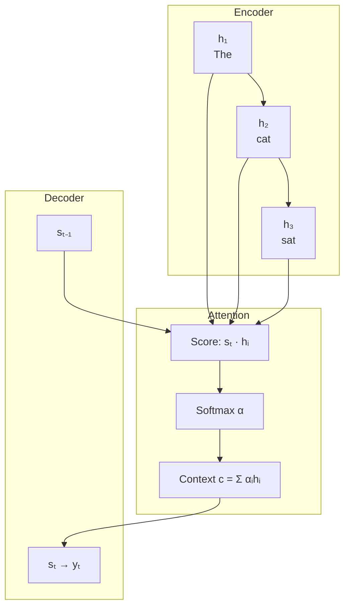
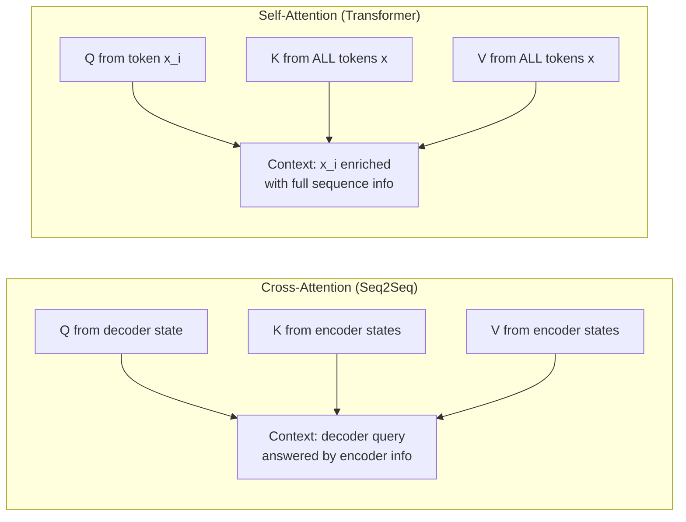

# Introduction to Attention Mechanisms

## Prerequisites

- [Module 05 L09: RNNs & LSTMs](../../module-05-neural-networks-deep-learning-fundamentals/lessons/09-rnns-lstms.md) — hidden states, backpropagation through time
- [Module 05 L03: Loss Functions](../../module-05-neural-networks-deep-learning-fundamentals/lessons/03-loss-functions.md) — cross-entropy, softmax

## What You'll Learn

| Concept | What it means in practice |
|---------|---------------------------|
| Information bottleneck | Why fixed-size context vectors fail at 50+ tokens |
| Attention weights | How the model votes on which tokens matter |
| QKV abstraction | Separating *what I seek* from *what I have* |
| Attention variants | When to use Bahdanau vs Luong vs scaled dot-product |

---

## Intuition First: The Bottleneck Problem

Imagine you are a professional translator handed a document written in Japanese. There is a rule: you must read the entire document once, memorize it as a *single* dense paragraph of notes, throw the original away, and then translate from your notes.

That is what sequence-to-sequence RNNs did before 2015.

```
Japanese doc (300 words)
        ↓
     RNN encoder
        ↓
Single hidden state vector (512 floats)  ←── information bottleneck
        ↓
     RNN decoder
        ↓
 English translation
```

The **encoder compresses everything** into one fixed-size vector. The decoder must reconstruct the entire output from that vector alone. For short sentences this works. For longer text the early words are overwritten by later ones — the network literally forgets.

**Empirical evidence**: Bahdanau et al. (2015) showed BLEU score for 30-word sentences was reasonable but dropped sharply for 50+ word sentences. The bottleneck was measurable.

The fix? Let the decoder **look back at every encoder hidden state**, not just the last one. That is attention.

---

## The Core Idea: Soft Database Lookup

Think of attention as a **soft, differentiable dictionary lookup**.

A hard dictionary lookup:

```python
d = {"name": "Alice", "age": 30}
d["age"]  # returns exactly 30
```

A soft dictionary lookup:

```
query = "how old?"
keys   = ["name", "age", "city"]
values = [alice_vec, thirty_vec, ny_vec]

similarity("how old?", "name") = 0.05
similarity("how old?", "age")  = 0.90
similarity("how old?", "city") = 0.05

output = 0.05 × alice_vec + 0.90 × thirty_vec + 0.05 × ny_vec
```

The result is a **weighted mixture** of values, differentiable end-to-end. Gradients flow through the weights back into the keys and queries, so the model learns what to look for and what to advertise.

---

## How Attention Works: Step by Step

Given:
- **Query** `q`: what the current decoder state is asking for
- **Keys** `K`: what each encoder position offers
- **Values** `V`: the information actually carried at each encoder position

The computation has three steps:

### Step 1 — Compute similarity scores

```
e_i = score(q, k_i)
```

Different attention variants use different score functions (covered below).

### Step 2 — Normalize to weights

```
α_i = exp(e_i) / Σ_j exp(e_j)   (softmax)
```

All `α_i` sum to 1. They are the *attention distribution* — a probability over input positions.

### Step 3 — Compute context vector

```
c = Σ_i α_i · v_i
```

The context vector `c` is the weighted sum of values. It flows into the decoder to produce the next output token.

---

## The Math: Formal Derivation

Let the encoder produce hidden states `h_1, ..., h_T` (each ∈ ℝ^d). The decoder has hidden state `s_t` at time step t.

**Bahdanau (additive) attention**:

```
e_{t,i} = v^T · tanh(W_1 · s_{t-1} + W_2 · h_i)

α_{t,i} = softmax(e_{t,i})  over i = 1..T

c_t = Σ_i α_{t,i} · h_i
```

Learnable parameters: `W_1 ∈ ℝ^{d_a×d}`, `W_2 ∈ ℝ^{d_a×d}`, `v ∈ ℝ^{d_a}`.

**Luong (multiplicative) attention**:

```
e_{t,i} = s_t^T · h_i        (dot product)
     or  = s_t^T · W · h_i   (general)
```

**Scaled dot-product attention** (Transformers — next lesson):

```
Attention(Q, K, V) = softmax(Q K^T / √d_k) · V
```

The `√d_k` scaling prevents softmax from entering regions with near-zero gradients when `d_k` is large.

!!! note "Why scale by √d_k?"
    If `q` and `k` are both unit vectors with independent components of variance 1, then `q·k` has variance `d_k`. Large dot products push softmax into saturation (gradients ≈ 0). Dividing by `√d_k` keeps variance ≈ 1, which keeps gradients healthy.

---

## Worked Example: 4-Word Sentence

Sentence: **"The cat sat on"**

Suppose the encoder produces hidden states (simplified to 2D for legibility):

```
h_1 ("The") = [0.1, 0.2]
h_2 ("cat") = [0.9, 0.8]
h_3 ("sat") = [0.5, 0.4]
h_4 ("on")  = [0.2, 0.9]
```

Decoder state `s = [0.8, 0.7]` (currently generating a word meaning "feline").

**Step 1 — dot-product scores**:

```
e_1 = s · h_1 = 0.8×0.1 + 0.7×0.2 = 0.08 + 0.14 = 0.22
e_2 = s · h_2 = 0.8×0.9 + 0.7×0.8 = 0.72 + 0.56 = 1.28  ← highest
e_3 = s · h_3 = 0.8×0.5 + 0.7×0.4 = 0.40 + 0.28 = 0.68
e_4 = s · h_4 = 0.8×0.2 + 0.7×0.9 = 0.16 + 0.63 = 0.79
```

**Step 2 — softmax**:

```
exp([0.22, 1.28, 0.68, 0.79]) = [1.25, 3.60, 1.97, 2.20]
sum = 9.02

α = [0.14, 0.40, 0.22, 0.24]
```

The model focuses most on "cat" (α=0.40) — exactly right for generating a word about a feline.

**Step 3 — context vector**:

```
c = 0.14×[0.1,0.2] + 0.40×[0.9,0.8] + 0.22×[0.5,0.4] + 0.24×[0.2,0.9]
  = [0.014, 0.028] + [0.360, 0.320] + [0.110, 0.088] + [0.048, 0.216]
  = [0.532, 0.652]
```

---

## Implementation: Attention in NumPy

```python
import numpy as np

def softmax(x: np.ndarray) -> np.ndarray:
    """Numerically stable softmax along last axis."""
    x = x - x.max(axis=-1, keepdims=True)
    exp_x = np.exp(x)
    return exp_x / exp_x.sum(axis=-1, keepdims=True)


def dot_product_attention(
    query: np.ndarray,   # (d,)
    keys: np.ndarray,    # (T, d)
    values: np.ndarray,  # (T, d_v)
) -> tuple[np.ndarray, np.ndarray]:
    """
    Single-query scaled dot-product attention.

    Returns
    -------
    context : (d_v,)  — weighted combination of values
    weights : (T,)    — attention distribution (sums to 1)
    """
    d_k = query.shape[-1]
    scores = (keys @ query) / np.sqrt(d_k)   # (T,)
    weights = softmax(scores)                  # (T,)
    context = weights @ values                 # (d_v,)
    return context, weights


# ── Worked example ──────────────────────────────────────────────────────────
np.random.seed(42)
T, d_k, d_v = 6, 8, 8

query  = np.random.randn(d_k)          # current decoder state
keys   = np.random.randn(T, d_k)       # encoder positions
values = np.random.randn(T, d_v)       # encoder information

context, weights = dot_product_attention(query, keys, values)

print("Attention weights (sum=1):", weights.round(3))
print("Weights sum:", weights.sum().round(6))
print("Context shape:", context.shape)
```

### Batched version (production-ready)

```python
def batched_attention(
    queries: np.ndarray,  # (B, T_q, d_k)
    keys:    np.ndarray,  # (B, T_k, d_k)
    values:  np.ndarray,  # (B, T_k, d_v)
    mask:    np.ndarray | None = None,  # (B, T_q, T_k) bool, True=mask out
) -> tuple[np.ndarray, np.ndarray]:
    """
    Scaled dot-product attention, batched.

    Returns
    -------
    output  : (B, T_q, d_v)
    weights : (B, T_q, T_k)
    """
    d_k = queries.shape[-1]
    # (B, T_q, d_k) × (B, d_k, T_k) → (B, T_q, T_k)
    scores = queries @ keys.transpose(0, 2, 1) / np.sqrt(d_k)

    if mask is not None:
        scores = np.where(mask, -1e9, scores)

    weights = softmax(scores)                   # (B, T_q, T_k)
    output  = weights @ values                  # (B, T_q, d_v)
    return output, weights


# Test shapes
B, T_q, T_k, d_k, d_v = 2, 5, 7, 16, 16
Q = np.random.randn(B, T_q, d_k)
K = np.random.randn(B, T_k, d_k)
V = np.random.randn(B, T_k, d_v)

out, attn = batched_attention(Q, K, V)
print(f"Output  : {out.shape}")   # (2, 5, 16)
print(f"Weights : {attn.shape}")  # (2, 5, 7)
```

---

## Attention Variants Compared

| Variant | Score function | Parameters | Use case |
|---------|---------------|-----------|----------|
| Additive (Bahdanau 2015) | `v^T tanh(W₁s + W₂h)` | W₁, W₂, v | Original seq2seq with attention |
| Multiplicative (Luong 2015) | `s^T h` | none | Fast dot-product |
| General (Luong 2015) | `s^T W h` | W | Learnable multiplicative |
| Scaled dot-product (Vaswani 2017) | `qk^T / √d_k` | none | Transformers |
| Multi-head (Vaswani 2017) | parallel scaled dot | W_Q, W_K, W_V, W_O | All modern LLMs |

The trend is toward scaled dot-product because it is GPU-parallelizable and parameter-free in the score function.

---

## Visualizing Attention

```python
import matplotlib.pyplot as plt
import numpy as np

def plot_attention_heatmap(
    weights: np.ndarray,  # (T_q, T_k)
    source_tokens: list[str],
    target_tokens: list[str],
    title: str = "Attention Weights",
) -> None:
    fig, ax = plt.subplots(figsize=(len(source_tokens) * 1.2 + 1,
                                    len(target_tokens) * 1.2 + 1))
    im = ax.imshow(weights, cmap="Blues", vmin=0, vmax=1)
    ax.set_xticks(range(len(source_tokens)))
    ax.set_yticks(range(len(target_tokens)))
    ax.set_xticklabels(source_tokens, rotation=45, ha="right")
    ax.set_yticklabels(target_tokens)
    ax.set_xlabel("Source (Keys)")
    ax.set_ylabel("Target (Queries)")
    ax.set_title(title)
    for i in range(len(target_tokens)):
        for j in range(len(source_tokens)):
            ax.text(j, i, f"{weights[i, j]:.2f}", ha="center", va="center",
                    color="black" if weights[i, j] < 0.5 else "white")
    plt.colorbar(im, ax=ax, fraction=0.046)
    plt.tight_layout()
    plt.show()


# Simulated attention for English→French translation
src = ["I", "love", "machine", "learning"]
tgt = ["J'", "adore", "l'", "apprentissage"]
w = np.array([
    [0.80, 0.10, 0.05, 0.05],  # "J'"      → "I"
    [0.05, 0.85, 0.05, 0.05],  # "adore"   → "love"
    [0.05, 0.05, 0.80, 0.10],  # "l'"      → "machine"
    [0.02, 0.03, 0.05, 0.90],  # "apprentissage" → "learning"
])
plot_attention_heatmap(w, src, tgt, title="Translation Attention (simulated)")
```

---

## Diagram: Seq2Seq with Attention



---

## Attention in Practice: Timeline of Impact

```
2015 — Bahdanau attention for NMT: BLEU +3-5 points on long sentences
2016 — Attention adopted in reading comprehension (SQuAD)
2017 — "Attention Is All You Need": attention replaces recurrence entirely
2018 — BERT (12-layer attention) achieves SOTA on 11 NLP benchmarks
2020 — GPT-3 (96 layers, 96 heads, 175B params): few-shot generalist
2022 — ChatGPT: attention at scale meets RLHF alignment
2024 — 1M+ token context windows (Gemini 1.5): attention length records
```

---

## Edge Cases & Misconceptions

!!! warning "Misconception: 'Attention replaces memory'"
    Attention lets the model *access* memory (the encoder states or KV cache), but it does not eliminate the need for good representations in those states. If the encoder produces poor hidden states, attention cannot recover.

!!! warning "Misconception: 'Attention weights explain model behavior'"
    Attention weights are often used to interpret models ("the model focused on word X"). Research (Jain & Wallace, 2019) shows attention is not always a faithful explanation — high attention does not guarantee causal influence.

!!! note "Edge case: Attention collapse"
    In practice, attention can become very peaked (one position dominates) or very flat (uniform distribution). Peaked attention can mean over-reliance on a single token. Flat attention means the model struggles to discriminate. Techniques like attention dropout mitigate this.

---

## Production Connection

**KV caching in inference**: During autoregressive generation, every new token attends to all previous tokens. Recomputing keys and values from scratch each step is wasteful. Production inference engines (vLLM, TensorRT-LLM) cache `K` and `V` tensors across steps, turning O(T²) per step into O(T) per step.

**Context window pricing**: Every API call charges by input tokens because storing and attending over longer KV caches consumes GPU memory. Understanding attention is understanding *why* context windows are expensive.

**Flash Attention**: The naive attention implementation stores the full (T×T) attention matrix in HBM (GPU memory), which is O(T²) memory. Flash Attention 2 (Dao 2023) tiles the computation to stay in SRAM, enabling 4–8× speedup and enabling million-token contexts.

---

## Numerical Stability: Why Softmax Needs Care

In production attention implementations, naively computing `exp(e_i) / Σ exp(e_j)` will overflow for large scores. The numerically stable implementation subtracts the maximum before exponentiation:

```python
def stable_attention_score(
    scores: np.ndarray,  # (T,) raw attention logits
) -> np.ndarray:
    """
    Numerically stable attention weights.

    Problem: exp(1000) = inf, exp(-1000) = 0 → division by zero
    Solution: subtract max before exp (does not change softmax output)

    Proof: softmax(x - c) = softmax(x) for any constant c
    exp(x_i - c) / Σ exp(x_j - c)
    = exp(x_i) exp(-c) / (Σ exp(x_j) exp(-c))
    = exp(x_i) / Σ exp(x_j)       ← c cancels
    """
    c = scores.max()                   # (scalar) max score
    exp_scores = np.exp(scores - c)    # (T,)
    return exp_scores / exp_scores.sum()


# Demonstrate: without stability, large scores overflow
unstable_scores = np.array([1000.0, 999.0, 998.0])
print("Unstable softmax:", np.exp(unstable_scores) / np.exp(unstable_scores).sum())
# → [nan, nan, nan]  (inf/inf is undefined)

print("Stable softmax:", stable_attention_score(unstable_scores))
# → [0.665, 0.244, 0.090]  (correct)
```

**Temperature scaling**: attention scores can be scaled by a temperature `τ` before softmax. Low `τ` makes attention peakier (sharper focus); high `τ` makes it more uniform:

```python
def attention_with_temperature(
    scores: np.ndarray,  # (T,) attention logits
    temperature: float = 1.0,
) -> np.ndarray:
    """τ → 0: one-hot (argmax); τ → ∞: uniform 1/T."""
    return stable_attention_score(scores / temperature)


temps = [0.1, 1.0, 5.0]
example = np.array([2.0, 1.0, 0.5, 0.1])

for t in temps:
    weights = attention_with_temperature(example, t)
    print(f"τ={t}: {weights.round(3)}")
# τ=0.1: [0.999 0.001 0.000 0.000]  ← nearly argmax
# τ=1.0: [0.540 0.198 0.120 0.082]
# τ=5.0: [0.302 0.258 0.236 0.204]  ← nearly uniform
```

The temperature-scaling trick from text generation (Lesson 07-01) is exactly this: the LLM's output logits are divided by a temperature before sampling. The same mathematics governs both attention distributions and generation sampling.

---

## Cross-Attention vs Self-Attention at a Glance



In both cases the formula is identical: `Attention(Q, K, V) = softmax(QK^T / √d_k) V`. The difference is *where* Q, K, V come from. Self-attention: all from the same sequence. Cross-attention: Q from one sequence, K and V from another.

---

## Key Takeaways

1. **The bottleneck problem**: Fixed-size context vectors cannot encode all information from long sequences; attention bypasses this by providing direct access to all encoder states.
2. **Three-step recipe**: Score → Softmax → Weighted sum (this pattern appears throughout all of deep learning).
3. **Query–Key–Value**: A clean abstraction that separates what you seek (Q), what exists (K), and what you retrieve (V).
4. **Scaling matters**: The `1/√d_k` factor is not cosmetic — it prevents softmax saturation.
5. **Attention is differentiable**: Weights are soft, so gradients flow back into the model end-to-end.
6. **Production implications**: KV caching, Flash Attention, and context window pricing all trace back to attention's O(T²) nature.

---

## Further Reading

- [Bahdanau et al. 2015](https://arxiv.org/abs/1409.0473) — Neural machine translation by jointly learning to align and translate (original attention paper)
- [The Illustrated Transformer](https://jalammar.github.io/illustrated-transformer/) — Jay Alammar's must-read visual guide
- [Luong et al. 2015](https://arxiv.org/abs/1508.04025) — Effective approaches to attention-based neural machine translation
- [Jain & Wallace 2019](https://arxiv.org/abs/1902.10186) — Attention is not explanation
- [deep-dive: attention-math.md](../../../deep-dives/attention-math.md) — Full derivations with backprop through attention

---

## 📹 Recommended Videos

- [StatQuest: Attention for Neural Networks](https://www.youtube.com/watch?v=XfpMkf4rD6E) — Clear step-by-step walkthrough
- [3Blue1Brown: Attention in Transformers](https://www.youtube.com/watch?v=eMlx5fFNoYc) — Visual geometric intuition
- [Yannic Kilcher: Attention Is All You Need](https://www.youtube.com/watch?v=iDulhoQ2pro) — Deep paper walkthrough

---

## 🚀 Next Lesson

**[Lesson 2: Self-Attention](./02-self-attention.md)** — how attention works *within* a sequence (not across encoder/decoder), enabling the Transformer encoder to build rich contextual representations in parallel.
