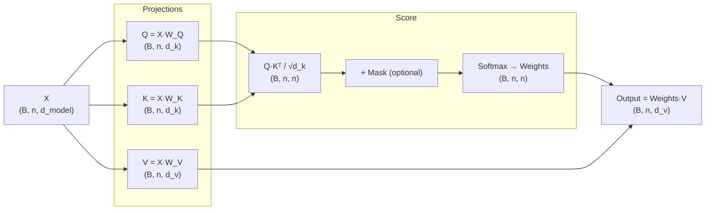

# Self-Attention: The Heart of Transformers

## Prerequisites

- [Lesson 01: Introduction to Attention](./01-introduction-to-attention.md) — QKV abstraction, scaled dot-product formula
- [Module 05 L02: Activation Functions](../../module-05-neural-networks-deep-learning-fundamentals/lessons/02-neurons-activation-functions.md) — softmax

## What You'll Learn

| Concept | Why it matters |
|---------|---------------|
| Self-attention vs cross-attention | Self-attention operates on one sequence; cross-attention relates two |
| Q, K, V projection matrices | How the model learns *what to look for* vs *what to advertise* |
| Scaled dot-product attention | The exact formula used in every Transformer |
| Causal masking | Why decoder models cannot look at future tokens |
| O(n²) complexity | Why long sequences are expensive |

---

## Intuition: A Sequence Attending to Itself

Regular (cross) attention: the decoder asks questions of the encoder.

**Self-attention**: each position asks questions of *every other position in the same sequence*.

Think of a sentence as a roundtable discussion. Each word gets to say: "What context do I need from the rest of the sentence to understand my own meaning?"

```
"The animal didn't cross the street because it was too tired."

When processing "it":
  "animal" answers strongly — "it" refers to me
  "street" answers weakly   — probably not me
  "tired"  answers weakly   — I'm an attribute, not the referent

→ Self-attention assigns high weight to "animal" when encoding "it"
```

This is fundamentally different from an RNN, where "it" can only see "tired" immediately before it unless the LSTM gates preserve earlier context. Self-attention gives every token **direct access** to every other token in a single layer.

---

## The Three Projection Matrices

For each token embedding `x_i ∈ ℝ^{d_model}`, self-attention creates three vectors:

```
q_i = x_i · W_Q    (query  — "what am I looking for?")  shape: (d_k,)
k_i = x_i · W_K    (key    — "what do I advertise?")    shape: (d_k,)
v_i = x_i · W_V    (value  — "what do I actually give?") shape: (d_v,)
```

Where:
- `W_Q ∈ ℝ^{d_model × d_k}` — query projection
- `W_K ∈ ℝ^{d_model × d_k}` — key projection
- `W_V ∈ ℝ^{d_model × d_v}` — value projection

!!! note "Why separate Q and K?"
    If we used the same matrix for both, every token would have the same query and key. The separation lets the model learn different representations for "what I seek" vs "what I offer." This is crucial for heads that specialize (e.g., one head tracks syntactic subject, another tracks semantic theme).

In matrix form for a sequence of `n` tokens:

```
Q = X · W_Q    shape: (n, d_k)   — all queries stacked
K = X · W_K    shape: (n, d_k)   — all keys stacked
V = X · W_V    shape: (n, d_v)   — all values stacked
```

---

## The Full Formula

```
Attention(Q, K, V) = softmax(Q K^T / √d_k) · V
```

Step by step:

| Step | Operation | Input shape | Output shape |
|------|-----------|-------------|--------------|
| 1. Scores | `Q @ K.T` | (n, d_k) × (d_k, n) | (n, n) |
| 2. Scale | `/ sqrt(d_k)` | (n, n) | (n, n) |
| 3. (Optional mask) | add -∞ to masked positions | (n, n) | (n, n) |
| 4. Softmax | along last dim | (n, n) | (n, n) |
| 5. Context | `@ V` | (n, n) × (n, d_v) | (n, d_v) |

The (n, n) matrix is the **attention matrix** `A`. Entry `A[i, j]` says how much token `i` attends to token `j`.

---

## Worked Numerical Example

Sentence: **"The cat sat"** — 3 tokens, `d_model = 4`, `d_k = d_v = 4`.

```
Embeddings X (3, 4):
  The = [1, 0, 1, 0]
  cat = [0, 1, 0, 1]
  sat = [1, 1, 0, 0]
```

Let W_Q = W_K = W_V = I (identity for this toy example).

So Q = K = V = X.

**Step 1 — Raw scores (Q @ K^T)**:

```
Q @ K^T =
  [1,0,1,0]   [1,0,1,0]^T       row 0 (The):  [2, 0, 1]
  [0,1,0,1] · [0,1,0,1]^T  =    row 1 (cat):  [0, 2, 1]
  [1,1,0,0]   [1,1,0,0]^T       row 2 (sat):  [1, 1, 2]

(dot products of each pair of embeddings)
```

**Step 2 — Scale by √d_k = √4 = 2**:

```
[[2, 0, 1],    /2 =    [[1.00, 0.00, 0.50],
 [0, 2, 1],             [0.00, 1.00, 0.50],
 [1, 1, 2]]             [0.50, 0.50, 1.00]]
```

**Step 3 — Softmax (row-wise)**:

```
Row 0: softmax([1.00, 0.00, 0.50]) = [0.462, 0.170, 0.368]
Row 1: softmax([0.00, 1.00, 0.50]) = [0.170, 0.462, 0.368]
Row 2: softmax([0.50, 0.50, 1.00]) = [0.244, 0.244, 0.512]
```

Interpretation: "The" attends mostly to itself (0.46), then "sat" (0.37), less to "cat" (0.17).

**Step 4 — Output = A @ V** (V = X here):

```
Output[0] ("The") = 0.462×[1,0,1,0] + 0.170×[0,1,0,1] + 0.368×[1,1,0,0]
                  = [0.462,0,0.462,0] + [0,0.170,0,0.170] + [0.368,0.368,0,0]
                  = [0.830, 0.538, 0.462, 0.170]
```

The output for "The" is a *mixture* of all token embeddings, weighted by their relevance. This contextualizes each token with information from the whole sequence.

---

## Implementation: Pure NumPy

```python
import numpy as np


def softmax(x: np.ndarray) -> np.ndarray:
    """Numerically stable softmax along last axis."""
    x = x - x.max(axis=-1, keepdims=True)
    return np.exp(x) / np.exp(x).sum(axis=-1, keepdims=True)


def scaled_dot_product_attention(
    Q: np.ndarray,             # (B, n, d_k)
    K: np.ndarray,             # (B, n, d_k)
    V: np.ndarray,             # (B, n, d_v)
    mask: np.ndarray | None = None,  # (B, n, n)  True = mask out
) -> tuple[np.ndarray, np.ndarray]:
    """
    Batched scaled dot-product attention.

    Returns
    -------
    output  : (B, n, d_v)
    weights : (B, n, n)   — attention distribution, rows sum to 1
    """
    d_k = Q.shape[-1]
    # (B, n, d_k) × (B, d_k, n) → (B, n, n)
    scores = Q @ K.transpose(0, 2, 1) / np.sqrt(d_k)

    if mask is not None:
        scores = np.where(mask, -1e9, scores)

    weights = softmax(scores)          # (B, n, n)
    output  = weights @ V              # (B, n, d_v)
    return output, weights


class SelfAttention:
    """Single-head self-attention layer."""

    def __init__(self, d_model: int, d_k: int | None = None, d_v: int | None = None):
        self.d_model = d_model
        self.d_k = d_k or d_model
        self.d_v = d_v or d_model

        # Learnable projections (initialized with small random values)
        scale = 1.0 / np.sqrt(d_model)
        self.W_Q = np.random.randn(d_model, self.d_k) * scale
        self.W_K = np.random.randn(d_model, self.d_k) * scale
        self.W_V = np.random.randn(d_model, self.d_v) * scale

    def forward(
        self,
        x: np.ndarray,              # (B, n, d_model)
        mask: np.ndarray | None = None,  # (B, n, n)
    ) -> tuple[np.ndarray, np.ndarray]:
        """
        Returns
        -------
        output  : (B, n, d_v)
        weights : (B, n, n)
        """
        Q = x @ self.W_Q   # (B, n, d_k)
        K = x @ self.W_K   # (B, n, d_k)
        V = x @ self.W_V   # (B, n, d_v)
        return scaled_dot_product_attention(Q, K, V, mask)


# ── Smoke test ───────────────────────────────────────────────────────────────
B, n, d_model = 2, 6, 64
x = np.random.randn(B, n, d_model)

sa = SelfAttention(d_model=64, d_k=32, d_v=32)
out, attn = sa.forward(x)

print(f"Input:   {x.shape}")    # (2, 6, 64)
print(f"Output:  {out.shape}")  # (2, 6, 32)
print(f"Weights: {attn.shape}") # (2, 6, 6)
print(f"Row sum (should be 1): {attn[0].sum(axis=-1).round(4)}")
```

---

## Causal (Masked) Self-Attention

Decoder models (GPT family) must not allow token `i` to see token `j > i` — that would be cheating during training.

We enforce this with a **causal mask** (upper-triangular):

```python
def causal_mask(n: int) -> np.ndarray:
    """
    Returns boolean mask (n, n):
      True  = this position should be masked (future token)
      False = this position is visible (current or past)
    """
    return np.triu(np.ones((n, n), dtype=bool), k=1)


# Visualize for n=5
mask = causal_mask(5)
print(mask.astype(int))
# [[0, 1, 1, 1, 1],   token 0 can only see itself
#  [0, 0, 1, 1, 1],   token 1 can see 0 and 1
#  [0, 0, 0, 1, 1],   token 2 can see 0,1,2
#  [0, 0, 0, 0, 1],
#  [0, 0, 0, 0, 0]]   token 4 can see everything before it
```

Adding the mask to attention:

```python
B, n = 1, 5
x = np.random.randn(B, n, 64)
sa = SelfAttention(d_model=64)
m = causal_mask(n)[np.newaxis, :, :]   # (1, 5, 5) for broadcasting

out, weights = sa.forward(x, mask=m)

# Verify: upper triangle of weights[0] should be ~0
print("Upper triangle (future tokens):", weights[0][0, 1:].round(4))
# All near zero because -1e9 → softmax → ~0
```

---

## PyTorch Implementation

```python
import torch
import torch.nn as nn
import torch.nn.functional as F


class SelfAttentionTorch(nn.Module):
    def __init__(self, d_model: int, d_k: int):
        super().__init__()
        self.d_k = d_k
        self.W_Q = nn.Linear(d_model, d_k, bias=False)
        self.W_K = nn.Linear(d_model, d_k, bias=False)
        self.W_V = nn.Linear(d_model, d_k, bias=False)

    def forward(
        self,
        x: torch.Tensor,                     # (B, n, d_model)
        mask: torch.BoolTensor | None = None, # (B, n, n)
    ) -> tuple[torch.Tensor, torch.Tensor]:
        Q = self.W_Q(x)   # (B, n, d_k)
        K = self.W_K(x)   # (B, n, d_k)
        V = self.W_V(x)   # (B, n, d_k)

        # (B, n, d_k) × (B, d_k, n) → (B, n, n)
        scores = Q @ K.transpose(-2, -1) / (self.d_k ** 0.5)

        if mask is not None:
            scores = scores.masked_fill(mask, float("-inf"))

        weights = F.softmax(scores, dim=-1)  # (B, n, n)
        output  = weights @ V                # (B, n, d_k)
        return output, weights


# Test
B, n, d_model, d_k = 2, 10, 128, 64
x = torch.randn(B, n, d_model)

sa = SelfAttentionTorch(d_model=d_model, d_k=d_k)
out, weights = sa(x)

print(f"Output:  {out.shape}")   # torch.Size([2, 10, 64])
print(f"Weights: {weights.shape}") # torch.Size([2, 10, 10])
```

---

## Diagram: Self-Attention Flow



---

## Complexity Analysis

| Resource | Self-Attention | RNN |
|----------|---------------|-----|
| Time | O(n² · d) | O(n · d²) |
| Memory | O(n²) | O(n · d) |
| Parallelizable | Yes (all tokens at once) | No (sequential) |
| Long-range dependencies | O(1) path length | O(n) path length |

For short sequences (n < 512) and large models (d = 4096+), the d² term in RNNs dominates. Self-attention wins on GPUs. For very long sequences (n > 32K), O(n²) memory becomes the bottleneck, motivating sparse and linear attention variants.

---

## Edge Cases & Misconceptions

!!! warning "Misconception: Self-attention is permutation-invariant by default"
    Without positional encodings, self-attention treats the input as a **set**, not a sequence. "The cat sat" and "sat cat The" produce the same set of attention interactions (though different scores due to different token identities). Positional encodings break this symmetry — covered in Lesson 04.

!!! warning "Misconception: Attention weights = importance scores"
    High attention weight on a token does not mean the model finds it semantically important. The value vector `v_i` could be small in magnitude, so a high weight still contributes little to the output. Gradient-based attribution methods are more reliable than raw attention for interpretation.

!!! note "Edge case: Attention sink tokens"
    LLMs learn to dump excess attention onto the first token (often `<BOS>`) or punctuation. Anthropic observed this in Claude; it is called an "attention sink." StreamingLLM exploits this to enable infinite-context streaming generation.

---

## Production Connection

**KV cache invalidation**: In generation, the K and V matrices grow with each new token. Systems like vLLM use PagedAttention — borrowed from OS virtual memory — to manage fragmented KV caches across requests, dramatically improving GPU utilization.

**Grouped-Query Attention (GQA)**: LLaMA-3 and Mistral use GQA, where multiple query heads share a single key/value head. This reduces KV cache size by 8× with minimal quality loss. Understanding single-head self-attention is the prerequisite.

**Tensor parallelism**: At scale (GPT-4, 8 GPUs), the Q, K, V projection matrices are split across GPUs. Each GPU computes attention for a subset of heads. This is only possible because the heads are mathematically independent.

---

## Flash Attention: Solving the O(n²) Memory Problem

The naive self-attention implementation stores the full attention matrix `A ∈ ℝ^{n×n}` in GPU high-bandwidth memory (HBM). At n=8192, this is 8192² × 4 bytes = 256 MB per head, per layer — before considering the batch dimension. For a 32-head model with batch=4, that's 32 GB for attention matrices alone.

Flash Attention (Dao et al., 2022) avoids materializing this matrix:

```python
import numpy as np

def flash_attention_conceptual(
    Q: np.ndarray,   # (n, d_k)
    K: np.ndarray,   # (n, d_k)
    V: np.ndarray,   # (n, d_v)
    block_size: int = 64,
) -> np.ndarray:
    """
    Conceptual Flash Attention via tiling.

    Key idea: process attention in blocks that fit in fast SRAM.
    Never materialize the full (n, n) attention matrix.

    Algorithm:
      1. Divide Q into row-blocks of size B_r
      2. For each Q-block, iterate over all K, V blocks
      3. Compute partial attention scores, track running (max, sum) for numerical stability
      4. Accumulate output incrementally

    Complexity:
      Memory: O(n) instead of O(n²)
      Compute: same O(n²) — tiles the same flops but with better cache efficiency
    """
    n, d_k = Q.shape
    d_v = V.shape[-1]
    O = np.zeros((n, d_v))       # output accumulator

    scale = d_k ** -0.5

    for i in range(0, n, block_size):
        # Q block: rows i to i+block_size
        Qi = Q[i:i+block_size]              # (B_r, d_k)
        Oi = np.zeros((len(Qi), d_v))
        m_i = np.full(len(Qi), -np.inf)    # running max for log-sum-exp
        l_i = np.zeros(len(Qi))            # running denominator

        for j in range(0, n, block_size):
            # K, V block: rows j to j+block_size
            Kj = K[j:j+block_size]         # (B_c, d_k)
            Vj = V[j:j+block_size]         # (B_c, d_v)

            # Partial scores
            Sij = Qi @ Kj.T * scale        # (B_r, B_c)

            # Update running max for numerical stability
            m_ij = Sij.max(axis=-1)        # (B_r,)
            m_new = np.maximum(m_i, m_ij)  # (B_r,) — new global max

            # Rescale previous accumulator to new max
            Oi = Oi * np.exp(m_i - m_new)[:, None]
            l_i = l_i * np.exp(m_i - m_new)

            # Add contribution of this K, V block
            exp_Sij = np.exp(Sij - m_new[:, None])  # (B_r, B_c)
            Oi += exp_Sij @ Vj             # (B_r, d_v)
            l_i += exp_Sij.sum(axis=-1)    # (B_r,)

            m_i = m_new

        # Normalize: divide by running denominator
        O[i:i+block_size] = Oi / l_i[:, None]

    return O   # (n, d_v)
```

**Memory comparison** at n=4096, d_k=64, one head:

| Implementation | Memory | Time |
|---|---|---|
| Naive (store full A) | 64 MB | Baseline |
| Flash Attention v1 | 4 MB (8× reduction) | ~2× faster |
| Flash Attention v2 | 4 MB | ~4× faster (better parallelism) |

Flash Attention v2 achieves ~70% of theoretical GPU FLOPs utilization, compared to ~30% for naive attention. This is the single biggest inference speedup in the Transformer stack.

---

## Key Takeaways

1. **Self-attention** lets every token attend to every other token in the same sequence — O(1) path length between any two positions.
2. **Q, K, V projections** separate the roles of seeking, advertising, and carrying information; the model learns all three.
3. **Scaling by √d_k** is required to keep softmax gradients non-vanishing when `d_k` is large.
4. **Causal masking** enforces autoregressive generation: token `i` cannot see `j > i`.
5. **O(n²) time and memory**: the price of full pairwise attention; optimizations like Flash Attention and sparse attention mitigate this.
6. Without **positional encoding**, self-attention is permutation-invariant — word order doesn't exist yet.

---

## Further Reading

- [Vaswani et al. 2017](https://arxiv.org/abs/1706.03762) — Attention Is All You Need (original Transformer paper)
- [The Illustrated Transformer](https://jalammar.github.io/illustrated-transformer/) — step-by-step visual walkthrough
- [Lilian Weng: Attention Survey](https://lilianweng.github.io/posts/2018-06-24-attention/) — comprehensive overview of attention families
- [deep-dive: attention-math.md](../../../deep-dives/attention-math.md) — backpropagation through scaled dot-product attention, gradient analysis

---

## 📹 Recommended Videos

- [3Blue1Brown: Attention in transformers, visually explained](https://www.youtube.com/watch?v=eMlx5fFNoYc) — beautiful geometric intuition
- [Andrej Karpathy: Let's build GPT from scratch](https://www.youtube.com/watch?v=kCc8FmEb1nY) — full causal self-attention implementation
- [Sebastian Raschka: Self-Attention from scratch](https://www.youtube.com/watch?v=QCJQG4DuHT0)

---

## 🚀 Next Lesson

**[Lesson 3: Multi-Head Attention](./03-multi-head-attention.md)** — running multiple self-attention operations in parallel, each learning a different relational pattern, and concatenating their outputs.
