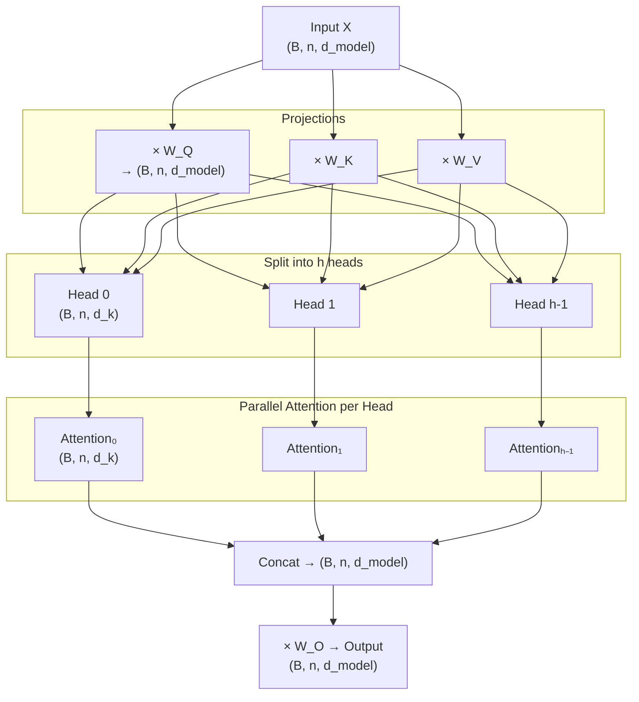

# Multi-Head Attention

## Prerequisites

- [Lesson 02: Self-Attention](./02-self-attention.md) — Q, K, V projections, scaled dot-product attention, shape conventions

## What You'll Learn

| Concept | Why it matters |
|---------|---------------|
| Head splitting | How `d_model` is partitioned across h heads |
| Parallel attention | Each head runs independently, attending to a different subspace |
| Head concatenation + output projection | How h outputs are merged back to `d_model` |
| Head specialization | Empirical evidence that heads learn distinct linguistic functions |

---

## Intuition: Multiple Perspectives on the Same Sentence

A single attention head computes one weighted mixture of values. But a sentence has many simultaneous relationships:

- **Syntactic**: subject–verb agreement ("dog runs", not "dogs runs")
- **Semantic**: thematic roles (agent, patient, instrument)
- **Coreference**: "it" refers to "the cat", not "the mat"
- **Positional**: adjacent words often have strong dependencies
- **Discourse**: pronoun resolution across clauses

One head has to "spend" its attention budget on one set of relationships at a time. Multi-head attention runs `h` heads **in parallel**, each attending to a different subspace of the embedding.

Think of it like having `h` expert reviewers each reading the same document for a different purpose, then combining their reports.

---

## Architecture: Splitting and Concatenating

Standard hyperparameters (BERT-Base): `d_model = 768`, `h = 12`, `d_k = d_v = 64`.

Note: `h × d_k = 12 × 64 = 768 = d_model`. Each head gets its own slice of the representation space.

```
For each head i = 1..h:
  Q_i = X · W_Q_i       (B, n, d_k)
  K_i = X · W_K_i       (B, n, d_k)
  V_i = X · W_V_i       (B, n, d_v)

  head_i = Attention(Q_i, K_i, V_i)   (B, n, d_v)

MultiHead = Concat(head_1, ..., head_h) · W_O
                   (B, n, h×d_v)      → (B, n, d_model)
```

In practice, the h separate projections are fused into single matrices:

```
W_Q ∈ ℝ^{d_model × (h·d_k)}   (all heads' queries at once)
W_K ∈ ℝ^{d_model × (h·d_k)}
W_V ∈ ℝ^{d_model × (h·d_v)}
W_O ∈ ℝ^{(h·d_v) × d_model}   (output projection)
```

---

## Forward Pass: Shape Walkthrough

Input `X: (B, n, d_model)`.  
`h = 8`, `d_model = 512`, `d_k = d_v = 64`.

```
1. Project:
   Q = X · W_Q    (B, n, 512)
   K = X · W_K    (B, n, 512)
   V = X · W_V    (B, n, 512)

2. Split into heads by reshaping:
   Q → (B, n, h, d_k) → transpose → (B, h, n, d_k)
   K → (B, h, n, d_k)
   V → (B, h, n, d_v)

3. Scaled dot-product attention per head:
   scores  = Q @ K^T / √d_k    (B, h, n, n)
   weights = softmax(scores)    (B, h, n, n)
   heads   = weights @ V        (B, h, n, d_v)

4. Merge heads:
   heads → transpose → (B, n, h, d_v) → reshape → (B, n, h·d_v)

5. Output projection:
   output = heads · W_O         (B, n, d_model)
```

---

## Worked Numerical Example

`B=1, n=3, d_model=4, h=2, d_k=2, d_v=2`

Input (3 tokens, 4-dim):
```
X = [[1, 0, 1, 0],   # token 0
     [0, 1, 0, 1],   # token 1
     [1, 1, 0, 0]]   # token 2
```

Suppose W_Q = W_K = W_V = I₄ (identity), so Q = K = V = X.

**Split Q into 2 heads** (slice dim=1 into two halves of size 2):

```
Head 0 Q:  [[1,0], [0,1], [1,1]]    (first 2 dims)
Head 1 Q:  [[1,0], [0,1], [0,0]]    (last 2 dims)
```

Head 0 scores: Q₀ @ K₀^T / √2:
```
scores = [[1,0,1],[0,1,1],[1,1,2]] / 1.414 = [[0.71,0,0.71],[0,0.71,0.71],[0.71,0.71,1.41]]
```

After softmax, head 0 produces one (3,2) output matrix. Head 1 produces another. Concat → (3,4). Apply W_O → (3,4). Each token's output is now informed by both relational subspaces.

---

## Implementation: NumPy

```python
import numpy as np


def softmax(x: np.ndarray) -> np.ndarray:
    x = x - x.max(axis=-1, keepdims=True)
    return np.exp(x) / np.exp(x).sum(axis=-1, keepdims=True)


class MultiHeadAttention:
    """
    Multi-head self-attention (non-causal by default).

    Parameters
    ----------
    d_model   : int — total embedding dimension
    num_heads : int — number of parallel attention heads
    """

    def __init__(self, d_model: int, num_heads: int):
        assert d_model % num_heads == 0, "d_model must be divisible by num_heads"
        self.d_model   = d_model
        self.num_heads = num_heads
        self.d_k       = d_model // num_heads   # dimension per head

        scale = 1.0 / np.sqrt(d_model)
        # Fused projection matrices
        self.W_Q = np.random.randn(d_model, d_model) * scale  # (d_model, h·d_k)
        self.W_K = np.random.randn(d_model, d_model) * scale
        self.W_V = np.random.randn(d_model, d_model) * scale
        self.W_O = np.random.randn(d_model, d_model) * scale

    def _split_heads(self, x: np.ndarray) -> np.ndarray:
        """(B, n, d_model) → (B, h, n, d_k)"""
        B, n, _ = x.shape
        x = x.reshape(B, n, self.num_heads, self.d_k)
        return x.transpose(0, 2, 1, 3)   # (B, h, n, d_k)

    def _merge_heads(self, x: np.ndarray) -> np.ndarray:
        """(B, h, n, d_k) → (B, n, d_model)"""
        B, h, n, d_k = x.shape
        x = x.transpose(0, 2, 1, 3)      # (B, n, h, d_k)
        return x.reshape(B, n, h * d_k)  # (B, n, d_model)

    def forward(
        self,
        x: np.ndarray,                    # (B, n, d_model)
        mask: np.ndarray | None = None,   # (B, 1, n, n) or (B, h, n, n)
    ) -> tuple[np.ndarray, np.ndarray]:
        """
        Returns
        -------
        output  : (B, n, d_model)
        weights : (B, h, n, n)
        """
        # 1. Project
        Q = x @ self.W_Q   # (B, n, d_model)
        K = x @ self.W_K
        V = x @ self.W_V

        # 2. Split into h heads
        Q = self._split_heads(Q)   # (B, h, n, d_k)
        K = self._split_heads(K)
        V = self._split_heads(V)

        # 3. Scaled dot-product attention per head
        scores = Q @ K.transpose(0, 1, 3, 2) / np.sqrt(self.d_k)  # (B, h, n, n)
        if mask is not None:
            scores = np.where(mask, -1e9, scores)
        weights = softmax(scores)                                    # (B, h, n, n)
        heads   = weights @ V                                        # (B, h, n, d_k)

        # 4. Merge heads + output projection
        merged = self._merge_heads(heads)  # (B, n, d_model)
        output = merged @ self.W_O         # (B, n, d_model)

        return output, weights


# ── Smoke test ───────────────────────────────────────────────────────────────
B, n, d_model, h = 2, 10, 512, 8
x = np.random.randn(B, n, d_model)

mha = MultiHeadAttention(d_model=d_model, num_heads=h)
output, weights = mha.forward(x)

print(f"Input:   {x.shape}")       # (2, 10, 512)
print(f"Output:  {output.shape}")  # (2, 10, 512)
print(f"Weights: {weights.shape}") # (2, 8, 10, 10)
print(f"Row sum (head 0, batch 0): {weights[0, 0].sum(axis=-1).round(4)}")
```

---

## PyTorch: Clean Implementation

```python
import torch
import torch.nn as nn
import torch.nn.functional as F


class MultiHeadAttentionTorch(nn.Module):
    def __init__(self, d_model: int, num_heads: int, dropout: float = 0.0):
        super().__init__()
        assert d_model % num_heads == 0
        self.num_heads = num_heads
        self.d_k       = d_model // num_heads

        self.W_Q = nn.Linear(d_model, d_model, bias=False)
        self.W_K = nn.Linear(d_model, d_model, bias=False)
        self.W_V = nn.Linear(d_model, d_model, bias=False)
        self.W_O = nn.Linear(d_model, d_model, bias=False)
        self.dropout = nn.Dropout(dropout)

    def forward(
        self,
        x: torch.Tensor,                     # (B, n, d_model)
        mask: torch.BoolTensor | None = None, # (B, 1, n, n) or None
    ) -> tuple[torch.Tensor, torch.Tensor]:
        B, n, d_model = x.shape
        h = self.num_heads

        def project_and_split(W, x):
            """Linear → reshape → (B, h, n, d_k)"""
            out = W(x)                              # (B, n, d_model)
            out = out.view(B, n, h, self.d_k)       # (B, n, h, d_k)
            return out.transpose(1, 2)              # (B, h, n, d_k)

        Q = project_and_split(self.W_Q, x)
        K = project_and_split(self.W_K, x)
        V = project_and_split(self.W_V, x)

        # (B, h, n, d_k) × (B, h, d_k, n) → (B, h, n, n)
        scores = Q @ K.transpose(-2, -1) / (self.d_k ** 0.5)
        if mask is not None:
            scores = scores.masked_fill(mask, float("-inf"))

        weights = F.softmax(scores, dim=-1)        # (B, h, n, n)
        weights = self.dropout(weights)

        # (B, h, n, n) × (B, h, n, d_k) → (B, h, n, d_k)
        heads  = weights @ V
        # Merge: (B, h, n, d_k) → (B, n, h*d_k)
        merged = heads.transpose(1, 2).contiguous().view(B, n, d_model)
        output = self.W_O(merged)                  # (B, n, d_model)
        return output, weights


# Test
d_model, h, B, n = 512, 8, 2, 20
x = torch.randn(B, n, d_model)
mha = MultiHeadAttentionTorch(d_model, h)
out, w = mha(x)
print(f"Output:  {out.shape}")   # (2, 20, 512)
print(f"Weights: {w.shape}")     # (2, 8, 20, 20)
```

---

## Diagram: Multi-Head Attention



---

## What Do Heads Learn? Empirical Evidence

Clark et al. (2019) and Michel et al. (2019) studied BERT's 144 attention heads (12 layers × 12 heads) and found consistent specialization:

| Head type | What it attends to |
|-----------|--------------------|
| Direct-object heads | Verb → object pairs |
| Coreference heads | Pronouns → antecedents |
| Positional heads | Adjacent tokens (offset 1 or 2) |
| Separator heads | `[CLS]` and `[SEP]` (attention sink) |
| Syntactic heads | Dependency arcs (subject, modifier) |

Key finding: **most of the model's capability lives in a small fraction of heads**. Michel et al. showed that for some tasks, you can prune 80% of heads with < 1% accuracy drop. For other tasks, specific heads are irreplaceable.

---

## Why Not Just One Wide Head?

**Why not a single head with `d_k = d_model`?**

1. **Subspace diversity**: Multiple heads each project to a different subspace, enforcing representational diversity. One wide head may collapse to a dominant pattern.
2. **Ensemble effect**: Multiple heads provide redundancy. If one head is noisy, others compensate.
3. **Specialization pressure**: With limited `d_k` per head, each head is forced to be selective — this emergent specialization is part of why Transformers generalize.
4. **Computational efficiency**: Split heads can be computed in parallel on tensor cores, then concatenated. There is no efficiency cost relative to a single wide head.

---

## Parameter Count Comparison

| Model | h | d_model | d_k | QKV params | O params |
|-------|---|---------|-----|------------|----------|
| BERT-Base | 12 | 768 | 64 | 3 × 768 × 768 = 1.77M | 768 × 768 = 590K |
| BERT-Large | 16 | 1024 | 64 | 3 × 1024 × 1024 = 3.14M | 1024 × 1024 = 1.05M |
| GPT-3 | 96 | 12288 | 128 | 3 × 12288 × 12288 = 453M | 12288² = 151M |

---

## Edge Cases & Misconceptions

!!! warning "Misconception: More heads always = better"
    Empirically, optimal head count scales with model size. Small models (d_model=128) may perform best with h=4; large models (d_model=4096) with h=32. Too many heads with too small d_k creates underparameterized heads.

!!! note "Grouped-Query Attention (GQA)"
    LLaMA-3 70B uses 8 query-head groups but only 8 key/value heads (vs 64 query heads). Each KV head is shared by 8 query heads. This reduces KV cache size by 8× with minimal accuracy loss. The extreme case — 1 KV head, many Q heads — is called Multi-Query Attention (MQA), used in Falcon.

!!! warning "Misconception: Attention is all you need for the feedforward layers"
    Multi-head attention is followed by a position-wise feed-forward network in every Transformer block. The FFN is what primarily expands model capacity; the MHA handles routing/mixing. Ablation studies show both are essential.

---

## Production Connection

**Flash Attention 2 with multi-head**: Modern inference engines tile the (B, h, n, n) attention computation to avoid materializing the full matrix in HBM. With h=32 and n=8192, the naive approach requires 32 × 8192² = 2.1 billion float32 values ≈ 8 GB just for attention weights. Flash Attention avoids this entirely.

**Head pruning for efficiency**: Production systems (Hugging Face Transformers) support `attention_prune_heads` to remove specific heads after training, reducing inference cost by 10–30% with negligible accuracy loss.

---

## Attention Pattern Analysis: What Heads Actually Learn

To visualize and analyze what specific heads learn, you can extract attention weights from a trained model:

```python
import torch
import numpy as np
from transformers import AutoTokenizer, AutoModel


def extract_attention_patterns(
    text: str,
    model_name: str = "bert-base-uncased",
    layer: int = 5,
) -> dict:
    """
    Extract attention weights from a specific BERT layer.

    Returns attention weights for each head at the specified layer,
    allowing analysis of head specialization.
    """
    tokenizer = AutoTokenizer.from_pretrained(model_name)
    model = AutoModel.from_pretrained(model_name, output_attentions=True)
    model.eval()

    inputs = tokenizer(text, return_tensors="pt")
    tokens = tokenizer.convert_ids_to_tokens(inputs["input_ids"][0])

    with torch.no_grad():
        outputs = model(**inputs)

    # outputs.attentions: tuple of (B, h, n, n) per layer
    layer_attn = outputs.attentions[layer]  # (1, 12, n, n) for BERT-base
    layer_attn = layer_attn[0].numpy()      # (12, n, n)

    return {"tokens": tokens, "weights": layer_attn}


def analyze_head_patterns(weights: np.ndarray, tokens: list[str]) -> None:
    """
    Identify head types by their attention pattern shapes.

    Pattern categories:
    - Diagonal: attends to same position (identity-like)
    - Previous token: strong sub-diagonal
    - First token: column 0 is dominant (attention sink)
    - Broad: roughly uniform (aggregation head)
    """
    n_heads = weights.shape[0]

    for h in range(n_heads):
        w = weights[h]  # (n, n)

        # Heuristics for pattern detection
        diagonal_strength   = np.diag(w).mean()
        prev_token_strength = np.diag(w, k=-1).mean() if len(tokens) > 1 else 0
        first_token_sink    = w[:, 0].mean()  # attention to position 0
        entropy             = -(w * np.log(w + 1e-9)).sum(axis=-1).mean()

        pattern = "broad"
        if first_token_sink > 0.4:
            pattern = "attention_sink"
        elif prev_token_strength > 0.3:
            pattern = "prev_token"
        elif diagonal_strength > 0.4:
            pattern = "self_attend"
        elif entropy < 0.5:
            pattern = "focused"

        print(f"  Head {h:2d}: {pattern:16s} "
              f"(sink={first_token_sink:.2f}, prev={prev_token_strength:.2f}, entropy={entropy:.2f})")
```

**Real findings from BERT-base layer 5** (Clark et al., 2019):

```
Head  0: attention_sink    — always attends to [CLS]
Head  1: prev_token        — tracks syntactic locality
Head  4: broad             — aggregation head
Head  6: focused           — tracks long-range coreference
Head  9: self_attend       — token identity preservation
```

This analysis confirms that heads specialize without explicit supervision — the training objective alone induces linguistic structure.

---

## Efficient Multi-Head Attention: PyTorch 2.0+ sdpa

```python
import torch
import torch.nn.functional as F


def efficient_mha(
    Q: torch.Tensor,   # (B, h, T, d_k)
    K: torch.Tensor,   # (B, h, T, d_k)
    V: torch.Tensor,   # (B, h, T, d_v)
    is_causal: bool = True,
) -> torch.Tensor:
    """
    PyTorch 2.0 scaled_dot_product_attention uses Flash Attention
    automatically when available (CUDA, BF16/FP16).

    Dispatches to:
    - Flash Attention v2 on A100/H100 with BF16/FP16
    - Memory-efficient attention on older GPUs
    - Naive math implementation on CPU
    """
    return F.scaled_dot_product_attention(
        Q, K, V,
        attn_mask=None,     # use is_causal instead
        dropout_p=0.0,
        is_causal=is_causal,  # applies causal mask automatically
    )
    # Output: (B, h, T, d_v)
    # No attention weights returned (not materialized — this is the point)
```

One-line replacement for the full attention computation. For production models, this is the only attention implementation you should use — it's 2–4× faster and uses 8× less memory than the naive equivalent.

---

## Key Takeaways

1. **Multi-head attention** runs `h` independent attention heads in parallel, each computing attention in a `d_k = d_model/h` dimensional subspace.
2. **Shape flow**: (B, n, d_model) → project → split → attend → merge → (B, n, d_model). The output has the same shape as the input.
3. The **output projection W_O** is crucial — it mixes information across heads before passing to the next layer.
4. **Heads specialize** empirically: syntax heads, coreference heads, positional heads emerge during training.
5. **Parameter count** for MHA is 4 × d_model² (Q, K, V, O projections) — a major fraction of total model parameters.
6. **GQA/MQA** are production variants that reduce KV cache overhead by sharing key/value heads across query heads.

---

## Further Reading

- [Vaswani et al. 2017](https://arxiv.org/abs/1706.03762) — Section 3.2 on multi-head attention
- [Clark et al. 2019](https://arxiv.org/abs/1906.04341) — What Does BERT Look At? (head analysis)
- [Michel et al. 2019](https://arxiv.org/abs/1905.10650) — Are Sixteen Heads Really Better than One?
- [Ainslie et al. 2023](https://arxiv.org/abs/2305.13245) — GQA: Training Generalized Multi-Query Transformer Models
- [The Annotated Transformer](https://nlp.seas.harvard.edu/annotated-transformer/) — Harvard NLP line-by-line PyTorch implementation

---

## 🚀 Next Lesson

**[Lesson 4: Positional Encoding](./04-positional-encoding.md)** — how Transformers inject sequence-order information without recurrence, including sinusoidal encodings and modern learned/relative alternatives like RoPE.
