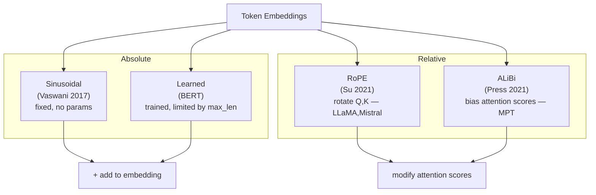

# Positional Encoding

## Prerequisites

- [Lesson 02: Self-Attention](./02-self-attention.md) — why attention treats input as a set
- Linear algebra: dot products, trigonometric functions

## What You'll Learn

| Concept | Why it matters |
|---------|---------------|
| Permutation invariance | Self-attention ignores order without PE |
| Sinusoidal PE | Original Transformer choice: no learned params, infinite extrapolation |
| Learned PE | BERT's approach: trainable position embeddings |
| Relative PE (RoPE) | Used by LLaMA, Mistral — encodes relative positions in Q·K dot product |
| ALiBi | Linear position bias for length extrapolation |

---

## Intuition: Why Order Is Missing

Consider these two sentences:

```
"Dog bites man"   → The dog is aggressive
"Man bites dog"   → Newsworthy, unusual
```

To self-attention without positional information, these are **identical** (same tokens, different order). The attention scores between "dog" and "bites" are computed from the same embedding vectors regardless of which position they occupy.

Self-attention treats the input as a **set** (unordered). To make it a **sequence** (ordered), we must inject position information.

The key design constraint: the position signal must be **differentiable** and must not catastrophically interfere with the semantic content of the token embeddings.

---

## Solution: Add Position Embeddings

The general approach:

```
final_embedding[i] = token_embedding[i] + position_embedding[i]
```

The model then receives position information encoded in the same vector space as the token semantics. Because attention operates on these summed vectors, the position signal propagates into every Q, K, and V computation.

!!! note "Why addition, not concatenation?"
    Concatenation would double d_model, increasing parameter count quadratically. Addition preserves d_model and allows the model to learn to separate positional and semantic content via the W_Q, W_K, W_V projections.

---

## Sinusoidal Positional Encoding: The Original

Vaswani et al. 2017 defined:

```
PE(pos, 2i)   = sin(pos / 10000^(2i/d_model))
PE(pos, 2i+1) = cos(pos / 10000^(2i/d_model))
```

Where:
- `pos` ∈ {0, 1, ..., T-1} — position in sequence
- `i` ∈ {0, 1, ..., d_model/2 - 1} — dimension index
- `d_model` — embedding dimension (e.g., 512)

**Intuition: binary clocks at different frequencies**

Think of each dimension pair `(2i, 2i+1)` as a clock hand rotating at frequency `ω_i = 1 / 10000^(2i/d_model)`:

- `i=0`: fastest clock — alternates every position (like the 1s digit in binary)
- `i=d_model/2-1`: slowest clock — barely moves (like the 2^512 digit)

Each position gets a unique combination of clock readings. The pattern is deterministic and never repeats for any sequence length.

---

## Why Sinusoidal? The Relative-Position Property

The key property: for any fixed offset `k`, `PE(pos+k)` can be expressed as a **linear transformation** of `PE(pos)`. Specifically:

```
PE(pos+k) = M_k · PE(pos)
```

where `M_k` is a rotation matrix that depends only on `k`, not on `pos`.

This means: when computing `q · k` in attention, the dot product between `PE(pos+k)` and `PE(pos)` is a function of `k` alone. The model can learn to use this to detect relative distances.

**Worked verification** (dimension pair `i=0`):

```
PE(pos, 0)   = sin(pos)
PE(pos, 1)   = cos(pos)
PE(pos+k, 0) = sin(pos+k) = sin(pos)cos(k) + cos(pos)sin(k)
             = cos(k)·PE(pos,0) + sin(k)·PE(pos,1)
```

This is exactly the rotation: `[cos(k), sin(k); -sin(k), cos(k)]` applied to `[PE(pos,0), PE(pos,1)]`. The offset `k` determines the rotation angle — the model can learn to detect this.

---

## Worked Example: Position 0 vs Position 5 (d_model=8)

```python
import numpy as np

def sinusoidal_pe(seq_len: int, d_model: int) -> np.ndarray:
    """
    Returns PE array of shape (seq_len, d_model).
    """
    PE = np.zeros((seq_len, d_model))
    pos = np.arange(seq_len)[:, np.newaxis]          # (seq_len, 1)
    i   = np.arange(0, d_model, 2)[np.newaxis, :]    # (1, d_model//2)

    angles = pos / (10_000 ** (i / d_model))          # (seq_len, d_model//2)
    PE[:, 0::2] = np.sin(angles)   # even dims
    PE[:, 1::2] = np.cos(angles)   # odd dims

    return PE

pe = sinusoidal_pe(seq_len=10, d_model=8)
print("Shape:", pe.shape)   # (10, 8)
print("\nPos 0:", pe[0].round(3))
print("Pos 1:", pe[1].round(3))
print("Pos 5:", pe[5].round(3))
```

Expected output (approximate):

```
Pos 0: [0.    1.    0.    1.    0.    1.    0.    1.   ]
Pos 1: [0.841 0.540 0.100 0.995 0.010 1.000 0.001 1.000]
Pos 5: [0.959 -0.279 0.479 0.877 0.050 0.999 0.005 1.000]
```

Position 0 always starts at `sin(0)=0, cos(0)=1`. Each subsequent position advances the faster clocks (small i) and barely moves the slower clocks (large i). Adjacent positions are similar in high dimensions and differ in low dimensions — a useful inductive bias.

---

## Implementation: Adding PE to Embeddings

```python
import numpy as np


def sinusoidal_pe(seq_len: int, d_model: int) -> np.ndarray:
    """Sinusoidal positional encoding. Returns (seq_len, d_model)."""
    PE = np.zeros((seq_len, d_model))
    pos = np.arange(seq_len)[:, np.newaxis]
    i   = np.arange(0, d_model, 2)[np.newaxis, :]
    angles = pos / (10_000 ** (i / d_model))
    PE[:, 0::2] = np.sin(angles)
    PE[:, 1::2] = np.cos(angles)
    return PE


class TransformerEmbedding:
    """Token embedding + positional encoding."""

    def __init__(self, vocab_size: int, d_model: int, max_seq_len: int = 5000):
        # Token embeddings (learned)
        self.token_embed = np.random.randn(vocab_size, d_model) * 0.02
        # Positional encoding (fixed)
        self.pe = sinusoidal_pe(max_seq_len, d_model)
        self.d_model = d_model

    def forward(self, token_ids: np.ndarray) -> np.ndarray:
        """
        Parameters
        ----------
        token_ids : (B, n)  — integer token indices

        Returns
        -------
        embeddings : (B, n, d_model)
        """
        B, n = token_ids.shape
        # Lookup token embeddings
        tok = self.token_embed[token_ids]   # (B, n, d_model)
        # Scale (original paper scales by sqrt(d_model) to balance PE)
        tok = tok * np.sqrt(self.d_model)
        # Add positional encoding (same PE for all items in batch)
        tok += self.pe[:n]                  # broadcasting: (n, d_model)
        return tok


# Smoke test
emb = TransformerEmbedding(vocab_size=10000, d_model=512)
token_ids = np.random.randint(0, 10000, size=(2, 20))  # B=2, n=20
x = emb.forward(token_ids)
print(f"Output shape: {x.shape}")  # (2, 20, 512)
```

---

## Visualization: The PE Heatmap

```python
import matplotlib.pyplot as plt

pe = sinusoidal_pe(seq_len=100, d_model=128)

plt.figure(figsize=(14, 5))
plt.imshow(pe.T, aspect="auto", cmap="RdBu", vmin=-1, vmax=1)
plt.xlabel("Position in sequence", fontsize=12)
plt.ylabel("Embedding dimension", fontsize=12)
plt.title("Sinusoidal Positional Encoding (seq_len=100, d_model=128)", fontsize=13)
plt.colorbar(label="value")
plt.tight_layout()
plt.show()
```

The heatmap reveals the wave pattern: high-frequency oscillations in small dimensions (visible as many alternating bands) and slow-moving signals in large dimensions.

---

## Modern Alternatives

### Learned Positional Embeddings (BERT)

BERT adds a trainable embedding table `E_pos ∈ ℝ^{max_pos × d_model}`:

```python
# PyTorch equivalent
self.pos_embedding = nn.Embedding(max_seq_len, d_model)
x = token_embed + pos_embedding(positions)
```

**Pros**: Can learn task-specific position patterns.  
**Cons**: Cannot generalize beyond `max_seq_len` seen during training. A BERT trained on 512 tokens cannot process 513 tokens without modification.

### RoPE (Rotary Position Embeddings) — LLaMA, Mistral, Falcon

Instead of adding PE to embeddings, RoPE **rotates** the Q and K vectors before computing attention scores:

```
q_rotated[pos] = Rotate(q[pos], angle=pos × θ)
k_rotated[pos] = Rotate(k[pos], angle=pos × θ)

attention score = q_rotated[pos_q] · k_rotated[pos_k]
               ∝ (original q·k) + f(pos_q - pos_k)
```

The dot product naturally encodes the relative offset `pos_q - pos_k`. This makes RoPE:
- **Extrapolation-friendly**: works beyond training length (with NTK scaling tricks)
- **Relative**: the model sees offsets, not absolute positions
- **No extra parameters**: pure trigonometric rotation

```python
import torch

def apply_rope(x: torch.Tensor, cos: torch.Tensor, sin: torch.Tensor) -> torch.Tensor:
    """
    Apply rotary position embeddings.

    x   : (B, h, n, d_k)
    cos : (n, d_k//2)
    sin : (n, d_k//2)
    """
    # Split into pairs
    x1, x2 = x[..., ::2], x[..., 1::2]   # each (B, h, n, d_k//2)
    # Rotate
    rotated_x1 = x1 * cos - x2 * sin
    rotated_x2 = x1 * sin + x2 * cos
    # Interleave back
    return torch.stack([rotated_x1, rotated_x2], dim=-1).flatten(-2)
```

### ALiBi (Attention with Linear Biases)

ALiBi adds a linear slope to attention scores based on token distance:

```
score[i, j] = (q_i · k_j) / √d_k  −  m × |i − j|
```

Where `m` is a head-specific slope (different for each head). No positional embeddings are added to the input at all.

**Key property**: Train on length 1024, infer on length 4096 with minimal degradation. Used in MPT-7B and early Falcon models.

---

## Diagram: Position Encoding Approaches



---

## Comparison Table

| Method | Params | Extrapolation | Where used |
|--------|--------|---------------|------------|
| Sinusoidal | 0 | Good (untested at extreme lengths) | Original Transformer, T5 |
| Learned | max_len × d_model | ❌ (fails beyond training length) | BERT, GPT-2 |
| RoPE | 0 (trig) | Good (with NTK scaling) | LLaMA, Mistral, Falcon, Qwen |
| ALiBi | 0 (slope per head) | Excellent | MPT, early Falcon |
| T5 Relative | small lookup table | Good | T5, mT5 |

---

## Edge Cases & Misconceptions

!!! warning "Misconception: Position encodings are just one-hot position numbers"
    One-hot encoding position `[0, 0, 1, 0, ...]` provides no relative position signal and doesn't scale to long sequences. Sinusoidal/RoPE encodings encode *structure* — relative distances are geometry in the embedding space.

!!! warning "Misconception: Adding PE doesn't change attention"
    Adding PE to token embeddings directly changes Q, K, V (since they are linear projections of the embedding). The dot product `q_i · k_j` now depends on both the token identities *and* their positions.

!!! note "Long context and RoPE NTK scaling"
    LLaMA-2 was trained on 4K context but can process 32K with dynamic NTK-aware RoPE scaling. This "stretches" the rotation frequencies to match the longer context, preserving relative position resolution.

---

## Production Connection

**Context window length** is directly tied to positional encoding choice. Models with sinusoidal or learned PE are hard to extend. Models with RoPE can be extended post-training via NTK or YaRN scaling — this is why LLaMA-based models commonly offer 32K, 64K, and 128K context versions with fine-tuning.

**vLLM position caching**: When serving long prompts, the positional encoding for each position is precomputed and cached, avoiding redundant trig operations across requests.

---

## RoPE: Full Implementation and Verification

RoPE is more subtle than adding an embedding — it operates on pairs of dimensions via complex multiplication:

```python
import numpy as np
import torch


def build_rope_cache(
    seq_len: int,
    d_k: int,
    base: float = 10_000.0,
) -> tuple[np.ndarray, np.ndarray]:
    """
    Build cos and sin caches for RoPE.

    For each pair of dimensions (2i, 2i+1), the rotation frequency is:
        θ_i = 1 / (base^(2i/d_k))

    Returns cos and sin arrays of shape (seq_len, d_k//2).
    """
    i = np.arange(0, d_k, 2) / d_k            # [0, 2/d_k, 4/d_k, ...]  shape: (d_k//2,)
    theta = 1.0 / (base ** i)                  # (d_k//2,) — frequencies

    positions = np.arange(seq_len)[:, None]    # (T, 1)
    angles = positions * theta[None, :]        # (T, d_k//2) — angle per position × dim

    return np.cos(angles), np.sin(angles)      # each (T, d_k//2)


def apply_rope_numpy(
    x: np.ndarray,     # (T, d_k) — queries or keys for one head
    cos: np.ndarray,   # (T, d_k//2)
    sin: np.ndarray,   # (T, d_k//2)
) -> np.ndarray:
    """
    Apply rotary position embedding to a (T, d_k) tensor.

    Each adjacent pair (x[2i], x[2i+1]) is rotated by position-dependent angle:
        x[2i]'   = x[2i]   * cos(pos * θ_i) - x[2i+1] * sin(pos * θ_i)
        x[2i+1]' = x[2i+1] * cos(pos * θ_i) + x[2i]   * sin(pos * θ_i)
    """
    x_even = x[:, ::2]    # (T, d_k//2) — even-indexed dimensions
    x_odd  = x[:, 1::2]   # (T, d_k//2) — odd-indexed dimensions

    x_rotated_even = x_even * cos - x_odd * sin   # (T, d_k//2)
    x_rotated_odd  = x_even * sin + x_odd * cos   # (T, d_k//2)

    # Interleave back: shape (T, d_k)
    out = np.zeros_like(x)
    out[:, ::2]  = x_rotated_even
    out[:, 1::2] = x_rotated_odd

    return out


# ── Verify: relative position property ────────────────────────────────────────
# Property: q_rotated[pos_i] · k_rotated[pos_j] depends only on (pos_i - pos_j)
d_k = 16
T = 8
cos, sin = build_rope_cache(T, d_k)

q = np.random.randn(T, d_k)
k = np.random.randn(T, d_k)

q_rot = apply_rope_numpy(q, cos, sin)
k_rot = apply_rope_numpy(k, cos, sin)

# Compute attention scores before and after RoPE
scores_before = (q @ k.T)       # (T, T) — absolute position distances
scores_after  = (q_rot @ k_rot.T)  # (T, T) — relative position distances

print("Score[0,0]:", scores_after[0, 0].round(4))
print("Score[1,1]:", scores_after[1, 1].round(4))
print("Score[2,2]:", scores_after[2, 2].round(4))
# Scores on the same diagonal should be similar (same relative offset = 0)
# Score[i, i] and Score[j, j] should be similar for any i, j → confirms relative property


# ── NTK-aware RoPE scaling for long context ────────────────────────────────────
def build_rope_cache_ntk(
    seq_len: int,
    d_k: int,
    original_max_len: int = 2048,
    new_max_len: int = 32768,
    base: float = 10_000.0,
) -> tuple[np.ndarray, np.ndarray]:
    """
    NTK-aware interpolation: scale base to handle longer sequences.

    Instead of stretching the positions (which reduces resolution),
    increase the base to spread frequency range.

    Used by: LLaMA-2-32K, Code Llama, many fine-tuned long-context models.
    """
    scale = new_max_len / original_max_len
    scaled_base = base * scale ** (d_k / (d_k - 2))  # NTK formula

    i = np.arange(0, d_k, 2) / d_k
    theta = 1.0 / (scaled_base ** i)

    positions = np.arange(seq_len)[:, None]
    angles = positions * theta[None, :]
    return np.cos(angles), np.sin(angles)


# Standard RoPE breaks at 2× training length; NTK scaling extends gracefully
cos_standard = build_rope_cache(seq_len=4096, d_k=64)[0]
cos_ntk      = build_rope_cache_ntk(seq_len=32768, d_k=64, original_max_len=4096,
                                     new_max_len=32768)[0]

print(f"Standard cache shape: {cos_standard.shape}")  # (4096, 32)
print(f"NTK cache shape:      {cos_ntk.shape}")        # (32768, 32)
```

**Why NTK scaling?** The Neural Tangent Kernel interpretation: extending context length is equivalent to changing the "effective base" of the positional encoding. By increasing the base (rather than stretching positions), frequency resolution is preserved across the extended sequence.

---

## Sinusoidal vs RoPE: Dot Product Analysis

The key mathematical difference between absolute (sinusoidal) and relative (RoPE) positional encodings:

| | Sinusoidal PE | RoPE |
|---|---|---|
| Where applied | Input embeddings: x = token + PE | Q and K tensors only |
| Attention score | `(token_i + PE_i) · W_Q · W_K^T · (token_j + PE_j)` | `rotate(q_i, θ_i) · rotate(k_j, θ_j)` |
| Depends on | Absolute positions i and j | Relative offset (i - j) |
| Cross terms | Semantic-position coupling | Clean separation |
| Length extrapolation | Poor | Good (with NTK/YaRN) |

The sinusoidal approach mixes position information into the token semantics at the input — this "leaks" position into the value vectors and creates cross-terms in the attention score. RoPE cleanly separates positions (encoded in Q, K) from content (encoded in V).

---

## Key Takeaways

1. **Self-attention is set-based** — without positional encoding, "The cat sat" and "sat cat The" are indistinguishable.
2. **Sinusoidal PE** uses waves at different frequencies — unique per position, zero learned parameters, relative-position property via rotation matrix.
3. **Learned PE** (BERT) is trainable but cannot generalize beyond training length.
4. **RoPE** encodes relative positions directly into the Q·K dot product via rotation — the dominant approach in modern open-source LLMs.
5. **ALiBi** biases attention scores linearly by distance — excellent extrapolation with zero parameters.
6. **Production impact**: PE choice determines maximum context window and long-context generalization.

---

## Further Reading

- [Vaswani et al. 2017](https://arxiv.org/abs/1706.03762) — Section 3.5: Positional Encoding
- [Su et al. 2021](https://arxiv.org/abs/2104.09864) — RoFormer: Enhanced transformer with rotary position embedding (RoPE)
- [Press et al. 2021](https://arxiv.org/abs/2108.12409) — Train short, test long: Attention with linear biases (ALiBi)
- [Peng et al. 2023](https://arxiv.org/abs/2306.15595) — YaRN: Efficient context window extension of large language models

---

## 🚀 Next Lesson

**[Lesson 5: The Complete Transformer Architecture](./05-transformer-architecture.md)** — combining positional encoding, multi-head attention, feed-forward networks, layer normalization, and residual connections into the full encoder and decoder stacks.
