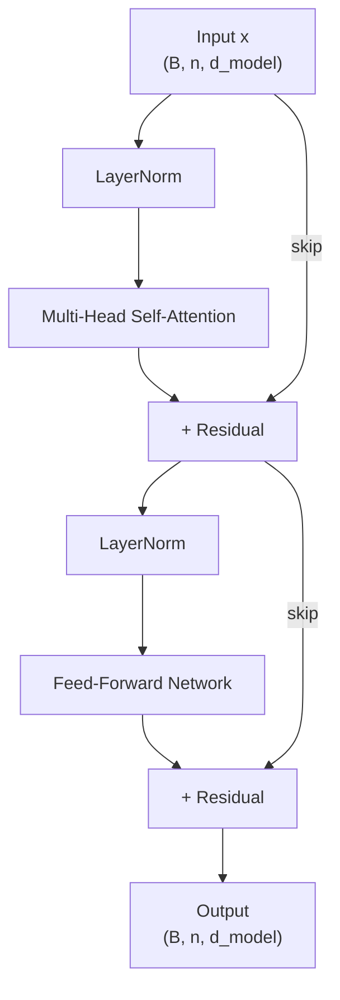

# The Complete Transformer Architecture

## Prerequisites

- [Lesson 03: Multi-Head Attention](./03-multi-head-attention.md) — parallel attention heads, output projection
- [Lesson 04: Positional Encoding](./04-positional-encoding.md) — adding position to token embeddings
- [Module 05 L04: Gradient Descent](../../module-05-neural-networks-deep-learning-fundamentals/lessons/04-gradient-descent.md) — why residual connections ease optimization

## What You'll Learn

| Component | Purpose |
|-----------|---------|
| Feed-Forward sublayer | Position-wise MLP that expands and contracts the representation |
| Layer Normalization | Stabilizes activations; enables deep networks |
| Residual connections | Allow gradients to flow to early layers |
| Encoder stack | N identical blocks that build contextual representations |
| Decoder stack | N blocks with masked self-attention + cross-attention |
| Full forward pass | Input tokens → logits over vocabulary |

---

## The 30,000-Foot View

```
"Attention Is All You Need" (Vaswani et al., 2017)
removes recurrence entirely and relies solely on:

  1. Multi-head self-attention   (sequence mixing)
  2. Feed-forward network        (position-wise transformation)
  3. Layer normalization         (training stability)
  4. Residual connections        (gradient highway)
  5. Positional encoding         (sequence order)
```

The encoder reads the input sequence and produces a rich representation. The decoder generates the output sequence one token at a time, attending to both previous outputs and the encoder representation.

---

## Building Block 1: Layer Normalization

Before diving into the full architecture, we need LayerNorm.

Unlike BatchNorm (normalizes across the batch dimension), LayerNorm normalizes across the **feature dimension** for each sample independently:

```
LayerNorm(x) = γ · (x - μ) / (σ + ε) + β

where:
  μ = mean(x, dim=-1)     — per-token mean
  σ = std(x, dim=-1)      — per-token std
  γ, β = learnable scale and shift (shape: d_model)
```

**Why LayerNorm for Transformers?** Batch norm requires batch statistics, which are unreliable for small batches and incompatible with variable-length sequences. LayerNorm operates independently per token — no cross-batch communication.

```python
import numpy as np


class LayerNorm:
    """Layer normalization."""

    def __init__(self, d_model: int, eps: float = 1e-6):
        self.gamma = np.ones(d_model)   # learnable scale
        self.beta  = np.zeros(d_model)  # learnable shift
        self.eps   = eps

    def forward(self, x: np.ndarray) -> np.ndarray:
        """
        x : (B, n, d_model)
        returns: (B, n, d_model)
        """
        mu    = x.mean(axis=-1, keepdims=True)         # (B, n, 1)
        sigma = x.std(axis=-1, keepdims=True) + self.eps
        x_hat = (x - mu) / sigma                       # (B, n, d_model)
        return self.gamma * x_hat + self.beta           # (B, n, d_model)
```

!!! note "Pre-LN vs Post-LN"
    The original Transformer applies LN *after* the sublayer + residual (Post-LN). Most modern LLMs (GPT-2, LLaMA) apply LN *before* the sublayer (Pre-LN). Pre-LN training is more stable and doesn't require learning rate warm-up.

---

## Building Block 2: Feed-Forward Network

Each encoder/decoder layer contains a **position-wise FFN** — applied independently to each token:

```
FFN(x) = max(0, x · W₁ + b₁) · W₂ + b₂

W₁ ∈ ℝ^{d_model × d_ff}    (expand)
W₂ ∈ ℝ^{d_ff × d_model}    (project back)

d_ff is typically 4 × d_model
```

For BERT-Base: `d_model=768`, `d_ff=3072`.  
For GPT-3: `d_model=12288`, `d_ff=49152`.

```python
class FeedForward:
    """Position-wise feed-forward network."""

    def __init__(self, d_model: int, d_ff: int):
        scale = 1.0 / np.sqrt(d_model)
        self.W1 = np.random.randn(d_model, d_ff)    * scale
        self.b1 = np.zeros(d_ff)
        self.W2 = np.random.randn(d_ff, d_model)    * scale
        self.b2 = np.zeros(d_model)

    def forward(self, x: np.ndarray) -> np.ndarray:
        """
        x : (B, n, d_model)
        returns: (B, n, d_model)
        """
        # Expand: (B, n, d_ff)
        h = np.maximum(0, x @ self.W1 + self.b1)   # ReLU
        # Project back: (B, n, d_model)
        return h @ self.W2 + self.b2
```

**Modern activation functions**: GPT models use GELU instead of ReLU. LLaMA uses SwiGLU (`x · sigmoid(β·x) · W₂`), which requires 3 weight matrices but trains better.

---

## Building Block 3: Residual Connections

Every sublayer uses a residual (skip) connection:

```
x = x + Sublayer(LayerNorm(x))   # Pre-LN formulation
```

or in the original post-LN formulation:

```
x = LayerNorm(x + Sublayer(x))
```

**Why residuals?** Without them, gradients must pass through every multiplication on the way to early layers. With residuals, gradients can take a "highway" that bypasses the sublayer:

```
∂L/∂x = ∂L/∂(x + f(x)) · (1 + ∂f/∂x)
```

The `1` ensures gradient flow even if `∂f/∂x ≈ 0` early in training.

He et al. (2016) showed that residual connections allow training networks with 1000+ layers without vanishing gradients. The original Transformer uses 6 encoder + 6 decoder layers; GPT-3 uses 96.

---

## The Encoder Block



Implementation:

```python
class EncoderBlock:
    """Single Transformer encoder block (Pre-LN)."""

    def __init__(self, d_model: int, num_heads: int, d_ff: int, dropout: float = 0.1):
        self.attn = MultiHeadAttention(d_model, num_heads)  # from Lesson 03
        self.ffn  = FeedForward(d_model, d_ff)
        self.norm1 = LayerNorm(d_model)
        self.norm2 = LayerNorm(d_model)
        self.dropout = dropout

    def _dropout(self, x: np.ndarray) -> np.ndarray:
        if self.dropout == 0.0:
            return x
        mask = np.random.rand(*x.shape) > self.dropout
        return x * mask / (1 - self.dropout)

    def forward(
        self,
        x: np.ndarray,             # (B, n, d_model)
        mask: np.ndarray | None = None,
    ) -> np.ndarray:               # (B, n, d_model)
        # Sub-layer 1: Multi-Head Self-Attention (Pre-LN)
        x_norm  = self.norm1.forward(x)
        attn_out, _ = self.attn.forward(x_norm, mask=mask)
        x = x + self._dropout(attn_out)      # residual

        # Sub-layer 2: Feed-Forward (Pre-LN)
        x_norm  = self.norm2.forward(x)
        ffn_out = self.ffn.forward(x_norm)
        x = x + self._dropout(ffn_out)       # residual

        return x
```

---

## The Decoder Block

The decoder has **three** sublayers:

1. **Masked self-attention** — attends to previous decoder outputs only (causal mask)
2. **Cross-attention** — queries are from the decoder; keys and values are from the encoder
3. **Feed-forward** — same as encoder

```python
class DecoderBlock:
    """Single Transformer decoder block (Pre-LN)."""

    def __init__(self, d_model: int, num_heads: int, d_ff: int):
        self.self_attn  = MultiHeadAttention(d_model, num_heads)
        self.cross_attn = MultiHeadAttention(d_model, num_heads)
        self.ffn        = FeedForward(d_model, d_ff)
        self.norm1 = LayerNorm(d_model)
        self.norm2 = LayerNorm(d_model)
        self.norm3 = LayerNorm(d_model)

    def forward(
        self,
        x: np.ndarray,           # (B, T_tgt, d_model) — decoder input
        memory: np.ndarray,      # (B, T_src, d_model) — encoder output
        tgt_mask: np.ndarray | None = None,    # causal mask
        src_mask: np.ndarray | None = None,    # padding mask
    ) -> np.ndarray:
        # Sub-layer 1: Masked self-attention on decoder input
        x = x + self.self_attn.forward(self.norm1.forward(x), mask=tgt_mask)[0]

        # Sub-layer 2: Cross-attention (query=decoder, key=value=encoder)
        # NOTE: In cross-attention, Q comes from decoder, K/V from encoder
        # For simplicity we forward with the same interface; production code
        # passes separate q, k, v arguments.
        x = x + self.cross_attn.forward(self.norm2.forward(x), mask=src_mask)[0]

        # Sub-layer 3: FFN
        x = x + self.ffn.forward(self.norm3.forward(x))

        return x   # (B, T_tgt, d_model)
```

---

## The Full Transformer

```python
class Transformer:
    """
    Full encoder-decoder Transformer.

    Hyperparameters from "Attention Is All You Need" base model:
      d_model = 512, h = 8, N = 6, d_ff = 2048
    """

    def __init__(
        self,
        vocab_size:  int,
        d_model:     int = 512,
        num_heads:   int = 8,
        num_layers:  int = 6,
        d_ff:        int = 2048,
        max_seq_len: int = 5000,
    ):
        # Shared embedding (source and target in NMT often share)
        self.embed = TransformerEmbedding(vocab_size, d_model, max_seq_len)

        # Encoder stack
        self.encoder = [
            EncoderBlock(d_model, num_heads, d_ff) for _ in range(num_layers)
        ]
        # Final encoder LayerNorm (Pre-LN style)
        self.enc_norm = LayerNorm(d_model)

        # Decoder stack
        self.decoder = [
            DecoderBlock(d_model, num_heads, d_ff) for _ in range(num_layers)
        ]
        self.dec_norm = LayerNorm(d_model)

        # Output linear → vocabulary logits
        self.W_out = np.random.randn(d_model, vocab_size) * 0.02

    def encode(
        self,
        src: np.ndarray,       # (B, T_src)  integer token ids
        src_mask: np.ndarray | None = None,
    ) -> np.ndarray:           # (B, T_src, d_model)
        x = self.embed.forward(src)
        for layer in self.encoder:
            x = layer.forward(x, mask=src_mask)
        return self.enc_norm.forward(x)

    def decode(
        self,
        tgt: np.ndarray,       # (B, T_tgt)  integer token ids
        memory: np.ndarray,    # (B, T_src, d_model)  encoder output
        tgt_mask: np.ndarray | None = None,
        src_mask: np.ndarray | None = None,
    ) -> np.ndarray:           # (B, T_tgt, d_model)
        x = self.embed.forward(tgt)
        for layer in self.decoder:
            x = layer.forward(x, memory, tgt_mask, src_mask)
        return self.dec_norm.forward(x)

    def forward(
        self,
        src: np.ndarray,       # (B, T_src)
        tgt: np.ndarray,       # (B, T_tgt)
        src_mask: np.ndarray | None = None,
        tgt_mask: np.ndarray | None = None,
    ) -> np.ndarray:           # (B, T_tgt, vocab_size) — logits
        memory = self.encode(src, src_mask)
        dec_out = self.decode(tgt, memory, tgt_mask, src_mask)
        logits = dec_out @ self.W_out   # (B, T_tgt, vocab_size)
        return logits
```

---

## Tensor Shape Trace (N=2 for illustration)

```
src: (2, 12)  ← batch of 2 sentences, 12 tokens each
                            tgt: (2, 8)   ← 8 output tokens (teacher-forced)

ENCODER:
  Embed + PE        → (2, 12, 512)
  EncoderBlock 0    → (2, 12, 512)
  EncoderBlock 1    → (2, 12, 512)
  LayerNorm         → (2, 12, 512)  ← memory

DECODER:
  Embed + PE        → (2, 8, 512)
  DecoderBlock 0:
    Masked Self-Attn  → (2, 8, 512)
    Cross-Attn        Q:(2,8,512) K,V:(2,12,512) → (2, 8, 512)
    FFN               → (2, 8, 512)
  DecoderBlock 1    → (2, 8, 512)
  LayerNorm         → (2, 8, 512)

OUTPUT:
  × W_out           → (2, 8, vocab_size)   ← logits per output position
```

---

## Hyperparameter Comparison: Original → GPT-3

| Parameter | Original Transformer | BERT-Base | GPT-2 Large | GPT-3 |
|-----------|---------------------|-----------|-------------|-------|
| d_model | 512 | 768 | 1280 | 12,288 |
| h (heads) | 8 | 12 | 20 | 96 |
| N (layers) | 6 | 12 | 36 | 96 |
| d_ff | 2048 | 3072 | 5120 | 49,152 |
| Parameters | ~65M | 110M | 774M | 175B |
| Context length | 512 | 512 | 1024 | 2048 |

The trend: each dimension grows roughly proportionally; GPT-3 is approximately 2700× larger than the original Transformer.

---

## Edge Cases & Misconceptions

!!! warning "Misconception: The Transformer always has both encoder and decoder"
    The encoder-decoder architecture is for sequence-to-sequence tasks (translation, summarization). BERT is encoder-only. GPT is decoder-only. Modern LLMs are almost exclusively decoder-only — no cross-attention.

!!! note "Why d_ff = 4 × d_model?"
    The FFN is where the model stores factual knowledge (Geva et al., 2021 showed FFN weights behave like key-value memories). The 4× expansion gives room for the model to transform representations before projecting back. Too small and the model underfits; too large and memory cost dominates.

!!! warning "Misconception: LayerNorm is the same in all Transformers"
    GPT-2 switched to Pre-LN (normalize before sublayer). LLaMA uses RMSNorm (no centering, just scaling) which is faster. The differences are subtle but matter for training stability.

---

## Production Connection

**Inference decode loop**: During generation, the encoder runs once. The decoder runs one step per output token. At each step, it attends to all previous decoder outputs (via cached KV) and to the full encoder output (fixed, also cached). Understanding the architecture explains why encoder inference is cheap (one forward pass) and decoder inference is linear in output length.

**KV cache for encoder-decoder models**: The encoder output `memory` is reused for all T_tgt decoder steps. Production inference engines (like those serving T5 or BART) cache this once and reuse it, avoiding re-encoding for every generation step.

**Tensor parallelism across layers**: At scale, encoder/decoder layers are split across multiple GPUs. Pipeline parallelism assigns different layers to different GPUs; tensor parallelism splits weight matrices within layers. Both strategies exploit the independent, stacked nature of Transformer blocks.

---

## Parameter Budget Analysis

Understanding where parameters live in a Transformer helps with architecture decisions:

```python
def transformer_param_count(
    d_model:   int,
    n_heads:   int,
    n_layers:  int,
    d_ff:      int,
    vocab_size: int,
    is_encoder_decoder: bool = False,
) -> dict:
    """
    Compute parameter count for each component.

    Rules:
    - Embedding: vocab_size × d_model (shared input/output for weight tying)
    - MHA per layer: 4 × d_model² (W_Q, W_K, W_V, W_O)
    - FFN per layer: 2 × d_model × d_ff (W_1, W_2)
    - LayerNorm per sublayer: 2 × d_model (γ, β)
    - Biases negligible
    """
    embed_params  = vocab_size * d_model    # token embedding table

    # Encoder
    mha_params_enc = 4 * d_model ** 2
    ffn_params_enc = 2 * d_model * d_ff
    ln_params_enc  = 4 * d_model           # 2 norms × 2 params each
    enc_params_per_layer = mha_params_enc + ffn_params_enc + ln_params_enc
    enc_total = n_layers * enc_params_per_layer

    # Decoder (encoder-decoder: has 3 sublayers, decoder-only: 2)
    if is_encoder_decoder:
        mha_params_dec = 4 * d_model ** 2   # masked self-attn
        cross_params   = 4 * d_model ** 2   # cross-attention
        ffn_params_dec = 2 * d_model * d_ff
        ln_params_dec  = 6 * d_model         # 3 norms
        dec_params_per_layer = mha_params_dec + cross_params + ffn_params_dec + ln_params_dec
        dec_total = n_layers * dec_params_per_layer
    else:
        dec_total = 0

    output_head = d_model * vocab_size   # output projection (weight-tied if shared with embed)

    return {
        "embedding":     embed_params,
        "encoder":       enc_total,
        "decoder":       dec_total,
        "output_head":   output_head,
        "total":         embed_params + enc_total + dec_total,  # weight-tied output
        "mha_fraction":  n_layers * mha_params_enc / (embed_params + enc_total + dec_total),
        "ffn_fraction":  n_layers * ffn_params_enc / (embed_params + enc_total + dec_total),
    }


# Original Transformer (Vaswani 2017)
params = transformer_param_count(512, 8, 6, 2048, 37000, is_encoder_decoder=True)
print("Original Transformer:")
for k, v in params.items():
    print(f"  {k:16s}: {v:,.0f}" if isinstance(v, (int, float)) and v > 1
          else f"  {k:16s}: {v:.1%}")

# GPT-2 (decoder only)
gpt2 = transformer_param_count(768, 12, 12, 3072, 50257, is_encoder_decoder=False)
print(f"\nGPT-2 base total: {gpt2['total']/1e6:.0f}M params")
print(f"  MHA fraction: {gpt2['mha_fraction']:.1%}")
print(f"  FFN fraction: {gpt2['ffn_fraction']:.1%}")
```

**Key insight**: in most Transformers, FFN parameters account for ~2/3 of non-embedding parameters, while MHA accounts for ~1/3. This is because `d_ff = 4 × d_model` while MHA uses `4 × d_model²` parameters for the same layer width. For 7B models, FFN accounts for ~4.7B parameters and MHA for ~2.3B.

---

## Gradient Highways: Why Residuals Enable 100+ Layer Models

Without residual connections, the gradient at layer `l` from the top layer `L` is:

```
∂L/∂x_l = ∏_{k=l}^{L-1} ∂f_k/∂x_k

For L=100 layers, each ∂f_k/∂x_k ≈ 0.9 (typical):
0.9^99 ≈ 0.000026  ← vanishing gradient
```

With residual connections, `x_l = x_{l-1} + f(x_{l-1})`, so:

```
∂L/∂x_l = ∂L/∂x_{l+1} · (1 + ∂f/∂x_l)

The "+1" creates an additive path:
∂L/∂x_0 = Σ paths to layer 0  ← sum of all paths, not product!
```

This means gradients flow through the identity shortcut even when the sublayer has near-zero gradients. Empirically, gradients at early layers in a 96-layer Transformer are only 3–5× smaller than at the top, rather than the exponential collapse without residuals.

```python
import numpy as np
import matplotlib.pyplot as plt


def simulate_gradient_flow(n_layers: int = 20) -> dict:
    """
    Simulate gradient magnitude at each layer (simplified).
    Compare residual vs no-residual networks.
    """
    np.random.seed(42)

    # Each layer's Jacobian has spectral norm ≈ 0.9 (typical for well-initialized FFN)
    layer_jacobians = 0.9 * np.ones(n_layers)

    # Without residual: product of Jacobians
    grad_no_residual = np.cumprod(layer_jacobians[::-1])[::-1]

    # With residual: each layer adds 1 to the Jacobian (approximate)
    grad_residual = np.zeros(n_layers)
    grad_residual[-1] = 1.0
    for l in range(n_layers - 2, -1, -1):
        grad_residual[l] = grad_residual[l+1] * (1 + layer_jacobians[l])  # simplified

    # Normalize for comparison
    return {
        "no_residual": grad_no_residual / grad_no_residual[-1],
        "residual":    grad_residual / grad_residual[-1],
    }

gradients = simulate_gradient_flow(20)
print(f"Layer 0 gradient (no residual): {gradients['no_residual'][0]:.6f}")
print(f"Layer 0 gradient (residual):    {gradients['residual'][0]:.6f}")
# No residual: ~0.12  (80% gradient loss in 20 layers)
# Residual:    ~1.0   (gradient preserved)
```

---

## Key Takeaways

1. **Each encoder block** has two sub-layers: Multi-Head Self-Attention + FFN, each wrapped with LayerNorm and a residual connection.
2. **Each decoder block** has three sub-layers: Masked Self-Attention, Cross-Attention (Q from decoder, K/V from encoder), and FFN.
3. **Residual connections** are the key to training deep networks — they create gradient highways that bypass multiplicative chains.
4. **Pre-LN vs Post-LN**: modern LLMs use Pre-LN for more stable training.
5. **FFN dimension** `d_ff = 4 × d_model` is a design choice that balances representation power with parameter count.
6. **Decoder-only models** (GPT, LLaMA) remove the encoder and cross-attention, simplifying to a single autoregressive stack.

---

## Further Reading

- [Vaswani et al. 2017](https://arxiv.org/abs/1706.03762) — Attention Is All You Need (full architecture paper)
- [The Annotated Transformer](https://nlp.seas.harvard.edu/annotated-transformer/) — Harvard NLP implementation with line-by-line annotation
- [Geva et al. 2021](https://arxiv.org/abs/2012.14913) — Transformer feed-forward layers are key-value memories
- [Pre-LN analysis](https://arxiv.org/abs/2002.04745) — On Layer Normalization in the Transformer Architecture

---

## 🚀 Next Lesson

**[Lesson 6: Encoder-Decoder Architecture](./06-encoder-decoder.md)** — deep dive into the encoder and decoder roles, teacher forcing, beam search, and sequence-to-sequence applications.
