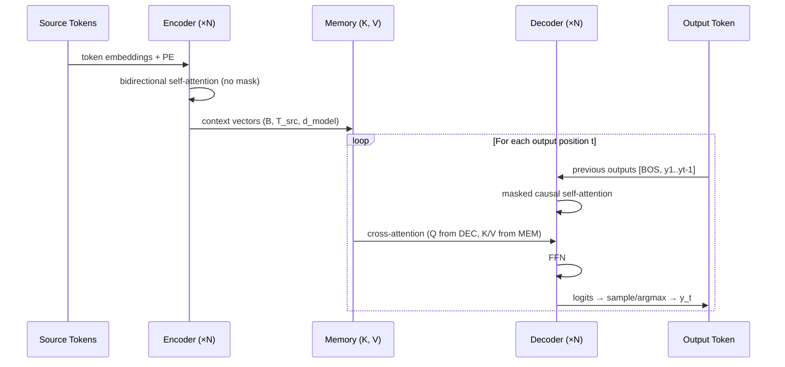

# Encoder-Decoder Architecture

## Prerequisites

- [Lesson 05: Complete Transformer Architecture](./05-transformer-architecture.md) — encoder blocks, decoder blocks, residuals
- [Lesson 01: Introduction to Attention](./01-introduction-to-attention.md) — attention as soft lookup

## What You'll Learn

| Concept | Why it matters |
|---------|---------------|
| Encoder role | Builds context representations; runs once per input |
| Decoder role | Generates output autoregressively; uses cross-attention |
| Cross-attention | Q from decoder, K/V from encoder — the "read" operation |
| Teacher forcing | Training trick: feed ground truth, not model predictions |
| Exposure bias | Gap between training (teacher-forced) and inference behavior |
| Decoding strategies | Greedy, beam search, top-k, nucleus sampling |

---

## Intuition: Encoder as Reader, Decoder as Writer

The encoder reads the entire input and produces a rich, bidirectional representation. It uses unrestricted self-attention — every token can attend to every other token.

The decoder writes the output one token at a time. It uses *causal* self-attention (no peeking at future output tokens) and *cross-attention* (looking at the encoder representation to decide what to write next).

Think of machine translation:

```
Encoder: reads "The cat sat on the mat" in English
         → produces 7 context vectors (one per token)
         each vector encodes "what this token means given its full context"

Decoder: writes French translation token by token
         At each step it asks: "given what I've written so far,
         and given all the English context vectors, what word comes next?"
```

---

## The Encoder: Bidirectional Context

The encoder is `N` identical blocks of `[Self-Attention + FFN]`.

Key property: **no causal mask**. Every encoder token attends to every other encoder token, including future positions. This bidirectional context is why BERT (encoder-only) outperforms GPT (decoder-only) on understanding tasks — it has full context for each representation.

```python
import numpy as np

def encode(
    src_token_ids: np.ndarray,  # (B, T_src)  integer token IDs
    encoder_layers: list,       # list of EncoderBlock
    embed_fn,                   # TransformerEmbedding
    norm_fn,                    # final LayerNorm
    src_padding_mask: np.ndarray | None = None,  # (B, 1, 1, T_src) True=pad
) -> np.ndarray:                # (B, T_src, d_model)
    """
    Run encoder: returns contextual representations (memory).
    No causal masking — every position sees every other.
    """
    x = embed_fn(src_token_ids)          # (B, T_src, d_model)
    for layer in encoder_layers:
        x = layer.forward(x, mask=src_padding_mask)
    return norm_fn.forward(x)            # memory: (B, T_src, d_model)
```

---

## Cross-Attention: Connecting Encoder to Decoder

In each decoder block, after the masked self-attention sublayer, the decoder performs **cross-attention**:

```
Q = decoder_hidden × W_Q      (B, T_tgt, d_k)  — decoder asks questions
K = memory × W_K              (B, T_src, d_k)  — encoder offers keys
V = memory × W_V              (B, T_src, d_v)  — encoder offers values

attention_weights: (B, T_tgt, T_src)
    — for each output token, how much to attend to each input token

cross_attn_output = softmax(Q·K^T / √d_k) · V   (B, T_tgt, d_model)
```

This is where the decoder "reads" the encoder. The attention weights in cross-attention directly correspond to the alignments you'd draw in a translation dictionary.

```python
class CrossAttention:
    """
    Cross-attention: queries from decoder, keys/values from encoder.
    Inherits the same math as self-attention but with different source tensors.
    """

    def __init__(self, d_model: int, num_heads: int):
        self.d_model   = d_model
        self.num_heads = num_heads
        self.d_k       = d_model // num_heads
        scale = 1.0 / np.sqrt(d_model)
        self.W_Q = np.random.randn(d_model, d_model) * scale
        self.W_K = np.random.randn(d_model, d_model) * scale
        self.W_V = np.random.randn(d_model, d_model) * scale
        self.W_O = np.random.randn(d_model, d_model) * scale

    def forward(
        self,
        query: np.ndarray,   # (B, T_tgt, d_model)  — from decoder
        memory: np.ndarray,  # (B, T_src, d_model)  — from encoder
        src_mask: np.ndarray | None = None,
    ) -> tuple[np.ndarray, np.ndarray]:
        """
        Returns
        -------
        output  : (B, T_tgt, d_model)
        weights : (B, num_heads, T_tgt, T_src)  — alignment matrix
        """
        B, T_tgt, _ = query.shape
        _, T_src,  _ = memory.shape
        h = self.num_heads

        Q = query  @ self.W_Q  # (B, T_tgt, d_model)
        K = memory @ self.W_K  # (B, T_src, d_model)
        V = memory @ self.W_V  # (B, T_src, d_model)

        def split(x, T):
            return x.reshape(B, T, h, self.d_k).transpose(0, 2, 1, 3)

        Q = split(Q, T_tgt)  # (B, h, T_tgt, d_k)
        K = split(K, T_src)  # (B, h, T_src, d_k)
        V = split(V, T_src)  # (B, h, T_src, d_k)

        scores = Q @ K.transpose(0, 1, 3, 2) / np.sqrt(self.d_k)  # (B, h, T_tgt, T_src)
        if src_mask is not None:
            scores = np.where(src_mask, -1e9, scores)

        def softmax(x):
            x = x - x.max(axis=-1, keepdims=True)
            return np.exp(x) / np.exp(x).sum(axis=-1, keepdims=True)

        weights = softmax(scores)            # (B, h, T_tgt, T_src)
        heads   = weights @ V               # (B, h, T_tgt, d_k)

        # Merge heads
        merged = heads.transpose(0, 2, 1, 3).reshape(B, T_tgt, self.d_model)
        output = merged @ self.W_O

        return output, weights
```

---

## Training: Teacher Forcing

During training, the decoder does not actually generate tokens — it uses the ground-truth target sequence shifted by one position.

```
Target:  "Le chat s'assit sur le tapis"

Decoder input  (shifted right):  [<BOS>, "Le", "chat", "s'assit", "sur", "le"]
Decoder target (shifted left):   ["Le",   "chat", "s'assit", "sur", "le", "tapis"]

At each position, we compute cross-entropy loss against the target token.
```

This technique is called **teacher forcing** — we force the decoder to see correct previous tokens, not its own (potentially wrong) predictions.

```python
def training_step(
    model,
    src_ids: np.ndarray,  # (B, T_src)
    tgt_ids: np.ndarray,  # (B, T_tgt+1)  including <BOS> and <EOS>
) -> float:
    """One training step with teacher forcing."""
    # Decoder input: everything except last token
    dec_in  = tgt_ids[:, :-1]   # (B, T_tgt)
    # Decoder target: everything except first token (<BOS>)
    dec_tgt = tgt_ids[:, 1:]    # (B, T_tgt)

    # Forward pass
    logits = model.forward(src_ids, dec_in)   # (B, T_tgt, vocab_size)

    # Cross-entropy loss (across batch and sequence)
    B, T, V = logits.shape
    log_probs = log_softmax(logits.reshape(B * T, V), axis=-1)
    targets   = dec_tgt.reshape(B * T)
    loss = -np.mean(log_probs[np.arange(B * T), targets])

    return loss
```

**Exposure bias**: Because teacher forcing feeds ground truth at every training step, the decoder never learns to recover from its own mistakes. At inference, errors accumulate because the decoder feeds its own predictions, not ground truth. This gap is called **exposure bias** and motivates techniques like scheduled sampling (mixing teacher-forced and predicted tokens during training).

---

## Inference: Decoding Strategies

At inference, there is no ground truth. The decoder must generate tokens step by step:

### Greedy Decoding

```python
def greedy_decode(
    model, src_ids: np.ndarray,
    bos_id: int, eos_id: int, max_len: int = 100
) -> list[int]:
    """Take the highest-probability token at each step."""
    memory = model.encode(src_ids)
    generated = [bos_id]

    for _ in range(max_len):
        dec_in  = np.array([generated])   # (1, current_len)
        logits  = model.decode(dec_in, memory)   # (1, current_len, vocab_size)
        next_id = int(np.argmax(logits[0, -1]))  # argmax over vocab
        generated.append(next_id)
        if next_id == eos_id:
            break

    return generated
```

**Problem**: Greedy decoding can miss globally better sequences. "The cat" might be the greedy choice at position 1, but "The feline" might lead to a better overall translation.

### Beam Search

Beam search maintains `k` candidate sequences (the "beam") and expands each at every step:

```
Beam width k=3, vocabulary size V:

Step 0:   ["<BOS>"]   (1 beam)
Step 1:   top-3 from V candidates = [["<BOS> Le"], ["<BOS> Un"], ["<BOS> Le"]]
Step 2:   expand each of 3 → 3V candidates, keep top-3
...
Step T:   select highest-scoring complete sequence
```

Scores are log probabilities summed across positions (with length normalization):

```
score(y) = (1/|y|^α) × Σ log p(y_t | y_{<t}, x)
```

`α` is a length penalty (typically 0.6–0.8) to prevent bias toward short sequences.

### Sampling Strategies

Modern LLMs use stochastic decoding for diversity:

```python
def sample_next_token(logits: np.ndarray, temperature: float = 1.0,
                      top_k: int = 50, top_p: float = 0.9) -> int:
    """
    Sample from logits with temperature, top-k, and nucleus (top-p) filtering.

    logits      : (vocab_size,)
    temperature : >1 = more random, <1 = more peaked
    top_k       : keep only top-k logits
    top_p       : keep smallest set with cumulative probability >= top_p
    """
    # Temperature scaling
    logits = logits / temperature

    # Top-k filtering
    if top_k > 0:
        threshold = np.sort(logits)[-top_k]
        logits = np.where(logits < threshold, -1e9, logits)

    # Top-p (nucleus) filtering
    probs = np.exp(logits - logits.max())
    probs /= probs.sum()

    sorted_idx  = np.argsort(probs)[::-1]
    sorted_prob = probs[sorted_idx]
    cumsum = np.cumsum(sorted_prob)
    # Remove tokens once cumulative prob exceeds top_p
    cutoff = cumsum > top_p
    cutoff[1:] = cutoff[:-1].copy()  # shift right — keep first token that crosses
    cutoff[0]  = False
    sorted_prob[cutoff] = 0.0
    probs[sorted_idx] = sorted_prob
    probs /= probs.sum()

    return int(np.random.choice(len(probs), p=probs))
```

| Strategy | Deterministic | Diversity | Use case |
|----------|---------------|-----------|----------|
| Greedy | Yes | Low | Fast, deterministic output |
| Beam search | Yes (k>1) | Low–Medium | Translation, summarization |
| Top-k sampling | No | High | Creative text, chat |
| Nucleus (top-p) | No | Adaptive | Best general-purpose sampling |
| Temperature only | No | Controllable | When distribution shape is good |

---

## Diagram: Encoder-Decoder Information Flow



---

## Encoder-Decoder vs Decoder-Only

| Aspect | Encoder-Decoder (T5, BART) | Decoder-Only (GPT, LLaMA) |
|--------|---------------------------|--------------------------|
| Input processing | Bidirectional (full context per token) | Causal (left-to-right) |
| Cross-attention | Yes | No |
| Parameters | Higher (two separate stacks) | Lower (one stack) |
| Best for | Translation, summarization, QA with long inputs | Open-ended generation, chat, coding |
| KV cache | Encoder cached once; decoder grows | Decoder KV cache grows with output |
| Training objective | Span corruption (T5), denoising (BART) | Next-token prediction |

**Why do modern LLMs use decoder-only?** Scaling laws favor decoder-only: with the same parameter budget, decoder-only models train more efficiently on next-token prediction at scale, and instruction tuning makes them capable at "understanding" tasks too.

---

## Edge Cases & Misconceptions

!!! warning "Misconception: Encoder output changes during decoding"
    The encoder runs **once** per input sequence and produces a fixed `memory` tensor. All decoder steps read from the same memory. This is why encoder inference is cheap — O(T_src) work per input.

!!! note "Cross-attention vs self-attention masking"
    Self-attention in the decoder uses a causal mask (upper triangular). Cross-attention uses a **padding mask** (mask out padding tokens in the source). Cross-attention never needs a causal mask — the decoder is allowed to look at any part of the source input.

!!! warning "Misconception: Beam search always beats sampling"
    For open-ended generation (stories, chat), beam search produces repetitive, generic text. Nucleus sampling (top-p) produces more diverse and natural text. For constrained generation (translation), beam search with length penalty is usually preferred.

---

## Production Connection

**T5 and BART in production**: Encoder-decoder models like T5 are deployed for translation, summarization, and question answering in Google products. The encoder runs once per document; multiple summarization targets can be decoded in batch from the same encoder output.

**Prefix caching**: When the same prompt prefix appears in many requests (e.g., a shared system prompt), production inference engines cache the encoder/prefix KV state and reuse it. This is called prefix caching or prompt caching, reducing latency by 50–90% for repeated prefixes.

---

## Beam Search: Implementation and Analysis

Greedy decoding picks the most probable token at each step. Beam search keeps the top-k most probable sequences at each step:

```python
import heapq
from dataclasses import dataclass, field


@dataclass(order=True)
class Hypothesis:
    """A partial hypothesis in beam search."""
    neg_score:  float          # negative log prob (for min-heap)
    tokens:     list[int] = field(compare=False)
    score:      float = field(compare=False)  # cumulative log prob


def beam_search(
    model,
    tokenizer,
    prompt:     str,
    beam_width: int   = 4,
    max_len:    int   = 50,
    length_pen: float = 0.6,   # α in Google's formula: score / len^α
) -> list[str]:
    """
    Beam search decoding.

    At each step, keep the top beam_width sequences by cumulative log probability.
    Length penalty prevents shorter sequences from dominating.

    Google's length penalty: score / ((5 + len) / 6)^α
    """
    import torch
    import torch.nn.functional as F

    input_ids = tokenizer(prompt, return_tensors="pt").input_ids

    # Initialize: one beam per prompt
    active_beams = [Hypothesis(neg_score=0.0, tokens=input_ids[0].tolist(), score=0.0)]
    completed    = []

    for step in range(max_len):
        all_candidates = []

        for hyp in active_beams:
            # Skip completed sequences
            if hyp.tokens[-1] == tokenizer.eos_token_id:
                completed.append(hyp)
                continue

            # Get next-token logits
            ids = torch.tensor(hyp.tokens).unsqueeze(0)
            with torch.no_grad():
                logits = model(ids).logits[0, -1]    # (vocab_size,)

            log_probs = F.log_softmax(logits, dim=-1)   # (vocab_size,)

            # Expand: add all candidate next tokens
            top_log_probs, top_ids = log_probs.topk(beam_width)

            for log_p, token_id in zip(top_log_probs, top_ids):
                new_score  = hyp.score + log_p.item()
                new_tokens = hyp.tokens + [token_id.item()]

                # Apply length penalty for comparison
                length      = len(new_tokens)
                penalized   = new_score / ((5 + length) / 6) ** length_pen

                all_candidates.append(
                    Hypothesis(neg_score=-penalized, tokens=new_tokens, score=new_score)
                )

        # Keep top beam_width candidates
        active_beams = sorted(all_candidates)[:beam_width]

        if not active_beams:
            break

    # Take best completed sequence (or active if none completed)
    best = (completed + active_beams)[0]
    return tokenizer.decode(best.tokens, skip_special_tokens=True)


# Comparison: greedy vs beam search
DECODING_COMPARISON = """
Input: "Translate to French: The weather is beautiful today."

Greedy (k=1):     "Le temps est beau aujourd'hui."     ← correct but safe
Beam (k=4):       "Le temps est magnifique aujourd'hui." ← more natural word choice
Sampling (top-p): "Quel temps splendide il fait aujourd'hui!" ← more varied, creative
"""
print(DECODING_COMPARISON)
```

**When to use each**:
- **Greedy**: fastest, acceptable for shorter outputs (code, JSON)
- **Beam search**: translation, structured text where quality matters
- **Sampling (top-k/nucleus)**: creative writing, chat — diverse outputs

---

## Key Takeaways

1. **Encoder** builds bidirectional context representations; it runs once and produces the `memory` tensor.
2. **Decoder** generates outputs autoregressively; each step uses causal self-attention + cross-attention to the encoder memory.
3. **Cross-attention** queries come from the decoder; keys and values come from the encoder — this is the alignment mechanism.
4. **Teacher forcing** feeds ground-truth tokens during training, accelerating learning but introducing exposure bias at inference.
5. **Decoding strategies**: greedy is fast, beam search is precise, nucleus sampling is diverse — choose based on task.
6. **Modern LLMs** are decoder-only: they drop the encoder and cross-attention, relying on a single autoregressive stack trained at scale.

---

## Further Reading

- [Vaswani et al. 2017](https://arxiv.org/abs/1706.03762) — Sections 3.3 (Decoder) and 5 (Training)
- [Raffel et al. 2020](https://arxiv.org/abs/1910.10683) — T5: Exploring the limits of transfer learning
- [Lewis et al. 2020](https://arxiv.org/abs/1910.13461) — BART: Denoising sequence-to-sequence pre-training
- [Holtzman et al. 2020](https://arxiv.org/abs/1904.09751) — The curious case of neural text degeneration (nucleus sampling)

---

## 🚀 Next Lesson

**[Lesson 7: Training Transformers](./07-training-transformers.md)** — warmup schedules, label smoothing, gradient clipping, mixed-precision training, and distributed training techniques.
