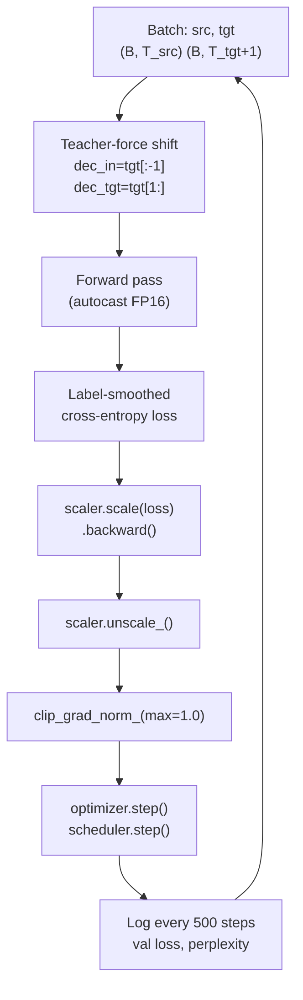

# Training Transformers

## Prerequisites

- [Lesson 05: Complete Transformer Architecture](./05-transformer-architecture.md) — the full model structure
- [Module 05 L04: Gradient Descent](../../module-05-neural-networks-deep-learning-fundamentals/lessons/04-gradient-descent.md) — Adam optimizer, learning rates
- [Module 05 L10: Training Best Practices](../../module-05-neural-networks-deep-learning-fundamentals/lessons/10-training-best-practices.md) — initialization, batch norm

## What You'll Learn

| Concept | Why it matters |
|---------|---------------|
| Noam LR schedule | Warmup prevents early instability; decay helps final convergence |
| Label smoothing | Prevents overconfident predictions, improves calibration |
| Gradient clipping | Prevents exploding gradients in deep Transformers |
| Mixed precision | 2× speedup + 2× memory savings with FP16/BF16 |
| Distributed training | Data parallelism, pipeline parallelism, tensor parallelism |

---

## Intuition: Why Transformer Training Is Tricky

A 6-layer Transformer has:
- 6 × (MHA + FFN) blocks with residual connections
- Layer norms at every sublayer
- Attention scores that interact multiplicatively across positions

Early in training, the model is random — attention scores are nearly uniform, FFN outputs are small. If the learning rate is too high from step 1, the QKV weights diverge immediately and the model never recovers. If the learning rate is too low, training is painfully slow.

The solution: **start low, ramp up, then decay**.

---

## 1. The Noam Learning Rate Schedule

The original Transformer paper used:

```
lr(step) = d_model^(-0.5) × min(step^(-0.5), step × warmup_steps^(-1.5))
```

Two phases:
- **Warmup** (0 → `warmup_steps`): LR increases linearly — `step × warmup_steps^(-1.5)`
- **Decay** (after `warmup_steps`): LR decreases as `step^(-0.5)`

```python
import numpy as np
import matplotlib.pyplot as plt


def noam_lr(step: int, d_model: int, warmup_steps: int = 4000) -> float:
    """
    Noam learning rate schedule from Vaswani et al. 2017.

    Parameters
    ----------
    step         : current training step (1-indexed)
    d_model      : model dimension (scales the overall magnitude)
    warmup_steps : steps to linearly increase LR
    """
    step = max(step, 1)  # avoid division by zero
    arg1 = step ** (-0.5)
    arg2 = step * (warmup_steps ** (-1.5))
    return (d_model ** (-0.5)) * min(arg1, arg2)


# ── Visualization ─────────────────────────────────────────────────────────────
steps = np.arange(1, 40_001)
lr_512  = [noam_lr(s, d_model=512,  warmup_steps=4000) for s in steps]
lr_768  = [noam_lr(s, d_model=768,  warmup_steps=4000) for s in steps]
lr_1024 = [noam_lr(s, d_model=1024, warmup_steps=4000) for s in steps]

plt.figure(figsize=(10, 4))
for lr, label in zip([lr_512, lr_768, lr_1024], ["d=512", "d=768", "d=1024"]):
    plt.plot(steps, lr, label=label)
plt.axvline(4000, color="red", linestyle="--", label="warmup_steps=4000")
plt.xlabel("Training step")
plt.ylabel("Learning rate")
plt.title("Noam LR Schedule")
plt.legend()
plt.tight_layout()
plt.show()
```

**PyTorch scheduler wrapper**:

```python
import torch
from torch.optim.lr_scheduler import LambdaLR


def get_noam_scheduler(
    optimizer: torch.optim.Optimizer,
    d_model: int,
    warmup_steps: int = 4000,
) -> LambdaLR:
    """Returns a PyTorch LR scheduler implementing the Noam schedule."""
    def lr_lambda(step: int) -> float:
        step = max(step, 1)
        return (d_model ** -0.5) * min(step ** -0.5,
                                        step * warmup_steps ** -1.5)

    return LambdaLR(optimizer, lr_lambda=lr_lambda)


# Usage
model = ...  # your Transformer model
optimizer = torch.optim.Adam(model.parameters(), lr=1.0,
                              betas=(0.9, 0.98), eps=1e-9)
scheduler = get_noam_scheduler(optimizer, d_model=512)

for step, batch in enumerate(dataloader, start=1):
    optimizer.zero_grad()
    loss = model(batch)
    loss.backward()
    optimizer.step()
    scheduler.step()
```

!!! note "Modern alternative: cosine with warmup"
    Most post-2020 training recipes use cosine annealing with linear warmup instead of Noam. PyTorch's `get_cosine_schedule_with_warmup` from HuggingFace Transformers is now standard.

---

## 2. Label Smoothing

**Problem**: Cross-entropy loss encourages the model to push the correct class probability to 1.0. This creates overconfident logits that don't generalize well and produce poor calibration.

**Solution**: Soften the one-hot target distribution.

```
Hard target:   [0, 0, 0, 1, 0, 0]   ← 100% on correct token
Smooth target: [ε/V, ε/V, ε/V, 1-ε+ε/V, ε/V, ε/V]

where ε = smoothing factor (typically 0.1), V = vocabulary size
```

The model now needs to assign probability `1-ε` to the correct token and spread `ε` uniformly over all tokens.

```python
import numpy as np


def cross_entropy_with_label_smoothing(
    logits: np.ndarray,   # (B×T, V)
    targets: np.ndarray,  # (B×T,)  integer class indices
    smoothing: float = 0.1,
) -> float:
    """
    Label-smoothed cross-entropy.
    """
    V = logits.shape[-1]
    # Numerically stable log-softmax
    logits_shifted = logits - logits.max(axis=-1, keepdims=True)
    log_probs = logits_shifted - np.log(np.exp(logits_shifted).sum(axis=-1, keepdims=True))

    # Hard target loss (cross-entropy)
    nll = -log_probs[np.arange(len(targets)), targets]       # (B×T,)

    # Soft target loss (uniform over all tokens)
    smooth_loss = -log_probs.mean(axis=-1)                   # (B×T,)

    # Blend
    loss = (1 - smoothing) * nll + smoothing * smooth_loss
    return float(loss.mean())


# PyTorch version (cleaner)
import torch
import torch.nn as nn


class LabelSmoothingCrossEntropy(nn.Module):
    def __init__(self, smoothing: float = 0.1, ignore_index: int = -100):
        super().__init__()
        self.smoothing    = smoothing
        self.ignore_index = ignore_index

    def forward(self, logits: torch.Tensor, targets: torch.Tensor) -> torch.Tensor:
        """
        logits  : (B×T, V)
        targets : (B×T,)
        """
        V = logits.size(-1)
        log_probs = torch.log_softmax(logits, dim=-1)

        # NLL loss (hard labels)
        nll = torch.nn.functional.nll_loss(
            log_probs, targets, ignore_index=self.ignore_index, reduction="none"
        )
        # Uniform loss (smooth labels)
        smooth = -log_probs.mean(dim=-1)

        loss = (1 - self.smoothing) * nll + self.smoothing * smooth

        # Mask padded positions
        mask = (targets != self.ignore_index).float()
        return (loss * mask).sum() / mask.sum()
```

**Effect**: Label smoothing improves BLEU scores by ~0.5–1.0 on translation tasks and reduces overconfidence (measured by ECE — Expected Calibration Error).

---

## 3. Gradient Clipping

Transformers can suffer from gradient spikes, especially early in training. A single large gradient update can destroy careful weight initialization.

**Global gradient clipping** rescales the gradient so its L2 norm never exceeds `max_norm`:

```
g_clipped = g × (max_norm / ‖g‖₂)   if ‖g‖₂ > max_norm
```

```python
import numpy as np


def clip_grad_norm(
    params: list[np.ndarray],
    max_norm: float = 1.0,
) -> float:
    """
    Clip gradients by global L2 norm.

    Returns the pre-clipping norm (useful for monitoring).
    """
    # Compute global norm across all parameters
    total_sq = sum(np.sum(p ** 2) for p in params)
    global_norm = float(np.sqrt(total_sq))

    if global_norm > max_norm:
        clip_coef = max_norm / (global_norm + 1e-6)
        for i in range(len(params)):
            params[i] *= clip_coef

    return global_norm


# PyTorch one-liner
torch.nn.utils.clip_grad_norm_(model.parameters(), max_norm=1.0)
```

**Typical values**: `max_norm=1.0` for most Transformers. GPT-3 used `max_norm=1.0` with Adam. If you see NaN loss, try `max_norm=0.1`.

---

## 4. Mixed Precision Training (FP16/BF16)

Modern GPUs have specialized tensor cores for FP16 arithmetic that are 2× faster than FP32. But FP16 has limited dynamic range (max ~65504), causing gradient underflow.

**The solution**: keep weights in FP32 but compute forward/backward in FP16 with **loss scaling**.

```python
import torch
from torch.cuda.amp import autocast, GradScaler


def train_with_amp(model, optimizer, scheduler, dataloader, device="cuda"):
    """Training loop with Automatic Mixed Precision (AMP)."""
    model.to(device)
    scaler = GradScaler()   # manages loss scaling automatically
    criterion = LabelSmoothingCrossEntropy(smoothing=0.1)

    for step, (src, tgt) in enumerate(dataloader, start=1):
        src, tgt = src.to(device), tgt.to(device)
        optimizer.zero_grad()

        # Forward pass in FP16
        with autocast():
            logits = model(src, tgt[:, :-1])   # (B, T, vocab_size)
            B, T, V = logits.shape
            loss = criterion(
                logits.reshape(B * T, V),
                tgt[:, 1:].reshape(B * T)
            )

        # Backward pass: scaler unscales gradients before clipping
        scaler.scale(loss).backward()

        # Unscale before clipping
        scaler.unscale_(optimizer)
        torch.nn.utils.clip_grad_norm_(model.parameters(), max_norm=1.0)

        # Optimizer step (updates loss scale based on gradient health)
        scaler.step(optimizer)
        scaler.update()
        scheduler.step()

        if step % 100 == 0:
            print(f"Step {step}: loss={loss.item():.4f}, "
                  f"scale={scaler.get_scale():.0f}")
```

**BF16 vs FP16**: BF16 (used in A100 GPUs, TPUs, and modern training) has the same exponent range as FP32 but only 7 mantissa bits (vs FP16's 10). BF16 rarely overflows, eliminating the need for loss scaling. Most modern LLM training uses BF16.

---

## 5. Complete Training Loop

```python
import torch
import torch.nn as nn
from torch.utils.data import DataLoader


def train_transformer(
    model: nn.Module,
    train_loader: DataLoader,
    val_loader: DataLoader,
    d_model: int = 512,
    warmup_steps: int = 4000,
    total_steps: int = 100_000,
    device: str = "cuda",
) -> dict:
    """Full Transformer training loop."""

    model.to(device)
    optimizer  = torch.optim.Adam(model.parameters(), lr=1.0,
                                   betas=(0.9, 0.98), eps=1e-9)
    scheduler  = get_noam_scheduler(optimizer, d_model, warmup_steps)
    criterion  = LabelSmoothingCrossEntropy(smoothing=0.1, ignore_index=0)
    scaler     = torch.cuda.amp.GradScaler()

    history = {"train_loss": [], "val_loss": []}
    global_step = 0

    model.train()
    for epoch in range(999):  # run until total_steps
        for src, tgt in train_loader:
            if global_step >= total_steps:
                break

            src, tgt = src.to(device), tgt.to(device)
            dec_in  = tgt[:, :-1]
            dec_tgt = tgt[:, 1:]

            optimizer.zero_grad()

            with torch.cuda.amp.autocast():
                logits = model(src, dec_in)   # (B, T, V)
                B, T, V = logits.shape
                loss = criterion(logits.reshape(B * T, V),
                                 dec_tgt.reshape(B * T))

            scaler.scale(loss).backward()
            scaler.unscale_(optimizer)
            torch.nn.utils.clip_grad_norm_(model.parameters(), 1.0)
            scaler.step(optimizer)
            scaler.update()
            scheduler.step()

            global_step += 1

            if global_step % 500 == 0:
                val_loss = evaluate(model, val_loader, criterion, device)
                history["train_loss"].append(loss.item())
                history["val_loss"].append(val_loss)
                current_lr = optimizer.param_groups[0]["lr"]
                print(f"Step {global_step:6d} | "
                      f"LR: {current_lr:.2e} | "
                      f"Train Loss: {loss.item():.4f} | "
                      f"Val Loss: {val_loss:.4f}")
                model.train()

    return history


@torch.no_grad()
def evaluate(model, loader, criterion, device):
    model.eval()
    total_loss, total_tokens = 0.0, 0
    for src, tgt in loader:
        src, tgt = src.to(device), tgt.to(device)
        dec_in, dec_tgt = tgt[:, :-1], tgt[:, 1:]
        logits = model(src, dec_in)
        B, T, V = logits.shape
        loss = criterion(logits.reshape(B * T, V), dec_tgt.reshape(B * T))
        non_pad = (dec_tgt != 0).sum().item()
        total_loss   += loss.item() * non_pad
        total_tokens += non_pad
    return total_loss / total_tokens
```

---

## 6. Distributed Training Overview

For large models, single-GPU training is insufficient:

| Strategy | How it works | When to use |
|----------|-------------|-------------|
| **Data parallelism** | Copy model to N GPUs; split batch across GPUs; sync gradients | Model fits on 1 GPU; more GPUs = more throughput |
| **Pipeline parallelism** | Split layers across GPUs; micro-batching to hide bubble | Model too large for 1 GPU; N GPUs = deeper model |
| **Tensor parallelism** | Split weight matrices column/row-wise across GPUs | Single layers too large for 1 GPU |
| **ZeRO (DeepSpeed)** | Shard optimizer states, gradients, and parameters | Training 70B+ models on commodity GPUs |

```python
# Data parallelism in PyTorch (simplest form)
model = nn.DataParallel(model)          # wraps automatically

# Distributed (preferred for production)
import torch.distributed as dist
torch.distributed.init_process_group(backend="nccl")
model = nn.parallel.DistributedDataParallel(model, device_ids=[local_rank])
```

---

## Diagram: Training Loop



---

## Edge Cases & Misconceptions

!!! warning "Misconception: Larger batch = always better"
    Large batches improve GPU utilization but can hurt generalization (sharp minima). Gradient accumulation simulates large batches without requiring more GPU memory: run N forward passes with batch_size/N, accumulate gradients, then step once.

!!! note "Gradient accumulation"
    ```python
    GRAD_ACCUM = 8   # simulate batch_size × 8
    for i, batch in enumerate(loader):
        loss = model(batch) / GRAD_ACCUM
        loss.backward()
        if (i + 1) % GRAD_ACCUM == 0:
            clip_grad_norm_(model.parameters(), 1.0)
            optimizer.step()
            optimizer.zero_grad()
    ```

!!! warning "Misconception: Label smoothing makes training worse"
    Label smoothing hurts training loss (by design — we're not optimizing toward one-hot targets) but improves validation loss and downstream task performance. Don't judge by training loss alone.

---

## Production Connection

**Karpathy's nanoGPT** implements a complete GPT training loop in ~300 lines of PyTorch, including gradient accumulation, AMP, and the cosine warmup schedule. It is the canonical reference for Transformer training in one file.

**LLaMA training**: Meta used BF16, gradient clipping at 1.0, AdamW with β₁=0.9, β₂=0.95, cosine schedule to 10% of peak LR, and batch sizes of 4M tokens. The training loss curve is the primary metric — a spike indicates instability (often fixed by rolling back a checkpoint).

---

## Diagnosing Training Problems

When training a Transformer, loss curves tell a story. Here are the most common pathologies and fixes:

```python
import numpy as np
import matplotlib.pyplot as plt


def diagnose_training_run(
    train_losses: list[float],
    val_losses:   list[float],
) -> dict:
    """
    Automated training diagnostics.

    Common pathologies:
    1. Loss spike early: LR too high → use warmup
    2. Flat loss: LR too low or gradient vanishing → check grad norm
    3. Training << val loss (overfitting): add dropout or reduce model size
    4. Both losses plateau: LR too low or wrong schedule
    5. NaN loss: LR explosion, check gradient norm before and after clipping
    """
    train = np.array(train_losses)
    val   = np.array(val_losses)

    # Detect spikes
    diffs = np.diff(train)
    spikes = (diffs > 2 * np.std(diffs)).sum()

    # Detect plateau (last 20% of training shows < 1% improvement)
    last_20 = train[int(0.8 * len(train)):]
    plateau = (last_20.max() - last_20.min()) / last_20.mean() < 0.01

    # Detect overfitting
    overfit_gap = (val[-1] - train[-1]) / train[-1]

    diagnostics = {
        "spikes": spikes,
        "plateau": plateau,
        "overfit_ratio": overfit_gap,
        "final_train_loss": float(train[-1]),
        "final_val_loss": float(val[-1]),
    }

    print("=== Training Diagnosis ===")
    if spikes > 0:
        print(f"⚠ {spikes} loss spike(s) detected → reduce LR or add warmup steps")
    if plateau:
        print("⚠ Training plateau → try cosine decay or reduce LR by 10×")
    if overfit_gap > 0.2:
        print(f"⚠ Overfit gap {overfit_gap:.1%} → add dropout, reduce model, or more data")
    if not any([spikes, plateau, overfit_gap > 0.2]):
        print("✓ Training looks healthy")

    return diagnostics


# Loss spike recovery: roll back to previous checkpoint
def training_loop_with_recovery(model, optimizer, loader, max_loss_spike: float = 5.0):
    """
    Automatically recover from loss spikes by checkpointing.
    Detects spikes as loss > max_loss_spike × previous_loss.
    """
    import copy, torch

    best_state = copy.deepcopy(model.state_dict())
    prev_loss  = float("inf")

    for step, batch in enumerate(loader):
        loss = compute_loss(model, batch)

        # Detect spike
        if loss.item() > max_loss_spike * prev_loss and step > 100:
            print(f"Loss spike at step {step}: {loss.item():.4f} vs prev {prev_loss:.4f}. Rolling back.")
            model.load_state_dict(best_state)
            optimizer.param_groups[0]["lr"] *= 0.5  # also halve LR
            continue

        loss.backward()
        torch.nn.utils.clip_grad_norm_(model.parameters(), 1.0)
        optimizer.step()
        optimizer.zero_grad()

        if loss.item() < prev_loss:
            best_state = copy.deepcopy(model.state_dict())

        prev_loss = loss.item()


def compute_loss(model, batch):
    """Placeholder — actual loss computation."""
    import torch
    return torch.tensor(0.5)  # demo
```

**Gradient norm monitoring** is essential for Transformers. Log it every N steps:

```python
import torch


def log_grad_norm(model, step: int, log_interval: int = 100) -> float:
    """
    Compute and log gradient norm before clipping.
    Healthy range: 0.1 – 5.0
    Spike: > 10 (may clip too aggressively)
    Near-zero: < 0.01 (vanishing gradient — check LR and initialization)
    """
    total_norm = torch.nn.utils.clip_grad_norm_(
        model.parameters(), float("inf")  # compute only, no clip
    )

    if step % log_interval == 0:
        status = "OK" if 0.1 < total_norm < 10 else "⚠ CHECK"
        print(f"Step {step:6d}: grad_norm={total_norm:.4f} [{status}]")

    return total_norm.item()
```

---

## Key Takeaways

1. **Noam warmup schedule**: linear warmup prevents early instability; the `1/√step` decay helps final convergence; use cosine with warmup for modern recipes.
2. **Label smoothing (ε=0.1)** prevents overconfidence and improves calibration; costs ~0.5 BLEU in training but gains in generalization.
3. **Gradient clipping (max_norm=1.0)** is essential for deep Transformers; NaN loss almost always means gradient explosion.
4. **Mixed precision (FP16/BF16)** gives 2× speedup and halves memory; BF16 is preferred for modern hardware (A100+) as it doesn't overflow.
5. **Distributed training** strategies — data, pipeline, tensor parallelism — each targets a different bottleneck; ZeRO shards optimizer state for memory savings.

---

## Further Reading

- [Vaswani et al. 2017](https://arxiv.org/abs/1706.03762) — Section 5: Training (Noam schedule, label smoothing)
- [Karpathy: nanoGPT](https://github.com/karpathy/nanoGPT) — 300-line training loop with all the above
- [Mixed Precision Training](https://arxiv.org/abs/1710.03740) — Micikevicius et al. 2018
- [ZeRO: Memory Optimizations](https://arxiv.org/abs/1910.02054) — Rajbhandari et al. 2020 (DeepSpeed)
- [The Annotated Transformer](https://nlp.seas.harvard.edu/annotated-transformer/) — Harvard NLP implementation

---

## 🚀 Next Lesson

**[Lesson 8: Transformer Variants](./08-transformer-variants.md)** — how BERT, GPT, T5, LLaMA, and Mistral differ in architecture, training objective, and use case.
