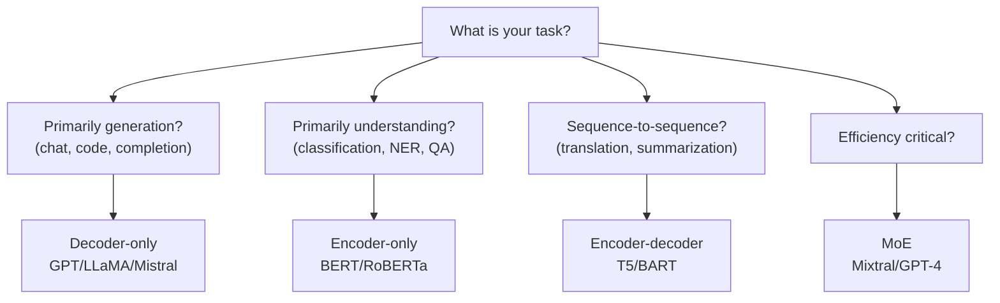

# Transformer Variants

## Prerequisites

- [Lesson 05: Complete Transformer Architecture](./05-transformer-architecture.md) — encoder, decoder, attention
- [Lesson 04: Positional Encoding](./04-positional-encoding.md) — RoPE, ALiBi

## What You'll Learn

| Model family | Architecture | Training objective | Best tasks |
|-------------|-------------|-------------------|------------|
| BERT | Encoder-only | Masked LM + NSP | Classification, NER, QA |
| GPT | Decoder-only | Causal LM (next token) | Generation, completion |
| T5 | Encoder-decoder | Span corruption | All NLP as text-to-text |
| LLaMA | Decoder-only | Causal LM | Open-source foundation |
| Mistral/Mixtral | Decoder-only (MoE) | Causal LM | Efficient generation |

---

## Intuition: Three Families, Three Design Philosophies

**Encoder-only (BERT)**: "Read deeply." Train the model to understand input by making it fill in masked words, using full bidirectional attention. Best at tasks where you need a rich representation of input.

**Decoder-only (GPT)**: "Write fluently." Train the model to predict the next word, using causal attention. Best at generation — and surprisingly good at everything else when scaled.

**Encoder-decoder (T5)**: "Transform input to output." Train the model on corrupted spans and reconstruct them. Best at mapping input sequences to output sequences with different lengths or structures.

---

## Architecture 1: BERT (Encoder-Only)

**Paper**: Devlin et al. 2018 — "BERT: Pre-Training of Deep Bidirectional Transformers for Language Understanding"

**Design choices**:
- Bidirectional self-attention (no causal mask)
- `[CLS]` token prepended; its final representation is used for classification
- `[SEP]` token separates two sentences for pair tasks
- WordPiece tokenization (vocabulary size: 30,522)

**Training objectives**:
1. **Masked Language Modeling (MLM)**: randomly mask 15% of tokens; predict masked tokens
   - 80% replace with `[MASK]`
   - 10% replace with random token
   - 10% keep original (so model cannot rely on `[MASK]` signal alone)

2. **Next Sentence Prediction (NSP)**: given sentence pair (A, B), predict if B follows A
   - Later research (RoBERTa) showed NSP is not helpful; dropped in most successors

```python
# BERT-style masked language modeling data preparation
import numpy as np

def mask_tokens(
    token_ids: np.ndarray,      # (n,)
    vocab_size: int,
    mask_id: int,
    mask_prob: float = 0.15,
) -> tuple[np.ndarray, np.ndarray, np.ndarray]:
    """
    Apply BERT-style masking.

    Returns
    -------
    masked_ids : (n,)  — input with masking applied
    labels     : (n,)  — original ids at masked positions, -100 elsewhere
    mask       : (n,)  — boolean mask of modified positions
    """
    labels     = np.full_like(token_ids, fill_value=-100)
    masked_ids = token_ids.copy()

    # Sample positions to mask
    mask = np.random.rand(len(token_ids)) < mask_prob

    for i in np.where(mask)[0]:
        labels[i] = token_ids[i]   # store original for loss
        r = np.random.rand()
        if r < 0.80:
            masked_ids[i] = mask_id      # replace with [MASK]
        elif r < 0.90:
            masked_ids[i] = np.random.randint(0, vocab_size)  # random token
        # else: keep original

    return masked_ids, labels, mask


# Example
token_ids = np.array([101, 2023, 2003, 1037, 4937, 102])   # [CLS] This is a cat [SEP]
masked, labels, mask = mask_tokens(token_ids, vocab_size=30522, mask_id=103)
print("Original:", token_ids)
print("Masked:  ", masked)
print("Labels:  ", labels)  # -100 = ignore in loss
```

**Using BERT for classification**:

```python
import torch
from transformers import BertModel, BertTokenizer

tokenizer = BertTokenizer.from_pretrained("bert-base-uncased")
model     = BertModel.from_pretrained("bert-base-uncased")

text   = "The movie was absolutely fantastic!"
inputs = tokenizer(text, return_tensors="pt")

with torch.no_grad():
    outputs = model(**inputs)

# [CLS] representation for classification
cls_repr = outputs.last_hidden_state[:, 0, :]  # (1, 768)
print("CLS shape:", cls_repr.shape)
```

**BERT model sizes**:
| Model | Layers | d_model | Heads | Parameters |
|-------|--------|---------|-------|------------|
| BERT-Base | 12 | 768 | 12 | 110M |
| BERT-Large | 24 | 1024 | 16 | 340M |
| RoBERTa-Base | 12 | 768 | 12 | 125M |

---

## Architecture 2: GPT (Decoder-Only)

**Paper**: Radford et al. 2018 (GPT), 2019 (GPT-2)

**Design choices**:
- Causal (autoregressive) self-attention — each token only sees left context
- No `[CLS]` token; classification uses last token's representation
- BPE tokenization (vocabulary size: 50,257 in GPT-2)
- Pre-LayerNorm (GPT-2 onward)

**Training objective**: next-token prediction (causal language modeling)

```
P(token_t | token_1, ..., token_{t-1})
```

This single objective, applied to internet-scale data, produces emergent capabilities: summarization, translation, coding — all without task-specific fine-tuning at scale.

```python
# GPT-style causal language modeling
import torch
from transformers import GPT2LMHeadModel, GPT2Tokenizer

tokenizer = GPT2Tokenizer.from_pretrained("gpt2")
model     = GPT2LMHeadModel.from_pretrained("gpt2")

# Text generation
input_ids = tokenizer.encode("The future of AI is", return_tensors="pt")

with torch.no_grad():
    output_ids = model.generate(
        input_ids,
        max_new_tokens=50,
        do_sample=True,
        top_p=0.9,
        temperature=0.8,
        pad_token_id=tokenizer.eos_token_id,
    )

print(tokenizer.decode(output_ids[0], skip_special_tokens=True))
```

**GPT model sizes**:
| Model | Layers | d_model | Heads | Parameters |
|-------|--------|---------|-------|------------|
| GPT-1 | 12 | 768 | 12 | 117M |
| GPT-2 XL | 48 | 1600 | 25 | 1.5B |
| GPT-3 | 96 | 12288 | 96 | 175B |
| GPT-4 | ~96 | ~12288 | ~96 | ~1.7T (estimated) |

---

## Architecture 3: T5 (Encoder-Decoder)

**Paper**: Raffel et al. 2020 — "Exploring the Limits of Transfer Learning with a Unified Text-to-Text Transformer"

**Philosophy**: Every NLP task is a text-to-text problem.

```
Task           Input                          Output
Translation:   "translate en to fr: Hello"   "Bonjour"
Summarization: "summarize: [long article]"   "Short summary"
QA:            "question: What is AI? context: [text]" "AI stands for..."
Classification:"sentiment: This is great!"   "positive"
```

**Training objective**: Span corruption
- Replace consecutive token spans with a single sentinel token (`<extra_id_0>`, etc.)
- Model reconstructs the original spans

```
Input:  "Thank you <extra_id_0> me to your <extra_id_1> week."
Target: "<extra_id_0> for inviting <extra_id_1> party last <extra_id_2>"
```

```python
from transformers import T5ForConditionalGeneration, T5Tokenizer

tokenizer = T5Tokenizer.from_pretrained("t5-small")
model     = T5ForConditionalGeneration.from_pretrained("t5-small")

# Translation
input_ids = tokenizer(
    "translate English to French: The house is wonderful.",
    return_tensors="pt"
).input_ids

outputs = model.generate(input_ids, max_new_tokens=30)
print(tokenizer.decode(outputs[0], skip_special_tokens=True))
# "La maison est magnifique."
```

---

## Architecture 4: LLaMA (Open Foundation Models)

**Paper**: Touvron et al. 2023 — LLaMA: Open and Efficient Foundation Language Models

LLaMA is a decoder-only model like GPT, but with several architectural improvements:

### 1. RMSNorm instead of LayerNorm

```
RMSNorm(x) = x / RMS(x) × γ
RMS(x) = √(mean(x²))
```

Removes the mean-centering from LayerNorm. 10–15% faster to compute. LLaMA uses Pre-RMSNorm (normalize before each sublayer).

```python
import torch
import torch.nn as nn

class RMSNorm(nn.Module):
    def __init__(self, d_model: int, eps: float = 1e-6):
        super().__init__()
        self.weight = nn.Parameter(torch.ones(d_model))
        self.eps = eps

    def forward(self, x: torch.Tensor) -> torch.Tensor:
        # x: (B, n, d_model)
        rms = x.pow(2).mean(dim=-1, keepdim=True).add(self.eps).sqrt()
        return x / rms * self.weight
```

### 2. SwiGLU activation in FFN

```
SwiGLU(x, W, V, W₂) = (Swish(xW) ⊙ xV) · W₂
Swish(z) = z · σ(z)    (sigmoid linear unit)
```

SwiGLU uses 3 weight matrices instead of 2, but typically `d_ff = 2/3 × 4 × d_model` to keep parameter count constant. Empirically, SwiGLU outperforms ReLU and GELU in language modeling perplexity.

```python
class SwiGLU(nn.Module):
    def __init__(self, d_model: int, d_ff: int):
        super().__init__()
        self.W  = nn.Linear(d_model, d_ff, bias=False)
        self.V  = nn.Linear(d_model, d_ff, bias=False)
        self.W2 = nn.Linear(d_ff, d_model, bias=False)

    def forward(self, x: torch.Tensor) -> torch.Tensor:
        # x: (B, n, d_model)
        gate = torch.sigmoid(self.W(x)) * self.W(x)   # Swish
        return self.W2(gate * self.V(x))               # ⊙ = element-wise
```

### 3. Rotary Position Embeddings (RoPE)

Covered in depth in [Lesson 04](./04-positional-encoding.md). RoPE applies rotation to Q and K vectors based on position, encoding relative distances in the dot product.

### 4. Grouped-Query Attention (GQA) in LLaMA-3

LLaMA-3 70B uses `num_query_heads=64`, `num_kv_heads=8`. Each KV head is shared by 8 query heads:

```python
# Grouped-Query Attention
def grouped_query_attention(Q, K, V, num_q_heads, num_kv_heads):
    """
    Q: (B, num_q_heads, n, d_k)
    K: (B, num_kv_heads, n, d_k)
    V: (B, num_kv_heads, n, d_v)
    """
    groups = num_q_heads // num_kv_heads
    # Repeat K and V to match Q heads
    K = K.repeat_interleave(groups, dim=1)   # (B, num_q_heads, n, d_k)
    V = V.repeat_interleave(groups, dim=1)   # (B, num_q_heads, n, d_v)
    # Standard attention now
    scores = Q @ K.transpose(-2, -1) / (Q.shape[-1] ** 0.5)
    weights = torch.softmax(scores, dim=-1)
    return weights @ V
```

**LLaMA model sizes**:
| Model | Layers | d_model | Heads (Q/KV) | Parameters |
|-------|--------|---------|-------------|------------|
| LLaMA-3-8B | 32 | 4096 | 32/8 | 8B |
| LLaMA-3-70B | 80 | 8192 | 64/8 | 70B |
| LLaMA-3-405B | 126 | 16384 | 128/16 | 405B |

---

## Architecture 5: Mistral/Mixtral

**Mistral-7B** (2023): decoder-only with Sliding Window Attention (SWA).

**Sliding Window Attention**: each token attends only to the `W` most recent tokens (e.g., `W=4096`) rather than all previous tokens. Through multiple layers, information can still propagate across long distances (layer `l` has effective context `l × W`), but memory is O(W) instead of O(T).

**Mixtral-8×7B**: a **Mixture of Experts (MoE)** model.

```
For each token, instead of one FFN:
  8 expert FFNs compete
  A router selects top-2 experts per token
  Only 2 are activated → 2 × 7B = 14B active params
  But 8 × 7B = 56B total stored params

Inference cost ≈ 14B dense model
Quality ≈ 45B dense model
```

```python
class MixtureOfExperts(nn.Module):
    def __init__(self, d_model: int, d_ff: int, num_experts: int, top_k: int = 2):
        super().__init__()
        self.experts = nn.ModuleList([
            nn.Sequential(nn.Linear(d_model, d_ff), nn.ReLU(), nn.Linear(d_ff, d_model))
            for _ in range(num_experts)
        ])
        self.router = nn.Linear(d_model, num_experts, bias=False)
        self.top_k  = top_k

    def forward(self, x: torch.Tensor) -> torch.Tensor:
        # x: (B, n, d_model)
        B, n, d = x.shape
        router_logits = self.router(x)   # (B, n, num_experts)

        # Top-k gating
        top_k_logits, top_k_idx = router_logits.topk(self.top_k, dim=-1)
        gate_weights = torch.softmax(top_k_logits, dim=-1)  # (B, n, top_k)

        # Compute expert outputs
        output = torch.zeros_like(x)
        for k_idx in range(self.top_k):
            expert_idx = top_k_idx[:, :, k_idx]  # (B, n)
            for e in range(len(self.experts)):
                mask = (expert_idx == e)           # (B, n)
                if mask.any():
                    x_e = x[mask]                  # (M, d_model)
                    out_e = self.experts[e](x_e)   # (M, d_model)
                    output[mask] += gate_weights[:, :, k_idx][mask].unsqueeze(-1) * out_e

        return output
```

---

## Choosing the Right Architecture



---

## Edge Cases & Misconceptions

!!! warning "Misconception: Decoder-only models can't do understanding tasks"
    GPT-4, Claude, and LLaMA are all decoder-only and achieve state-of-the-art on understanding benchmarks (MMLU, HELM). At scale, next-token prediction generalizes to all language tasks.

!!! note "Why is BERT still used?"
    For specialized understanding tasks with labeled data (legal NLP, biomedical NER), fine-tuning BERT-scale models (110M-340M params) is faster and cheaper than prompting a 7B+ decoder model. The encoder's bidirectional context also gives better representations for retrieval embeddings.

!!! warning "Misconception: More parameters always means better"
    Mixtral-8×7B (active 14B params) beats LLaMA-2-70B on many benchmarks while being 5× cheaper at inference. Architecture efficiency matters as much as raw parameter count.

---

## Production Connection

**BERT in production**: Google's search, Microsoft Bing, and most NLP pipelines still use BERT-family models for fast classification and embedding. A BERT-Base inference takes ~5ms on CPU vs ~200ms for a 7B decoder model.

**LLaMA in production**: Meta's open release of LLaMA weights enabled a community of derived models (Vicuna, Alpaca, Mistral) that power most open-source AI applications. Understanding LLaMA's architecture means understanding 80% of deployed open-source LLMs.

---

## Mixture of Experts (MoE): Scaling Without Full Compute

Mixtral-8×7B uses **Sparse Mixture of Experts** to have 47B total parameters but only activate ~13B per token. Each FFN layer is replaced with 8 expert FFNs, and a router selects 2 per token:

```python
import torch
import torch.nn as nn
import torch.nn.functional as F


class MoEFeedForward(nn.Module):
    """
    Sparse Mixture of Experts FFN.

    Architecture:
    - n_experts FFN networks (standard SwiGLU FFNs)
    - A router (gating network) that selects top-k experts per token
    - Each token only activates top-k experts (sparse activation)

    Parameters: n_experts × d_model × d_ff (total)
    FLOPs:       k × d_model × d_ff (per token) — fraction of total params
    """

    def __init__(
        self,
        d_model:    int = 4096,
        d_ff:       int = 14336,   # per expert (Mixtral uses ~14K)
        n_experts:  int = 8,
        top_k:      int = 2,       # activate top-2 experts per token
    ):
        super().__init__()
        self.n_experts = n_experts
        self.top_k     = top_k

        # n_experts independent FFNs
        self.experts = nn.ModuleList([
            nn.Sequential(
                nn.Linear(d_model, d_ff, bias=False),
                nn.SiLU(),
                nn.Linear(d_ff, d_model, bias=False),
            )
            for _ in range(n_experts)
        ])

        # Router: maps token → expert weights
        self.router = nn.Linear(d_model, n_experts, bias=False)

    def forward(self, x: torch.Tensor) -> torch.Tensor:
        """
        x : (B, T, d_model)
        returns: (B, T, d_model)

        For each token, route to top-k experts and compute weighted sum.
        """
        B, T, d = x.shape
        x_flat = x.view(B * T, d)  # (B×T, d_model) — process all tokens

        # Router: compute expert weights
        router_logits = self.router(x_flat)           # (B×T, n_experts)
        router_probs  = F.softmax(router_logits, dim=-1)

        # Select top-k experts
        topk_weights, topk_ids = router_probs.topk(self.top_k, dim=-1)
        # topk_weights: (B×T, k)
        # topk_ids:     (B×T, k) — which experts to use

        # Normalize top-k weights to sum to 1
        topk_weights = topk_weights / topk_weights.sum(dim=-1, keepdim=True)

        # Compute outputs from selected experts
        out = torch.zeros(B * T, d, device=x.device, dtype=x.dtype)

        for k_idx in range(self.top_k):
            expert_ids  = topk_ids[:, k_idx]        # (B×T,) — which expert for each token
            weights_k   = topk_weights[:, k_idx]    # (B×T,) — weight for this expert slot

            # Group tokens by expert for efficient computation
            for expert_id in range(self.n_experts):
                mask = (expert_ids == expert_id)
                if not mask.any():
                    continue

                expert_input  = x_flat[mask]                              # (n, d_model)
                expert_output = self.experts[expert_id](expert_input)     # (n, d_model)
                out[mask] += weights_k[mask, None] * expert_output

        return out.view(B, T, d)


# MoE vs Dense parameter comparison
n_experts, d_model, d_ff, top_k = 8, 4096, 14336, 2

total_params = n_experts * (d_model * d_ff + d_ff * d_model)   # all expert params
active_params = top_k * (d_model * d_ff + d_ff * d_model)      # active per token

print(f"MoE FFN total params:  {total_params/1e9:.2f}B")
print(f"Active params/token:   {active_params/1e9:.2f}B ({active_params/total_params:.1%} of total)")

# Mixtral-8×7B: 47B total, ~13B active
# vs LLaMA-2-13B: 13B total, 13B active
# Same inference cost, much higher capacity!
```

**Load balancing**: a critical challenge in MoE. If all tokens route to the same expert, others are wasted. MoE training adds an auxiliary load-balancing loss:

```python
def aux_load_balancing_loss(
    router_probs: torch.Tensor,   # (B×T, n_experts) — softmax probabilities
    alpha: float = 0.01,          # weight of auxiliary loss
) -> torch.Tensor:
    """
    Auxiliary loss to encourage uniform expert utilization.

    Computes the dot product of:
    - fraction of tokens routed to each expert
    - average router probability for each expert

    This penalizes expert collapse (all tokens → one expert).
    """
    n_tokens, n_experts = router_probs.shape

    # Fraction of tokens assigned to each expert (via argmax routing)
    expert_usage = (router_probs.argmax(dim=-1) == torch.arange(n_experts, device=router_probs.device).unsqueeze(0)).float().mean(0)
    # Mean router probability for each expert
    expert_probs = router_probs.mean(0)

    # Dot product: high when usage and probability are correlated
    # Minimize this to balance load
    return alpha * n_experts * (expert_usage * expert_probs).sum()
```

---

## Key Takeaways

1. **Encoder-only (BERT)**: bidirectional attention, MLM training, best for classification and representation tasks.
2. **Decoder-only (GPT/LLaMA)**: causal attention, next-token prediction, best for generation; scales to trillion-parameter models.
3. **Encoder-decoder (T5)**: full attention in encoder, causal in decoder, text-to-text unification, best for seq2seq.
4. **LLaMA innovations**: RMSNorm, SwiGLU, RoPE, GQA — each improves training stability, quality, or inference efficiency.
5. **Mixture of Experts (Mixtral)**: routes each token to a subset of FFN experts, achieving better quality-per-FLOP.
6. **Architecture choice** depends on task type, latency budget, and training compute — not a one-size-fits-all decision.

---

## Further Reading

- [BERT paper](https://arxiv.org/abs/1810.04805) — Devlin et al. 2018
- [RoBERTa paper](https://arxiv.org/abs/1907.11692) — Liu et al. 2019 (BERT without NSP, more data)
- [T5 paper](https://arxiv.org/abs/1910.10683) — Raffel et al. 2020
- [LLaMA-3 paper](https://arxiv.org/abs/2407.21783) — Meta 2024
- [Mistral-7B paper](https://arxiv.org/abs/2310.06825)
- [Mixtral paper](https://arxiv.org/abs/2401.04088)
- [Hugging Face Model Hub](https://huggingface.co/models) — browse and compare all architectures

---

## 🚀 Next Lesson

**[Lesson 9: Implementing Attention from Scratch](./09-implementing-attention.md)** — complete, annotated NumPy implementation of multi-head attention with all shape checks, followed by a PyTorch version you can extend.
