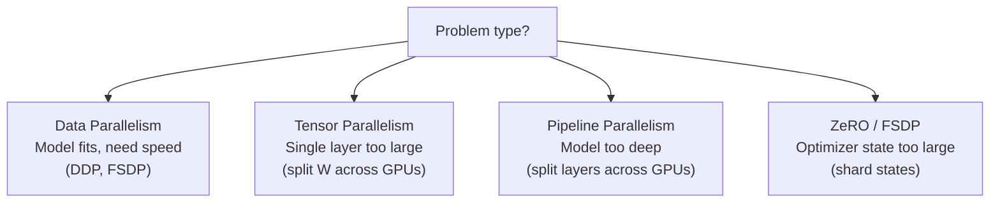

# Scaling Laws & Efficient Transformers

## Prerequisites

- [Lesson 07: Training Transformers](./07-training-transformers.md) — training loop, mixed precision
- [Lesson 09: Implementing Attention](./09-implementing-attention.md) — attention complexity analysis
- Basic familiarity with power law relationships

## What You'll Learn

| Topic | Key insight |
|-------|------------|
| Kaplan scaling laws | Loss ∝ N^−0.076 and D^−0.095 — predictable improvement |
| Chinchilla correction | Optimal compute splits evenly between model and data size |
| Flash Attention | O(n) HBM memory, 4–8× speedup through kernel tiling |
| Mixed precision | BF16/FP16 gives 2× throughput with negligible quality loss |
| Parallelism strategies | Data, tensor, pipeline — which bottleneck each targets |

---

## Intuition: Why Scaling Laws Matter

Before scaling laws, training an LLM meant guessing hyperparameters and hoping. After Kaplan et al. (2020) and Hoffmann et al. (2022), you can **predict** what loss you'll achieve at any compute budget — and optimally split that budget between model size and data volume.

This transforms AI engineering from art to science:

```
Given: $10M compute budget
Before scaling laws: train a 175B model with 300B tokens (GPT-3 approach)
After Chinchilla:    train a 70B model with 1.4T tokens (same compute, lower loss!)
```

The Chinchilla result (DeepMind, 2022) showed that GPT-3 was significantly under-trained on data relative to its model size. Llama, Llama-2, and Mistral all applied this insight.

---

## 1. The Kaplan Scaling Laws (OpenAI, 2020)

Kaplan et al. trained hundreds of models from 700K to 1.5B parameters on 22B tokens and fit power-law curves:

```
L(N) ≈ (N_c / N)^(α_N)    with α_N ≈ 0.076
L(D) ≈ (D_c / D)^(α_D)    with α_D ≈ 0.095
L(C) ≈ (C_c / C)^(α_C)    with α_C ≈ 0.050
```

Where:
- `N` = number of (non-embedding) parameters
- `D` = dataset size in tokens
- `C` = total compute in FLOPs
- `L` = cross-entropy loss (bits per character)

**Key observation**: every doubling of parameters reduces loss by the same percentage (~5%). This means the curve doesn't flatten — you can keep improving by scaling.

```python
import numpy as np
import matplotlib.pyplot as plt


def kaplan_loss(
    N: float,     # model parameters (non-embedding)
    D: float,     # dataset size in tokens
    a: float = 406.4,    # fitted constants from OpenAI paper
    b: float = 410.7,
    alpha_N: float = 0.34,
    alpha_D: float = 0.28,
) -> float:
    """
    Kaplan et al. (2020) joint scaling law.

    L(N, D) = [(N_c/N)^(α_N/α_D) + D_c/D]^(α_D)

    Simplified parameterization:
    L ≈ (a/N^α_N) + (b/D^α_D)
    """
    return (a / N ** alpha_N) + (b / D ** alpha_D)


# Example: Predict loss for different model/data combinations
configs = {
    "GPT-3 (175B, 300B tokens)": (175e9, 300e9),
    "Chinchilla (70B, 1.4T tokens)": (70e9, 1.4e12),
    "LLaMA-3 (8B, 15T tokens)": (8e9, 15e12),
}

print("Predicted losses (lower = better):")
for name, (N, D) in configs.items():
    loss = kaplan_loss(N, D)
    print(f"  {name}: L ≈ {loss:.3f}")
```

---

## 2. The Chinchilla Correction (DeepMind, 2022)

Hoffmann et al. (2022) trained 400+ models of different sizes and asked: *given a fixed compute budget C, what model size N and dataset size D minimize loss?*

For a fixed C FLOPs (with FLOPs ≈ 6ND for a Transformer forward + backward):

```
C = 6ND
Optimal N* ≈ (C / 6)^0.5   ← model and data scale equally
Optimal D* ≈ (C / 6)^0.5
```

**The practical rule**: for every parameter, train on approximately 20 tokens.

| Model | Parameters | Chinchilla-optimal tokens |
|-------|-----------|--------------------------|
| 1B | 1B | 20B |
| 7B | 7B | 140B |
| 70B | 70B | 1.4T |
| 405B | 405B | 8.1T |

```python
def chinchilla_optimal(compute_flops: float, flops_per_param_token: float = 6.0):
    """
    Given a compute budget in FLOPs, return the Chinchilla-optimal
    (model_params, dataset_tokens) pair.

    compute_flops: total training FLOPs (e.g. 1e23 for ~100 A100-days)
    """
    optimal_n = (compute_flops / flops_per_param_token) ** 0.5
    optimal_d = (compute_flops / flops_per_param_token) ** 0.5
    return optimal_n, optimal_d


# Example: how many GPU-days to train Chinchilla-optimal 7B?
# 7B params × 140B tokens × 6 FLOPs = 5.88e21 FLOPs
# A100 GPU ≈ 312 TFLOPs/s = 3.12e14 FLOPs/s
flops_needed = 7e9 * 140e9 * 6
a100_seconds = flops_needed / 3.12e14
a100_days    = a100_seconds / 86400

print(f"Training 7B/140B tokens: {flops_needed:.2e} FLOPs")
print(f"One A100 GPU: {a100_days:.0f} days")
print(f"1000 A100s:   {a100_days/1000:.1f} days")
```

!!! note "Why Chinchilla matters for AI engineering"
    If you are building a product on a fine-tuned open-source model, the quality of that model depends critically on whether it was Chinchilla-optimal during pre-training. Models like LLaMA-3 (8B, 15T tokens) significantly *over-train* beyond Chinchilla-optimal — intentionally — because the resulting small model is cheaper to serve even if training took more compute.

---

## 3. Flash Attention: Memory-Efficient Attention

### The Problem

Naive scaled dot-product attention for sequence length `n` materializes a full `(n, n)` attention weight matrix in GPU High-Bandwidth Memory (HBM):

```
Memory for attention weights: n² × 4 bytes (FP32) or 2 bytes (FP16)

For n=8192, 32 heads:
  32 × 8192² × 2 bytes = 4.3 GB  — just for attention weights!

For n=128K (Gemini 1.5):
  32 × 131072² × 2 bytes = 1.1 TB  — impossible on any GPU
```

### The Solution: Tiling in SRAM

Flash Attention (Dao et al. 2022) tiles the computation so the full `(n, n)` matrix is **never materialized**. It works in blocks that fit in L2 cache / SRAM:

```
Divide K and V into blocks of size B_c columns.
Divide Q into blocks of size B_r rows.

For each block of Q:
  For each block of K, V:
    Compute partial attention scores for this (B_r, B_c) tile
    Update running softmax using the online softmax trick
    Accumulate weighted V into output

Output is written to HBM once per Q block (not per (i,j) pair).
```

```python
# Conceptual (not optimized) Flash Attention loop
def flash_attention_conceptual(
    Q: np.ndarray,  # (T, d_k)
    K: np.ndarray,  # (T, d_k)
    V: np.ndarray,  # (T, d_v)
    block_size: int = 64,
) -> np.ndarray:
    """
    Flash Attention: compute attention output without storing full (T, T) matrix.

    Uses the online softmax recurrence:
      m_new = max(m_old, max(scores))
      l_new = exp(m_old - m_new) * l_old + sum(exp(scores - m_new))
      o_new = (exp(m_old - m_new) * o_old + exp(scores - m_new) @ V) / l_new

    Memory: O(T) instead of O(T²)
    """
    T, d_k = Q.shape
    d_v = V.shape[1]
    output = np.zeros((T, d_v))
    scale = 1.0 / np.sqrt(d_k)

    for i in range(0, T, block_size):
        q_block = Q[i : i + block_size]      # (B_r, d_k)
        m_i = np.full(len(q_block), -np.inf) # running max
        l_i = np.zeros(len(q_block))          # running denominator
        o_i = np.zeros((len(q_block), d_v))   # running output

        for j in range(0, T, block_size):
            k_block = K[j : j + block_size]   # (B_c, d_k)
            v_block = V[j : j + block_size]   # (B_c, d_v)

            # Partial scores for this block
            scores = (q_block @ k_block.T) * scale  # (B_r, B_c)
            m_j    = scores.max(axis=-1)             # (B_r,)

            # Online softmax recurrence
            m_new = np.maximum(m_i, m_j)
            exp_scores = np.exp(scores - m_new[:, np.newaxis])   # (B_r, B_c)
            l_new = np.exp(m_i - m_new) * l_i + exp_scores.sum(axis=-1)

            o_i = (np.exp(m_i - m_new)[:, np.newaxis] * o_i
                   + exp_scores @ v_block)

            m_i, l_i = m_new, l_new

        output[i : i + block_size] = o_i / l_i[:, np.newaxis]

    return output


# Verify against standard attention
T, d = 64, 32
Q, K, V = np.random.randn(T, d), np.random.randn(T, d), np.random.randn(T, d)

# Standard attention
scores_std  = (Q @ K.T) / np.sqrt(d)
exp_s       = np.exp(scores_std - scores_std.max(axis=-1, keepdims=True))
weights_std = exp_s / exp_s.sum(axis=-1, keepdims=True)
out_std     = weights_std @ V

# Flash attention
out_flash = flash_attention_conceptual(Q, K, V, block_size=16)

print(f"Max difference: {np.abs(out_std - out_flash).max():.2e}")
# Should be < 1e-6 — numerically identical
```

**Flash Attention results** (from Dao et al. 2023):
- **2.4× faster** than PyTorch baseline on A100 for sequence length 2048
- **4.1× faster** for sequence length 16384
- **Memory**: O(n) instead of O(n²) — enabling 100K+ token contexts

---

## 4. Mixed Precision Training

Modern GPUs (A100, H100) have dedicated FP16/BF16 tensor cores that run 2× faster than FP32.

### FP32 vs FP16 vs BF16

| Format | Sign | Exponent | Mantissa | Range | Precision |
|--------|------|----------|----------|-------|-----------|
| FP32 | 1 | 8 bits | 23 bits | ±3.4×10³⁸ | High |
| FP16 | 1 | 5 bits | 10 bits | ±65504 | Medium |
| BF16 | 1 | 8 bits | 7 bits | ±3.4×10³⁸ | Lower |

**BF16 advantages over FP16**: same exponent range as FP32, so it never overflows during gradient computation. This eliminates the need for loss scaling. All modern LLM training uses BF16.

```python
import torch
from torch.cuda.amp import autocast, GradScaler


def train_step_fp16(model, optimizer, batch, criterion):
    """
    Mixed-precision training step (FP16 with loss scaling).

    Use this when running on older GPUs (V100) that don't support BF16.
    """
    optimizer.zero_grad()

    # Forward pass in FP16 using autocast
    with autocast(dtype=torch.float16):
        logits = model(batch["input_ids"])     # computed in FP16
        loss   = criterion(logits, batch["labels"])  # FP16

    # Scale loss to prevent FP16 gradient underflow
    scaler = GradScaler()
    scaler.scale(loss).backward()

    # Unscale before clipping (otherwise you clip scaled gradients)
    scaler.unscale_(optimizer)
    torch.nn.utils.clip_grad_norm_(model.parameters(), max_norm=1.0)

    # Optimizer step — GradScaler skips if gradients contain Inf/NaN
    scaler.step(optimizer)
    scaler.update()

    return loss.item()


def train_step_bf16(model, optimizer, batch, criterion):
    """
    Mixed-precision training step (BF16 — modern preferred approach).

    No GradScaler needed: BF16 has same exponent range as FP32.
    Supported on A100, H100, TPUs.
    """
    optimizer.zero_grad()

    with autocast(dtype=torch.bfloat16):
        logits = model(batch["input_ids"])
        loss   = criterion(logits, batch["labels"])

    loss.backward()
    torch.nn.utils.clip_grad_norm_(model.parameters(), max_norm=1.0)
    optimizer.step()

    return loss.item()
```

---

## 5. Parallelism Strategies for Large Models

When a model or dataset doesn't fit on a single GPU, you need parallelism:



### Data Parallelism (DDP)

```python
import torch.distributed as dist
from torch.nn.parallel import DistributedDataParallel as DDP

# Each GPU gets a copy of the model
# Batch is split across GPUs
# Gradients are averaged across GPUs after backward

dist.init_process_group("nccl")
model = DDP(model, device_ids=[local_rank])

# Training loop is unchanged — DDP handles gradient sync
for batch in dataloader:
    loss = model(batch).loss
    loss.backward()   # DDP averages gradients here
    optimizer.step()
```

**When to use**: model fits on 1 GPU, want linear speedup with more GPUs.

### Tensor Parallelism (Megatron-LM style)

```python
# Split W_Q, W_K, W_V column-wise across N GPUs
# Each GPU computes attention for h/N heads
# All-gather at output projection

# Example: 8-head attention on 4 GPUs
# GPU 0: heads 0, 1
# GPU 1: heads 2, 3
# GPU 2: heads 4, 5
# GPU 3: heads 6, 7
```

**When to use**: a single Transformer layer doesn't fit on 1 GPU.

### ZeRO (Zero Redundancy Optimizer)

```
Standard DDP: each GPU holds full model + optimizer state
  Memory per GPU = model_params × 16 bytes (FP32 params + gradients + Adam moments)

ZeRO Stage 1: Shard optimizer states across GPUs
  Each GPU holds 1/N of the optimizer state
  Memory savings: ~4×

ZeRO Stage 2: Also shard gradients
  Each GPU reduces only its own shard
  Memory savings: ~8×

ZeRO Stage 3 (FSDP): Also shard parameters
  Parameters are gathered on-demand during forward pass
  Memory savings: proportional to N GPUs
```

```python
from torch.distributed.fsdp import FullyShardedDataParallel as FSDP

# ZeRO Stage 3 — shard everything
model = FSDP(model, auto_wrap_policy=...)

# PyTorch handles gathering parameters forward, reducing gradients backward
for batch in dataloader:
    loss = model(batch).loss
    loss.backward()
    optimizer.step()
```

---

## 6. Practical Scaling Checklist

When setting up a new training run, use scaling laws to make decisions *before* spending compute:

```python
def estimate_training_run(
    target_params: float,   # e.g. 7e9 for 7B
    target_tokens: float,   # e.g. 1e12 for 1T tokens
    gpu_flops: float = 3.12e14,  # A100 at 312 TFLOPS
    num_gpus: int = 1000,
    utilization: float = 0.4,  # typical MFU
) -> dict:
    """
    Estimate training cost for a Chinchilla-style run.

    MFU (Model FLOPs Utilization): fraction of peak GPU throughput achieved.
    Typically 35-50% for well-optimized setups.
    """
    # FLOPs: approximately 6 × N × D for one forward+backward pass
    total_flops  = 6 * target_params * target_tokens
    effective_flops_per_sec = gpu_flops * num_gpus * utilization
    training_seconds = total_flops / effective_flops_per_sec
    training_days    = training_seconds / 86400

    # Memory: ~2 bytes per param (BF16) + optimizer state (~12 bytes/param with Adam)
    mem_per_gpu_gb = (target_params * 14) / (1e9 * num_gpus)

    return {
        "total_flops": f"{total_flops:.2e}",
        "training_days": f"{training_days:.1f}",
        "memory_per_gpu_gb": f"{mem_per_gpu_gb:.0f}",
    }


result = estimate_training_run(7e9, 1.4e12, num_gpus=1000)
print("7B model, 1.4T tokens, 1000 A100s:")
for k, v in result.items():
    print(f"  {k}: {v}")
```

---

## Model Size Scaling Table

| Model | N (params) | D (tokens) | C (FLOPs) | Chinchilla-optimal? |
|-------|-----------|-----------|-----------|---------------------|
| GPT-3 | 175B | 300B | 3.1×10²³ | Under-trained on data |
| Chinchilla | 70B | 1.4T | 5.8×10²³ | Optimal |
| LLaMA-2 7B | 7B | 2T | 8.4×10²² | Over-trained (cheap inference) |
| LLaMA-3 8B | 8B | 15T | 7.2×10²³ | Highly over-trained |
| GPT-4 (est.) | ~1.7T | ~13T | ~1×10²⁵ | Unknown |

The trend: companies increasingly over-train smaller models to optimize for inference cost, accepting higher pre-training expense for a model that is cheap to serve.

---

## Edge Cases & Misconceptions

!!! warning "Misconception: Scaling laws are exact predictions"
    Scaling laws are *empirical power-law fits* with substantial uncertainty. The exponents vary across architectures, tokenizers, and data distributions. They are useful for order-of-magnitude decisions, not precise loss predictions.

!!! warning "Misconception: Flash Attention changes the mathematical result"
    Flash Attention is *numerically identical* to standard attention (modulo floating-point rounding). It is a pure engineering optimization that changes HBM access patterns, not the computation.

!!! note "Data quality vs quantity"
    Scaling laws assume data quality is held constant. In practice, 1T tokens of curated web text > 10T tokens of raw unfiltered web crawl. Chinchilla-optimal data quantities assume high-quality filtered data.

!!! warning "Misconception: More GPUs always = faster training"
    Communication overhead grows with GPU count. At 1000+ GPUs, all-reduce operations can consume 10–30% of training time. Careful parallelism strategy (pipeline + tensor + data) is required to maintain efficiency.

---

## Production Connection

**Inference cost dominates over lifetime**: GPT-4 reportedly cost ~$100M to train once but serves millions of queries per day. Training compute is a one-time cost; inference compute is ongoing. This is why LLaMA-3 was trained for 15T tokens (10× Chinchilla) — a smaller model at inference is worth the extra training cost.

**MFU (Model FLOPs Utilization)**: the fraction of peak GPU performance actually used during training. A100 peak is 312 TFLOPS/GPU; well-optimized LLM training achieves 35–50% MFU. If your MFU is below 30%, you have a parallelism, batch size, or data loading bottleneck.

**Flash Attention in production**: Every major inference engine (vLLM, TensorRT-LLM, DeepSpeed-Inference) uses Flash Attention or equivalent tiling. The combination of Flash Attention + BF16 + KV caching is responsible for the dramatic drop in LLM inference cost between 2022 and 2024.

---

## Key Takeaways

1. **Kaplan scaling laws**: loss falls predictably as L ∝ N^−0.076 and D^−0.095 — no known ceiling.
2. **Chinchilla**: given a compute budget C, allocate equally between model (N) and data (D) — one parameter per 20 tokens.
3. **Over-training** smaller models (15T tokens for 8B params) is often worthwhile because inference is cheap; training is a one-time cost.
4. **Flash Attention** tiles the (n, n) attention computation in SRAM, reducing HBM memory from O(n²) to O(n) and delivering 4–8× speedup.
5. **BF16** is the right mixed-precision format on modern hardware — same exponent range as FP32 means no overflow, no loss scaling needed.
6. **Parallelism strategies**: data parallelism for throughput, tensor parallelism for large layers, ZeRO/FSDP for memory — use them in combination.

---

## Further Reading

- [Kaplan et al. 2020](https://arxiv.org/abs/2001.08361) — Scaling laws for neural language models
- [Hoffmann et al. 2022](https://arxiv.org/abs/2203.15556) — Training compute-optimal LLMs (Chinchilla)
- [Dao et al. 2022](https://arxiv.org/abs/2205.14135) — Flash Attention: fast and memory-efficient exact attention
- [Dao et al. 2023](https://arxiv.org/abs/2307.08691) — Flash Attention 2: faster attention with better parallelism
- [Korthikanti et al. 2023](https://arxiv.org/abs/2205.05198) — Reducing activation recomputation in large Transformer models
- [ZeRO paper](https://arxiv.org/abs/1910.02054) — Rajbhandari et al. 2020

---

## Module Complete!

**Congratulations — you have mastered the Transformer module:**

- Attention as a soft differentiable database lookup
- Self-attention, multi-head attention, and their O(n²) complexity
- Positional encodings from sinusoidal to RoPE
- The full Transformer architecture: encoder, decoder, residuals, LayerNorm
- Training: Noam schedule, label smoothing, gradient clipping, mixed precision
- Architecture variants: BERT, GPT, T5, LLaMA, Mixtral
- Implementation: every line of code, every shape annotation
- Scaling laws: how to predict and optimize training before spending compute

**Next**: [Module 07 — Large Language Models](../../module-07-large-language-models-llms/index.md)
