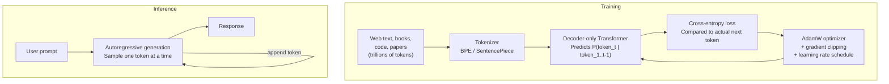

# Introduction to Large Language Models

## Prerequisites

- [Module 06: Transformers & Attention](../../module-06-transformers-attention-mechanisms/index.md) — multi-head attention, decoder architecture
- [Module 06 L02: Self-Attention](../../module-06-transformers-attention-mechanisms/lessons/02-self-attention.md) — Q, K, V, causal masking

## What You'll Learn

| Concept | What it means in practice |
|---------|--------------------------|
| Next-token prediction | One objective, infinite applications |
| Emergent capabilities | Why 100B parameters do things 1B parameters can't |
| Token probability distribution | How temperature and sampling shape outputs |
| Three LLM families | When to use autoregressive vs masked vs seq2seq |
| Core limitations | What LLMs structurally cannot do |

---

## Intuition First: The One Trick That Does Everything

An LLM is trained to do one thing:

> **Given the text seen so far, predict the most likely next token.**

That's it. No explicit reasoning module, no memory system, no knowledge base. Just: "what token comes next?"

And yet, through scale and repetition, this simple objective produces:
- Code generation
- Logical reasoning
- Translation without translation examples
- Medical diagnosis assistance
- Creative writing
- Mathematical proofs

Why? Because to *reliably* predict the next token in millions of diverse documents, the model must internally represent facts, causal relationships, grammar, coding conventions, and world knowledge. The prediction task *forces* the representation of knowledge.

This is the central mystery and power of LLMs.

---

## What is a Token?

Before understanding LLMs, we need tokens. Text is not fed to LLMs as raw characters or words — it's split into **subword tokens** using algorithms like Byte Pair Encoding (BPE).

```python
from transformers import AutoTokenizer

tokenizer = AutoTokenizer.from_pretrained("gpt2")

examples = [
    "Hello, world!",
    "The capital of France is Paris.",
    "def fibonacci(n):",
    "antidisestablishmentarianism",
]

for text in examples:
    tokens = tokenizer.encode(text)
    decoded = [tokenizer.decode([t]) for t in tokens]
    print(f"{repr(text)}")
    print(f"  Tokens ({len(tokens)}): {decoded}")
    print()
```

Expected output:
```
'Hello, world!'
  Tokens (4): ['Hello', ',', ' world', '!']

'The capital of France is Paris.'
  Tokens (9): ['The', ' capital', ' of', ' France', ' is', ' Paris', '.']

'def fibonacci(n):'
  Tokens (7): ['def', ' fibonacci', '(', 'n', '):', ...]

'antidisestablishmentarianism'
  Tokens (6): ['ant', 'idis', 'establishment', 'arian', 'ism']
```

**Key insight**: common words are single tokens; rare words are broken into subwords. This lets the vocabulary (typically 32K–100K tokens) handle any text without an "unknown word" problem.

---

## The Next-Token Prediction Objective

At every training step, the model sees a sequence of tokens and must predict the next one:

```
Input sequence:  [The] [cat] [sat] [on] [the]
                  ↓     ↓     ↓     ↓     ↓
Target:          [cat] [sat] [on] [the]  [mat]

Each position is trained to predict its successor.
With sequence length T=1024, each example gives 1024 training signals.
```

The loss is cross-entropy between the predicted distribution and the true next token:

```python
import numpy as np


def next_token_loss(logits: np.ndarray, targets: np.ndarray) -> float:
    """
    Compute cross-entropy loss for next-token prediction.

    logits  : (B, T, V) — raw scores over vocabulary
    targets : (B, T)    — ground truth token IDs (shifted right by 1)

    Returns: scalar loss (lower = better)
    """
    B, T, V = logits.shape

    # Numerically stable log-softmax
    logits_shifted = logits - logits.max(axis=-1, keepdims=True)
    log_probs = logits_shifted - np.log(np.exp(logits_shifted).sum(axis=-1, keepdims=True))

    # Gather log probability of the true next token at each position
    B_idx = np.arange(B)[:, np.newaxis] * np.ones((B, T), dtype=int)
    T_idx = np.arange(T)[np.newaxis, :] * np.ones((B, T), dtype=int)

    true_log_probs = log_probs[B_idx, T_idx, targets]   # (B, T)

    return float(-true_log_probs.mean())


# Example: batch of 2 sequences, length 5, vocabulary 100
np.random.seed(42)
logits  = np.random.randn(2, 5, 100)
targets = np.random.randint(0, 100, size=(2, 5))

loss = next_token_loss(logits, targets)
print(f"Loss: {loss:.3f}")  # ≈ log(100) ≈ 4.6 for random logits
print(f"Perplexity: {np.exp(loss):.1f}")  # ≈ 100 — guessing randomly
```

**Perplexity** is the exponentiated loss. A perplexity of 100 means the model is as confused as if it were guessing uniformly over 100 tokens. GPT-4 has perplexity ~8–12 on English text — it reliably narrows the next token to about 10 likely candidates.

---

## How Generation Works

Once trained, generation is simple: repeatedly sample the next token and append it to the context.

```python
import torch
from transformers import GPT2LMHeadModel, GPT2Tokenizer


def generate_text(
    prompt: str,
    model_name: str = "gpt2",
    max_new_tokens: int = 100,
    temperature: float = 0.8,
    top_p: float = 0.9,
) -> str:
    """
    Generate text token by token using nucleus sampling.

    temperature : >1 = more random, <1 = more focused, 0 = greedy
    top_p       : nucleus sampling — keep tokens summing to top_p probability
    """
    tokenizer = GPT2Tokenizer.from_pretrained(model_name)
    model = GPT2LMHeadModel.from_pretrained(model_name)
    model.eval()

    input_ids = tokenizer.encode(prompt, return_tensors="pt")

    with torch.no_grad():
        output_ids = model.generate(
            input_ids,
            max_new_tokens=max_new_tokens,
            do_sample=(temperature > 0),
            temperature=temperature,
            top_p=top_p,
            pad_token_id=tokenizer.eos_token_id,
        )

    return tokenizer.decode(output_ids[0], skip_special_tokens=True)


# Try it
print(generate_text("The transformer architecture was introduced in"))
```

---

## Temperature: Controlling Randomness

Temperature rescales the logits before softmax, controlling how peaked (or flat) the output distribution is:

```python
def apply_temperature(logits: np.ndarray, temperature: float) -> np.ndarray:
    """
    Scale logits by temperature.

    temperature → 0: argmax (deterministic)
    temperature = 1: standard softmax
    temperature → ∞: uniform distribution (random)
    """
    if temperature == 0:
        # Greedy: return one-hot on argmax
        result = np.zeros_like(logits)
        result[np.argmax(logits)] = 1.0
        return result

    scaled = logits / temperature
    exp_s  = np.exp(scaled - scaled.max())
    return exp_s / exp_s.sum()


# Demonstration
logits = np.array([2.0, 1.5, 0.5, 0.3, 0.1])   # top-5 logits

for temp in [0.1, 0.5, 1.0, 2.0]:
    probs = apply_temperature(logits, temp)
    print(f"Temp={temp:.1f}: {probs.round(3)}")
```

Output:
```
Temp=0.1: [0.993 0.007 0.000 0.000 0.000]  ← very peaked, almost greedy
Temp=0.5: [0.762 0.209 0.020 0.009 0.000]  ← more confident
Temp=1.0: [0.432 0.264 0.097 0.080 0.065]  ← baseline
Temp=2.0: [0.260 0.220 0.177 0.171 0.163]  ← flatter, more random
```

!!! note "Practical temperature guidelines"
    - `temperature=0` (greedy): factual QA, code completion — you want the most likely answer
    - `temperature=0.7`: general chat — some variety, stays coherent
    - `temperature=1.0–1.2`: creative writing — genuine diversity
    - `temperature>1.5`: rarely useful — output becomes incoherent

---

## Three LLM Families

### 1. Autoregressive (Decoder-Only)

```
Examples: GPT-2/3/4, LLaMA, Mistral, Claude, Gemini
Training: predict next token given all previous tokens (left-to-right)
Masking:  causal (upper-triangular) — can't see future tokens
Best for: generation, chat, code completion

Architecture:
Token embeddings → N × [Causal Self-Attention + FFN] → Output logits
```

### 2. Masked Language Models (Encoder-Only)

```
Examples: BERT, RoBERTa, ALBERT
Training: predict randomly masked tokens using full bidirectional context
Masking:  none — every token sees every other token
Best for: classification, named entity recognition, retrieval embeddings

Architecture:
Token embeddings → N × [Bidirectional Self-Attention + FFN] → [CLS] → Classifier
```

### 3. Encoder-Decoder

```
Examples: T5, BART, mT5, FLAN-T5
Training: span corruption (T5) or denoising (BART)
Best for: translation, summarization, structured output

Architecture:
Source → N × Encoder Blocks → Memory
Target → N × Decoder Blocks (with cross-attention to Memory) → Output
```

### Comparison

| Aspect | GPT (Decoder-Only) | BERT (Encoder-Only) | T5 (Enc-Dec) |
|--------|-------------------|---------------------|--------------|
| Context | Left only | Both directions | Both in encoder |
| Generation | Native | Not designed for | Via decoder |
| Classification | Via prompting | Via [CLS] head | Via decoder |
| Best use | Chat, code, general | Embeddings, classification | Translation, summarization |
| Scale trend | → 1T+ params | → 340M (plateaued) | → 11B+ |

---

## Emergent Capabilities

One of the strangest phenomena in LLM research is **emergence** — capabilities that appear suddenly at certain scales and are essentially absent at smaller scales.

```
Few-shot learning:
  1B params:  ~55% on 5-shot GSM8K (grade school math)
  7B params:  ~62%
  70B params: ~77%
  175B params: ~63% (GPT-3 base — instruction tuning matters!)

Chain-of-thought reasoning:
  Models < 100B: almost no benefit from chain-of-thought prompting
  Models ≥ 100B: dramatic improvements from step-by-step reasoning

In-context learning:
  Small models: barely follow examples in the prompt
  Large models: adapt to new tasks from 3-5 examples with no gradient updates
```

Why does this happen? The current best hypothesis: complex capabilities require many "circuits" in the model to work simultaneously, and smaller models can't represent all the required intermediate computations. When you cross a threshold, all necessary circuits exist and can work together.

---

## Core Limitations

Understanding LLM limitations is as important as understanding capabilities:

### 1. Hallucination

LLMs generate plausible-sounding text — but "plausible" and "true" are different things. A model can confidently state a fake paper citation, a wrong historical date, or a non-existent function.

**Root cause**: the training objective rewards coherent token sequences, not factual accuracy. The model learns to complete text fluently, which sometimes means generating fluent falsehoods.

```python
# Example of a hallucination-prone prompt
prompt = "The paper 'Attention Is All You Need' was published in:"
# Model might say: "2016" (wrong — it was 2017) or invent a conference
```

**Mitigation**: retrieval-augmented generation (RAG), grounding with tools, fine-tuning on factual QA, temperature reduction.

### 2. Knowledge Cutoff

Training data has a fixed end date. Events after the cutoff are unknown to the model.

```
GPT-4: knowledge cutoff ≈ April 2023
LLaMA-3: knowledge cutoff ≈ December 2023
Models can extrapolate from training but cannot know recent facts.
```

**Mitigation**: web search tools, RAG pipelines, frequent model retraining.

### 3. Context Window Limits

Every LLM processes a finite context window. Text beyond this limit is simply truncated.

| Model | Context window |
|-------|---------------|
| GPT-2 | 1,024 tokens |
| GPT-3 | 2,048 tokens |
| GPT-4 Turbo | 128,000 tokens |
| Claude 3 | 200,000 tokens |
| Gemini 1.5 | 1,000,000 tokens |

Even with large contexts, **attention over all tokens at all layers** is expensive. A 128K-token context with 32 attention heads at 4096 dimensions costs ~hundreds of GB of KV cache.

### 4. No Real-Time Grounding

By default, LLMs have no access to the current date, real-time information, the user's filesystem, or external APIs. They are pattern-matching machines on their training distribution.

**Mitigation**: tool use / function calling — give the model access to calculators, web search, code execution, and databases.

---

## Diagram: LLM Training and Inference Loop



---

## Production Connection

**Why token count = cost**: Every cloud LLM API charges per token because:
1. Each new token requires one full forward pass through all layers
2. The KV cache for all previous tokens must be kept in GPU memory
3. Attention cost grows as O(n) per step with KV caching (O(n²) total)

**Counting tokens before calling the API**:

```python
import tiktoken

def count_tokens_openai(text: str, model: str = "gpt-4") -> int:
    """Count tokens using OpenAI's tiktoken library."""
    enc = tiktoken.encoding_for_model(model)
    return len(enc.encode(text))

def estimate_cost(prompt: str, response_tokens: int = 500, model: str = "gpt-4o") -> float:
    """Estimate API cost before calling."""
    input_tokens  = count_tokens_openai(prompt)
    input_cost    = (input_tokens  / 1_000_000) * 5.00   # $5/1M input tokens
    output_cost   = (response_tokens / 1_000_000) * 15.00  # $15/1M output tokens
    return input_cost + output_cost

prompt = "Explain attention mechanisms in transformers in detail."
cost = estimate_cost(prompt)
print(f"Input tokens: {count_tokens_openai(prompt)}")
print(f"Estimated cost: ${cost:.4f}")
```

---

## Edge Cases & Misconceptions

!!! warning "Misconception: LLMs 'understand' language"
    LLMs process statistical patterns in token sequences. They do not have beliefs, desires, or genuine understanding in the philosophical sense. They produce outputs that *look like* understanding because the training distribution rewards accurate completions. This distinction matters for reliability and safety.

!!! warning "Misconception: Higher temperature = more creative"
    Temperature changes *randomness*, not creativity. At high temperatures, the model samples low-probability tokens more often — but low-probability next tokens are often incoherent or off-topic. True creativity in LLM outputs emerges from diversity at moderate temperatures combined with good prompting.

!!! note "The 'stochastic parrot' critique"
    Bender et al. (2021) argued LLMs are "stochastic parrots" — they manipulate linguistic form without grounding in meaning. This critique is philosophically interesting but operationally: LLMs produce useful outputs on real engineering tasks regardless of whether they "understand" in a philosophical sense.

---

## Comparing LLM Families Side by Side

```python
import openai
import anthropic


def compare_model_responses(prompt: str) -> dict[str, str]:
    """
    Query multiple LLM families and compare responses.
    Useful for calibrating which model is right for your task.
    """
    results = {}

    # OpenAI GPT-4o (autoregressive, decoder-only)
    oai_client = openai.OpenAI()
    gpt_response = oai_client.chat.completions.create(
        model="gpt-4o",
        messages=[{"role": "user", "content": prompt}],
        max_tokens=200,
    )
    results["gpt-4o"] = gpt_response.choices[0].message.content

    # Anthropic Claude (autoregressive, decoder-only with Constitutional AI)
    ant_client = anthropic.Anthropic()
    claude_response = ant_client.messages.create(
        model="claude-opus-4-5",
        max_tokens=200,
        messages=[{"role": "user", "content": prompt}],
    )
    results["claude-3-opus"] = claude_response.content[0].text

    # Compare token efficiency
    for model, response in results.items():
        words = len(response.split())
        print(f"{model}: {words} words")

    return results


# Typical model characteristics:
MODEL_CHARACTERISTICS = {
    "GPT-4o":        {"training": "RLHF + SFT",    "context": "128K", "strength": "general"},
    "Claude-3-Opus": {"training": "RLAIF + SFT",   "context": "200K", "strength": "long docs"},
    "Gemini-1.5-Pro":{"training": "RLHF + SFT",    "context": "1M",   "strength": "multimodal"},
    "LLaMA-3-70B":   {"training": "SFT + DPO",     "context": "128K", "strength": "open-source"},
    "Mistral-7B":    {"training": "SFT + DPO",     "context": "32K",  "strength": "efficient"},
}
```

**Emergence at scale**: GPT-3 demonstrated that certain capabilities (few-shot learning, chain-of-thought reasoning) only appear above a threshold of ~10B parameters. Below that threshold, the model doesn't exhibit these behaviors at all — they are emergent, not gradual:

```python
EMERGENCE_EXAMPLES = {
    "few_shot_learning": "Model learns from 3-5 examples in the prompt (emerges ~10B+)",
    "chain_of_thought":  "Step-by-step reasoning with 'Let me think...' prompts (emerges ~50B+)",
    "instruction_follow":"Follows complex multi-step instructions without fine-tuning (emerges ~10B+)",
    "multi_step_math":   "Solves 5+ step math problems accurately (emerges ~100B+)",
}

# Below emergence threshold, larger models DON'T outperform smaller ones on these tasks
# Above threshold, capability appears suddenly — this is the 'emergent capabilities' phenomenon
```

---

## Key Takeaways

1. **LLMs are trained on one objective**: predict the next token. Everything else — reasoning, translation, coding — emerges from this at scale.
2. **Perplexity** measures how confused the model is; lower perplexity means better prediction. GPT-4 perplexity ≈ 8–12 on English.
3. **Temperature** controls output randomness: low for factual precision, moderate for general chat, higher for creative tasks.
4. **Three families**: decoder-only (generation), encoder-only (understanding/embeddings), encoder-decoder (seq2seq).
5. **Emergent capabilities** appear suddenly at scale: few-shot learning, chain-of-thought reasoning, in-context learning.
6. **Core limitations**: hallucination, knowledge cutoff, finite context, no real-time grounding. Know these before deploying.

---

## Further Reading

- [Andrej Karpathy: Intro to LLMs](https://www.youtube.com/watch?v=zjkBMFhNj_g) — best 1-hour walkthrough of the full LLM landscape
- [Anthropic: Core Views on AI Safety](https://www.anthropic.com/news/core-views-on-ai-safety) — grounded discussion of LLM capabilities and limitations
- [Brown et al. 2020 (GPT-3)](https://arxiv.org/abs/2005.14165) — few-shot learning with language models
- [Bender et al. 2021](https://dl.acm.org/doi/10.1145/3442188.3445922) — On the Dangers of Stochastic Parrots
- [deep-dive: tokenization-internals.md](../../../deep-dives/tokenization-internals.md) — BPE algorithm from scratch

---

## Next Lesson

**[Lesson 2: From Transformers to LLMs](./02-transformers-to-llms.md)** — how the original encoder-decoder Transformer became the decoder-only architecture of GPT, and why decoder-only models dominate modern LLM development.
