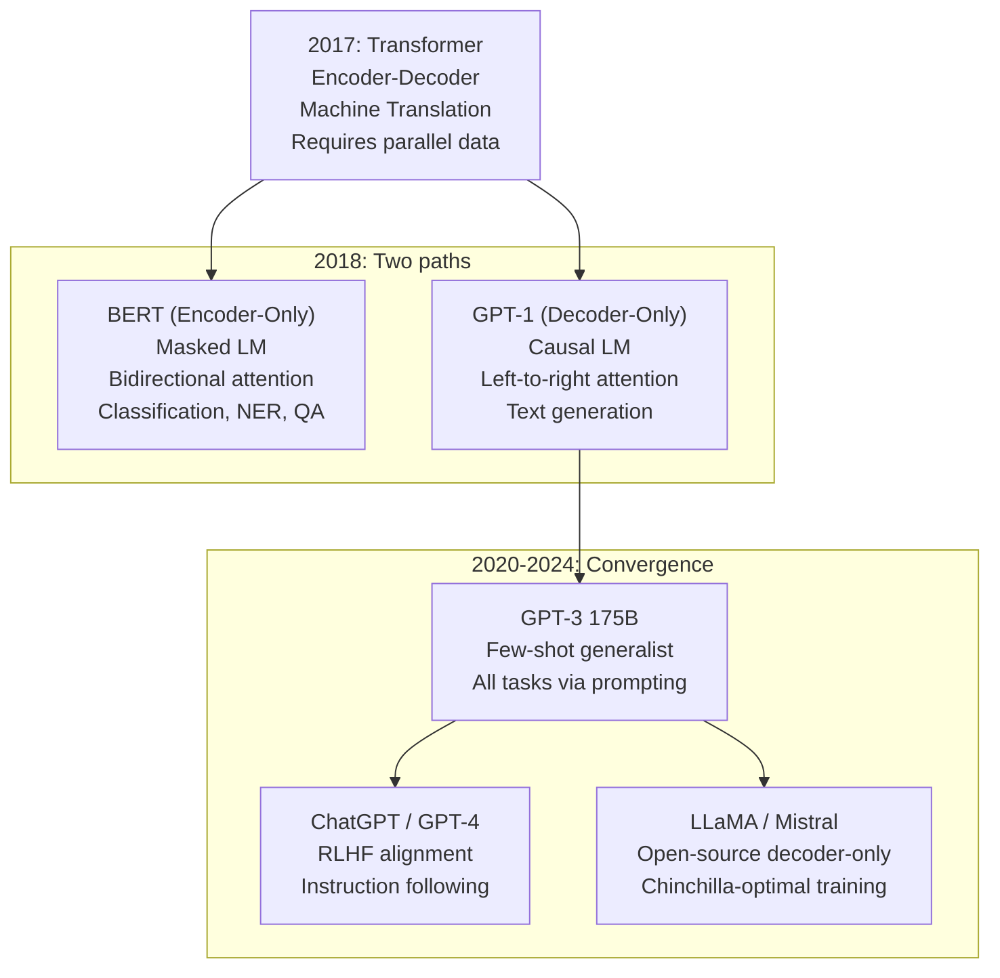

# From Transformers to LLMs

## Prerequisites

- [Module 06 L05: Complete Transformer Architecture](../../module-06-transformers-attention-mechanisms/lessons/05-transformer-architecture.md) — encoder, decoder, cross-attention
- [Module 06 L06: Encoder-Decoder Architecture](../../module-06-transformers-attention-mechanisms/lessons/06-encoder-decoder.md) — teacher forcing, decoding strategies
- [Lesson 01: Introduction to LLMs](./01-introduction-to-llms.md) — next-token prediction, token probability

## What You'll Learn

| Concept | Key insight |
|---------|------------|
| Original Transformer limitations | Encoder-decoder requires labeled parallel data |
| GPT-1 simplification | Decoder-only + causal LM = unsupervised pre-training |
| BERT simplification | Encoder-only + masked LM = rich representations |
| Scale trajectory | GPT-1 → GPT-2 → GPT-3: same architecture, 1500× more parameters |
| Why decoder-only won | Scaling efficiency, generation-first design |

---

## Intuition: What Changed Between 2017 and 2020

The original Transformer (Vaswani et al., 2017) was designed for machine translation:

```
English sentence → [Encoder] → Context vectors → [Decoder] → French sentence
```

It required **paired training examples**: every English sentence needed a corresponding French sentence. This limited it to supervised learning on labeled data.

The key insight of both GPT and BERT (2018): **raw text is everywhere and requires no labels**. The question became: *what self-supervised objectives can turn raw text into useful representations?*

GPT: "Predict the next token given all previous tokens."
BERT: "Predict the masked tokens given all surrounding tokens."

Both abandoned the encoder-decoder design for task-specific simplifications.

---

## Simplification 1: GPT — Decoder Only

GPT (Generative Pre-trained Transformer) kept only the decoder half of the Transformer and removed cross-attention (since there's no encoder to attend to).

```
Original Transformer Decoder:
  [Masked Self-Attn] → [Cross-Attention to Encoder] → [FFN]

GPT Decoder Block:
  [Masked (Causal) Self-Attn] → [FFN]
  (Cross-attention removed — no encoder)
```

The causal (autoregressive) self-attention mask ensures each token only attends to itself and previous tokens:

```python
import torch
import torch.nn as nn
import torch.nn.functional as F


class CausalSelfAttention(nn.Module):
    """
    GPT-style causal self-attention.
    Key difference from encoder attention: no token can see future tokens.
    """

    def __init__(self, d_model: int, n_heads: int, max_seq_len: int = 1024):
        super().__init__()
        assert d_model % n_heads == 0

        self.n_heads = n_heads
        self.d_k     = d_model // n_heads

        # Fused QKV projection (3× more efficient than separate matrices)
        self.qkv  = nn.Linear(d_model, 3 * d_model, bias=False)
        self.proj = nn.Linear(d_model, d_model, bias=False)

        # Causal mask: pre-compute for max sequence length
        # Upper-triangular True matrix — positions the model cannot see
        mask = torch.triu(torch.ones(max_seq_len, max_seq_len, dtype=torch.bool), diagonal=1)
        self.register_buffer("causal_mask", mask)  # not a parameter, saved with model

    def forward(self, x: torch.Tensor) -> torch.Tensor:
        """
        x : (B, T, d_model) — batch of token sequences
        returns: (B, T, d_model) — contextually enriched token representations

        Every token[i] can only attend to tokens[0..i].
        """
        B, T, d_model = x.shape
        h = self.n_heads

        # Project and split into Q, K, V heads
        qkv = self.qkv(x)                                    # (B, T, 3*d_model)
        Q, K, V = qkv.split(d_model, dim=2)                  # each (B, T, d_model)
        Q = Q.view(B, T, h, self.d_k).transpose(1, 2)        # (B, h, T, d_k)
        K = K.view(B, T, h, self.d_k).transpose(1, 2)
        V = V.view(B, T, h, self.d_k).transpose(1, 2)

        # Scaled dot-product attention with causal mask
        scores = Q @ K.transpose(-2, -1) / (self.d_k ** 0.5)  # (B, h, T, T)
        scores = scores.masked_fill(self.causal_mask[:T, :T], float("-inf"))
        attn   = F.softmax(scores, dim=-1)                     # (B, h, T, T)

        out  = attn @ V                                        # (B, h, T, d_k)
        out  = out.transpose(1, 2).contiguous().view(B, T, d_model)
        return self.proj(out)                                  # (B, T, d_model)


# Test: verify causal property
model = CausalSelfAttention(d_model=64, n_heads=4)
x = torch.randn(1, 8, 64)
out = model(x)
print(f"Input:  {x.shape}")    # (1, 8, 64)
print(f"Output: {out.shape}")  # (1, 8, 64) — same shape
```

### GPT Training Objective

```python
def gpt_loss(model, token_ids: torch.Tensor) -> torch.Tensor:
    """
    Next-token prediction loss for GPT-style model.

    token_ids : (B, T+1) — includes both input and target tokens
    Input to model:  token_ids[:, :-1]   (first T tokens)
    Target:          token_ids[:, 1:]    (last T tokens, shifted by 1)

    Every position is trained simultaneously (T loss signals per example).
    """
    input_ids  = token_ids[:, :-1]  # (B, T)
    target_ids = token_ids[:, 1:]   # (B, T)

    logits = model(input_ids)       # (B, T, vocab_size)
    B, T, V = logits.shape

    loss = F.cross_entropy(
        logits.view(B * T, V),
        target_ids.view(B * T)
    )
    return loss
```

---

## Simplification 2: BERT — Encoder Only

BERT (Bidirectional Encoder Representations from Transformers) kept only the encoder half and removed the causal mask — every token can attend to every other token in both directions.

```
BERT block:
  [Bidirectional Self-Attn (no mask)] → [FFN]

Input:  [CLS] "The" "cat" [MASK] "on" "the" "mat" [SEP]
Output: contextual embedding for each token

The [CLS] token's final embedding is used for classification.
The [MASK] tokens' embeddings are used to predict the original words.
```

```python
def bert_mlm_loss(model, token_ids: torch.Tensor, mask_prob: float = 0.15) -> torch.Tensor:
    """
    Masked Language Modeling loss (BERT pre-training objective).

    For 15% of tokens:
      80% → replace with [MASK] (ID = 103 for BERT tokenizer)
      10% → replace with random token
      10% → keep original (model can't rely on [MASK] as a signal)
    """
    MASK_ID = 103  # [MASK] token for BERT
    B, T = token_ids.shape

    # Sample positions to mask
    prob_matrix = torch.rand_like(token_ids.float())
    masked_positions = prob_matrix < mask_prob     # bool (B, T)

    labels = token_ids.clone()
    labels[~masked_positions] = -100               # -100 = ignore in loss

    # Apply masking strategy
    masked_input = token_ids.clone()
    r = torch.rand_like(token_ids.float())

    # 80%: [MASK]
    masked_input[masked_positions & (r < 0.8)] = MASK_ID
    # 10%: random token — leave as is (already set above for remaining 20%)
    # 10%: keep original — already in masked_input

    logits = model(masked_input)                   # (B, T, vocab_size)
    B, T, V = logits.shape

    loss = F.cross_entropy(
        logits.view(B * T, V),
        labels.view(B * T),
        ignore_index=-100
    )
    return loss
```

---

## The Scale Trajectory: GPT-1 → GPT-3

The same architectural idea — decoder-only, causal language modeling — was scaled up dramatically:

| Model | Year | Parameters | Layers | d_model | Heads | Training tokens |
|-------|------|-----------|--------|---------|-------|----------------|
| GPT-1 | 2018 | 117M | 12 | 768 | 12 | 1B |
| GPT-2 | 2019 | 1.5B | 48 | 1600 | 25 | 40B |
| GPT-3 | 2020 | 175B | 96 | 12288 | 96 | 300B |
| GPT-4 | 2023 | ~1.7T (est.) | ~96 | ~12288 | ~96 | ~13T (est.) |

The architecture barely changed. What changed was scale — and with scale came qualitatively different capabilities:

```
GPT-1 (117M):  Can complete sentences, follows simple patterns
GPT-2 (1.5B):  Coherent paragraphs, basic reasoning, weak translation
GPT-3 (175B):  Few-shot learning, code generation, complex reasoning,
               mathematical problem solving, creative writing
```

This dramatic capability jump with "merely" 1500× more parameters is emergence at work.

---

## Why Decoder-Only Became the Standard

By 2022, nearly all frontier models adopted decoder-only architecture. Why?

### 1. Training Efficiency

Causal language modeling trains on **every token position simultaneously**:
```
Sequence of length T = T training signals per example
No need for labeled pairs — raw internet text is training data
```

Masked LM (BERT) wastes 85% of positions (only 15% are masked). The full causal LM objective is more data-efficient.

### 2. Inference Flexibility

A decoder-only model handles *any* task with appropriate prompting:
```
Classification: "Is this review positive or negative? Review: ... Answer:"
Translation:    "Translate to French: Hello → "
Summarization:  "Summarize the following text: ..."
Code gen:       "# Python function to sort a list:\ndef sort_list("
```

The encoder-decoder paradigm requires task-specific fine-tuning or a text-to-text framing (T5's approach). The decoder-only paradigm handles everything through prompting.

### 3. KV Cache Efficiency

At inference, the decoder generates one token at a time. With KV caching:
```
Step 1: compute K, V for all input tokens → cache them
Step 2+: compute K, V only for the new token → append to cache
Cost per step: O(T) not O(T²)
```

This caching is natural for autoregressive generation.

### 4. Emergent Instruction Following

Large decoder models trained on sufficiently diverse data develop the ability to follow instructions through prompting alone — without any fine-tuning. This was demonstrated clearly by GPT-3 and made encoder-only models seem limiting.

---

## Diagram: Architecture Evolution



---

## Numerical Example: Autoregressive Generation Step by Step

Let's trace exactly what happens when GPT generates "Paris" given "The capital of France is":

```
Step 1: Tokenize input
"The capital of France is" → [464, 3139, 286, 4881, 318]

Step 2: Forward pass through all N decoder layers
Input shape: (1, 5, d_model)
Output: (1, 5, vocab_size) — logits at each position

Step 3: Take logits at the LAST position only
final_logits = logits[0, -1, :]   # (vocab_size,)

Step 4: Apply temperature + sampling
probs = softmax(final_logits / T)
next_token = sample(probs)   # → token ID for " Paris"

Step 5: Append token and repeat
"The capital of France is Paris" → new input for next step
```

```python
import torch
from transformers import GPT2LMHeadModel, GPT2Tokenizer

tokenizer = GPT2Tokenizer.from_pretrained("gpt2")
model     = GPT2LMHeadModel.from_pretrained("gpt2")
model.eval()

prompt = "The capital of France is"
input_ids = tokenizer.encode(prompt, return_tensors="pt")

# Show top-5 predictions for the next token
with torch.no_grad():
    outputs = model(input_ids)
    next_logits = outputs.logits[0, -1, :]    # (vocab_size,)

top5_ids   = next_logits.topk(5).indices
top5_probs = next_logits.softmax(dim=-1)[top5_ids]

print(f"Prompt: '{prompt}'")
print("\nTop-5 next token predictions:")
for token_id, prob in zip(top5_ids, top5_probs):
    token = tokenizer.decode([token_id])
    print(f"  {repr(token):15s} {prob:.3f}")
```

Expected output:
```
Prompt: 'The capital of France is'

Top-5 next token predictions:
  ' Paris'       0.734
  ' the'         0.081
  ' called'      0.043
  ' located'     0.027
  ' a'           0.018
```

The model correctly assigns ~73% probability to "Paris" — demonstrating that world knowledge was encoded during pre-training.

---

## BERT vs GPT: When to Use Each

Despite decoder-only models dominating headline research, BERT-family models remain widely used in production:

| Scenario | Better choice | Why |
|----------|--------------|-----|
| Semantic search / embeddings | BERT (or Sentence-BERT) | Bidirectional context makes richer embeddings |
| Classification (fixed categories) | BERT | Fine-tune [CLS] head; cheap inference |
| Text generation | GPT | BERT wasn't designed to generate |
| Chat / instruction following | GPT + RLHF | Decoder-only + alignment training |
| Extractive QA | BERT | Extract span from context; no generation needed |
| Code completion | GPT (Codex, CodeLlama) | Autoregressive completion is natural |
| Named entity recognition | BERT | Token-level classification on bidirectional context |

---

## Edge Cases & Misconceptions

!!! warning "Misconception: GPT and BERT are fundamentally different"
    The mathematical operations are nearly identical. Both use multi-head self-attention and FFN blocks. The key differences are: (1) causal mask vs no mask, and (2) autoregressive vs bidirectional training. The architecture is 90% the same.

!!! warning "Misconception: Decoder-only models can't do 'understanding'"
    GPT-4 scores above human-level on many understanding benchmarks (MMLU, bar exam, LSAT). "Understanding" is not privileged by architecture — it emerges from scale and training data.

!!! note "The 'pre-training + fine-tuning' paradigm"
    The two-stage approach (unsupervised pre-training → supervised fine-tuning) was GPT-1's key contribution. Before GPT, most NLP models were trained from scratch on task-specific data. Pre-training on raw text and fine-tuning on labeled data dramatically improved performance with less labeled data.

---

## Production Connection

**Model selection for production systems**: Most production AI applications today choose between:
1. A decoder-only model via API (GPT-4, Claude, Gemini) for general tasks
2. A fine-tuned small decoder model (Mistral 7B, LLaMA-3 8B) for latency-sensitive or cost-sensitive tasks
3. A BERT-family model for classification, ranking, or embedding tasks

Understanding the architectural distinctions helps you make this choice rationally rather than defaulting to the largest available model.

**Token efficiency**: because BERT's masked LM only computes loss on 15% of tokens while GPT computes loss on 100%, GPT-style models are ~6× more data-efficient. This is a key reason training budgets shifted from BERT to GPT-style objectives.

---

## Scale and the Bitter Lesson

Richard Sutton's "Bitter Lesson" (2019) argues that methods that scale with compute consistently beat methods that incorporate human knowledge. GPT proves this:

```python
GPT_SCALE_TRAJECTORY = {
    "GPT-1 (2018)": {
        "params": "117M",
        "data": "BooksCorpus (5GB)",
        "compute": "small cluster, 30 days",
        "capability": "Generative text, basic few-shot",
    },
    "GPT-2 (2019)": {
        "params": "1.5B",
        "data": "WebText (40GB)",
        "compute": "256 V100s, 7 days",
        "capability": "Coherent long-form text, strong completion",
        "notable": "Originally withheld over misuse concerns",
    },
    "GPT-3 (2020)": {
        "params": "175B",
        "data": "Common Crawl + Books + Wikipedia (570GB filtered)",
        "compute": "10,000 V100s, weeks",
        "capability": "Few-shot learning, code generation, complex reasoning",
        "notable": "First model to demonstrate true in-context learning",
    },
    "GPT-4 (2023)": {
        "params": "~1T (MoE, estimated)",
        "data": "Unknown, >1T tokens",
        "compute": "Unknown",
        "capability": "Expert-level performance on most benchmarks",
        "notable": "RLHF + Constitutional AI alignment; multimodal",
    },
}

# Key metrics that improved with scale:
SCALE_IMPROVEMENTS = {
    "MMLU (5-shot)":      {"GPT-3": "43.9%", "GPT-4": "86.4%"},  # academic benchmarks
    "HumanEval (coding)": {"GPT-3": "0%",    "GPT-4": "67%"},    # code generation
    "Math (MATH dataset)":{"GPT-3": "4.5%",  "GPT-4": "42.5%"},  # mathematical reasoning
}
```

**KV cache: the inference optimization that makes LLMs deployable**:

```python
def demonstrate_kv_cache_benefit(
    seq_len:   int = 1000,
    d_model:   int = 4096,
    n_heads:   int = 32,
    n_layers:  int = 32,
) -> dict:
    """
    KV cache memory vs. speed trade-off at inference.

    Without KV cache: recompute K, V for all previous tokens at each step
    With KV cache:    store K, V once, only compute for new token

    Memory cost: 2 (K+V) × n_heads × head_dim × seq_len × n_layers × 2 bytes
    """
    head_dim = d_model // n_heads
    kv_cache_bytes = 2 * n_heads * head_dim * seq_len * n_layers * 2  # BF16
    kv_cache_gb = kv_cache_bytes / 1e9

    # Time saved: without cache, generation is O(T²); with cache, O(T)
    speedup_ratio = seq_len / 2  # approximate

    return {
        "kv_cache_memory_gb": round(kv_cache_gb, 2),
        "approx_speedup":     f"{speedup_ratio:.0f}×",
        "note": "Trade memory for linear (not quadratic) generation time",
    }

info = demonstrate_kv_cache_benefit()
print(f"KV cache memory at T=1000: {info['kv_cache_memory_gb']:.2f} GB")
print(f"Approx speedup:            {info['approx_speedup']}")
```

---

## Key Takeaways

1. **GPT** simplified the Transformer to decoder-only + causal LM: self-supervised on raw text, no labeled data needed.
2. **BERT** simplified to encoder-only + masked LM: bidirectional context, excellent representations for understanding.
3. **Scale trajectory**: GPT-1 (117M) → GPT-3 (175B) used the same architecture — scale produced emergent capabilities.
4. **Decoder-only dominates** modern LLMs because: causal LM is more data-efficient, generation is native, instruction following emerges at scale.
5. **KV caching** makes autoregressive generation O(T) per step — the natural fit for decoder-only architecture.
6. **BERT still useful**: production systems regularly use BERT-family models for embeddings, classification, and extraction tasks.

---

## Further Reading

- [The Illustrated GPT-2](https://jalammar.github.io/illustrated-gpt2/) — Jay Alammar's visual walkthrough
- [GPT paper (Radford et al. 2018)](https://openai.com/research/language-unsupervised) — Language understanding by generative pre-training
- [BERT paper (Devlin et al. 2018)](https://arxiv.org/abs/1810.04805) — BERT: Pre-training deep bidirectional transformers
- [GPT-3 paper (Brown et al. 2020)](https://arxiv.org/abs/2005.14165) — Language models are few-shot learners
- [State of GPT (Karpathy, 2023)](https://www.youtube.com/watch?v=bZQun8Y4L2A) — How GPTs work, from pre-training to RLHF

---

## Next Lesson

**[Lesson 3: Pre-training Strategies](./03-pretraining-strategies.md)** — data curation, training objectives, compute requirements, and the engineering decisions that go into building a pre-training run from scratch.
